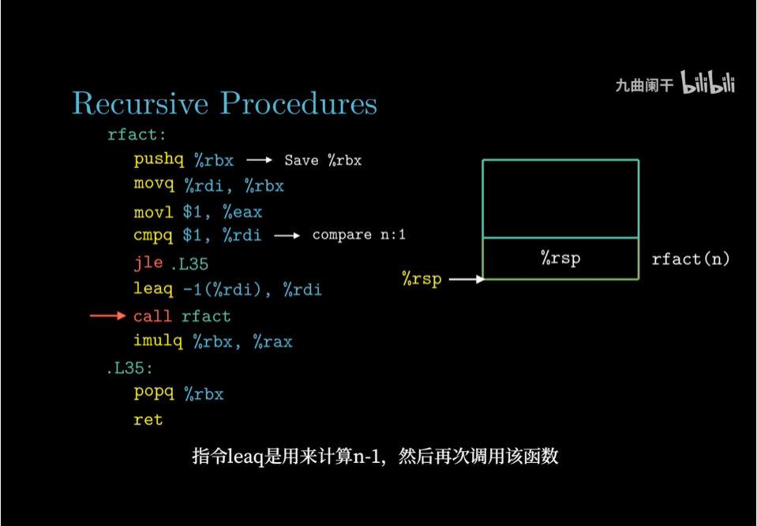

[TOC]


Ashcroft, Edward; Zohar Manna (1971). "The translation of go to programs to 'while' programs". Proceedings of IFIP Congress. The paper, which is difficult to obtain in the original conference proceedings due to their limited distribution, was republished in Yourdon's 1979 book pp. 51-65     


https://en.wikipedia.org/wiki/Structured_program_theorem 结构化程序定理 对不对？


What was really shown was that a purelypropositional formulation of the B ̈ohm–Jacopini theorem is false: there is a de-terministic propositional flowchart that is not equivalent to any propositionalwhileprogram. This result is implicit in [1, 4], although it was not stated thisway.
《The B ̈ohm–Jacopini Theorem is False,Propositionally》


1.E. Ashcroft and Z. Manna. The translation of goto programs into while programs.In C.V. Freiman, J.E. Griffith, and J.L. Rosenfeld, editors,Proceedings of IFIPCongress 71, volume 1, pages 250–255. North-Holland, 1972 隐含上述

4.S. Rao Kosaraju. Analysis of structured programs. InProc. 5th ACM Symp. Theoryof Computing (STOC’73), pages 240–252, New York, NY, USA, 1973. ACM.

Using these tools, we then give a purely propositional account of three knownresults: that the B ̈ohm–Jacopini theorem is false at the propositional level, thatloopprograms with multi-level breaks are sufficient to represent all deterministicflowcharts, and that the Kosaraju hierarchy is strict. These results are provedin Sections 3, 4, and 5, respectively. We conclude with some open problems inSection 6


We have shown three results giving upper and lower bounds on the power ofvarious programming constructs to represent flowchart programs, modeled asautomata on guarded strings. On the one hand, the simple three-state automatonin Section 3 cannot be represented by anywhileprogram. On the other hand, wepresent a congruence in Section 4 that transforms any automaton into a tree-likestructure and show how a tree-like automaton can be turned into aloopprogramwith multi-level breaks. We also give an alternative proof of Kosaraju’s hierarchyresult forloopprograms with multi-level breaks


-------------------------------------


https://en.wikipedia.org/wiki/Recursion_(computer_science)#Structural_versus_generative_recursion


---------------------------------------------------------------------------

corecursion https://en.wikipedia.org/wiki/Corecursion#Examples


在计算机科学中，corecursion是对递归具有dual([范畴学意义上的对偶](https://en.wikipedia.org/wiki/Dual_(category_theory)))作用的一种操作。

递归是分析性的，从基础案例开始进一步将数据分解为较小的数据，然后重复进行直到达到基础案例为止，

而核心递归则从基础案例开始逐步构建并综合起来，迭代生成进一步从基础案例中删除的数据。基本情况。简而言之，corecursive算法使用它们自身产生的数据（在变得可用且需要时）一点一点地产生更多的数据。

一个类似但不同的概念是生成递归，它可能缺少核心递归和递归中固有的明确“方向”。


-------------------------------------------------------------------------------------------------------------------------

结构递归 与 生成递归 https://en.wikipedia.org/wiki/Structural_induction jiegoudigui
[消耗结构化数据的函数]通常将其参数分解为它们的直接结构组件，然后处理这些组件。如果直接组件之一与输入属于同一类数据，则该函数是递归的。因此，我们将这些功能称为（结构性）递归功能。

—  Felleisen，Findler，Flatt和Krishnaurthi，如何设计程序，2001年[5]
因此，结构递归函数的定义特征是每个递归调用的参数是原始输入字段的内容。结构递归几乎包括所有的树遍历，包括XML处理，二叉树创建和搜索等。通过考虑自然数（即自然数为零或自然数的后继）的代数结构，可以实现以下功能：阶乘也可以视为结构递归。


https://en.m.wikipedia.org/wiki/Structured_program_theorem
Böhm–Jacopini theorem
《B方法》裘宗燕译第九章:递归操作定义为 非递归抽象 的一种精化。

# 1. 循环转递归


所有递归都可以改写成循环吗？ - hoodlum1980的回答 - 知乎
https://www.zhihu.com/question/20418254/answer/112090154


有哪些循环方法是只能用goto完成，不能用for循环完成的？ - Tridu的回答 - 知乎
https://www.zhihu.com/question/38149457/answer/1741755530


https://www.cnblogs.com/zhujudah/p/4104599.html
循环就是尾递归


TOP-down转bottom-UP，比如汉诺塔的递归转递推算法，

阶乘（函数式则是flodl,flodr左右折叠**添加左右括号运算顺序层次==压栈出栈**）

```
int FactorialTailRecursion(int n, int acc)
{
    if (n == 0) return acc;
    return FactorialTailRecursion(n - 1, acc * n);
}
```
变：

```
int FactorialLoopOptimized(int n, int acc)
{
    while (true)
    {
        if (n == 0) return acc;

        acc *= n;
        n--;
    }
}
```


https://www.cnblogs.com/JeffreyZhao/archive/2009/04/01/tail-recursion-explanation.html

所有的递归都能等效成一个栈+循环
递归是循环超集

所有的递归都能等效成一个栈+循环


通用的递归转循环方法 - brambles的文章 - 知乎
https://zhuanlan.zhihu.com/p/136511316


递归能够等效于栈+循环，其实确切地说函数的调用就已经能等效成栈+循环了，而递归只是其中的一种而已。


通过简单的规则手动优化尾递归了，那么作为一个程序员，把这种简单的重复操作交给计算机那当然是理所当然的了。我这里可以给出一个简易的通过正则的和字符串拼接的实现。

这个项目只是一个简易 demo，在分析语法的时候只用了简单的正则表达式，所以智能覆盖小部分的情况。如果希望进阶，可以使用 acron 解析，转换AST，并且用 escodegen 生成代码来实现更好的版本，我这里可以提供另外一个项目进行参考 acron 使用和操作 AST。
https://github.com/bramblex/jsjs


https://github.com/bramblex/tail-call


# 2. 递归转循环已经有很好的答案




https://www.bilibili.com/video/BV19X4y1P7Pn


https://cn.bing.com/search?q=%E5%B0%BE%E9%80%92%E5%BD%92%E8%BD%AC%E5%BE%AA%E7%8E%AF&PC=U316&FORM=CHROMN
递归转循环方法


http://hcoona.github.io/Functional-Programming/tail-recursion-cps-and-recursion-to-loop/
一般递归转循环


尾递归、CPS 和将递归转化为循环的一般方法


7. 递归模型
无外乎以下三种：

左递归：

```
f(n):
ret_v1=call f(g1(n));
ret_v2=call f(g2(n));
doSomething_2(ret_v1, ret_v2);
```
右递归：

```
f(n):
doSomething;
call f(g1(n));
call f(g2(n));
```
混合式递归：

```
f(n):
ret_v1=call f(g1(n));
doSomething(ret_v1);
call f(g2(n));
```


是否所有的循环都能用递归代替？ - 罗宸的回答 - 知乎
https://www.zhihu.com/question/29373492/answer/49446200


是否所有的循环都能用递归代替？ - 梨梨喵的回答 - 知乎
https://www.zhihu.com/question/29373492/answer/44137224


尾递归为啥能优化？ - brambles的文章 - 知乎
https://zhuanlan.zhihu.com/p/36587160


通用的递归转循环方法 - brambles的文章 - 知乎
https://zhuanlan.zhihu.com/p/136511316

奔跑吧！“消除递归算法”
本系列的第7篇《神力加身！动态编程》中讲述的、自底向上的“动态规划”其实就是一种消除递归算法。

实现“动态规划”的窍门在于：画出如《神力加身！动态编程》一文中所展示的递归展开树，然后从最深的叶子节点开始向上循环处理。

另一种消除递归算法就是“人肉模拟法”——人肉模拟计算机系统对递归算法的实现，也就是章节4描述的步骤。这个也是“消除递归的万能算法”。

步骤中最关键的就是返回地址的处理——它指示了“从哪里来、到哪里去”。 

算法素颜（第8篇）：史上最猛之递归屠龙奥义 - 周林Zhou Lin的文章 - 知乎
https://zhuanlan.zhihu.com/p/66285575

通用的递归转循环方法 - brambles的文章 - 知乎
https://zhuanlan.zhihu.com/p/136511316


所有递归都可以改写成循环吗？ - takeyoudancing的回答 - 知乎
https://www.zhihu.com/question/20418254/answer/28215190

递归算法向非递归算法转换


直接转换法通常用来消除尾递归和单向递归，将递归结构用循环结构来替代


尾递归是指在递归算法中，递归调用语句只有一个，而且是处在算法的最后。例如求阶乘的递归算法：
```

long fact(int n) { 
    if (n==0) 
        return 1; 
    else 
        return n*fact(n-1); 
} 

```
当递归调用返回时，是返回到上一层递归调用的下一条语句，而这个返回位置正好是算法的结束处，所以，不必利用栈来保存返回信息。对于尾递归形式的递归算法，可以利用循环结构来替代。例如求阶乘的递归算法可以写成如下循环结构的非递归算法：

```
long fact(int n) {
    int s=0;
    for (int i=1; i<=n;i++) 
    s=s*i; //用s保存中间结果return s;
} 

```

间接转换法 该方法使用栈保存中间结果，一般需根据递归函数在执行过程中栈的变化得到。

```
将初始状态s0进栈 
while (栈不为空) {   
    退栈，将栈顶元素赋给s;  
    if (s是要找的结果)
        返回;   
    else      {
    寻找到s的相关状态s1;       
    将s1进栈   }
} 

```


间接转换法在数据结构中有较多实例，如二叉树遍历算法的非递归实现、图的深度优先遍历算法的非递归实现等等。


[将循环（while / for）转换为递归或从递归转换为循环的一般方法？](https://softwareengineering.stackexchange.com/questions/279004/general-way-to-convert-a-loop-while-for-to-recursion-or-from-a-recursion-to-a)


[迭代可以代替递归吗？](https://cs.stackexchange.com/questions/67897/iteration-can-replace-recursion/67931#67931?newreg=83c771eff16245e58d19dd395ce60935)


[How to replace recursive functions using stack and while-loop to avoid the stack-overflow](https://www.codeproject.com/Articles/418776/How-to-replace-recursive-functions-using-stack-and)


介绍 

模拟功能的目的 

递归和模拟函数的优缺点  

使用堆栈和while循环替换递归函数的10条规则（步骤）   

第一法则 

第二条规则 

第三条规则

第四条规则

第五条规则

第六条规则


第七条规则

第八条规则

第九条规则

第十条规则 

递归类型的简单示例 

更实际的示例资源

为什么源同时包含模拟版本和递归版本？

结论
参考   


## 2.1. 结构化程序定理


[结构化定理wiki](https://en.wikipedia.org/wiki/Structured_program_theorem)

结构化程序定理，也称为博姆- Jacopini的定理，[1] [2]是在结果语言理论编程。它指出，一类控制流程图（在此上下文中，以前称为流程图）可以通过仅以三种特定方式（控制结构）组合子程序来计算任何可计算函数。这些是

执行一个子程序，然后执行另一个子程序（序列）
根据布尔表达式的值执行两个子程序之一（选择）
只要布尔表达式为真，重复执行子程序（迭代）
但是，受这些约束的结构化图表可以使用位形式的其他变量（存储在原始证明中的额外整数变量中），以便跟踪原始程序由程序位置表示的信息。该构造基于伯姆的编程语言P''。

该定理构成了结构化程序设计的基础，结构化程序设计避免了goto命令，只使用子程序，序列，选择和迭代。


https://link.springer.com/chapter/10.1007%2F978-3-540-70594-9_11


Böhm–Jacopini定理（Böhm和Jacopini，1966）是程序图式学的经典成果。它指出任何确定性流程图程序都相当于一会儿程序。该定理通常是在一级解释或一级未解释（示意图）级别上拟定的，因为构造需要引入辅助变量。Ashcroft and Manna（1972）和Kosaraju（1973）表明，这是不可避免的。正如许多作者所观察到的那样，功能更强大的结构化编程结构（即具有多级中断的循环程序）足以表示所有确定性流程图，而无需引入辅助变量。Kosaraju（1973）建立了严格的层次结构，该层次结构由允许的最大嵌套深度决定。在本文中，我们仅对这些结果进行了命题说明。我们根据命题级别上的保护弦上的自动机（在测试中与Kleene代数的自动机理论相对应）重新构造了问题。尽管经典方法无法区分抽象的一阶和命题级别，但我们发现，纯粹的命题表述允许使用代数和拓扑概念（例如双仿真和共归）来简化数学处理。使用这些工具，我们可以给出更严格的数学公式以及更简单，更易揭示的证明。


