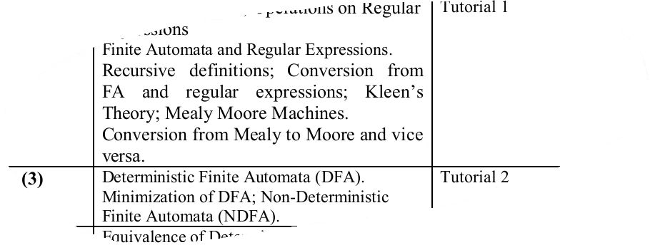
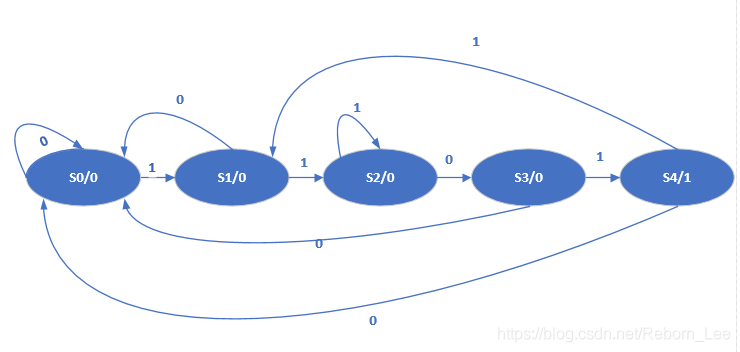
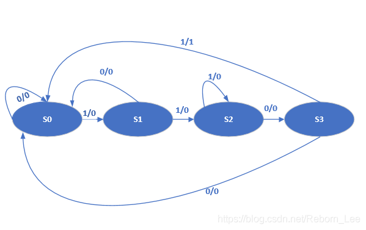
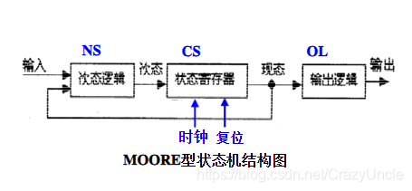

[TOC]


https://github.com/vinizorza/**mealy_moore_converter**牛逼 good
https://www.linkedin.cn/in/viniciuszorzanelli

------------------------


https://automatonsimulator.com/
自动机模拟器


http://csintro.ucas.ac.cn/static/ucas-exp/exp1/turing-machine.html

```
 q0, 0, 0, R, q0
 q0, 1, 1, R, q1
 q1, 1, 1, R, q1
 q1, 0, 1, L, q2
 q2, 1, 1, L, q2
 q2, 0, 0, N, qa
```


https://scholar.google.cz/scholar?start=10&q=conversion+from+mealy+machine+to+moore+&hl=cs&as_sdt=0,5#d=gs_qabs&t=1652731241873&u=%23p%3DshweUjapJRMJ
自动机工具包
语言模拟器

https://www.geeksforgeeks.org/mealy-and-moore-machines-in-toc/


Generate HDL for Mealy and Moore Finite State Machines - MathWorks
https://www.mathworks.com/help/hdlcoder/ug/using-mealy-and-moore...

https://arabdawaer.com/miduhuzo/moore-and-mealy-machines-to-count-number-of-substring-ab/


https://dozakoqezegogohu.consumersnewhomeconstruction.com/mechanization-of-the-moore-mealy-algorithm-for-the-reduction-of-sequential-machines-book-25921gx.php
书


https://www.jackychennn.com/2022/04/04/mealy-machine-moore-machine/
简单例子中文博客教程


https://upscfever.com/upsc-fever/en/gatecse/en-gatecse-chp130.html
很多例子


Mealy 机器以George H. Mealy的名字命名，他在 1955 年的一篇论文“A Method for Synthesizing Sequential Circuits”中提出了这一概念。
https://en.m.wikipedia.org/wiki/Mealy_machine


Moore/Mealy 机器是在时钟的任何滴答声中也有输出的DFA 。现代 CPU、计算机、手机、数字时钟和基本的电子设备/机器都有某种有限状态机来控制它。

简单的软件系统，特别是可以使用正则表达式表示的软件系统，可以建模为有限状态机。有许多这样的简单系统，例如自动售货机或基本电子设备。

通过找到两个有限状态机的交集，可以以一种非常简单的方式设计例如交换消息的并发系统。例如，交通灯是由多个子系统组成的系统，例如不同的交通灯，它们同时工作。

一些应用示例：

号码分类
带计时器的手表
自动售货机
红绿灯
条码扫描器
气泵
Applications of Mealy & Moore Machine - SlideShare


# ASM算法状态机
 https://en.m.wikipedia.org/wiki/Algorithmic_state_machine 

[PDF]
Algorithm State Machines(ASM) - University of Technology, Iraq
https://www.uotechnology.edu.iq/ce/Lectures/Dr-Ikbal-Electronics-2...

[PDF]
ASM Chart: Multiplier Control COE608: Computer Organization…
https://www.ee.ryerson.ca/~courses/coe608/lectures/ASM-Control.pdf

https://www.mathworks.com/help/stateflow/ug/changing-the-chart-type.html


# Mealy To Moore

## tutorial

Mealy Machine Verilog Code | Moore Machine Verilog Code
https://www.rfwireless-world.com/source-code/VERILOG/Mealy-Machine-and-Moore-Machine-verilog-code.html

Moore 与 Mealy 状态机的互相转换 - 黑山老喵小窝
www.catonblack.cn/2019-01-18/mealy2moore


http://www.vlsifacts.com/mealy-to-moore-and-moore-to-mealy-transformation/

http://fastbitlab.com/fsm-lecture-3-mealy-and-moore-state-transition-table/

 

并不是每台 Mealy 机器都可以转换为等效的 Moore 机器。有些只能转换为几乎等效的摩尔机器，输出随时间变化。这是由于状态标签与转换标签配对以形成输入/输出对的方式。考虑过渡{\displaystyle s_{i}\rightarrow s_{j}}s_i\rightarrow s_j从状态{\displaystyle s_{i}}s_{i}陈述{\displaystyle s_{j}}s_{j}. 导致转换的输入{\displaystyle s_{i}\rightarrow s_{j}}
https://en.m.wikipedia.org/wiki/Moore_machine#Relationship_with_Mealy_machines


并不是每台 Mealy 机器都可以转换为等效的 Moore 机器。有些只能转换为几乎等效的摩尔机器，输出随时间变化。这是由于状态标签与转换标签配对以形成输入/输出对的方式。
https://handwiki.org/wiki/Moore_machine


https://www.javatpoint.com/conversion-from-mealy-machine-to-moore-machine

https://www.tutorialspoint.com/automata_theory/moore_and_mealy_machines.htm

https://www.chegg.com/homework-help/questions-and-answers/s-convert-automaton-moore-machine-b-provide-state-transition-table-resulting-moore-automat-q86389983

https://upscfever.com/upsc-fever/en/gatecse/en-gatecse-chp130.html

https://engg.directory/video/lec-24-mealy-to-moore-conversion-with-example-in-hindi

## video
https://www.youtube.com/results?search_query=Mealy+To+Moore+Conversion Mealy To Moore Conversion


https://youtu.be/n8O-TW8VMCE
米利自动机转摩尔自动机

https://youtu.be/dYwogjb_zss


https://youtu.be/a9rxi7ZKZbw


https://youtu.be/JNFTpfHqJEo
判断给定字符序列是否存在的米利自动机


## paper
https://www.researchgate.net/publication/322727920_Mealy-to-Moore_Transformation_-_A_state_stable_design_of_automata

论文!Mealy-to-Moore Transformation - A state stable design of automata
https://www.researchgate.net/publication/322727920_Mealy-to-Moore_Transformation_-_A_state_stable_design_of_automata/fulltext/5a6bd90faca2722c947bc088/Mealy-to-Moore-Transformation-A-state-stable-design-of-automata.pdf?_sg%5B0%5D=2Gp3jK-O87w8CG_i7TgQa14o8SMQDoOYd1uIeD7nxxqcQwQZttVeXThPn5OPcJya_EUhpVyRGgHhJV2pTcTXoQ.xBt3Zx4bRBuEJrNzgFicsj5TKvMDuZl8oT1tTueZXRGFOq2n1DcClZHudMuo_bGq-yeV6hVud5Oez19FLO5Q7Q&_sg%5B1%5D=1q2KFN6TBctT8BZLzFoNZMvAPlSsosuyZYOyyjFVoNyzs35aKuExcRMMKrpUpO6zhyMk_Zf3-wLTyOFSYpDHCz2_hOyMKlHYT7YSAswvo6qB.xBt3Zx4bRBuEJrNzgFicsj5TKvMDuZl8oT1tTueZXRGFOq2n1DcClZHudMuo_bGq-yeV6hVud5Oez19FLO5Q7Q&_iepl=
这篇论文展示了一种将异步反馈的Meary机器转换为摩尔机器的方法。转换在使用RS缓冲器的情况下在双轨逻辑中完成。改造后的机器可以稳定自己，使用起来很安全。转换通过 KV 图进行可视化，并使用公式进行计算。我们将介绍三个用例，以便更好地理解。为了支持所述的转换，还提出了一个模拟。


或者这本书  Introduction to Computer Theory  https://www.philadelphia.edu.jo/it/cs/syllabus/751323.pdf 
计算机理论导论 https://scholar.google.cz/scholar?hl=cs&as_sdt=0%2C5&q=mealy+to+moore+conversion&btnG=#d=gs_qabs&t=1652732008017&u=%23p%3DpmxjpvXpu1UJ





Conversion of mealy to Moore machine for safety critical systems
https://www.researchgate.net/publication/356699778_Conversion_of...
在本文档中，我们将展示借助传输晶体管逻辑将异步反馈 Mealy 有限状态机转换为 Moore 有限状态机的过程，以降低电路复杂性（面积）和延迟因子。通过晶体管逻辑需要较少数量的晶体管来设计电路。在本文中，通过仅由 NMOS 晶体管组成的晶体管逻辑，从而降低了复杂性。预期的设计在名为 45nm 技术的 cadence virtuoso 工具中实施和验证。由此产生的顺序机器将是安全的、高速的和一致的。


# Moore  2 Mealy Machine
每台摩尔机器{\displaystyle M}米等效于具有相同状态和转换以及输出函数的 Mealy 机器{\displaystyle G(s,\sigma )\rightarrow G_{M}(\delta _{M}(s,\sigma ))}

事实上，任何 Moore 机都可以转换为 Mealy 机，反之亦然，但通常最小的 Mealy 机将比最小的 Moore 机具有更少的状态。

对于 Mealy 机器的任何表示，只有当 Mealy 机器的任何状态，每个转换到该状态具有相同的输出时，才可以转换为 Moore 机器而无需添加或重新标记状态。
https://math.stackexchange.com/questions/268888/my-moore-and-mealy-machines-look-the-same-why


从Moore机到Mealy机的转换 - 自动机教程 - srcmini
www.srcmini.com/7375.html

How to Convert Moore Machine Into Mealy Machine Theory of Automata
https://www.youtube.com/watch?v=a9rxi7ZKZbw&ab_channel=GrowWithBilal

https://math.stackexchange.com/questions/1230803/how-can-a-moore-machine-be-converted-into-an-equivalent-mealy-machine-and-vice-v


Algorithm for conversion of Moore Machine to Mealy Machine
Input: Moore Machine

Output: Mealy Machine

Step 1: Start

Step 2 :Take a blank Mealy Machine transition table format.

Step 3 :Copy all the Moore Machine transition states into this table format.

Step 4: Check the present states and their corresponding outputs in the Moore Machine state table; if for a state Qi output is m, copy it into the output columns of the Mealy Machine state table wherever Qi appears in the next state.

Step 5: Stop


# Finite Automata to Moore Machine and Vice-Versa
https://www.youtube.com/watch?v=dYwogjb_zss&ab_channel=SunSin
Conversion of Finite Automata to Moore Machine and Vice-Versa. 


Convert Mealy machine to Moore machine - UPSC Fever
https://upscfever.com/upsc-fever/en/gatecse/en-gatecse-chp130.html

Convert Mealy machine to Moore machine - UPSC Fever
https://upscfever.com/upsc-fever/en/gatecse/en-gatecse-chp130.html


# NFA2DFA
https://www.youtube.com/watch?v=syjJutOdLnI&ab_channel=Education4u
conversion of nfa to dfa examples | 

https://go-pdf.online/program-to-convert-nfa-to-dfa.pdf
nfa2DFA

---------------------------------------

# 米利自动机摩尔自动机 demos

https://www.youtube.com/watch?v=JNFTpfHqJEo&ab_channel=JunaidBaber  严格定义和具体实例使用情况

《Verilog HDL高级数字设计》ASM算法状态机

[置顶]刷题链接：https://www.nowcoder.com/exam/oj?tab=Verilog%E7%AF%87&topicId=302&fromPut=pc_zh_s_1540795715  
米利状态机
摩尔状态机例子


【第十四期 Finite State Machines（上）——Verilog  HDLBits系列-哔哩哔哩】 https://b23.tv/sMtl847【第十五期 Finite State Machines（下）——Verilog  HDLBits系列-哔哩哔哩】 https://b23.tv/V0a8BsB


【用C语言写一个简单的有限状态机（以电梯为例）-哔哩哔哩】 https://b23.tv/jpdNwo0
C文件在这里：https://github.com/horychen/FiniteStateMachineO1Demo
编译指令为：gcc FSM_Elevator_demo.c -o <输出文件名随便啥比如main>
视频中编译不出来是因为输出文件名中出现了dash（“-”）。

【C语言之状态机编程_02_状态机使用案例分析-哔哩哔哩】 https://b23.tv/nHloRAR
本期视频是上期状态机视频的补充，结合上期讲解的基础上，分析了两个状态机案例，并提出了几个状态机编程中需要注意的问题，帮助大家更好掌握状态机编程方法，视频代码工程下载链接 https://github.com/candylife9/state_machine_example.git

【简单地理解后缀自动机 SAM-哔哩哔哩】 https://b23.tv/AiqQKpL
【用最直观的方式理解AC自动机-哔哩哔哩】 https://b23.tv/JvaMyQa

【基于vhdl的红路灯交通灯系统-哔哩哔哩】 https://b23.tv/yApjMuq


【FPGA三段式状态机（从三段式状态机的原理入手，一步步手敲代码，一点点学会三段式状态机的写法）-哔哩哔哩】 https://b23.tv/IF8YHrB

 -----------------------
 


tools


Haskell mearley2moore

python 仓库
https://github.com/Tridu33/automata-python


https://zh.wikipedia.org/wiki/%E7%B1%B3%E5%88%A9%E5%9E%8B%E6%9C%89%E9%99%90%E7%8A%B6%E6%80%81%E6%9C%BA


# 1. Moore状态机和Mealy状态机

普通的FSM只有输入和状态转移，没有输出。

Moore机和Mealy机在FSM的基础上增加了输出。

二者的区别在于：Moore机的输出只与状态有关；Mealy机的输出则与状态和输入有关。


具体而言：Moore机的输出函数定义为$\lambda : Q状态 \rightarrow \delta 输出集合$ ；Mealy机的输出函数则定义为：$\lambda : Q状态\times \Sigma输入集合 \rightarrow \delta 输出集合$  。


Moore状态机和Mealy状态机区别 - 特雷西福的文章 - 知乎
https://zhuanlan.zhihu.com/p/131603324

moore y=f(s)

mealy y=f(s,x)

y输出
x输入
s状态
f一个函数

1. Moore型的输出只与当前状态有关，而Mealy型的输出还与输入相关。

2. 在实现相同功能的情况下,Mealy型状态机所需要的状态数比Moore型少，Moore需要待状态稳定才输出。

3.输出时序上，Moore状态机同步输出，Mealy状态机异步输出；

4.输出变化上，Mealy状态机比Moore状态机领先一个时钟周期；


两种状态机主要区别在于状态转换和信号输出是否与输入信号有关

Moore状态机的下一个状态仅与当前状态有关，Mealy状态机的下一状态仅与当前状态有关，还和输入信号有关；

Moore型状态机的输出信号是直接由状态寄存器译码得到，而Mealy型状态机则是以现时的输入信号结合即将变成次态的现态，编码成输出信号。

请问UML状态机是MEALY机还是MOORE机啊？


https://blog.csdn.net/Reborn_Lee/article/details/88918615


**Moore状态机**：输出仅仅与当前状态有关；

如下实例，如三段式写法来写的一个序列检测的状态机（【 FPGA 】序列检测器的Moore状态机实现），状态机最后的输出：

``` 
    
    always @*
    begin
        if(current_state == s4) dout = 1;
        else dout = 0;
    end
    
    
```
由此可见，Moore状态机仅仅和当前状态有关。
也可以看状态转移图判断：




**Mealy状态机**：输出不仅取决于当前状态，还和输入有关；

同样，如下序列检测的例子：【 FPGA 】序列检测器的Mealy状态机实现

同样是三段式描述，最后的输出为：


```
 
	
	always @ *
	begin
		if(reset) dout = 1'b0;
		else if( (current_state == s3)&&(din == 1'b1) ) dout = 1'b1;
		else dout = 1'b0;
	
	end
	
```


同样，也可以通过状态转移图判断：


可见，输出不仅和当前状态和输入都有关系。


最后，Moore状态机和Mealy状态机可以相互转换。上述两个状态转移图实际上实现的是同一个功能，就是检测序列1101.


按照输出变量依从关系的不同，时序逻辑电路又可分为**米利型和摩尔型**。输出与输入变量直接相关的时序逻辑电路称为米里型电路，输出与输入变量无直接关系的时序逻辑电路称为摩尔型电路。





波形上的区别：

    我想他们在波形上表现的区别更值得注意。
    以一个序列检测器为例，检测到输入信号11时输出z为1，其他时候为0。用摩尔型FSM实现需要用到三个状态（A，B，C）。而用米利型FSM实现则需要两个状态（A，B）。摩尔型FSM输出函数的输入只由状态变量决定，要想输出z=1，必须C状态形成，即寄存器中的两个1都打进去后才可以。输出z=1会在下一个有效沿到来的时候被赋值。而米利型FSM输出函数是由输入和状态变量共同决定的。状态在B的时候如果输入为1，则直接以组合电路输出z=1，不需要等到下个有效沿到来。从而也就不需要第三个状态C。

比较：

1.摩尔机器使用更安全：

    输出在时钟边沿变化（总是在一个周期后）。
    在Mealy机器中，输入更改可能会在逻辑完成后立即导致输出更改, 当两台机器互连时出现大问题 - 如果不小心，可能会发生异步反馈。

2.Mealy机器对输入的反应更快：

    在相同的周期内反应 - 不需要等待时钟。
    在Moore机器中，可能需要更多逻辑来将状态解码为输出 - 在时钟边沿之后更多的门延迟。
    并非所有时序电路都可以使用Mealy模型实现。 一些时序电路只能作为摩尔机器实现。


