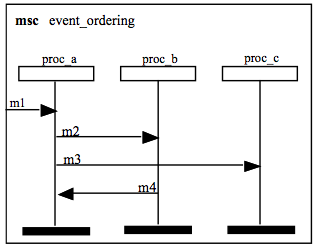

# message Sequence Chart

MSC是国际电联(ITU-T)给出的一种图形化语言，它可以用来描述多个实体之间通信以及信息交互的顺序。

应用领域广泛，侧重于多个自动机协调工作，可用于所有具有信息交互的领域。

MSC图

（基本）消息序列图或MSC 是显示系统组件（也称为实例）之间的通信的图。MSC中的每个垂直线代表一个系统组件，水平箭头代表从一个组件到另一个组件的消息。 

它是一种设计级别的标记，旨在并且最适合涉及两个或多个子系统的系统设计；它不是特别适合系统要求。 

还有高级消息序列图或 hMSC，它给出了某些MSC发生的顺序。 

解释MSC
MSC显示了在某些组件 （有时称为instance）之间发送某些消息的顺序。每个组件/实例的垂直线是其轴。消息和组件必须在其他地方定义。每个消息m在时间上有两个瞬间：何时由一个组件发送（out（m））和何时被另一个组件（in（m））接收。顺序如下： 

每个消息在接收之前就已发送（out（m）在in（m）之前）。 
对于每个组件，垂直线上方的消息位于下方的消息之前。 
但是 ，对于不同垂直线上的消息顺序没有其他保证。对于两个不共享组件的消息，关系图中的高低无关。对于喜欢MSC的人来说，这是他们最大的魅力和力量。对于其他所有人，这是一个令人困惑的烦恼。 
还 一个MSC可以描述是不一致的，在各组分可能不具有足够的信息来执行所述消息订购MSC定义的实现。尽管可能将其视为符号及其语义上的缺陷，但MSC爱好者将其视为一种分析的机会。 

例如，在图1中

在m1 in（m1）到达 之后，再发送m2 out（m2）（规则2），
接下来是m2 in（m2）的到达（规则1）。 
但是，尽管图中的m3比m4高，但是我们不知道m3是在发送m4还是到达m4之前到达，因为这三个时刻发生在不同的组件上（规则3）。即使m3在图中较高，但m3仍会在m4之后到达（in（m3）> in（m4））—图表中较高的消息没有区别，除了在相同垂直线（分量）处的消息。 
同样的情况是，尽管MSC要求out（m3）在in（m4）之前，但实际上没有办法强制执行此规则（规则4）。组件proc_b无法确定proc_a何时发送m3，因此它无法确保m4直到稍后才到达。 

图2给出了图1 中消息输入和输出 的部分顺序。

https://www.ics.uci.edu/~alspaugh/cls/shr/msc.html

https://www.ics.uci.edu/~alspaugh/cls/shr/

数学和逻辑基础
套
关系，等价关系，顺序关系
函授，功能，映射
订购套
CPO和格
图表
电源组
二进制和其他字符串
逻辑术语和概念
艾伦区间代数
“对我来说是希腊语”-阅读，发音和拼写一些麻烦的符号和单词
人类基金会
计算机科学以外的术语表
摘要
图尔明的论证结构
查询周期
霍菲尔德的法律关系
简报
软件开发基础
要求
启发“快速入门”
词汇表和本体
目标和目标图
一世*
SCR样式要求
追踪
规格
合金
消息序列图（MSC）
常用表达
爪哇
设计模式
Java文档
Java包
Java类型，接口和类
XML，HTML
XHTML和HTML
XML模式
XSL转换（XSLT）
我要感谢许多学生（和其他读者）的建议和评论显着改善了这些页面。所有其余的缺陷归作者所有。如果发现错误，请与我联系。 

