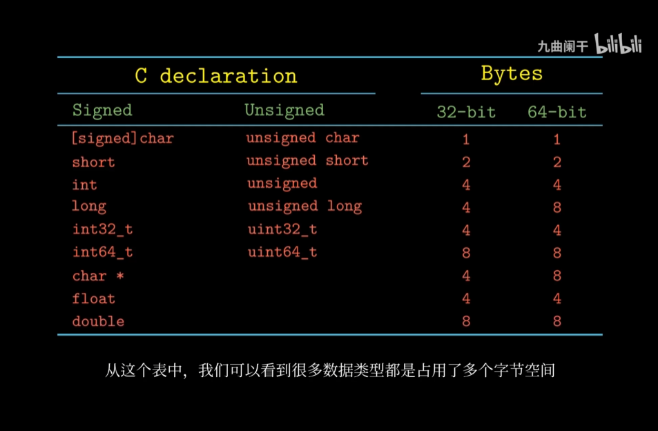

# 1. 面经

https://bitable.feishu.cn/appwBhd98QJ9cpMggHc5QMVHlfd?from=navigation_button_1_trial&table=tblZul4jLRyw60lb&view=vewJHSwJVd

静态变量全局变量 区别 
https://blog.csdn.net/mm_hh/article/details/77126878

https://blog.csdn.net/zydybaby/article/details/109701816  一文java

Java集合高频面试题（最新版） https://blog.csdn.net/zydybaby/article/details/110183091

一文计算机网络

