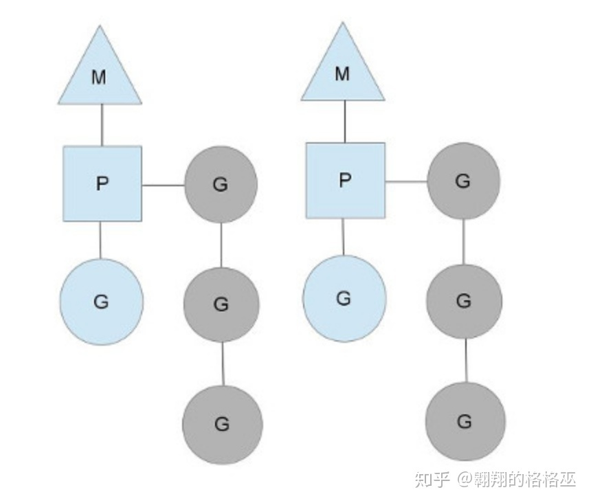

# 进程代数理论

https://www.cnblogs.com/dengfanxin/archive/2009/06/08/pa.html
进程代数

如何深入浅出地解释并发模型中的 CSP 模型？ - luikore的回答 - 知乎
https://www.zhihu.com/question/26192499/answer/46815754

https://zh.wikipedia.org/wiki/%E8%BF%9B%E7%A8%8B%E6%BC%94%E7%AE%97

如何深入浅出地解释并发模型中的 CSP 模型？ - 夏梓耀的回答 - 知乎
https://www.zhihu.com/question/26192499/answer/75803446

并发神器CSP的前世今生 - soolaugust的文章 - 知乎
https://zhuanlan.zhihu.com/p/143846211

# CSP与Go

这个很好！下面配套代码 https://github.com/zhengxiaoyao0716/parallel-task

Go语言CSP并发模型与Elixir的Actor模型探究 - 正逍遥0716的文章 - 知乎
https://zhuanlan.zhihu.com/p/51278538

CSP有CSP的编程模型，Actor有Actor的，二者理论上是等价可互换的，用不同的方法都能解决同样的问题，而且都很优雅（从两例里目标代码总比模拟代码精简易读就能看出），但非要模拟对方的方法，用对方的思路来解决问题就很别扭了。

----------------

在CSP提出后，有些语言尝试将Hoare提出的输入和输出作为原语纳入到自己的语言体系中，比如OCCAM并发处理语言。和传统的加锁方式不同，CSP理论中不允许进程对其他进程的变量赋值，进程之间只能通过通信原语来实现数据交换和协作。但是这些语言都没能真正地为这些原语提供支持。大多数流行语言都支持共享和内存访问同步到CSP的消息传递样式。而采用CSP理论的语言也有，但是基本都没有得到广泛的采用。

直到Go语言出现，正式将CSP的原则纳入到核心原则，并提供了通信的原语支持channel。正因为如此，并发被认为是Go语言的优势之一。并让Go语言在分布式系统、云原生系统和系统中间件中迅速占领了市场。而其他语言基于共享内存的并发模型，在大型和复杂系统中变得很难正确使用。

当然Go还有其局限性，因为CSP的理解成本问题，Go同时也支持传统的加锁方式，也支持共享内存的方式。不过Go已经向其他语言证明CSP的可行性和优越处。并且提出了经典的CSP核心概念：

Do not communicate by sharing memory; instead, share memory by communicating. “不要以共享内存的方式来通信，相反，要通过通信来共享内存。”
而由于Go语言的推广和效果，使得CSP的概念变得流行起来，目前很多语言在尝试将CSP纳入到语言体系中并提供对Hoare提出原语的支持。

并发神器CSP的前世今生 - soolaugust的文章 - 知乎
https://zhuanlan.zhihu.com/p/143846211

源码角度解析Go语言并发[3]---Go如何实现CSP模型中"内存共享" - 甘蔗的文章 - 知乎
https://zhuanlan.zhihu.com/p/106977868

https://www.bilibili.com/video/BV1ox411R7Ci?p=28
视频教程 **bilibli **Go语言中的CSP

Go语言中国网站： www.qfgolang.com

文档来自这儿：https://github.com/rubyhan1314/Golang-100-Days

Go语言的CSP模型 - 路由器没有路的文章 - 知乎
https://zhuanlan.zhihu.com/p/313763247

CSP是Communicating Sequential Process的简称，中文可以叫做通信顺序进程，是一种并发编程模型，是一个很强大的并发数据模型，是上个世纪七十年代提出的，用于描述两个独立的并发实体通过共享的通讯channel（管道）进行通信的并发模型。相对于Actor模型，CSP中channel是第一类对象，它不关注发送消息的实体，而关注与发送消息时使用的channel。

严格来说，CSP是一门形式语言（类似于】calculus），用于描述并发系统中的互动模式，也因此成为一众面向并发的编程语言的理论源头，并衍生出了Occam/Limbo/Golang.

而具体到编程语言，如Golang，其实只用到了CSP的很小一部分，即理论中的Process/Channel（对应到语言中的goroutine/channel）：这两个并发原语之间没有从属关系，Process 可以订阅任意个Channel，Channel也并不关心是哪个Process在利用它进行通信；Process围绕Channel进行读写，形成一套有序阻塞和可预测的并发模型。

**Process**:可以是进程线程甚至一段代码块

**!**表示输入命令，在一个process中写入数据

**?**表示读取命令，在一个process中读取数据

**->**如果这个符号左边返回值False右边就不会被执行。

这种语言同时利用了一个所谓的守护命令，也就是 Edgar Dijkstra 在一篇之前在 1974 年所写的论文中介绍的，“Guarded commands, nondeterminacy and formal derivation of programs”。一个有守护的命令仅仅是一个带有左和右倾向的语句，由 → 来分割。

Go语言只用了一部分CSP/Channel对应goroutine/channel

在Go语言中通过自己的调度器实现了CSP模型，这个调度器也就是MPG调度模型

图中两个M如果运行在一个CPU上就是并发，如果运行在不同CPU就是并行。

M 代表内核线程；

P 代表程序执行上下文，将等待执行的G与M对接。Go的运行时系统会适时地让P与不同的M建立或断开关联，以使P中的那些可运行的G能够及时获得运行时机；

G代表协程，可以有多个；

图解Go语言并发模型MPG - 翱翔的格格巫的文章 - 知乎
https://zhuanlan.zhihu.com/p/271706257

二、Golang

CSP与主流语言通过共享内存（go也有sync包，但是大型很多错用不了）来进行并发控制方式不同，Go 语言采用了CSP模式。这是一种用于描述两个独立的并发实体通过共享的通讯 Channel（管道）进行通信的并发模型。

Golang 就是借用CSP模型的一些概念为之实现并发进行理论支持，其实从实际上出发，go语言并没有，完全实现了CSP模型的所有理论，仅仅是借用了process和channel这两个概念。process是在go语言上的表现就是goroutine是实际并发执行的实体，每个实体之间是通过channel通讯来实现数据共享。

k Go语言的CSP模型是由协程Goroutine与通道Channel实现：

·Go协程goroutine：是一种轻量线程，它不是操作系统的线程，而是将一个操作系统线程分段使用，通过调度器实现协作式调度。是一种绿色线程，微线程，它与Coroutine协程也有区别，能够在发现堵塞后启动新的微线程。

·通道channel：类似Unix的Pipe，用于协程之间通讯和同步。协程之间虽然解耦，但是它们和Channel有着耦合。

# 学习笔记

https://blog.csdn.net/SHU15121856/article/details/102649749 【进程代数学习笔记】4：[CSP]进程间的通道通信,管道与活锁避免

