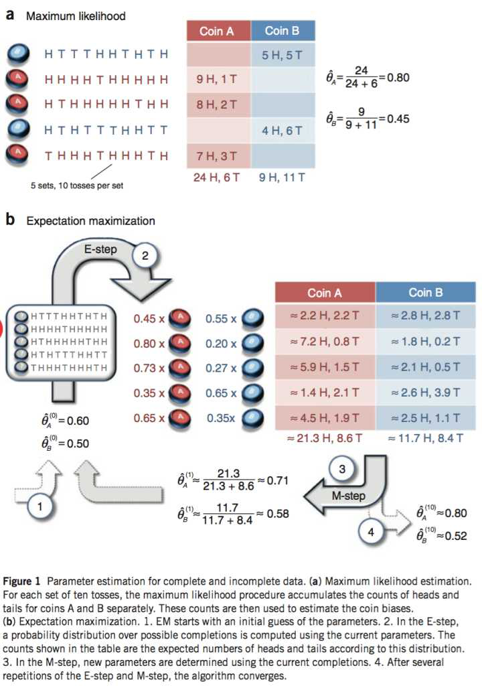

# EM算法

理论：
简版：猜（E-step）,反思（M-step）,重复；

E步骤：固定 θ ，求隐含变量zi的概率分布，Qi(zi)。

M步骤：给定Qi(zi)，用极大似然估计来计算 θ，并更新。

求最大似然函数估计值的一般步骤：

（1）写出似然函数；

（2）对似然函数取对数，并整理；

（3）求导数，令导数为0，得到似然方程；

（4）解似然方程，得到的参数即为所求；

恶心的隐含变量（抽取得到的每个样本都不知道是从哪个分布抽取的），猜的参数是**每个分布的 θ**，根据结果反思调整猜测的**每个分布的 θ**

## 推导

EM算法详解 - Microstrong的文章 - 知乎
https://zhuanlan.zhihu.com/p/40991784

高斯混合模型(GMM)和EM算法  blog.csdn.net/weixin_38206214/article/details/81064625

 EM算法详细推导   blog.csdn.net/weixin_38206214/article/details/81431932

EM算法-数学原理及其证明  blog.csdn.net/yzheately/article/details/51164441

---------------------------------

## 形象

怎么通俗易懂地解释EM算法并且举个例子? - 史兴的回答 - 知乎
https://www.zhihu.com/question/27976634/answer/39132183

怎么通俗易懂地解释EM算法并且举个例子? - 乐也的回答 - 知乎
https://www.zhihu.com/question/27976634/answer/153567695

maximum likelihood estimation 二项分布的EM算法

https://math.stackexchange.com/questions/25111/how-does-expectation-maximization-work

以硬币A，第一轮为例。因为已经预设了硬币A的正面概率（0.6），我们可以算出来A扔10次得到第一轮结果的概率（5正5反）0.6^5*0.4^5。同样，可以算出B得到5正5反的概率.

2项分布A能得出5H5T的概率，算出来应该是0.000796，

然后算B的（0.5^10 = 0.000976），

再normalize结果： A为0.000796/（0.000796 + 0.000976） ~ 0.45 ，同理B约为0.55

十枚硬币中又0.45份的A,0.55份B硬币，

octave:计算0.45份A硬币的H,T分别多少枚> 0.45*5/10
ans =  0.22500

octave:计算0.55份B硬币的H,T分别多少枚> 0.55*5/10
ans =  0.27500

第二行：

计算0.8份A硬币的H,T分别多少枚

H:

octave:> 0.8*9/10
ans =  0.72000

T:

octave:> 0.8*1/10
ans =  0.080000

## 坐标上升法

怎么通俗易懂地解释EM算法并且举个例子? - Evan的回答 - 知乎
https://www.zhihu.com/question/27976634/answer/252238739

  

图中的直线式迭代优化的路径，可以看到每一步都会向最优值前进一步，而且前进路线是平行于坐标轴的，因为每一步只优化一个变量。

这犹如在x-y坐标系中找一个曲线的极值，然而曲线函数不能直接求导，因此什么梯度下降方法就不适用了。但固定一个变量后，另外一个可以通过求导得到，因此可以使用坐标上升法，一次固定一个变量，对另外的求极值，最后逐步逼近极值。对应到EM上，E步：固定θ，优化Q；M步：固定Q，优化θ；交替将极值推向最大。

## 代码

GMM与EM算法的Python实现
sofasofa.io/tutorials/gmm_em/

## 总结性

EM算法详解 - Microstrong的文章 - 知乎
https://zhuanlan.zhihu.com/p/40991784

