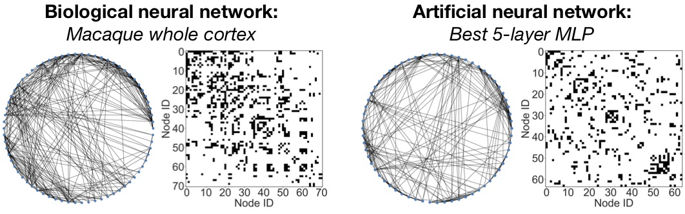

猴子大脑拓扑结构和神经网络结构的相似性

sweet point最佳点

Graph Structure of Neural Networks
https://arxiv.org/abs/2007.06559

https://github.com/facebookresearch/graph2nn
神经网络通常表示为神经元之间的连接图。但是，尽管使用广泛，但目前对神经网络的图结构与其预测性能之间的关系知之甚少。在这里，我们系统地研究了神经网络的图结构如何影响其预测性能。为此，我们开发了一种新的基于图的神经网络表示形式，称为关系图，其中神经网络计算的各个层对应于沿图结构进行的各轮消息交换。使用这种表示，我们表明：（1）关系图的“最佳点”导致神经网络的预测性能大大提高；（2）神经网络 其性能大约是聚类系数及其关系图的平均路径长度的平滑函数；（3）我们的发现在许多不同的任务和数据集上是一致的；（4）可以有效地识别最有效点；（5）表现最佳的神经网络具有令人惊讶的类似于真实生物神经网络的图结构。我们的工作为神经体系结构的设计和对神经网络的一般理解开辟了新的方向。

生物神经网络和人类的神经网络结构

https://www.youtube.com/watch?v=akgU8nRNIp0
我们的大脑可以被构建为数学模型，代数拓扑能够帮助我们解锁大脑神经结构与功能之间的联系，同时还可以将神经元之间信息传递的方向用有向图表示出来。这是“大脑与数学”系列的第3部分，具体请见由[遇见数学翻译组]核心成员 @小虎 朋友所译《Your Brain as Math - Part 2》. 欢迎更多朋友加入到[遇见数学]的翻译小组, 一道为营造更良好的数学文化氛围而前行.

# 1. 神经网络拓扑解释

https://b23.tv/aChY4I 大脑拓扑几何解释

http://www.youtube.com/watch?v=rlI1KOo1gp4
在上一集中，我们看到大脑神经网络可以建模为图，在本集中我们将看到可以将其视为拓扑学中的对象——单纯复形。那么……什么是单纯复形？具体请见由[遇见数学翻译组]核心成员 @小倪同学 所译《Your Brain as Math - Part 2》. 欢迎更多朋友加入到[遇见数学]的翻译小组, 一道为营造更良好的数学文化氛围而前行. » 加入链接

http://www.youtube.com/watch?v=M0M3srBoTkY
蓝脑计划（Blue Brain Project）是尝试利用分子层级的哺乳类脑部逆向工程建立一个电脑模拟脑。这里模拟并不仅是包括人工神经网络模型，也包括生物过程的真实神经元模型，和一个经验重建模型连接组。而数学家将从代数拓扑的角度来解码大脑中神经元之间的联系，以帮助我们理解它的功能。具体请见由[遇见数学翻译组]核心成员 @小倪同学 所译《Your Brain as Math - Part 1》. 欢迎更多朋友加入

http://t.cn/Rnad6M7
【神经同源理论探索——用代数拓扑刻画神经网络容量】《Towards Neural Homology Theory - On Characterizing the Capacity of Neural Networks using Algebraic Topology - YouTube》by William Guss http://t.cn/Rnad6M7

