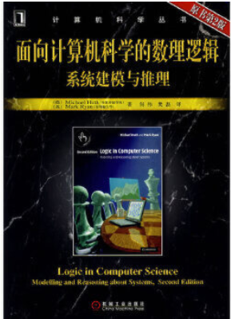
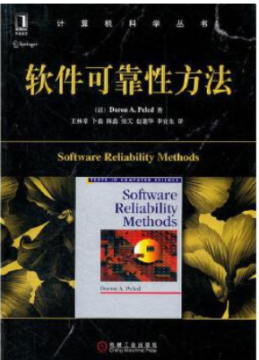
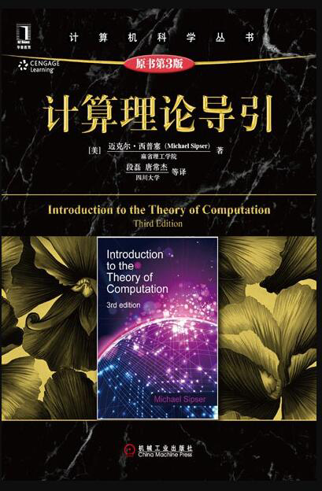
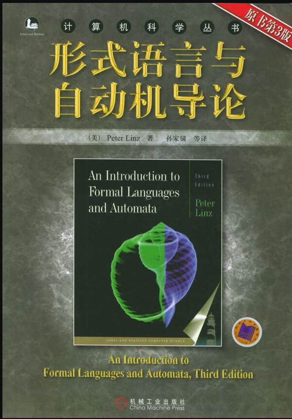
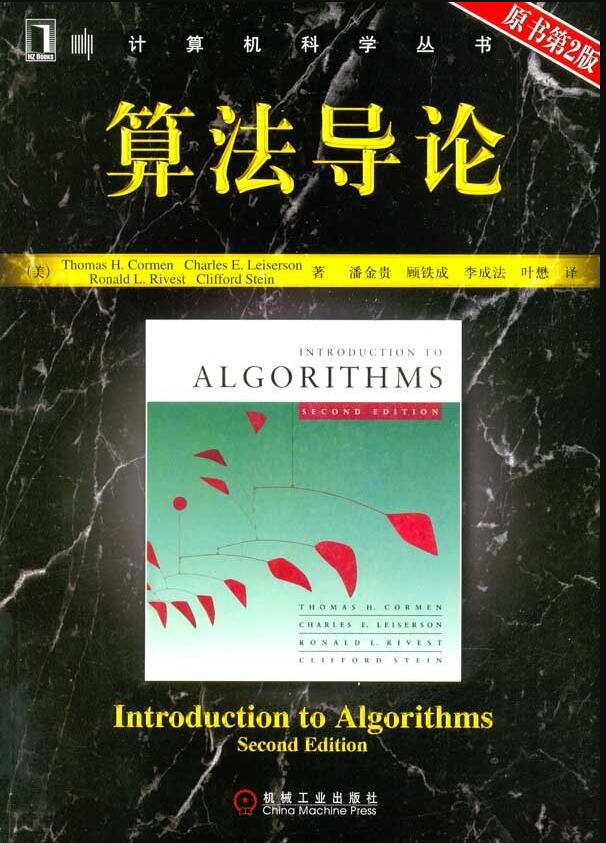

# 1. 教程书资源

[CS161笔记](http://web.cs.ucla.edu/~rosen/161/)

学长说：
> 一般来说，你可以看一下logic in computer science，如果是搞情景演算就要看Retier的教材，我给你找找看[Ronald_Brachman,_Hector_Levesque]_Knowledge_Repre(z-lib.org)是刘老师的导师写的，你可以大致瞄一下有什么内容。这个是知识表示与推理的，就是我们说的搞KR的。我们这个组主要也是搞KR的
> [Raymond_Reiter]_Knowledge_in_Action__Logical_Foun(z-lib.org)[R是情景演算的教材
> [M._Huth,_M._Ryan]_Logic_in_Computer_Science(z-lib.org)是一般的关于逻辑在计算机科学的应用，你可以挑你自己感兴趣的章节先看一下吧。然后网上应该也有中文版。

上课用两本教材：
>[George_S._Boolos,_John_P._Burgess,_Richard_C._Jef(b-ok.xyz)计算和逻辑
>Kenneth Rosen - Discrete Mathematics and Its Applications, seventh edition (2011, McGraw-Hill Science_Engineering_Math)离散数学及其应用

模型检测方面的知识，形式化检测应该怎么学

