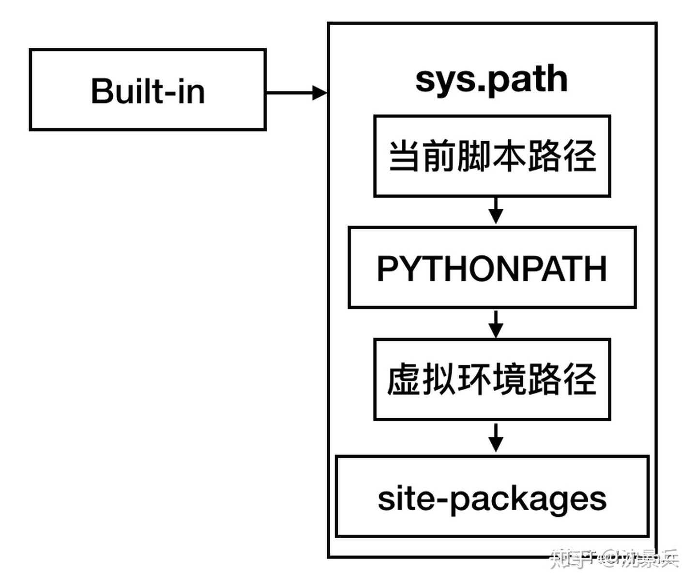

# 1. 添加PYTHONPATH


import sys

sys.path简单粗暴环境变量真的有用


```python
['', '**C:\\Users\\admin\\Documents\\Tridu33\\(Py\\!3b1b-video\\manim', 'C:\\Users\\admin\\Documents\\Tridu33\\(Py\\!jupyternotebook\\tensorflow-handbook--cubao\\source\\_static\\codehttps://pic1.zhimg.com/80/v2-81db12975566ebcdc6fdc0a0bc860004_1440w.jpg', **'C:\\ProgramData\\Miniconda3\\python37.zip', 'C:\\ProgramData\\Miniconda3\\DLLs', 'C:\\ProgramData\\Miniconda3\\lib', 'C:\\ProgramData\\Miniconda3', 'C:\\ProgramData\\Miniconda3\\lib\\site-packages', 'C:\\ProgramData\\Miniconda3\\lib\\site-packages\\win32', 'C:\\ProgramData\\Miniconda3\\lib\\site-packages\\win32\\lib', 'C:\\ProgramData\\Miniconda3\\lib\\site-packages\\Pythonwin']
```

【Python专题(三)】Python模块导入与路径管理 - 沈景兵的文章 - 知乎
https://zhuanlan.zhihu.com/p/137087714

