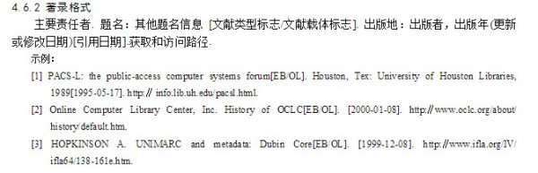
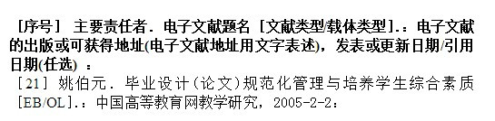

# 1. 应用网络电子资源

[序号]主要责任者.电子文献题名.电子文献出处[电子文献及载体类型标识].或可获得地址，发表或更新日期/引用日期.


视频属于电子文献，根据国标2005，格式如下：

电子文献  electronic documents 

以数字方式将图､文､声､像等信息存储在磁､光､电介质上，通过计算机、网络或相关设备使用的记录有知识内容或艺术内容的文献信息资源，包括电子书刊、数据库、电子公告等。


```
[序号]主要责任者.电子文献题名.电子文献出处[电子文献及载体类型标识].或可获得地址，发表或更新日期/引用日期.
```






# 2. 【举例】

\[16\] 王明亮.关于中国学术期刊标准化数据库系统工程的进展\[EB/OL\].http: //www.cajcd.edu.cn/pub/wml.txt/980810–2.html, 1998–08–16/1998–10–04.  
\[17\] 万锦.中国大学学报论文文摘（1983–1993）.英文版 \[DB/CD\]. 北京: 中国大百科全书出版社, 1996.

# 3. 常用的电子文献及载体类型标识：

-〔DB/OL〕——联机网上数据(database online)  
-〔DB/MT〕——磁带数据库(database on magnetic tape)  
-〔M/CD〕——光盘图书(monograph on CD?ROM)  
-〔CP／DK〕——磁盘软件(computer program on disk)  
-〔J／OL〕——网上期刊(serial online)  
-〔EB/OL〕——网上电子公告(electronic bulletin board online)


