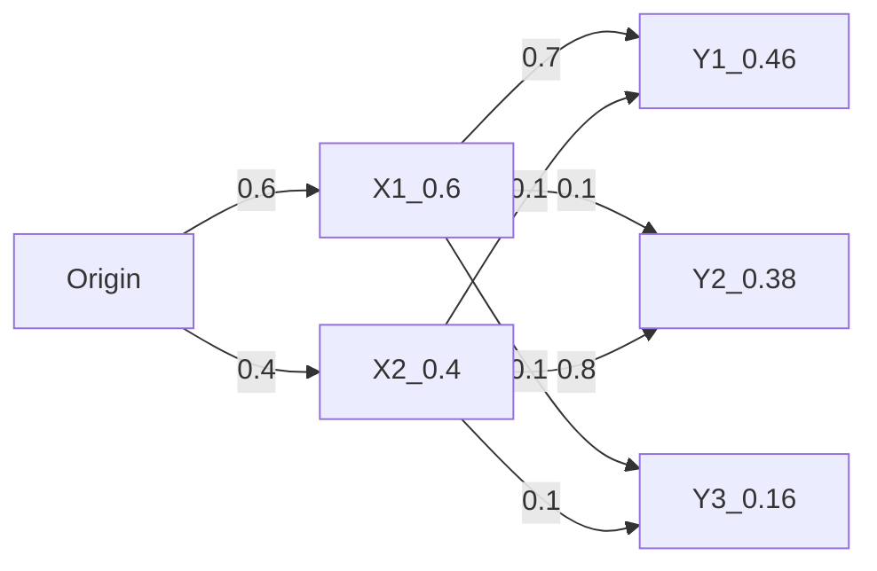
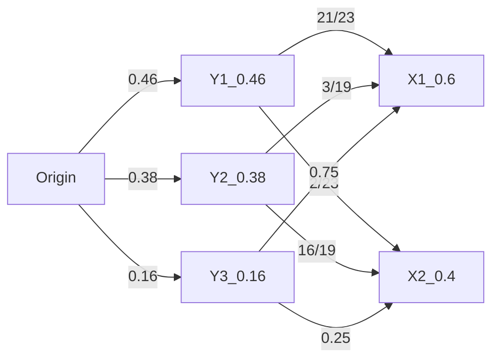

# LearningProbabilisticGraphicalModelsInR

LearningProbabilisticGraphicalModelsInR


github.com/PacktPublishing/Learning-Probabilistic-Graphical-Models-in-R
随书代码

《概率图模型--基于R语言》


随手找个例子：




全概率Y1 0.46 Y2 0.38 Y3 0.16


贝叶斯公式可以推导：用定义式$P(X|Y)=\frac{P(x,y)}{P(y)}$和$P(Y|X)=\frac{P(x,y)}{P(x)}$

推导出**一般形式的贝叶斯公式**$P(X|Y)=\frac{P(Y|X)P(X)}{P(Y)}$

实际问题中，一般已知第一张图【X,Y,...,Z随便给定一个顺序（已经求解出），有可能我们一会儿关心（要求解）Y,X,...,Z顺序的条件概率,一会儿关心（要求解）X,Z,...,Y顺序的条件概率，贝叶斯公式能帮到你利用第一张图求解其他而不需要详细慢慢画出来第二三四n张图。换句话说就是，通过对变量X的观察，得到其他变量的后验概率分布等信息。而概率图模型更是666】，

现在欲求解“给定Y下X的**后验分布**”$P(X|Y)${第二张未知待求图的条件概率}，$P(X)$**先验分布**{全局下X独立事件发生概率},$P(Y|X)$**似然率**{第一张图的条件概率，X事件发生条件下Y的概率}，$P(Y)$**归一化因子**{全局下Y独立事件发生概率,在第一张已知数据的图中是全概率公式求解的,边缘化$P(y)=\sum_x P(x,y)=\int_x P(X,y)dx$消除联合概率分布下单个X变量的边缘化}


定义式$P(x,y)=P(y|x)*P(x)$和边缘化$P(y)=\sum_x P(x,y)=\int_x P(X,y)dx$消除联合概率分布下单个X变量的边缘化
推导出来$P(y)=\sum_x P(X,Y)=\sum_ P(Y|X)*P(x)$

把上述公式代入一般形式的贝叶斯公式改写成**更方便实用的贝叶斯公式形式**：

$P(X|Y)=\frac{P(Y|X)P(X)}{P(Y)}=\frac{P(Y|X)P(X)}{\sum_x P(Y|X)*P(X)}$,这样每个数都能直接从第一张图(已知)看出来，求给定Y下X的后验分布的过程中，连归一因子P(Y)都没必要拎出来算就有结果。只需要看图查出来：$P(X)$**先验分布**{全局下X独立事件发生概率},$P(Y|X)$**似然率**{第一张图的条件概率，X事件发生条件下Y的概率}，


其实贝叶斯公式的意义就是:*在不求解下面图的情况下* 快速算出来更换顺序后的**条件概率**（毕竟变量多的话，求起来还挺麻烦的）多少？


条件概率

Y1


$P(X_1|Y_1)=\frac{P(X_1)P(Y_1|X_1)}{P(X_1)P(Y_1|X_1)+P(X_2)P(Y_1|X_2)}=\frac{0.6*0.7}{0.6*0.7+0.4*0.1}=\frac{21}{23}$

$P(X_2|Y_1)=\frac{P(X_2)P(Y_1|X_1)}{P(X_1)P(Y_1|X_1)+P(X_2)P(Y_1|X_2)}=\frac{0.4*0.1}{0.6*0.7+0.4*0.1}=\frac{2}{23}$

Y2

$P(X_1|Y_2)=\frac{P(X_1)P(Y_2|X_1)}{P(X_1)P(Y_2|X_1)+P(X_2)P(Y_2|X_2)}=\frac{0.6*0.1}{0.6*0.1+0.4*0.8}=\frac{3}{19}$

$P(X_2|Y_2)=\frac{P(X_2)P(Y_2|X_1)}{P(X_1)P(Y_2|X_1)+P(X_2)P(Y_2|X_2)}=\frac{0.4*0.8}{0.6*0.1+0.4*0.8}=\frac{16}{19}$

Y3

$P(X_1|Y_3)=\frac{P(X_1)P(Y_3|X_1)}{P(X_1)P(Y_3|X_1)+P(X_2)P(Y_3|X_2)}=\frac{0.6*0.2}{0.6*0.2+0.4*0.1}=0.75$

$P(X_2|Y_3)=\frac{P(X_2)P(Y_3|X_1)}{P(X_1)P(Y_3|X_1)+P(X_2)P(Y_3|X_2)}=\frac{0.4*0.1}{0.6*0.2+0.4*0.1}=0.25$


对应的不同顺序的图就是下面这图

把"X,Y"事件记作"A,B"事件{方便往下列举很多}，A,B事件是独立的，现实世界的独立事件发生概率p(X)p(Y) 和我们观察者 “先考虑A上图”  或者“先考虑B事件发生”无关！

举例A1-A2和B1-B2,...,Z1-Z2,ZA1-ZA2,...就是当P(A1)=0.5=P(A2)拍硬币的伯努利事件。

举例，A1-A6和B1-B6,...,Z1-Z6,ZA1-ZA6,...就是掷骰子事件的不断重复）：




全概率公式验证（同一个问题不同分发的X1=0.6 ,X2=0.4全局下看，概率必须一致，讲道理的数学“自洽”）

```octave
octave:1> 0.46*21/23+0.38*3/19+0.16*0.75
ans =  0.60000
octave:2> 0.46*2/23+0.38*16/19+0.16*0.25
ans =  0.40000
```

## A-Z-ZA-...很多事件叫做：联合概率分布


 边缘化Marginalization


$P(y)=\sum_y P(x,y)=\int_y P(X,y)dy$

## 贝叶斯公式理解


欲求解“给定Y下X的**后验分布**”$P(X|Y)${第二张未知待求图的条件概率}，$P(X)$**先验分布**{全局下X独立事件发生概率},$P(Y|X)$**似然率**{第一张图的条件概率，X事件发生条件下Y的概率}，$P(Y)$**归一化因子**{全局下Y独立事件发生概率,在第一张已知数据的图中是全概率公式求解的,边缘化$P(y)=\sum_x P(x,y)=\int_x P(X,y)dx$消除联合概率分布下单个X变量的边缘化}

**更方便实用的贝叶斯公式形式**：

$P(X|Y)=\frac{P(Y|X)P(X)}{P(Y)}=\frac{P(Y|X)P(X)}{\sum_x P(Y|X)*P(X)}$,

改写为：$X->\theta,Y->D$,

$P(\theta|D)=\frac{P(D|\theta)P(\theta)}{P(D)}=\frac{P(D|\theta)P(\theta)}{\sum_x P(D|\theta)*P(\theta)}$

$P(\theta)$先验概率：初始Belief,新观察之前对D的认知。
$P(D|\theta)$给定$\theta$下的似然率：我可以**生成**什么数据D。即对所有的$\theta,D$的概率是多少。参考
>$P(Y|X)$**似然率**{已知图的条件概率，X事件发生条件下Y的概率}

知道：先验概率初始认知$\theta$的前提条件下D事件发生的条件概率

$P(\theta|D)$后验概率：观察到D之后的新Belief


总结，新的先验是当前计算出来的后验概率，重复上面的公式就能不断更新Belief

找到P13《标题的书》中有一个电灯泡的例题，可以辅助理解更新过程

机器先验分布M={working0.99,broken0.01}

灯泡L={good,bad}

下列是P(L|M)似然率

| likehood |      |      |
| -------- | ---- | ---- |
|          | good | bad  |
| working  | 0.99 | 0.1  |
| broken   | 0.6  | 0.4  |

后验分布要用公式求解

新的先验是当前计算出来的后验概率，迭代。。。。。。

P14计算出来的新的先验应该是71%为什么它下一步直接是50%？


实际画出来的图很形象很靠谱，随着bad,bad,bad会迅速变坏

随着bad,good,good,good,good,good,good...good机器正常工作的概率先降后升


-------------------
卡尔曼滤波是根据测量到的数据和噪声的概率分布计算最可能的真实值
贝叶斯推理是根据新数据可用的时候（结合旧的Belief数据概率）更新改进计算新的事实和结论


# index
1. 概率推理--基本建模方法
2. 精确推理--图的组合和模块的查询
3. 学习参数--极大似然拟合学习
4. 贝叶斯建模--基础模型，更复杂，用自适应算法查询和拟合
5. 近似推断 概率图模型第二种推断方法，主要的采用方法“MCMC马尔可夫蒙特卡洛”
6. 贝叶斯建模--线性模型  
7. 概率混合模型


