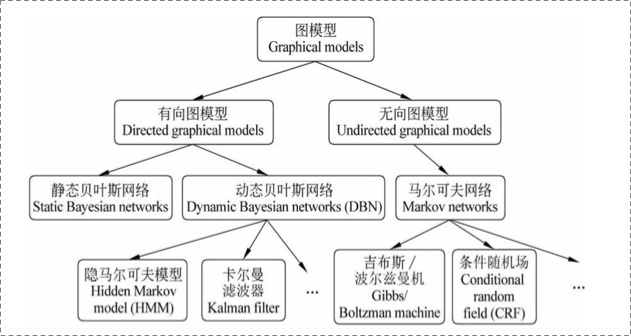

# 概率图模型总结

snowflowersnowflake.github.io/2019/10/30/概率图模型体系/

## 入门

概率图模型（快速入门必备） mscto.com/base/473870.html

 概率图模型是用图来表示变量概率依赖关系的理论，结合概率论与图论的知识，利用图来表示与模型有关的变量的联合概率分布。由图灵奖获得者Pearl开发出来。
 
 概率图模型理论分为概率图模型表示理论，概率图模型推理理论和概率图模型学习理论。

  “结构化概率模型”（structured probabilistic model），是一类用图形模式表达基于概率相关关系的模型的总称，也称“图模型”（graphical model）英文简称，PGM。

PGM理论研究并解决三个问题

- 表示（如何通过图来刻画多个随机变量之间的关系）（注：这个是PGM的基础）
- 学习（如何通过已知数据来确定图的参数） （注：机器学习主要研究这个问题）
- 推断（如果根据已知图，来推断出想要的统计结论） （注：消息传递主要研究这个问题）

    基本的Graphical Model 可以大致分为两个类别：贝叶斯网络(Bayesian Network)和马尔可夫随机场(Markov Random Field)。  
        它们的主要区别在于采用不同类型的图来表达变量之间的关系：贝叶斯网络采用有向无环图(Directed Acyclic Graph)来表达因果关系，马尔可夫随机场则采用无向图(Undirected Graph)来表达变量间的相互作用。
## 概率图模型学习笔记：HMM、MEMM、CRF

将随机变量作为结点，若两个随机变量相关或者不独立，则将二者连接一条边；若给定若干随机变量，则形成一个有向图，即构成一个 **网络** 。  
如果该网络是有向无环图，则这个网络称为 **贝叶斯网络**。  
如果这个图退化成线性链的方式，则得到 **马尔可夫模型** ；因为每个结点都是随机变量，将其看成各个时刻(或空间)的相关变化，以随机过程的视角，则可以看成是 **马尔可夫过程** 。  
若上述网络是无向的，则是无向图模型，又称 **马尔可夫随机场或者马尔可夫网络** 。  
如果在给定某些条件的前提下，研究这个马尔可夫随机场，则得到 **条件随机场** 。  
如果使用条件随机场解决标注问题，并且进一步将条件随机场中的网络拓扑变成线性的，则得到 **线性链条件随机场** 。

将一个具有多变量的全局函数因子分解，得到几个局部函数的乘积，以此为基础得到的一个双向图叫做**因子图**。  
　　所谓因子图，就是对函数因子分解的表示图，一般内含两种节点，变量节点和函数节点。我们知道，一个全局函数能够分解为多个局部函数的积，因式分解就行了，这些局部函数和对应的变量就能体现在因子图上。  
　　在概率论及其应用中, 因子图是一个在贝叶斯推理中得到广泛应用的模型。

**sum-product算法**  
　　在因子图中，所有顶点，要不然就是变量节点不然就是函数节点，边线表示他们之间的函数关系。在讲解朴素贝叶斯和马尔可夫的时候，我们变线上标注的符 号，也就是Psi函数表示符号，就是表示我们模型中x和y的联系函数。Psi函数在不同的环境下有着不同的含义，因此解释这种东西总是比较棘手的。在动态模型里面，或者任何其他的图概率模型，都是可以用因子图表示的，而Psi在这里，表征的通常都是概率或者条件概率。 因子图和Psi函数表示法，在machine learning的paper中是比较常用的。

例：该公式等价于下图  
  
  
下面就是隐马尔可夫模型的因子图：  

blog.csdn.net/Scotfield_msn/article/details/79195517
概率图模型体系：HMM、MEMM、CRF - Scofield的文章 - 知乎 https://zhuanlan.zhihu.com/p/33397147

一、Preface
二、Prerequisite
    2.1 概率图
        2.1.1 概览
        2.1.2 有向图 vs. 无向图
        2.1.3 马尔科夫假设&马尔科夫性
    2.2 判别式模型 vs. 生成式模型
    2.3 序列建模

三、HMM
    3.1 理解HMM
    3.2 模型运行过程
        3.2.1 学习过程
        3.2.2 序列标注（解码）过程
        3.2.3 序列概率过程

四、MEMM
    4.1 理解MEMM
    4.2 模型运行过程
        4.2.1 学习过程
        4.2.2 序列标注过程
        4.2.3 序列概率过程
    4.3 标注偏置？

五、CRF
    5.1 理解CRF
    5.2 模型运行过程
        5.2.1 学习过程
        5.2.2 序列标注过程
        5.2.3 序列概率过程
    5.3 CRF++分析
    5.4 LSTM+CRF

六、总结
Referrence

