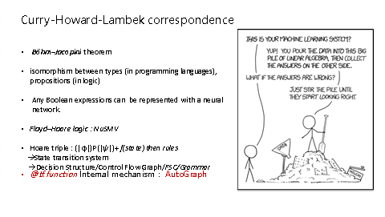

机器学习神经网络可解释性

幻灯片 2

 

 

核心观点，可解释性不是为了让人“以为自己理解了”，不是为了让人心里觉得爽或者无意义不可靠的试验来battle(当然，可靠思辨有意义的实验设计验证很重要)，而是要通过理解“设计的超参给定网络函数组要能cover对问题对应数据分布的解空间任一函数.

 

神经网络是一个可微函数族，那就让这个函数族能覆盖任务的特点；

关键应该是结构的设计，所谓结构的设计，要遵循的原则就是函数族覆盖问题的特性。

 

可解释性是为了能指导生产生活，我们的观点是“用来指导网络设计”，

 

比如整理好不同网络结构cover不同特性的任务，然后在此基础上算法网络结构搭积木，从而批量化排列组合生成可靠有效的神经网络产品。https://blog.csdn.net/qq_35082030/article/details/73368962 25种神经结构和对应github原仓库

 

 

幻灯片 3

 

 

回到故事的起点，从程序设计布尔逻辑门出发讨论神经网络结构函数映射的实现。

这是联结词完备集：与或非门 的神经网络结构

 

 

幻灯片 4

 

《离散数学》告诉我们任何逻辑公式可以写成析取范式或合取范式。

进而，组合前一页的逻辑门神经网络，可以用神经网络等效实现”any逻辑公式“！

幻灯片 5

 

 

说点题外话，这图是于博士建国同志从生物进化学出发探究为何生物演化出神经网络？

 

神经网络：同时有记忆功能和决策推理功能的最佳选择，更重要的是为了防止信息不足带来训练时期的过拟合，我们有遗忘机制。

 

能通过修改神经细胞群的链接强弱能力，重新建立新旧链接等机制来更新迭代现有知识。

 

这叫做”神经网络细胞群的自然选择“，可以解释在生物寿命周期内的演化和学习。

 

下面以异或门一个简单但是具有启发性的例子为例

 

讲假如已知一个具体算法函数公式的话，我们应该怎么设计对应功能的神经网络结构？

 

 

 

 

幻灯片 6

 

 

从析取范式公式出发，设计的网络

 

 

幻灯片 7

 

 

注意一个很有启发的观察结论：我们发现这是一个参数甚至结构都不一样网络，却能从同一个公式出发进行解释，进而设计。

 

 

幻灯片 8

 

 

又是同一个析取范式出发，设计的不同神经网络结构

 

 
a⊕b = (¬a ∧ b) ∨ (a ∧¬b)=(a ∧ b) ∨ (¬a ∧¬b)==(a ∧ b) ∨ ¬(a ∨ b)

幻灯片 9

 

 a⊕b = (¬a ∧ b) ∨ (a ∧¬b)=(a ∧ b) ∨ (¬a ∧¬b)=(a ∧ b) ∨ ¬(a ∨ b)

这是异或门从***\*合取范式\****出发进行设计的神经网络

 
a⊕b =(a ∨ b) ∧ (¬a ∨ ¬b)=(a ∨ b) ∧ ¬ (a ^ b)
 

幻灯片 10

 

 

同理，相同公式不同神经网络结构实现方式

 

 

幻灯片 11

 

 

那么逻辑解释和函数计算实践的关系是什么呢？

 

算法程序，在程序形式化验证领域使用霍尔逻辑演算规则来描述，等效的，也可以用代数计算/从函数映射角度/非线性决策分类出发，进而尝试分析异或门可解释性。(翻到下一页)这个异或功能网络的函数角度等效解释

 

幻灯片 12

 

 

(前一张图的解析)

注意这个决策函数(二分类器/直线)边界分割方式可以有无数种(线段偏移)，只要线性层train出来的能够被激活函数正确地做出决策二分类，此基础上组合网络结构，就是能学到解决对应问题的函数映射等效的decision structure。

 

这也能从函数角度解释前面为什么这么多XOR异或门的等效实现。

 

那么一个重要的观察结论就是：(因为当前异或门计算任务的数据概率分布解空间有无数个，神经网络只要概率性fitting 解空间一个就行，而不需要得到确定性求解算法表达式)

 

幻灯片 13

 

 

同理，另一种公式设计

 

幻灯片 14

 

 

前面异或门用的是thresh阈值激活函数，那么如果换成其他激活函数呢？早在1991年，已经有人用理论证明，如果神经网络的激活函数是连续、有界且非恒定值的，则可以在紧凑的输入集上实现连续映射。

https://www.zhihu.com/question/24259872/answer/623699200 最开始人们以为只有sigmiod有这样特性，后来发现只要是连续映射KST条件激活函数就能投票。

simoid不是必须的(梯度消失问题)，甚至现在基本总用Relu，多快好省方便利索。

 

我的观点是线性代数计算部分只是为了计算权重，实际上非线性激活函数才是每个网络cell投票决策的能力，并且还起到了特征选择的作用。

例如，经Rectified Linear Unit, ReLU抑制为0的神经元在之后的学习过程中不起任何作用。https://blog.csdn.net/weixin_38286298/article/details/90319134 因此用relu激活函数更适合深度网络的投票/决策/推理/判断/分类/回归类网络。

 

决策投票decision structure才是核心功能算法映射，反向BP梯度下降训练的参数只是用来判断当前cell能否达到选用的激活函数做出正确投票分类的决策阈值。

 

线性代数运算还有一个好处：连续可微可导，可以反向求导自动求出来的(当前选用的连续非线性激活函数决策阈值)的参数权重，来适应对应激活函数的决策阈值。假设换激活函数后，只是每个cell决策阈值量化的自变量数值上看起来不一样，其实换个激活函数，这个决策网络decition structure结构也和前文异或门决策结构类似。

 

而这个decision structure 才是解决问题正确的控制流图，,我认为这个决策图结构是类似相同目标函数对应算法计算图的，具体体现就是train出来类似的适应当前问题特定数据概率分布规律的决策网络。

 

支撑这个观点的一个证据是：二值网络能力也不算差。一方面，二值网络(起因)压缩技术实现更高效的推理。另一方面，可以利用二值网络来进一步研究卷积神经网络的可解释性，即找出哪一层是重要的，哪一层是无用的并且可以从黑盒中删除，哪种结构有利于准确预测。

 

很多时候，train出来的网络结构，去掉dead cell/dead substructure后的子图主要走特定的结构。

https://zhuanlan.zhihu.com/p/270184068

 

https://zhuanlan.zhihu.com/p/350439652

 

 幻灯片 15

 

 

那么如果先有算法再设计神经网络具体可以怎么做呢？

 

先搭建右图这么一个多层网络，不需要知道具体映射，不需要知道具体参数大小，只需要知道大概解函数映射中，大概需要”谁和谁建立联系，谁和谁有关联”，***\*设计神经网络结构\****初始训练函数族的时候就要cover这种相关关系。

 

这很重要！

 

换句话说，神经网络学习设计中，利用可解释性，在特定问题设计时，针对该问题数据概率分布特点，分析问题解映射的特点，数据关联，去设计能cover这种特点的最适合的网络结构，去train自动获取参数(就像turing的P/A/B型机器内生计算)。

 

 

比如要让计算机自发理解年龄和出生年月的(线性)关系y=2*x+b=2*(1*x+c1)+c2 = …… ,只要能正确激活括号内函数就能很多种写法，可以有无穷多种网络写法,就像异或网络可以很多种结构。其实非线性分类机也同理，只是都多组合几个决策而已。

 

幻灯片 16

 

 

如果我们把问题抽象成一个任务和一个问题解映射函数。

这个初始化神经网络结构代表的函数族就是为了找对应问题的解函数映射。

 

这个解如果理解为一个tensorflow算法代码实现的话，可以画出计算图，结构化程序定理告诉我们可以用一个计算图，一个decision structure自动机迁移系统来等效表示。

\---------------------------------------------------------------------------

结构化程序定理:“任意正规程序都能等价于基集合{序列，if then rules, while do}产生的结构化程序，可以理解为程序(函数)流程图。

程序算法本质同构画出等效控制流图/FSC/Grammar。迁移系统(程序/算法/逻辑功能电路验证/设计运行系统(电梯系统PLC画图程序之类的)/设计的协议是否能满足LTL目标使用需求/自动机/确定性策略的Markov Network/状态迁移图...

AutoGraph 将函数中的 Python 控制流语句转换成 TensorFlow 计算图中的对应节点。如 while 和 for 语句转换为 tf.while ， if 语句转换为 tf.cond 等

\------------------------------------------------------------------------

 根据柯里霍华德同构，我们又知道文法就是符号版自动机。

 \------------------------------------------------------------------------

 Curry-Howard 同构显示了推理系统和程序语言之间的相似性

\--------------------------------------------------------------------------

 假设把这个算法语义结构翻译成霍尔逻辑，这个算法决策步骤就是霍尔三元组描述的符号演算逻辑推理规则中，把问题抽象成等效文法问题/符号逻辑推理/归纳逻辑ILP规则学习 问题。

 前文提到，神经网络可以表示任意的布尔表达式。那这个文法规则也就能用网络结构表达式。但是因为不方便等原因，实际上我们还是直接从自动机角度理解就好。

\-----------------------------------------------------------------------

Floyd–Hoare logic用严格的数理逻辑推理来保障程序正确性，比如NuSMV。

符号演算规则“霍尔三元组”:  (|ϕ|)P(|ψ|)表示状态ϕ下做动作P到达下一状态ψ，配合if(state) then rules就是状态迁移系统,决策过程中，状态转移依靠状态

最弱前置谓词if(state) then rules。

除了Hoare论文中的简单语言的规则，其他语言构造的规则也已经被Hoare和很多其他研究者开发完成。包括并发、过程、goto语句，和指针。

\------------------------------------------------------------------------

 

幻灯片 17

 

 

但是，不像文法自动机倾向于具体算法函数，神经网络学的是逼近这个算法要解决问题的***\*概率分布\****的很多种映射函数的***\*其中一种\****(如XOR) 欧氏空间之间的非线性映射，或者说学到的是***\*解空间\****。

因此如何用映射表示概率分布成为研究重点。

 

这里一个强化学习DQN的目标是学习到一个离开房子的策略policy https://blog.csdn.net/itplus/article/details/9361915

 

注意不是唯一解控制流图，观察实际上train出来右边的解图结构中，房间三号,S3到S1是一种解，S3到S4另一个可行解。

初始点I --> G目标点 竟然有两个解图！写成确定性状态转移决策算法的话，位于状态3号既可以去1也可以4，概率性决策选一个就能解决问题！

 

 

满足问题要求的数据分布有多个解答，把他俩函数映射关系合起来看作一个解空间，概率性选一个学出来就可以！

 这，配合前文异或门的多解例子，进一步说明神经网络的求解观点是：我们不需要学出来一个确定性算法/状态迁移系统/petri网络，只需要学习适合任务要求概率分布的决策结构decision structe!

 时髦点的话来说就是：设计的神经网络结构需要能够***\*从数据中学习\*******\*隐藏的流形结构\****，这样训练就能学习到 ***\*特定任务在\*******\*流形上的概率分布\****。(翻下一页进一步解释)

 

幻灯片 18

 

 

《花书》没有免费午餐定理：在所有可能的数据生成分布上平均之后，每一个分类算法在未事先观测的点上都有相同的错误率。告诉我们没有万能算法可以解决任何问题。我们目标是理解什么样的分布与人工智能获取经验的 ‘‘真实世界’’ 相关，什么样的学习算法在我们关注的数据生成分布上效果最好。

 

换言之，我们核心假设是”需要求解的任务数据冥冥中满足特定规律“。

 天地有正气，杂然赋流形:

这点引用顾险峰的话就是”***\*高维数据分布在低维流形附近，流形中具有特定概率分布，深度学习网络具有强大的逼近非线性映射的能力。\****有时候，神经网络毕竟的不是函数或映射，而是概率性分布。更为重要的，***\*逼近概率分布比逼近映射\****要容易得多。在理想情况下，即逼近误差为零的情形，如果神经网络逼近一个映射，那么解空间只包含一个映射；如果神经网络逼近一个概率分布，那么解空间包含无穷个映射，这些映射的差别构成一个无穷维李群。“

 

\---------------------------------------------------------------------------

通俗解释就是：前面PPT提到网络可以学习计算图算法等“***\*确定性函数\****”和神经网络结构的同构关系这点,可能过分强调确定性运算状态迁移关系，

 

实际上我认为应该强调激活函数的非线性决策集群的投票行为，才是真正解决问题实现的非线性decision structure。

 

只要设计出的神经网络结构有着能够cover到“问题任务需求的数据概率性分布规律”解空间 的可能性，然后BP自动train出来的解结构就能解决问题。

 ---------------------------------------------------------------------------------------------------------------------------

 个人实用主义的数学观点是奥卡姆剃须刀原理：要数学，但不需要过于数学。

流形(Manifold)是局部具有欧式空间性质的空间，流形的局部和欧式空间是同构的。对应***\*可微分编程，\****理论保证神经网络反向求导就够用了。

李群（英语：Lie group）是一个数学概念，指具有群结构的光滑微分流形，其群作用与微分结构相容。引入李群的最初动机是为微分方程的连续对称性建模，就像有限群被用于伽罗瓦理论对代数方程的离散对称性建模一样。

剩下的太过数学我就不懂了，等真有需要再学习吧。

 \---------------------------------------------------------------------------------------------------------------------------

***\*参考\****

 流形(Manifold)是局部具有欧式空间性质的空间，包括各种纬度的曲线曲面，例如球体、弯曲的平面等。流形的局部和欧式空间是同构的。流形学习假设所处理的数据点分布在嵌入于外维欧式空间的一个潜在的流形体上，或者说这些数据点可以构成这样一个潜在的流形体。

流形是线性子空间的一种非线性推广。

拓扑学角度：局部区域线性，与低纬欧式空间拓扑同胚(连续的变换最后都能变成一样的两个物体，成为同胚，Homeomorphism)。

微分几何角度：有重叠chart的光滑过渡(把流体的任何一个微小的局部看作是欧几里德空间，称为一个chart)。

黎曼流形就是以光滑的方式在每一点的切空间上指定了欧式内积的微分流形。
链接：https://www.zhihu.com/question/19926894/answer/120742534

 

李群（英语：Lie group）是一个数学概念，指具有群结构的光滑微分流形，其群作用与微分结构相容。李群是连续的群，也即其元素可由几个实参数描述。因此，李群为连续对称性的概念提供了一个自然的模型，例如三维旋转对称性。李群被广泛应用于现代数学和物理学。索菲斯·李引入李群的最初动机是为微分方程的连续对称性建模，就像有限群被用于伽罗瓦理论对代数方程的离散对称性建模一样

 

深度学习的几何观点（1） - 流形分布定律 https://mp.weixin.qq.com/s?__biz=MzA3NTM4MzY1Mg==&mid=503330762&idx=1&sn=a243f6ebe1be19e38aafff36c652df16&chksm=0485c1c133f248d7339736c1c071f2df964cbc794a83b92546c2d57f9ce7991acf4da27a9396&mpshare=1&scene=1&srcid=04099t7TkHfOcqHhXPLgIEyH&sharer_sharetime=1617943183469&sharer_shareid=7145cbc3d8fd655459c0177e9b45259c#rd

 

计算共形几何暑期课程B站有视频，github有PPT https://mp.weixin.qq.com/s/H9MBGEBw8T6BwcUnBcARDg

 

《Computational Conformal Geometry》by Gu and Yau, High Education Press, International Press, 2008.

 Na Lei, Zhongxuan Luo, Shing-Tung Yau and David Xianfeng Gu.  "Geometric Understanding of Deep Learning". arXiv:1805.10451 .

 ttps://arxiv.org/abs/1805.10451

 Xianfeng Gu, Feng Luo, Jian Sun, and Shing-Tung Yau. "Variational principles for minkowski type problems, discrete optimal transport", and discrete monge-ampere equations. Asian Journal of Mathematics (AJM), 20(2):383-398, 2016.

 Na Lei,Kehua Su,Li Cui,Shing-Tung Yau,David Xianfeng Gu, "A Geometric View of Optimal Transportation and Generative Model", arXiv:1710.05488. Add to Citavi project by ArXiv ID https://arxiv.org/abs/1710.05488

 幻灯片 19

 

 

大体分两类网络结构”特征提取/知识表示类””决策/回归/分类/推理类”。

 

重申核心观点，可理解性的目标是指导生产：设计的超参给定网络函数组要能cover对问题对应数据分布的解空间任一函数.

既然神经网络是一个可微函数族，那就让这个函数族能覆盖任务的特点；

关键应该是结构的设计，所谓结构的设计，要遵循的原则就是函数族覆盖问题的特性。

 

《数字图像处理》中学到：空间域卷积=频域Fourier变换，本质就是特征提取滤波。若是高通滤波器（则，边缘提取）/ 低通录波器（图像平滑，提取整体特征）

 

典型例子就是图像识别任务：cnn识别类网络+mlp多层感知机推理分类回归决策网络 不一定就是最优，

其中识别网络可换成别的，推理网络也可换成别的，排列组合就能水出很多刷榜论文。比如这里有用像素概率分布决策图替换卷积实现图像分类的任务，感兴趣也可看知乎链接关于不是用神经网络之前手写识别是怎么做的？

 

《特征工程》word2vec训练出来的词的embedding不但实现了NLP词的量化为计算机可读数据格式，后来还发展了glove表示context和语义知识。

 

Seq2seq，数据分布特点是节点和上一个节点有关系(时序性),这实际上在结构上进行递归的神经网络计算图。较早的RNN连乘一直带来两个问题：梯度爆炸和消失。在前向过程中，开始时刻的输入对后面时刻的影响越来越小，这就是长距离依赖问题。这样一来，就失去了“记忆”的能力。要知道生物的神经元拥有对过去时序状态很强的记忆能力。

长短期记忆（Long short-term memory, LSTM）就是要解决这两个问题，通过引入若干门来解决，相比RNN多了一个状态cell state。cell state承载着之前所有状态的信息，每到新的时刻，就有相应的操作来决定舍弃什么旧的信息以及添加什么新的信息。这个状态与隐藏层状态h不同，在更新过程中，它的更新是缓慢的（从而实现比较长的短时记忆），而隐藏层状态h的更新是迅速的。

 

DQN强化学习例子：

需要识别sensor？值迭代过程用CNN嵌入到策略网络中

需要建模序列状态？à那就网络迭代k次，理解为看k步后的值函数

值迭代网络需要输入特征局部加权？à那就Attention机制

 ------------------------------------------------------------

Fourier变换提出背景：为了对复杂函数进行偏微分计算。1822年发表的《热的解析理论》

傅里叶变换就是把一个任意函数（序列）转化为一个个不同频率的三角函数（序列）的和的函数“裂解器”

\-----------------------------------------------------------

 【1】Training decision trees as replacement for convolution layers

原因是没有RNN时字体识别可以用https://www.zhihu.com/question/29238666/answer/232523424

[2]Value Iteration Networks

https://daiwk.github.io/posts/rl-stepbystep-chap13.html

 下面基于来自李宏毅，非常推荐华语机器学习之光李宏毅的RL,double DQN讲法，LSTM讲法都能让人直呼过瘾。

幻灯片 20

 

 

类比MLP参数太多空间指数碰撞过拟合，cov卷积共享参数防止过拟合。

实际上Attention可以看作在seq2seq在RNN/LSTM难以并行计算基础上，模仿CNN并行计算的一种共享参数防止”参数过多过拟合”的设计。目标是对context上下文加权，关注局部细节的作用。

 

 幻灯片 21

 

 

人工智能有三种记忆方式：

 

1感知记忆：比如前文提到的特征感知类网络

 

首先发现了傅里叶分解原理，然后发现人类耳蜗神经结构就是在对声音信号进行傅里叶分解；

人类首先发现了保角变换（共形变换），后来发现从视网膜到第一级的视觉中枢就是保角变换。

\----------------------------------------------------------------------------------------------------------

一个保持角度不变的映射。共形变换保持了角度以及无穷小物体的形状，但是不一定保持它们的尺寸。

共形的性质可以用坐标变换的导数矩阵雅可比矩阵的术语来表述。如果变换的雅可比矩阵处处都是一个标量乘以一个旋转矩阵，则变换是共形的。

\--------------------------------------------------------------------------------------------------------------

 2短时记忆working记忆

 3长时记忆，提取和当前知识相关内容。

 Attention局部加权，强者恒强，

 RNN/LSTM问题是memory 没法太大，因为随着memory参数k增加k by k matrix增加很快.参数太多太容易overfitting

 Attention参数增加数据不会增太快

 类似不同卷积核不同特征，多头多个特征

 Self attention自注意力保持

 

幻灯片 22

 

 

幻灯片 23

 

 

Caption generation story like

How to do story like !!!!!!!!!!!!!!!!!!

 http://www.cs.toronto.edu/~mbweb/

https://github.com/ryankiros/neural-storyteller

《Show, Attend and Tell: Neural Image CaptionGeneration with Visual Attention》

 

幻灯片 24

 

 

# 1. 结构化学习train出答案

过程解释就是答案解释

--------------------------------------------

由上文铺垫，可以开始看这篇文章相关信息了，主要看2.2和2.5相关引用论文及其引用论文引用的论文：[人工智能系统的形式化验证技术研究进展与趋势](http://svlab.nuaa.edu.cn/_upload/article/files/02/f8/0d1959cc49a5bdab54b2b35edd94/0675d3aa-fad1-4e24-baf5-18ad9891be86.pdf)

1.5 图形化理解神经网络中的异或问题 - 如是的文章 - 知乎
https://zhuanlan.zhihu.com/p/25736962

https://www.cnblogs.com/Belter/p/6711160.html
神经网络实现异或（XOR） 

