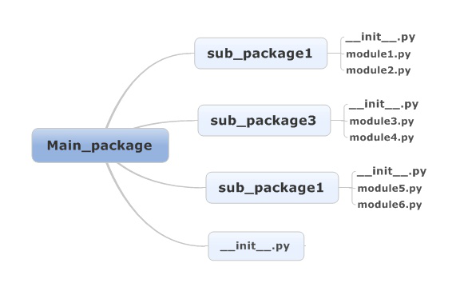

# 1. python包机理机制

从上边的例子可以看出，\_\_init\_\_.py的主要作用是：

1\. Python中package的标识，不能删除

2\. 定义\_\_all\_\_用来模糊导入

3\. 编写Python代码(不建议在\_\_init\_\_中写python模块，可以在包中在创建另外的模块来写，尽量保证\_\_init\_\_.py简单）

https://www.cnblogs.com/he12345/p/7510767.html

[python项目内import其他内部package的模块的正确方法](https://www.cnblogs.com/he12345/p/7510767.html)

本文主要介绍如何在一个python项目中，优雅的实现项目内各个package的模块（module）之间的相互引用。

之所以写这篇文章，是因为网上流传的各种奇技淫巧简直五花八门（包括stackoverflow等知名社区），极易误导对python的import机制不熟悉的人。比如我就曾一度因为找不到优雅的import方式，而认为python是一门愚蠢的语言。所以，我把近一上午的学习结果总结出来，希望大家不要误入歧途。

本文参考了如下两篇博客：   
habnab关于python package的精彩总结：[地址点我](http://blog.habnab.it/blog/2013/07/21/python-packages-and-you/)   
Jean-Paul Calderone关于python项目结构的建议：[地址点我](http://as.ynchrono.us/2007/12/filesystem-structure-of-python-project_21.html)


详细介绍有博文：https://realpython.com/python-modules-packages/


[模块和包](https://link.zhihu.com/?target=https%3A//docs.python.org/3/tutorial/modules.html%23modules)**

我们用两句话来介绍Module和Package：

1.  Module是一个Python源代码文件，即扩展名为.py的文件。
2.  Package是一个包含\_\_init\_\_.py文件的目录，可以包含python模块和其他包。


两个概念：package和module

package，就是一个包，里面可以装东西的，可以装subpackage，也可以装module。怎么确定一个文件夹就是一个package呢：关键就看这个package里面是否有一个py文件叫\_\_init\_\_.py。只要有这个文件，就把该文件作为一个package就可以了，不管是package还是subpackage。

那什么是module呢？就是package中的一个py文件。

二、\_\_init\_\_.py文件的作用

(1). \_\_init\_\_.py文件定义了包的属性和方法，

(2). \_\_init\_\_.py会告诉python这是一个package

(3). 如果在\_\_init\_\_.py文件中定义一个\_\_all\_\_ = \["Module1", "Module2", "subPackage1", "subPackage2"\]的变量，那么在import的时候，就会把\_\_all\_\_ 列表中的子模块和子包导入到当前作用域中来。

二、在开发的时候如何import?

1\. 常见的import有如下形式

```text
import package
import module
from package import module/subpackage (as XXX)
from package.subpackage import module/subpackage (as XXX)
from module import function
from package import *     ##
```

但是，import module.function这种写法是错误的。



其中，每个module.py文件中会有若干个function。

在调用包的时候，

（1）同一个main\_package下的各个subpackage相互调用。如sub\_package1中的module1.py想调用sub\_package1的module2.py、sub\_package1的module2.py中的function1函数和sub_package2的module2.py

那么可以这样使用：

```text
from . import module2.py
from .module2.py import function1
from ..sub_package2 import module2.py
```

总结：“. ”是导入本package的module，“.. ”是导入与package同级的packge中的module

（2）不同的main_package下的module.py文件相互调用。这个就比较常见了，不多讲。


Python中 文件夹的含义


python中模块就是指一个py文件，如果我们将所有相关的代码都放在一个py文件中，则该py文件既是程序由是模块，但是程序和模块的设计目的是不同的，程序的目的是为了运行，而模块的目的是为了其他程序进行引用。

Dictionary在pycharm中就是一个文件夹，放置资源文件，对应于在进行JavaWeb开发时用于放置css/[js](https://link.zhihu.com/?target=http%3A//lib.csdn.net/base/javascript)文件的目录，或者说在进行物体识别时，用来存储背景图像的文件夹。该文件夹其中并不包含_ _ init.py_ _文件

对于Python package 文件夹而言，与Dictionary不同之处在于其会自动创建_ _ init.py_ _文件。   
简单的说，python package就是一个目录，其中包括一组模块和一个_ _ init.py_ _文件。

该文件与Python的import机制有关，这关乎到你的哪些.py文件是对外可访问的。有些时候，如果一个包下有很多模块，在调用方import如此多模块是很费事，且不优雅的，此时可以通过修改_ _ init_ _.py来完成该任务。

其实_ _ init_ *.py可以为空，当其为空时，from Image import * 将Image包下所有的模块都进行引用，如果想要控制引用的模块，则可以自行定义 all* _
https://zhuanlan.zhihu.com/p/97930453


Python包的相对导入时出现错误的解决方法

```text
from . import XXX
from .. import XXX
```

会遇到如下的问题提示

```text
SystemError: Parent module '' not loaded, cannot perform relative import
ValueError: attempted relative import beyond top-level package
```

其实这两个错误的原因归根结底是一样的：

在涉及到相对导入时，package所对应的文件夹必须正确的被python解释器视作package，而不是普通文件夹。否则由于不被视作package，无法利用package之间的嵌套关系实现python中包的相对导入

文件夹被python解释器视作package需要满足两个条件：

1.  文件夹中必须有\_\_init\_\_.py文件，该文件可以为空，但必须存在该文件
2.  不能作为顶层模块来执行该文件夹中的py文件（即不能作为主函数的入口）

补充：在"from YY import XX"这样的代码中，无论是XX还是YY，只要被python解释器视作package，就会首先调用该package的\_\_init\_\_.py文件。如果都是package，则调用顺序是YY，XX

练习中“from . import XXX”和“from .. import XXX”中的'.'和'..'，可以等同于linux里的shell中'.'和'..'的作用，表示当前工作目录的package和上一级的package

　　举个例子：

　　目录树

```text
testIm/
--__init__.py
--main.py : from Tom import tom
--Tom/
　　--__init__.py : print("I'm Tom's __init__!")
　　--tom.py : from . import tomBrother, from .. import kate,print("I'm Tom!")
　　--tomBrother.py print(I'm Tom's Brother!)
--Kate/
　　--__init__.py : print("I'm Kate's __init__!")
　　--kate.py
```

运行文件：main.py

```text
I'm Tom's __init__!
I'm Tom's Brother!
Traceback (most recent call last):
File "D:\PythonLearning\TestIm\main.py", line 3, in <module>
from Tom import tom
File "D:\PythonLearning\TestIm\Kate\kate.py", line 4, in <module>
from .. import kate
ValueError: attempted relative import beyond top-level package
```

可以看到from . import tomBrother顺利执行，首先执行了Tom文件夹下的\_\_init\_\_.py文件，后来执行了tomBrother.py文件，但是当执行到“from .. import kate”时报错，这是因为我们是在TestIm文件夹下把main.py文件作为主函数的入口执行的，因此尽管TestIm文件夹中有\_\_init\_\_.py文件，但是该文件夹不能被python解释器视作package，即Tom package不存在上层packge，自然会报错，相对导入时超出了最高层级的package

修改方法：

目录树

```text
test/
--main.py : from testIm.Tom import tom
--testIm/
　　--__init__.py
　　--Tom/
　　　　--__init__.py : print("I'm Tom's __init__!")
　　　　--tom.py : from . import tomBrother, from .. import Kate,print("I'm Tom!")
　　　　--tomBrother.py print(I'm Tom's Brother!)
　　--Kate/
　　--__init__.py : print("I'm Kate's __init__!")
　　--kate.py
```

运行文件：main.py

结果：　　

```text
I'm top's __init__!
I'm Tom's __init__!
I'm Tom's Brother!!
I'm Kate's __init__!
I'm Tom!
```

即主函数入口不在TestIm中，则TestIm和其同样包含\_\_init\_\_.py文件的子文件夹都被python解释器视作package，形成相应的嵌套关系。可以正常使用from . import XXX和from .. import XXX

  

[Python包的相对导入时出现错误的解决方法 - 青山牧云人 - 博客园​www.cnblogs.com](https://link.zhihu.com/?target=https%3A//www.cnblogs.com/ArsenalfanInECNU/p/5346751.html)
https://zhuanlan.zhihu.com/p/82566231


https://zhuanlan.zhihu.com/p/35749853


