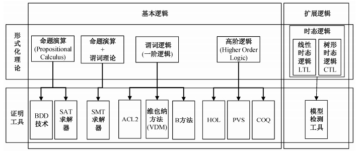

Z3 https://github.com/Z3Prover/z3
Vampire https://vprover.github.io/
Matryoshka http://matryoshka.gforge.inria.fr/
Dafny https://rise4fun.com/Dafny
Ivy https://github.com/microsoft/ivy
Isabelle https://isabelle.in.tum.de/
HOL https://hol-theorem-prover.org/
Coq https://coq.inria.fr/
Agda https://agda.readthedocs.io/en/v2.6.0.1/
Lean https://leanprover.github.io/about/
VST https://github.com/PrincetonUniversity/VST

《形式化方法的研究进展与趋势》 http://svlab.nuaa.edu.cn/_upload/article/files/02/f8/0d1959cc49a5bdab54b2b35edd94/0675d3aa-fad1-4e24-baf5-18ad9891be86.pdf
ccf

http://xbna.pku.edu.cn/html/2016-2-363.htm
形式化 综述，有很多

近年来, 形式化方法发展很快, 一些技术已经产生工业应用。以逻辑系统为主线, 分析几个影响力比较大的形式化验证技术和验证工具, 以帮助应用工程师选择并使用形式化工具。主要包括命题演算和时态逻辑方面的SAT、BDD、模型检测和SMT, 谓词逻辑方面的ACL2、VDM方法和B方法, 以及高阶逻辑方面的HOL、PVS和COQ。还介绍形式化方法在学术界和工业界的应用情况, 最后给出几个商业化的形式化验证工具。

近年来, 形式化方法的研究与应用极其活跃。传统的定理证明器、模型检测器等形式化工具越来越成熟, 新的高性能形式化系统层出不穷。在应用领域, 一个重要趋势是出现越来越多较大规模的形式验证成果, 形式化方法正在走进工业界。

在硬件验证领域, 形式化方法早已广泛采用。INTEL公司曾因为浮点算术部件的一个错误而遭受近5亿美元的损失, 此后INTEL引进HOL证明器, 开发了FORTE系统, 将形式化方法引入验证流程。引入形式化方法的大公司还有AMD, IBM, INTEL, NVIDIA, CADENCE, Motorola, 西门子和微软等等。

学术界也出现了一批有规模的实用型形式化研究成果。比如, 剑桥大学进行了ARM6处理器的验证[1], 德国的Verisoft项目验证了一个一万行的操作系统核心[2], 法国国家信息研究所(INRIA)在COQ定理证明器的支持下, 开发并验证了一个完整的C编译器[3]。

一批专业性的形式验证公司正在兴起。除早期的等价性验证工具(如FORMALITY)外, 新兴公司(如JASPER和Calypto)采用更高级的证明技术, 在半导体行业著名公司中拥有很多客户, 包括INTEL, NVDIA和ARM等等。虽然形式验证技术还不能全面取代模拟验证, 但在很多应用领域, 商业化的形式验证工具已经相当成熟, 其应用范围迅速扩大, 尤其是它们能够发现传统验证方法难以发现的错误。在国外大公司中, 推广形式化方法已经成为一个重要趋势。

2013年10月23日, 半导体行业的著名论坛SemiWiki①上有一条引人注目的消息“Formal Will Dominate Verification”称业界著名的形式验证公司JASPER自2007年以来, 年增长速度为37%, 超过EDA工业平均水平6倍, 其用户数增长率为79%, 许可证增长率为129%。该公司的工具系统可以处理的设计规模年增长率达100%, 远远超过摩尔定律的年增长率40%。文章作者认为, 在未来, 形式化方法将成为验证行业的主流工具。统计显示, 关键系统硬件验证所花费的时间占系统开发总时间的70%~80%, 所以, 形式化方法对整个硬件开发的影响将非常巨大。

① http://www.semiwiki.com

在这种形势之下, 让国内从事程序测试和FPGA验证的专业部门和工程人员较全面地了解形式化方法的进展很有必要。形式化方法这一领域非常庞大, 本文仅对基于逻辑的形式化方法做大致的描述, 介绍若干较有影响的逻辑系统、证明工具和应用案例, 帮助应用人员了解并选择合适的形式化工具和方法。形式化方法理论、证明器开发技术以及逻辑之外的形式化系统均不在本文讨论范围之内。

1 命题演算和SAT求解器
最简单的逻辑系统是命题演算(propositional calculus), 其典型的应用之一是描述和证明两个组合电路的等价性。一些更复杂的问题也能用命题演算表示和证明, 比如CPU设计中流水线结构与非流水线结构的等价性。

命题演算研究的基本问题包括可满足性(Satis-fiability)和永真性。所谓一个命题“可满足”指存在对变量的一种赋值, 使命题为真。可满足性的反面是不可满足, 即对这个命题的所有赋值都不能使命题为真, 或者说该命题是永假命题(unsatisfiable)。永假命题的否定命题便是永真命题(tautology), 因此, 要证明一个命题永真可以转换成证明这个命题的否定为永假。

命题演算的证明问题有两个重要特点:第一个是它的可判定性, 即可以构造出自动化的算法, 证明任何一个命题的可满足性; 第二个特点是证明的复杂性。命题演算的判定问题是一个NP完全性问题, 目前, 解决此类问题的算法所需的时间和空间资源都随问题规模增加呈指数级增长。

命题演算在自动证明方面有两个重大进展:一个是BDD技术; 另一个是SAT求解器。它们大幅提高了证明的速度以及可以处理问题的范围。

一个命题逻辑公式往往有很多等价的表示。在描述一个大规模电路时, 大部分描述方式会占用很大的存储空间, 这种情况给问题的求解带来很大困难。为此, Bryant[4]提出BDD (binary decision dia-gram)技术, 把命题公式转变为一种紧凑的图表示。在这种表示方式下, 所有相互等价的命题公式只有唯一的BDD图结构。这样, 一方面减少了逻辑公式在计算机中所占的空间, 另一方面也提供了命题公式等价性检查的一种方法。所以, BDD被用于组合电路的等价性证明以及模型检查方法。

SAT求解器采用基于David-Putnam的搜索技术(也称DP方法)解决可满足性问题。原始的DP方法搜索效率很低, 能够解决的问题规模比较小。2000年以来出现一批对DP方法的改进技术, 比如“冲突分析”和“递归学习”等。它们的主要作用是在搜索过程中通过对已处理过的子树的分析。找出一些特征, 利用这些特征跳过许多搜索子树, 因此有可能大大削减搜索空间。这些新技术大幅度提高了证明的速度和规模, 其强大能力超出很多计算机科学家的预期。

在新型SAT求解器出现之前, 一般的定理证明器大约只能证明几十个、最多几百个变量的问题。而新的SAT求解器所解决的最大案例超过了一百万个变量和3百万~4百万个子句, 花费时间仅几小时[5]。因此, SAT技术可用于大规模集成电路的验证, 受到工业界重视, 一些商业化的形式化工具内部都包含SAT求解器。

当前, 基本的SAT求解技术主要分成两大类:一类是基于冲突分析(conflict analysis)的技术, 代表性的求解器有Grasp, Sato, Chaff, MiniSat, Berk-Min, Siege和MaxSAT; 另一类是基于前向分析(look-ahead)的技术, 代表性的求解器有Bohm, Posit, Satz, EqSatz, OKsolver, March_dl和Kcnf等[5]。

SAT求解器是许多更复杂的证明工具的基础, 是模型检测和SMT工具中的一个重要模块。除在硬件验证中的应用外, SAT求解器在人工智能, 软件验证等领域也有广泛应用[5]。主要方法是利用命令式语言的一个抽象模型--状态转换系统(transition system)。例如在C程序验证中, 首先把C代码转换成反映程序状态转换关系的控制流图, 然后把程序验证归结为检查程序是否可能到达某个出错位置的问题, 再用SAT求解。

2 时态逻辑和模型检测工具
时态逻辑研究状态随时间变化系统的逻辑特性。由于软件和硬件的运行都是状态变化的过程, 所以时态逻辑在程序验证和硬件验证中应用相当广泛。其中, 有3类特性的应用最广:安全性(safty properties)、活性(liveness properties)和公平性(fairness)。粗略地说, 安全性指某些状态(不好的)永远不会到达; 活性指某种期待的良好性质迟早会成立; 公平性指系统提供的各项服务都将有平等的机会得到执行。时态逻辑特性通常用模型检查工具来验证。

模型检查是一种著名的形式化技术[6], 这里的“模型”指系统的模型。在软件中, 一个模型通常是一个程序, 在硬件中通常是一个电路, 此外模型也可以是软硬件系统的一个抽象模型, 比如一个自动机。模型描写系统的状态变化过程, 模型检查就是检查此模型是否满足某些预先规定的要求或特性。

系统的特性通常用时态逻辑表示, 比如系统是否会发生死锁, 是否会在指定时间内发生死锁, 系统是否会运行到某个错误状态, 是否在指定时间内能够对输入信号做出响应等等。模型检查的基本方法就是对系统状态进行穷尽搜索, 以验证系统是否满足规定的特性。

应用模型检测方法时要考虑下面几个因素。

1) 特性描述语言。根据任务要求选择适用的特性描述语言, 比如命题逻辑、LTL或CTL等。此外还有各种专用的特性描述语言, 比如PSL (property specification language)。

2) 模型描述语言。可以是C, JAVA, Verilog和VHDL等语言写的源代码, 也可以是某种专用的模型描述语言(如Promela)。模型描述语言的选择要根据问题和模型检查工具来定。

3) 模型检查工具。包括针对软件的工具和针对硬件的工具, 模型检查工具决定特性描述语言和模型描述语言。模型检查工具数量非常多, 有些工具可以直接用于源代码(C, C++, JAVA, Verilog和VHDL), 有的工具仅对某种抽象语言进行检查, 有些工具有自己的语言, 应用时需要把源代码转换成该工具的语言, 也有些工具可用于多种语言。下面介绍几个比较著名的模型检查工具。

CBMC是卡内基梅隆大学开发的针对C语言的有界模型检查器, 也支持C++和System C。它能够验证C/C++程序与Verilog等其他程序之间的语义一致性(consistency), 方法是将语言中的循环展开, 把两个程序分别转换成布尔表达式, 然后应用SAT和SMT工具证明其一致性, 如果两个程序不一致, CBMC将输出一个反例[7]。

Cadence SMV是McMillan在CMU的SMV软件基础上开发的针对硬件验证的符号模型检查工具, 其输入语言是SMV或Verilog语言, 用于证明cache coherence等硬件设计问题。该工具可以免费用于学习和研究工作, 商业版的软件是Cadence公司的Incisive系列工具。

UPPAAL是一个基于时间自动机的模型检测工具[8], 用多个并行自动机表示并行系统, 并且在自动机中引入时间概念。UPPAAL系统能够支持系统的建模, 模拟和形式化特性验证。

由于模型检查工具能够进行自动证明, 所以在工业界有广泛应用。模型检查的一个案例如列车距离保持系统软件验证。欧洲铁路安全标准(比如CENELEC EN-50126, EN-50128)要求采用形式化方法。Cimatti等[9]用模型检查方法验证了Logica di Sicurezza (LDS)软件, 该软件是Ansalodo-STS开发的一个列车管理系统软件中关于第二层安全逻辑的一个实现。过去, 该软件依靠人工审查和模拟进行验证, 很难检查所有可能情形。文献[9]采用支持软件验证的符号模型检查技术, 并使用模型检查器NuSMV。研究者把一个C++子集所写的需求说明转换为NuSMV的描述语言代码, 后者可以用有界模型检查、时态归纳和CEGAR等方法进行证明。另外, 他们把C++程序转换成顺序C代码, 后者又可以用支持C的一组模型检测工具进行检查。在这项工作中, 研究者比较了一批模型检查工具KRATOS, BLAST, SATABS, CPACHECKER, CMBC和NuSMV, 做了94个测试案例。结果显示, NuSMV表现最好, 所有问题都能解决, 且速度最快, 占用的存储空间最小。

3 SMT求解器
SMT[10]起源于对SAT的扩充。SAT的表达能力局限于命题演算, 许多问题需要用更强大的逻辑系统来表达。近几年出现的一个新动向是在SAT基础上通过添加“理论”的方式进行扩展, 既增加了表达能力, 又能继续保持SAT的高效求解性能。这类证明器统称为SMT。

SMT中的“理论”可以看做描述一类数据结构的公理集合。常用的理论有等式理论、算术理论、指针理论和矩阵理论等。在SAT基础上扩充这些理论, 使得一些程序验证工作能够高效进行。SMT方面的研究是近几年形式化方法的一个热点。

在SAT基础上仅扩充单个理论往往不能满足应用的需要。为了能够扩充多个理论, 需要有一种理论组合方法。最早提出的理论组合方法有Nelson-Oppen (NO), 其他理论组合方法有Delayed Theory Combination (DTC)和Ackerman化方法。DTC在NO的基础上做了重要改进, 很多优秀的求解器采用DTC方法, 包括Yices[11]、Z3[12], Mathsat5[13]和CVC3[14]。Ackerman化方法是一种特殊的理论组合判定方法, 用来处理未解释函数的理论组合问题, 常与DTC方法结合使用, Z3和Mathsat4采用了该方法。

SMT的发展非常迅速, 目前流行的SMT求解器有Barcelogic, Beaver, Boolector, CVC3, ALT-Ergo, Mathsat5, OpenSMT, Sword, VeriT, Yices, Z3, STP以及Spear。国际上自2005年开始, 每年举办SMT竞赛, 2008和2009两年中排名居前的几个证明器是Z3, Yices2, MathSAT-4.2, Barcelogic和CVC3。

文献[15]对SMT的发展给出很好的综述, 使用3万多个测试用例检查5个主要的SMT求解器。分析显示, Z3总体求解能力最强, Yices在处理位移等式类问题时正确求解的问题最多, MathSAT4在数组类问题求解中胜出。能解决所有问题的求解器除Z3外, 还有Yices和CVC3。CVC3的求解能力仅次于Z3。Z3在定理证明类的测试案例中求解时间是Yices和CVC3的1/5。Yices在程序分析和验证领域表现突出。

4 谓词逻辑及一阶定理证明器
谓词逻辑也称一阶逻辑, 其描述语言是在命题演算的基础上增加谓词、函数和量词, 因此描述能力比命题演算更强。许多数学定理可以用谓词逻辑表示。但是, 在表达能力增强的同时, 谓词逻辑也失去全自动证明的优势。谓词逻辑是半可判定的, 即能够开发一个定理证明器。当一个谓词逻辑公式为真时, 证明器最终能够证明该定理; 否则, 定理证明器可能永远无法给出答案。

谓词逻辑的一个重要的证明技术是消解法(reso-lution), 其核心证明规则是一条消解规则:

¬A∨B,A∨C⇒B∨C。
如果一个一阶逻辑的公式集合不可满足, 那么用消解法最终能够推出“假”。如果要从一组假设H1, ..., Hn出发证明一个命题F永真, 只需证明集合{H1, ..., Hn, ~F}不可满足。为此, 首先把这个集合转换成等价的CNF (合取范式)子句集合, 然后用消解法证明该集合可以推出“假”。

迄今为止, 基于消解法的证明系统还没有产生类似SAT那样的性能突破。大部分谓词逻辑证明工具采用较丰富的规则集合及各种启发式证明策略。

4.1 ACL2
ACL2是美国奥斯汀大学开发的一个历史比较悠久的谓词逻辑定理证明器[16], 其前身是Boyer-Moore证明器[17]。ACL2是一个基于LISP语言的证明工具。LISP语言既用于描述定理, 也实现证明算法。

ACL2证明器的一个重要特点是结构归纳法证明技术, 适用于在表结构上定义的函数特性证明。ACL2引入一系列启发式证明方法, 许多定理能够自动证明。

在硬件验证方面, 早在20世纪80年代初, Hunt[18]用ACL2在RTL层上设计了FM8501处理器, 并进行正确性证明。随后他将这项工作扩展到与这台机器相关的汇编软件、链接程序以及操作系统的正确性证明。90年代初, 该证明器被用于证明复杂度更高的处理器FM9001, 验证工作一直进行到门电路一级, 最后在门阵列上实现。证明中的引理和定理共一万多行, 产生的证明有6百万步。整个形式化设计和证明工作耗时3年, 实现和调试又耗时半年。90年代末, Sawada等[19]设计和验证了一台流水线处理器FM9801, 它包含现代微处理器的许多复杂特征:无序发射、Tomasulo动态调度、转移预测、例外和中断处理等。关于这个处理器的证明描述长达1200页。

由于ACL2在硬件验证方面的成绩, 多个半导体公司将它用于工业产品的验证。比如Motorola公司DSP处理器CAP的微程序的验证以及AMD公司AMD-K5处理器浮点运算部件的验证。在证明过程中, 他们还开发了从RTL到ACL2语言的转换工具。

4.2 维也纳方法(VDM)
VDM是IBM的维也纳小组20世纪70年代研发的一种形式化的描述方法[20], 首先被用于开发程序语言的形式说明, 后来发展为一般软件的描述和开发方法。VDM是在欧美广泛使用的形式化描述语言之一。

VDM的理论基础是一阶逻辑和抽象数据类型。一个VDM规范(specification)分为类型、值、函数、操作和状态。数据类型包括集合、序列、函数以及在这些数据类型上的运算。函数包括高阶函数和多态函数。VDM数据类型分为简单类型和复合类型。复合类型有联合类型、记录类型和笛卡尔积。VDM对软件的描述包括状态和操作。一个状态用一组具有某种数据类型的状态变量表示。对于系统性质, VDM采用类型不变式和状态不变式描述。状态变换用函数和操作描述, 操作是可以访问和修改全局变量的特殊函数。在描述操作时, 可以描述它们的前置条件和后置条件。操作的描述中可以使用let, if, cases, while等类似命令式的语句, 在VDM中称为声明。总体而言, VDM是一个在命令式语言中加入逻辑特性描述的语言[21]。

VDM是形式化描述语言的一个代表。早期的形式化描述语言还有Z方法[22]和Larch[23]等。近几年VDM进一步发展到VDM++, 增加了面向对象、并行和实时等方面的特性。该系统被用于空中交通控制系统的开发[24]。

4.3 B方法
B方法是Abrial[25]开发的一个形式化描述语言, 同时又是一个证明工具, 用于多个实际工程, 包括多个铁路和地铁控制系统、通讯协议验证和火箭控制等等。

B方法是在Z方法和VDM方法的基础上发展起来的, 除继承前两个方法的主要特点之外, 还引入逐步求精(refinement)和抽象机(abstract machine)这两种新的描述机制。抽象机是系统的基本描述框架, 可以通过逐步求精的方式将其不断精化, 从一个粗略的抽象机描述, 逐步过渡到更细致的抽象机描述。精化的最终结果就是系统的实现。

抽象机的逐步细化是B方法的重要特点, 在精化过程中, 还需要证明细化前的抽象机与精化后的抽象机之间的连贯性(coherence), 也就是要证明两者没有逻辑冲突, 因此通过逐步求精得到的系统是一个正确的实现(correct by construction)。对于验证工作, B方法通过语法检查、类型检查和待证条件(proof obligation)的生成和证明来完成。

支持B方法的证明器有Atelier B和B-Toolkit, 分别是CLEARSY公司和B-Core公司开发的商业软件, 其中Atelier B自4.0版之后是免费版。这两个软件在做完程序验证之后, 生成C代码或ADA代码。证明器确保生成的代码没有无用变量, 没有类型问题, 没有无效代码, 没有无穷循环, 没有副作用等。

B方法被用于多个安全攸关的实用系统开发。在这些项目中, 生成的代码行数在3000~180000行之间, B方法本身的代码则在5000~250000行之间。B方法最初用于铁路行业, 阿尔斯通公司和西门子公司都是B方法的客户。后来人们又将B方法用于汽车工业和航空制造业。

B方法的一个后续工作是在欧洲共同体基金支持下开展的Event-B[26]开发工作。Event-B在B方法的基础上进行精简和扩充, 是一种基于事件(event)、变换、逻辑断言和不变式以及证明的模型开发工具。Event-B提出一种易于扩充的系统建模和验证框架, 已被许多研究者使用, 也被用于开发实际的软硬件系统。Robin是支持Event-B开发的软件平台。

其他基于一阶逻辑的系统还有Z[22], E[27], Otter[28], Prover9[29], Waldmeister[30]和SPASS[31]等。

5 高阶逻辑和证明助手
在一阶逻辑中只有一阶函数和谓词, 变元不能是函数或谓词。高阶函数的变元本身可以是函数(包括高阶函数)。量词的变元也可以取函数为值。

一阶逻辑能够满足大部分日常推理的需要, 其常用软件、硬件的性质大都能用一阶逻辑表示。但是, 有些复杂的问题需要高阶逻辑表示, 如高阶逻辑可以表示逻辑操作符和逻辑规则。一些逻辑系统可以嵌入到高阶逻辑当中。

高阶逻辑与类型理论有很强的关联。由于高阶逻辑表示能力很强, 在没有一定约束的情况下, 高阶逻辑中会出现悖论, 即可以写出逻辑上有矛盾的命题。为了防止悖论的出现, 高阶逻辑需要引入类型系统, 变量受到类型约束。早期的高阶定理证明器(如HOL和PVS)建立在简单带类型λ-演算的基础之上, 美国的Twelf [32]和NuPrl[33]建立在一阶依赖类型(Dependent Types) λ-演算之上, 后期的一些高阶定理证明器(如LEGO[34]和COQ)建立在高阶带类型λ-演算的基础之上。在COQ之后, 虽然也有基于更复杂的逻辑系统的高阶定理证明工具, 但这些工具尚未获得大规模发展。

表示能力越强的逻辑, 自动证明的能力就越弱。对于高阶逻辑, 没有一个类似SAT或消解法那样的判定过程。因此, 人机交互证明是高阶逻辑证明器的主要工作方式, 证明器的作用在于辅助人们进行证明工作, 简化一些证明步骤以及检查人工做出的证明本身是否合法可靠。所以, 高阶定理证明器也称为证明助手(proof assistant)或证明检查器(proof checker)。

使用证明助手进行证明的过程类似于数学家进行证明的过程, 需要开发一组相关的引理, 并借助证明策略tactics提高证明的效率。每个引理的证明通常采用从目标出发的证明方法。复杂的证明目标需要分解成子目标, 子目标再分解成更细的目标, 直到最后完成证明。如果一个子目标的证明难度较大, 则将其另立为一条引理, 单独进行证明。证明策略tactics用于对子目标进行分解以及直接证明。系统除提供基本的证明策略外, 还提供证明策略的构造方法, 用户可以通过构造新的证明策略加速证明过程。一些比较复杂的证明策略相当于对一类问题的自动化证明过程。某些自动证明算法可以通过这种方法融合到证明中。

5.1 HOL
HOL是剑桥大学20世纪80年代初开发的一个证明器, 很早就用于证明一个简单CPU的正确性, 后来又证明了一个工业用的CPU VIPER的正确性[35]。90年代, Windley[36]提出一个CPU验证框架, 将CPU分为指令层、微指令层、多相时钟层和结构层等, 下面一层相当于其直接上层的一个解释器。证明工作被分解为对每个解释器的正确性证明, 即证明每个解释器正确地解释上一层的指令。他用这个方法证明了一个32位RISC结构的AVM机的正确性。

在INTEL浮点运算器出错之后, INTEL聘用剑桥大学的HOL专家Harrison, Harrison用HOL系统证明了浮点运算器的正确性。浮点运算器实际上比许多CPU核心更为复杂, 这是一个有相当规模的工作。INTEL也建立了一个专门的形式化研究小组, 设计语言并实现了一个证明工具, 其中包含一个类似HOL的内核以及支持自动验证的符号模拟器。现在INTEL内部有一大批验证工作用形式化方法进行, 而且在某种程度上取代了模拟验证[37]。

5.2 PVS
PVS是美国SRI International在20世纪90年代初开发的一个系统, 其自动证明能力优于HOL。自动证明模块包括以BDD为基础的命题演算证明、算术和等式证明、自动条件重写和归纳证明。验证速度比HOL高出许多倍。PVS是简单带类型高阶逻辑, 类型系统包括多态类型和谓词子类型。由于类型过于丰富, 该系统的类型检查问题不可判定。

20世纪90年代中期, PVS被用于证明AAMP5处理器的正确性。该处理器被洛克希德公司和波音公司用于飞行控制。验证花费近3000小时, 写了近8000行描述程序, 发现两个预埋的错误和两个以前未发现的实际错误[38]。

5.3 COQ
COQ是基于直觉主义高阶带类型λ-演算证明器的代表[39]。直觉主义逻辑的一个重要特点是把证明与计算联系在一起, 即:证明等同于计算, 等同于程序。它的哲学理念是在一个正确性证明完成之后, 从证明中抽取出正确的程序。在实际应用中, 从证明抽取程序的做法不多见, 但COQ确实能把程序嵌入在证明系统中, 也能够在证明程序正确性的同时得到可靠的程序。

COQ并没有像HOL和PVS那样大量用于硬件验证, 但是COQ的生命力是目前所有证明器中最强的, 它的影响力在全世界范围不断扩大, 一些学者甚至用COQ撰写计算机教科书。

很多大中型证明工作已经在COQ平台上完成, 包括对数学领域著名的四色问题的证明, 对群论中最重要的有限群分类定理中的一个部分“奇数阶定理”的证明(包含170000行COQ代码, 4000多个定义, 证明了约15000个定理), 对COQ自身的核心部分的证明, 以及对一个实现了ANSIC的完整的编译器的证明。

2003年以来, 中国在COQ的引进和吸收方面加快了步伐。清华大学牵头, 联合国内多所名牌大学(如北京大学、中国科学技术大学和华东师范大学等)连续5年举办COQ暑期班, 从法国请来专家讲课, COQ知识在国内得到一定程度的普及。此后, 全国很多机构在COQ开发方面取得可喜成绩, 比如, 航空集团西安飞行自动控制研究所结合使用COQ, FRAMA-C和WHY工具对数组越界、空指针引用和缓冲区溢出三类问题进行安全验证, 西北工业大学在COQ基础上验证了嵌入式操作系统的微内核。

6 形式化方法的应用方式
实际应用中行之有效的形式化方法应用方式大致分为3类: 1) 直接验证开发的系统; 2) 构造并验证系统的抽象模型; 3) 把验证融入到系统设计和开发过程中, 边设计边验证。

6.1 对实际系统或系统部分的验证
实际系统通常用某种形式化定义的语言描述, 如程序设计语言或硬件描述语言。在基于逻辑的验证中, 提供的信息采用某种逻辑语言描述。最常见的需求描述是一些实际语言提供的断言机制。形式化方法对断言做静态检查, 通过证明技术保证断言对任何执行过程都能通过。

目前有一些基于现有开发语言的扩充语言, 其中提供了增强的断言描述机制, 可以更好地支持对所开发系统的验证。这方面的典型工作如基于C#语言的Spec#[40]和基于Java的JML[41], 都是在基础编程语言上增加丰富的断言描述机制, 可能还增加一些专门用于支持断言验证的库。这些语言可以方便地描述函数(方法)的前后条件、循环不变式、类(对象)不变式等, 统称为规范(specification)。人们也为这种扩充语言开发了相应的验证系统, 能自动(或半自动)地验证源程序代码是否满足其中嵌入的系统规范。经过这样验证的系统更为可靠和安全。

另一个值得注意的工作是NASA开发的Java Path Finder (JPF)[42]。这是一个针对Java字节码程序的模型检查工具, 可以用于检测程序执行中可能出现的各种错误, 包括死锁、未处理异常等复杂的难以定位的错误。前面介绍的OVL就是直接验证硬件设计的系统和工具。

6.2 系统的形式化建模和验证
前述方法直接在系统开发的层面上描述系统的需求并进行验证, 所采用的规范描述接近代码, 有可能直接发现程序描述中的错误。但是, 这种方式也有一些固有的缺点。首先, 规范描述可能包含大量实现细节, 很繁琐, 验证的工作量有时非常大, 有些性质的验证需要很多人工干预。再者, 在代码层面上工作, 一些重要的高层需求可能很难描述和验证(例如那些全局性的、跨越不同程序模块的系统性质), 这些情况都要求我们考虑在抽象的系统模型上进行验证。目前大量的形式化验证工作是在模型的层面上进行的。

一个系统的形式化模型是该系统, 或系统的某些部分或侧面的形式化描述, 它反映该系统中当前关注的一些特性或性质。常用的形式化模型描述工具很多, 如通用的自动机或时间自动机、状态迁移系统、逻辑语言、进程代数语言等, 专门用于计算机系统建模的形式化语言如Z, VDM等。各种形式化验证工具都提供了自己的描述语言, 可能是某种通用形式化记法的专门化, 也可能是针对某方面问题专门设计的语言, 如SPIN, SMV, UPPAAL等工具提供的建模语言。不同建模语言有其特殊的方面, 如有些语言特别适合建模并发系统或者实时系统等。除建模语言外, 还需要相应的性质描述语言, 用于描述模型的性质, 作为验证的依据。

在系统开发的各个阶段, 形式化分析和建模都可能发挥重要作用, 在这些方面已经有许多成功的范例。一个典型事例是用UPPAAL建模一个audio/ video实时传输协议。人们都知道该协议有错, 但通过测试一直无法找到错误。用UPPAAL建模后, 不但找到了错误, 还自动产生修正建议和证明[43]。另一个范例是对IBM CICS (Custom Information Control System)的再工程, 与常规方法的对比开发显示, 采用基于Z方法建模的开发过程, 既提高了系统的质量, 也降低了开发费用。

在系统工作中采用形式化模型和验证技术, 主要困难在于系统模型的选择和构建。这里最关键的问题是如何保证建立的模型确实反映了被建模的系统的相关性质, 只有这样建立的模型才是有效的。但是, 这种有效性无法给出严格证明, 只能通过其他技术手段检验和确认。

6.3 基于形式化方法的系统开发
由于在系统开发的各阶段都可能采用形式化建模和验证技术, 人们自然会想到这些模型之间的联系, 能否在后面阶段利用或改造前面开发的模型, 后面阶段的模型能否保持前面模型已有的性质等。如果能有效地利用需求模型开发高层设计模型, 利用高层设计模型开发详细设计模型, 直至最后实现, 并且能保证后续模型能保持前面模型已经验证的性质, 就非常理想了。这种系统开发方式显然有很多优点, 例如:前期分析和设计模型相对抽象, 有益于检查和验证系统的高层和全局性的性质; 细节模型逐渐具体, 有益于验证系统的细节性质; 在不同层次和阶段验证, 可能分解系统验证中的困难, 可能较好地支持复杂系统的开发等等。

前面所述的B方法即是这方面的开创性工作之一。其目标就是支持形式化的系统开发工作:开发者首先用B方法提供的基于一阶逻辑和集合论的语言建立高层系统模型, 证明其满足所需的性质; 然后通过加入细节或更改结构的方式变换模型, 并证明一个精化定理, 保证新模型保持原模型已证明过的性质; 这样一直做下去, 直至得到一个可实现模型, 最后用系统提供的代码生成工具直接生成可执行程序。

7 商业化的形式化工具
在很长的一段时间内, 关心形式化方法的主要是学术机构的研究人员, 大部分形式化验证工具都是免费的。除EDA行业的等价性证明工具外, 商业化运作的形式化工具数量不多, 有一些还从收费产品转变成免费产品。近几年的一个趋势是更高级的商业化形式化工具的出现和流行。

微软的Z3最初是一个免费工具, 现在的售价为9999美元。根据李靖等[15]的分析, 在SMT类的证明工具中, Z3的总体表现超过同类软件。2013年5月国际DAC会议(EDA工具方面最重要的国际会议)上有两个形式验证工具倍受瞩目:一个是进行特性验证的JASPER工具, 另一个是进行C与RTL等价性证明的Calypto SLEC工具。Calypto公司在2013年的DAC会议后的用户评分中获得两项第一:一个是低功耗第一, 另一个是高级综合第一。分析显示, Calypto之所以受用户欢迎, 最重要的因素是它的证明工具SLEC。比如, 在低功耗方面, 要对程序做很多复杂变换, 因此要证明变换后的代码与原先的代码等价, SLEC能够进行自动证明, 所以很受欢迎。这一技术目前没有竞争对手。硬件验证方面的另一个工具是IBM公司的RuleBase。

Jasper工具目前在硬件验证行业有比较广泛的应用。INTEL, ARM和NIVIDA等大公司均引入此工具。该工具的功能之一是进行时序电路的等价性验证。这一能力在电路优化、clock gating和低功耗设计等场合非常有用。一个案例显示, 原本需要3天进行模拟的验证工作, 采用Jasper时序等价性验证技术仅耗费45分钟就可以完成验证。这一技术目前能够处理几百万门以上的大型设计, 并且能够大幅度提高可靠性。NIVIDIA公司对一项大型设计进行模拟验证后, 再用Jasper工具进行形式验证, 结果发现20个错误, 占所发现错误总数的50%。Jasper公司声称他们的工具比市场上同类工具的速度快10倍。

基于Jasper的形式验证近几年发展势头很快, 几乎成为主要半导体公司不可缺少的工具之一。在某些场合, Jasper形式验证完全取代模拟验证。根据ARM的一个验证报告, 在一个典型案例中设置1400条验证断言, 能够成功验证的断言超过一半, 发现15个错误, 另外有670个断言未能验证。最近, Jasper公司已被Cadence公司收购。

从国外公司的应用情况看, 用好形式化工具也是一个困难的问题, 学习时间一般都要在半年以上, 并且经常需要形式化工具的公司派出专家进行现场帮助指导, 指导费用也非常昂贵。

8 结语
形式化方法是一个非常复杂庞大的领域, 本文只给出一个简略的概要性介绍, 局限在若干重要的逻辑系统以及相关验证工具的范围内, 重点是我们能够了解到的、发展比较快的系统, 或者是发展比较成熟的系统。图 1概括描述本文涉及的逻辑系统、证明技术和证明工具。

近10年来, 形式化方法的发展非常迅速。由于篇幅所限, 许多重要的发展方向未能包含在本文中, 比如针对GPU程序的形式验证方法, 基于会话语言的形式验证系统, 以及对软错误的形式化验证方法, 等等。

从未来趋势上看, 形式化方法将继续在理论、工具、方法、教育和应用上同时发展, 这几个方向之间会有大量的交互活动, 许多问题有待解决。比如对嵌入式系统的高层描述, 目前已经出现了多种形式化理论, 但是对现实中的系统, 这些方法依然不够用。未来究竟应该研究一种统一的嵌入式系统形式模型, 还是针对嵌入式系统的各个具体领域开发专用的形式化理论, 是一个很有实际价值的理论问题。形式验证工具的研究依然是形式化方法的一个热点, 优秀的工具是应用形式化方法的关键环节。工具的开发, 一方面需要不断提高效率和描述能力, 另一方面需要与应用领域紧密结合。类似于Formality和JASPER这样商业化的验证工具不但具备很强的证明能力, 而且结合了硬件设计领域中长期积累的经验。形式化方法的发展会促进计算机教育的改革, 比如COQ系统被一些大学应用于计算机教学。另一方面, 形式化方法的发展也呼唤计算机教育的改革, 最大的难点是进行跨学科的综合性教育, 需要一个结合形式化理论、软件工程、微电子科学、嵌入式系统和工业控制系统的、多方位的综合性教学体制。对于几十年来所积累的形式化方法成果, 需要进行认真整理和提炼。数学理论的形式化工作在国际上已经有几十年的历史, 未来将会出现一个包含全部数学理论的形式化数学知识库, 数学的研究工作直接在形式化系统中进行。这一工作方向还将拓展到其他领域, 比如集成电路设计的形式化知识库等。软件与硬件领域是受到形式化方法冲击最直接的领域, 未来的开发人员至少需要掌握一两种形式化工具, 以便进行设计和验证。

https://qastack.cn/software/10358/if-you-learned-formal-methods-for-software-how-useful-have-you-found-it 有没有用

# 1. 形式化方法

https://www.zhihu.com/question/37328298?sort=created

作者：捉木马的蓝胖纸  
链接：https://www.zhihu.com/question/37328298/answer/125964166  
来源：知乎  
著作权归作者所有。商业转载请联系作者获得授权，非商业转载请注明出处。  
  

verification的流程可以这么总结：  
1 对于你要verify的系统进行formalization，建立formal model  
2 提出需要验证的properties，或specifications（恩以下简称spec），就是你想要系统满足哪些条件  
3 证明或checking是否你的formal model满足这些properties

而在如何进行formal verification上，则有不同的工具。举几个栗子：  
1\. Theorem Prover  
利用提出定理-证明的方式来完成上诉流程。具有比较高的灵活性，万物皆可证……（额不好要写飞起）咳咳，需要手写证明过程来对你的model vs spec进行验证。证明过程会由checker去检测是否通过。  
对于Theorem Prover来说目前最好用的就是**Coq**没有之一什么的就是喜欢这只鸡……  
手写证明的过程会很令人头疼，所以尽量使得证明半自动化是很多团队正在做的工作。同时建模过程也很令人蛋疼，高度的灵活性和自动化是个矛盾。

2\. Model Checker  
自动check你给出的spec。对于建模来说，不少行业内的model checker可以自动读取你的设计，所以建模的这个过程有时候可以省去。  
因为是自动check……没错这玩意儿会遍历所有的可能性，为了对抗这庞大的运算过程会对不太可能遇到的情况进行pruning。

3\. Equivalent Checker  
等价检测，不知道这个东西是不是硬件电路里面专有的。工具灰常之多。检验给出得两个设计是不是完全等价。相当于完全正确的golden model作为spec，待检验电路作为model去check。  
可以脑补设计一个：俩电路输出做xor，结果求和看是不是为零。

先这些。  
补充一下，这个东西牛掰不？很牛掰。那咋不用啊？Scalability！！！期待更多辅助自动化工具的出现吧。哎……多少PhD就这么栽进去了。~\\(≧▽≦)/~  
Formal method应用不少，比如有不少团队进行solver的研究，那个……算是verification的再上一个环节吧，就不在这里讨论了。而且PLT经常跟formal method一起讨论，额，还没有完全理清关系，就不在这里说（这俩大坑，深不可测深不可测）了。

作者：光荣与梦想  
链接：https://www.zhihu.com/question/37328298/answer/121324149  
来源：知乎  
著作权归作者所有。商业转载请联系作者获得授权，非商业转载请注明出处。  
  

又是一个学弟跳进形式化的大坑，我很心痛啊。我导师就搞这玩意，老衲略懂皮毛。希望大家能猛喷我的错误之处。下面开始回答问题  
1 具体运用在哪些方面？  
安全关键领域(核电高铁航空航天)，比如ARINC 653操作系统。按我导师的说法是嵌入式实时操作系统。  
2 有无很大价值  
有，把程序里bug全找出来。证明过的程序绝对正确，弥补了软件测试的缺陷。程序就变成了数学，当然很厉害。  
3 那我为啥转去机器学习了？  
现在很多程序没法证明。能证明的，证明过程又很困难。未来看不到啥希望。个人主观意见：我不认为能发展到一切程序都能证明的程度。同时，机器学习好找工作[23333333](tel:23333333)。  
4 工业界的运用情况如何？  
不是太清楚，貌似没有大规模运用。只是有几个工具，在往工业界推广。 5 学术界情况如何？ 小老板说过，耶鲁和美国几个大学在搞形式化验证。已经完成了对xxx操作系统(名字忘了，反正我以前没听过)的证明。新加坡南洋理工也有做这方面的。此外澳大利亚也造成过对xxx操作系统的证明。不过这个系统很小。代码在几万行上。  
some anecdotes：我导师另外一个学生，转博士，不但把方向换了，连导师都换了，把我导师气坏了23333  
个人意见，奉劝大家别往坑里跳了。

[编辑于 知乎回答 2016-09-11](/question/37328298/answer/121324149)
 
[金刚心](//www.zhihu.com/people/jin-gang-xin)

know myself, examined life

3 人赞同了该回答

我搞这么多年计算机还没听说过过形式化方法。之前一直想找数据库，或者计算机视觉方面的博士可惜没有申请成功。后来一个搞形式化方法的教授主动联系我，我考虑很久，觉得奖学金给的也可以，就准备入坑了。内心依然很纠结，不知道将来被坑死呢还是有新的转机呢？

看了大家回答，有了点认知，这个技术在工业界还是很有潜力的，但是现在并不是热门。不像机器学习那样连中国大妈都知道，各种机器学习的广告铺天盖地。

如果去工作，建议选择机器学习，起码能快速找到工作赚钱。

如果要向学术界发展，那就要慎重了，连中国大妈都知道的东西，等博士毕业的时候还是不是热门谁也不敢说。现在冷门的形式化方法将来是不是会变成热门更没人说的清楚。说到根本，搞研究是要研究问题的本质，不是追潮流。讲讲我的经历，我大学本科刚毕业那会（2010），搞通信很吃香，好找工作工资高，代表企业华为，华三，杭州迪普（利益相关）。到了2015，互联网崛起来，不少通信行业的人转行去搞互联网了，代表企业美团，爱奇异。到了现在人工智能火了，自动驾驶火了，好多人又坐不住了想转行跳槽........

回答楼主的问题，要是搞研究该不该入这个坑，这个是命，入了就入了，跳了就跳了，都是命。我自己完全不知道。但是考虑到奖学金给的还可以，教授又比较看好我，我就去了。

作者：匿名用户  
链接：https://www.zhihu.com/question/37328298/answer/369629255  
来源：知乎  
著作权归作者所有。商业转载请联系作者获得授权，非商业转载请注明出处。  
  

我讲一下形式化方法在芯片验证领域的应用。

我们就是做形式化验证的，做集成电路的等价性验证工具ATEC(A Tool for Equivalence Checking)起家，算是EDA软件公司。

同类的工具有Cadence的JasperGold，以及Synopsys的VC Formal。下面的链接是相关工具比较。

 
ATEC主要是做Verilog代码和C代码的等价性验证，应用最成功的是FPU的验证，可以几秒到几分钟之内快速发现bug。

华为、联发科 Mediatek ([http://www.mediatek.com](https://link.zhihu.com/?target=http%3A//www.mediatek.com/)), Vivante ([http://www.vivantecorp.comi](https://link.zhihu.com/?target=http%3A//www.vivantecorp.comi/)) 和 PowerCORE ([PowerCORE 苏州中晟宏芯信息科技有限公司- Home Page](https://link.zhihu.com/?target=http%3A//www.powercore.com.cn/))都有使用过ATEC抓到FPU/GUP的bug。

对于开源的fpu项目，我们免费做验证，参考下面的github链接。截止到目前我们抓了3个开源fpu的bug。

 
下面两篇是PowerCORE使用ATEC时写的相关硕士论文。

-   [朱青. 向量定点运算单元的形式化验证\[D\].西安电子科技大学,2017.](https://link.zhihu.com/?target=http%3A//kns.cnki.net/KCMS/detail/detail.aspx%3Fdbcode%3DCMFD%26dbname%3DCMFDTEMP%26filename%3D1017297286.nh)
-   [朱峰. 浮点估值模块设计和形式化验证研究\[D\].苏州大学,2017.](https://link.zhihu.com/?target=http%3A//kns.cnki.net/KCMS/detail/detail.aspx%3Fdbcode%3DCMFD%26dbname%3DCMFDTEMP%26filename%3D1018034267.nh)

