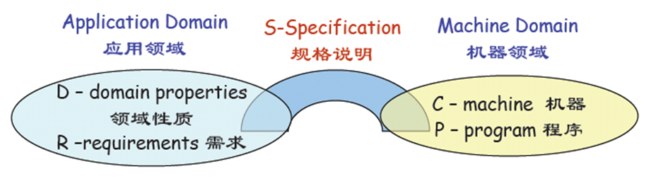

程序或算法可以被形式化地证明是正确的吗，如果可以，应该如何证明？ - Jason Hu的回答 - 知乎
https://www.zhihu.com/question/21578571/answer/700799496

software verification，横跨了数学、理论计算机和软件工程的很大的应用方向。做software verification有整一个谱系的方法。

- 全自动化。

model checking。model checking需要你把specification用temporal logic来表达。典型的temporal logic有CTL, LTL和CTL*。model checking有个好处就是提到的三个temporal logic都有完备的检查算法，因此是全自动的。在状态空间有限的情况下model checking的应用很普遍，比方说电子硬件又或者是分布式协议。

SAT。有完备的NP-complete算法。DPLL算法是历史上的突破点。

SMT和automatic theorem prover。现有成熟的都是基于first order logic，内部用到了SAT。SMT专注于arithematic而automatic theorem prover专注于quantifiers。有名的有MSR的z3[1] 和Vampire[2]。荷兰有个项目在开发基于AI和higher order logic的SMT，非常有前途。[3] 但是注意first order logic是undecidable theory所以这个自动工具的能力有限。要利用这些工具进行定理证明需要你对实现有很深的理解。

- 半自动。

半自动的往往是基于SMT的。比方说Dafny[4]和Ivy[5]。他们本身是编程语言，可以编写specification验证写的程序。Dafny和Ivy都是基于z3的。这个方向在纯软件工程很常见，这些工具往往都是软工的人开发的。

- （基本上）全手动。

这一类型的工具更加偏向于数学性的。常见的有Isabelle[6], HOL[7], Coq[8], Agda[9]和Lean[10]。他们有的是基于formal logic，比方说Isabelle和HOL，有的基于type theory比方说剩下三个。但是本质上他们本身也是编程语言。我对type theory比较了解。在type theory，你可以表达很多的程序，包括很多高阶的程序，你用Dafny是没办法验证的。虽然这些语言都是函数式语言，你也可以用他们来验证其他程序。比方说VST[11]用Coq里的separation logic模型来验证C程序。

基本上，这个方向的工具太多了。一般来讲，自动化越强的可证明的命题就越弱；自动化越弱的需要的专业知识就越多。你对这个方向感兴趣的话可以先从比方说Dafny入手，感受一下。这个方向基本跟CS一样老。

参考
^Z3 https://github.com/Z3Prover/z3
^Vampire https://vprover.github.io/
^Matryoshka http://matryoshka.gforge.inria.fr/
^Dafny https://rise4fun.com/Dafny
^Ivy https://github.com/microsoft/ivy
^Isabelle https://isabelle.in.tum.de/
^HOL https://hol-theorem-prover.org/
^Coq https://coq.inria.fr/
^Agda https://agda.readthedocs.io/en/v2.6.0.1/
^Lean https://leanprover.github.io/about/
^VST https://github.com/PrincetonUniversity/VST

# 1. 形式验证

形式验证包括4 种技术与方法，即演绎推理、抽象解释、模型检测和符号执行。

**演绎推理**的基本思想是，将程序满足其形式规约的证明问题转化为一组数学命题的 证明。这组数学命题被称为证明义务（proofobligation)。若这组证明义务的证明确实能 够蕴含“程序满足其规约”这一命题，那么我们就说该证明系统是正确％ :und) 的。 **Folyd-Hoae逻辑**是一种经典的基于演绎推理的验证系统。抽象解释理论是一种对程序语义进行可靠抽象（或近似）的通用理论[331]。该理论为 程序分析的设计和构建提供了一个通用的框架[332]，并从理论上保证了所构建的程序分析的 终止性和可靠性（即考虑了所有的程序行为）。

**抽象解释**本质上是通过对程序语义进行不同 程度的抽象以在分析精度和计算效率之间取得权衡。这种由（面向某类性质的）语义抽象 及其上的操作所构成的数学结构称为抽象域。到目前，已出现了数十种面向不同性质的抽 象域。其中，代表性的抽象域有区间抽象域、八边形抽象域、多面体抽象域等。

**模型检测**的基本思想是通过遍历系统的状态空间以验证系统模型是否满足给定的关 键性质，并在不满足性质时给出具体反例路径。因此，如何对模型状态空间进行快速遍 历对于模型检测至关重要，而**状态空间爆炸问题**则自然成为模型检测技术面临的主要问 题。与模型检测技术取得成功的硬件领域相对比，软件系统的状态空间复杂性大幅提高。 由于模型检测覆盖范围较广，鉴于篇幅所限，本报告中我们将以软件模型检测为代表， 来对软件模型检测近期技术的进展做一个总结。

**符号执行**[393 396]提供了一种系统性遍历程序路径空间的手段，符号执行中的程序路 径精确刻画了这条路径上的程序信息，可基于路径信息开展多种软件验证确认阶段的活 动，包括自动测试、缺 陷 （包括功能缺陷）查找以及部分程序验证等。理论上，相比于 需要固定程序输人的分析方法，符号执行通过符号分析，能覆盖更多的程序行为。另一 方面，符号执行技术**依赖于SAT/SMT技术**，求解器的能力是决定符号执行效果的关键因 素'同时，符号执行中程序路径空间大小随着程序规模的增大而呈指数级增长，例如， 单就串行程序来讲，一个具有％个条件语句的程序段，就有可能包含2%条路径，这也是 制约符号执行能力的关键因素

《形式化方法的研究进展与趋势》

**分离逻辑**正火2021

# 2. 形式验证

软件形式化方法(Formal Method) https://blog.csdn.net/ggjrtg/article/details/83926848 《软件开发的形式化方法》古天龙

软件形式化方法概述

从广义上讲，形式化方法是借助数学的方法来解决软件工程领域的问题，主要包括建立精确的数学模型以及对模型的分析活动。

狭义的讲，形式化方法是运用形式化语言，进行形式化的规格描述、模型推理和验证的方法。
就形式化建模而言，形式化表示必须包含一组定义其语法语义的形式化规则。这些规则可用于分析给定的表达式是否符合语法规定，或证明该表达式具有某种性质。
    形式化方法的出发点是**数学逻辑方法**，其目的是开发可靠的软件产品。
形式化方法可以分为**形式化描述**和建立在形式化描述基础之上的**形式化开发**。形式化的描述就是用形式化的语言(具有严格的语法语义定义的语言)做描述。形式化的软件开发，就是用形式化的语言来描述软件需求和特征，并且通过推理验证来保证最终的软件产品是否满足这些需求和具备这些特征。这样的验证当然得建立在严格的语法语义的基础之上的。在实际应用中，这是不容易做到的。形式化方法研究的目的就是希望能够提供更好的理论、方法和工具，扩大形式化方法的应用范围和使用价值。

  形式化方法的意义在于它能帮助发现其它方法不容易发现的系统描述的不一致、不明确或不完整，有助于增加软件开发人员对系统的理解，因此形式化方法是提高软件系统，特别是**Safety-Critical系统的安全性与可靠性**的重要手段。最早的形式化方法是逻辑与逻辑推理，它的目标是使**推理机械化**。从广义上讲，这一目标受到许多挫折，比如说逻辑系统的不完备性(incompleteness)、逻辑系统的不可判定性(undecidability)、自动推理的难处理性(intractability)。但是在一些实际应用上，逻辑方法和自动推理还是起着非常大的作用。

形式化方法在软件开发中能够起到的作用是多方面的。

首先是对**软件需求的描述**，软件需求的描述是软件开发的基础。比如说一般非形式化的描述很可能导致描述的不明确和不一致，如果描述的不明确和不一致将导致设计、编程的错误，将来的修改所要付出的代价就非常大了，如果导致的错误没有被发现，则影响程序的可靠和使用。形式化方法则要求描述的明确性，而描述的不一致性也就相对易于发现。

其次是**对软件设计的描述**。软件设计的描述和软件需求的描述一样重要，形式化方法的优点对于软件需求的描述同样适用于软件设计的描述，另外由于有了软件需求的形式化描述，我们可以检验软件的设计是否满足软件的要求。

对于编程来讲，我们可以考虑**自动代码生成**。对于一些简单的系统，**形式化的描述有可能直接转换成可执行程序**，这就简化了软件开发过程，节约了资源和减少了出错的可能性。

另外，形式化方法可以用于程序的**验证**，以保证程序的正确性。

对于测试来讲，形式化方法可用于**测试用例的自动生成**，这可以节约许多时间和在一定程度上保证测试用例的覆盖率。

 形式化方法原则上就是用数学与逻辑的方法描述和验证软件。
 
 从描述上讲，一方面是系统或程序的描述，另一方面是性质的描述。这些可以用一种或多种语言来描述。这些语言包括**命题逻辑，一阶逻辑，高阶逻辑，代数，状态机，并发状态机，自动机，CTL计算树逻辑，LTL线性时序逻辑，CSP进程代数， π-演算calculus， μ-演算calculus，特殊的程序语言Z,B,VDM，以及程序语言的子集等**。
 
 从验证来讲，主要有两类方法，一类是以**逻辑推理**为基础，另一类则以**穷尽搜索**为基础。逻辑推理有 natural deduction, sequent calculus, resolution 以及Hoare-logic 等方法，**穷尽搜索方法统称为模型检测**。这类方法与系统或程序以及系统性质的表示有很大的关系，比如说符号模型检测，其基本原理是用命题逻辑公式表示状态转换关系，用不动点算法计算状态的可达性以及这些状态是否满足某些性质。

形式化方法的应用在**电路设计和协议设计**上都取得了很大的成绩，但是对于软件来讲还有很多没有解决的问题。软件的描述要比电路和协议复杂，一个软件描述所包含的状态空间通常来讲可以是无限的，因此验证的难度很大。逻辑推理的不足之处在于推理的难度，对于稍微复杂的系统，自动化的推理就难以胜任。人为的推理有很大的缺点，除了费时费力外，比如说一个定理推不出来，并不能说明这个定理不成立，很可能是推理方法和策略应用不当。模型检测的好处在于它有全自动化的检测过程，并且如果一个性质不满足，它能给出这个性质不满足的理由，我们即可据此对我们的系统描述进行改进。模型检测的困难首先是它所能检测的是有限状态模型。这样对于一般软件来讲，需要有一个从任意状态到有限状态的建模过程，并且这样的一个模型的状态空间会面临组合爆炸的问题。

 

形式验证一般被称为**形式化验证方法**，是相对于传统的验证（模拟、仿真和测试）而言的。形式化验证方法的主要思路就是使用数学的公式、定理和系统来验证一个系统的正确性等。目前的形式化验证方法可以用于验证硬件系统、软件系统和其他系统，而且形式化验证的技术目前也已经发展到不但可以验证系统的功能正确性（有没有错误），而且可以验证系统的性能指标（功耗、散热、延迟等等）。

形式化验证方法主要可以**分为三种：定理证明、模型检测和等价性验证**。定理证明的基本原理是选定一个数学逻辑体系，并用其中的公式来描述（如软、硬件）系统和系统性质刻画，然后在一定的数学逻辑（如hol逻辑）体系中依据此体系的公理、定理、推导规则和系统描述公式，看看能不能推导出系统的性质刻画公式，如果可以的话验证成功。

模型检测的原理比较简单但是非常实用，它将（如软、硬件）系统建模成有限状态系统（一般成为keripke结构），系统的性质刻画用时序逻辑公式表示（CTL，LTL等），而后在此模型上来验证性质刻画的正确性，模型检测于定理证明相比是有很大优势的，他可以全自动地验证，不需要人工干预，而定理证明则在一些关键推导路径中需要数学家控制。

还有一种是等价性验证，等价性验证其实是一种半形式话的技术，同前两种验证正确性的技术不同，它验证的是设计的一致性，即不同设计阶段的设计是否功能相同，这种技术中一般采用符号的方法和增量的方法，而且由于这种方法和硬件电路紧密结合，所以电路验证的一些传统方法也大量应用于此中方法中来，比如ATPG技术等。如大家使用的Synopsys的Formality本质上就是一个等价性验证器。

形式化验证是非常有用的，只是国内作这一行的人太少。大家可以看看Synopsys和Cadence两家公司，它们都是从形式化验证起家的，然后转到目前流行的将设计和验证统一在一起，即“设计验证”领域。

 软件形式化方法研究内容：
 
 形式化语言（**形式化描述、形式规约**）：怎样描述软件系统及其行为模式；更好地刻画软件系统的性质，比如说，通讯、分布、开放、移动；各种语言的应用、比较，语言与语言之间的转换；开发相应的软件工具。

  形式化验证（**形式验证**）：怎样验证软件系统符合给定的行为模式；更有效地验证软件系统的性质，比如说，自动化、速度快、内存需求少；各种方法的应用、比较；开发相应的软件工具。

 

具体来说，软件形式化方法包括以下几个主要研究方向：

 (1) **基础概念**：复合、抽象、重用模型、数学理论组合、数据结构及算法。需要对如何复合方法、复合规格、复合模型、复合理论、复合证明等进一步的理解；需要开发出将整体特性分解为易于验证的局部特性的有效方法；实际系统在规格和验证之前都要进行某种程度上的抽象，需要研究出评判抽象层次合理与否的方法；重用不仅可以提高开发效率，而且可以提高软件的可靠性，应当研究可重用模型和理论；许多安全关键反应式系统是数字和模拟混合的，需要连续和离散两个范畴内数学基础支撑的混杂系统理论和技术支撑；大规模、复杂软件中搜索空间是巨大的，需要研究出新的数据结构和算法。

 (2) **形式化方法与面向对象方法**的结合：这已经成为软件工程领域的一个研究热点，例如：Statecharts、Petri网、Z语言、VDM等，以及与面向对象方法结合产生的Objectcharts、面向对象Petri网、Object-Z、Z++、VDM++等。这方面的研究体现在两个方面：利用面向对象结构来提高形式符号的表达能力；使用形式化方法来分析面向对象的语义或提高这些标记符号的表达对象概念的能力。形式化方法和其他传统软件开发方法相结合以达到取长补短的目的，也是值得研究的课题。

 (3) **工具开发**：具有良好用户界面、易于学习和操作简单的形式化方法支撑工具，对于形式化方法的推广应用是大有裨益的。追求通用的完善的形式化方法及其支撑工具是不现实的，侧重于如下某一个或几个方面准则的特色方法和工具是未来研究的重点。这些准则包括：一旦开始使用之后尽早得到明显的效益；效益随着开发者的了解深入和熟练而增加；单一规格可以在软件开发生命周期的多个阶段取得效益；能和其他通用编程语言或方法交互使用；工具应当像编译器那样易于使用、输出，也易于阅读；概念和工具应当易于入门和学习掌握；软件特性分析有所侧重；支持渐进软件开发，允许部分规格和验证。此外，特定问题域的形式化方法及其工具研究也是非常重要的。

