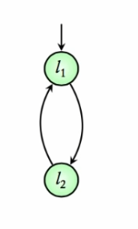
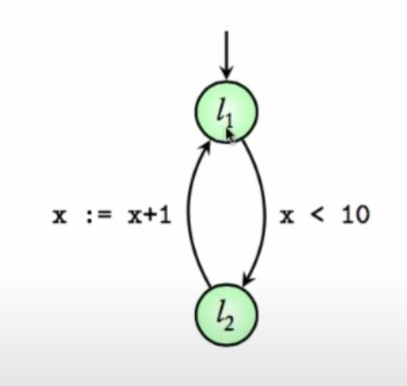
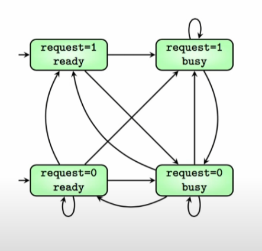

[ModelChecking本地文件](file:///D:/tridu33/postgraduate/ModelChecking)

[TOC]

# 1. 软件工程软件设计之形式化方法


软件工程实践专题研究报告；


形式化语言（形式化描述、形式规约）：怎样描述软件系统及其行为模式；更好地刻画软件系统的性质，比如说，通讯、分布、开放、移动；各种语言的应用、比较，语言与语言之间的转换；开发相应的软件工具。

    形式化验证（形式验证）：怎样验证软件系统符合给定的行为模式；更有效地验证软件系统的性质，比如说，自动化、速度快、内存需求少；各种方法的应用、比较；开发相应的软件工具。
    
    形式化验证方法主要可以分为三种：
    定理证明、
    模型检测
    等价性验证。


具体来说，[软件形式化方法包括以下几个主要研究方向](https://blog.csdn.net/LoveLion/article/details/8635369)：

(1) 基础概念：复合、抽象、重用模型、数学理论组合、数据结构及算法。需要对如何复合方法、复合规格、复合模型、复合理论、复合证明等进一步的理解；需要开发出将整体特性分解为易于验证的局部特性的有效方法；实际系统在规格和验证之前都要进行某种程度上的抽象，需要研究出评判抽象层次合理与否的方法；重用不仅可以提高开发效率，而且可以提高软件的可靠性，应当研究可重用模型和理论；许多安全关键反应式系统是数字和模拟混合的，需要连续和离散两个范畴内数学基础支撑的混杂系统理论和技术支撑；大规模、复杂软件中搜索空间是巨大的，需要研究出新的数据结构和算法。

(2) 形式化方法与面向对象方法的结合：这已经成为软件工程领域的一个研究热点，例如：Statecharts、Petri网、Z语言、VDM等，以及与面向对象方法结合产生的Objectcharts、面向对象Petri网、Object-Z、Z++、VDM++等。这方面的研究体现在两个方面：利用面向对象结构来提高形式符号的表达能力；使用形式化方法来分析面向对象的语义或提高这些标记符号的表达对象概念的能力。形式化方法和其他传统软件开发方法相结合以达到取长补短的目的，也是值得研究的课题。

(3) 工具开发：具有良好用户界面、易于学习和操作简单的形式化方法支撑工具，对于形式化方法的推广应用是大有裨益的。追求通用的完善的形式化方法及其支撑工具是不现实的，侧重于如下某一个或几个方面准则的特色方法和工具是未来研究的重点。这些准则包括：一旦开始使用之后尽早得到明显的效益；效益随着开发者的了解深入和熟练而增加；单一规格可以在软件开发生命周期的多个阶段取得效益；能和其他通用编程语言或方法交互使用；工具应当像编译器那样易于使用、输出，也易于阅读；概念和工具应当易于入门和学习掌握；软件特性分析有所侧重；支持渐进软件开发，允许部分规格和验证。此外，特定问题域的形式化方法及其工具研究也是非常重要的。


-------------------------------------------------------------------------------------------------------------------

根据软工方法论教学主页常见软件工程方法有：

- 朴素的方法
- 特定领域方法
- **形式化方法**
- 半形式化的方法
  - 结构化方法
  - 面向对象方法
  - 面向服务方法

其中各种方法都已经做过报告和相关学习讨论，因为“形式化方法”课程还没有详细涉及，所以计划籍此机会学习并实践**形式化方法**进行软件工程设计。

## 1.1. 理论
下面理论部分参考文献[<sup>1</sup>](#refer-anchor-1)，一般地，形式系统（框架）使得表示一个规范与其相应程序之间的映射成为可能。精确是形式化方法或形式符号系统的一个特征，是产生无二义性规范的主要依据。一个交流媒体应该是**清晰的**，并且是**无二义性**的。规范的清晰和无二义性并不等于说它是**精确**、抽象或**简明**的，但规范的这五个性质是相互关联的。另外，形式规范主要的语用益处在于：可以对形式规范进行较详细的构造性检查，因为对此规范中的具体内容的含义不会有争议，有争议的只是内容的完备性。总体上，形式化方法大致可分为五类[^Boiten*1992].

基于模型的方法—给出系统（程序）状态和状态变换操作的显式但亦是抽象的定义，但对于并发没有显式的表示，如：`Z`和`VDM`[^Jones 1990]。

2. 代数方法—通过联系不同操作间的行为关系而给出操作的隐式定义，而不定义状态，同样，它亦未给出并发的显式表示，如：`OBJ、CLEAR`。
2. 过程代数方法—给出并发过程的一个显式模型，并通过过程间允许的可观察的通讯上的限制（约束）来表示行为，如：`CSP、CCS`(并发)。
3. 基于逻辑的方法—有很多方法采用逻辑来描述系统的特性，包括程序行为的低级规范和系统时间行为的规范，如：时态逻辑[^Galton 1992]。

各种形式符号系统对于精确、抽象地表达概念具有各自不同的能力，但它们均可用于严密地描述概念，更重要的是，它们比自然语言的描述更严密、更精确、更抽象。规范的抽象、精确及简明性都有助于使规范更清晰，当然，良好的结构也有助于清晰性。

更详尽的形式化理论需要查看相关教材[^LOGIC]和文献典籍[^POMC]。

## 1.2. 实践/结果

在此阶段，已有大量的关于形式处理的工作[^Boiten*1992][^Dromey 1989]，即：将一程序与其的规范形式地对应起来。这一技术即是所谓的构造方法，构造方法基于*从低级规范推导出程序*这一想法，将程序构造与验证统一起来.

验证环境是基于与构造技术类似的数学基础，但它主要关心程序和规范之间的自动/辅助正确性证明[^Muk 1995]。提个相对比较火的应用：ATEC主要是做`Verilog`代码和C代码的等价性验证，应用最成功的是`FPU`的验证，可以几秒到几分钟之内快速发现`bug`。华为、联发科 `Mediatek`, `Vivante`  和 `Power CORE`都有使用过`ATEC`抓到`FPU/GUP`的`bug`。

verification的流程可以这么总结：
1 对于你要verify的系统进行formalization，建立formal model；
2 提出需要验证的properties，或specifications（恩以下简称spec），就是你想要系统满足哪些条件；
3 证明或checking是否你的formal model满足这些properties。

形式实现技术在顺序程序上应用较广，目前也有对并发程序方面的研究。这一技术的使用代价很高，所以主要用于高精确系统的开发，因为高精确系统中的一个很小的错误可能会引起极大的灾难。若要使形式实现技术能广泛地应用，还须对其做较大的改进，以提高其效率，降低其使用代价。 

[形式化相关应用看这里](https://www.zhihu.com/question/37328298/answer/125956076) 。以下实验使用NuSMV https://nusmv.fbk.eu/，`NuSMV`实操编程实践。


## 1.3. demo



```nusmv
MODULE main
VAR
	location: {l1,l2};
ASSIGN
	init(location) := l1;
	next(location) := case
				(location = l1):l2;
				(location = l2):l1;
					esac;
```

保存为```intro.smv``` 交互式运行：

```
./>nusmv -int 

NuSMV > read_model -i intro.smv
NuSMV > flatten_hierarchy
NuSMV > encode_variables
NuSMV > build_model
NuSMV > pick_state -i
```

输出初始状态：

```

***************  AVAILABLE STATES  *************

  ================= State =================
  0) -------------------------
  location = l1
  
There's only one available state. Press Return to Proceed.

Chosen state is: 0
```

输入：

```
NuSMV > print_reachable_states -v
```

打印状态转移图，对应的状态及其下一个状态，输出：

```
######################################################################
system diameter: 2
reachable states: 2 (2^1) out of 2 (2^1)
  ------- State    1 ------
  location = l2
  ------- State    2 ------
  location = l1
  -------------------------
######################################################################
```

输入：

```
NuSMV > simulate -i -k 3
```

动态“迁移系统仿真3步，输出仿真结果：

```
********  Simulation Starting From State 1.11   ********

***************  AVAILABLE STATES  *************

  ================= State =================
  0) -------------------------
  location = l2


There's only one available state. Press Return to Proceed.

Chosen state is: 0

***************  AVAILABLE STATES  *************

  ================= State =================
  0) -------------------------
  location = l1


There's only one available state. Press Return to Proceed.

Chosen state is: 0

***************  AVAILABLE STATES  *************

  ================= State =================
  0) -------------------------
  location = l2


There's only one available state. Press Return to Proceed.

Chosen state is: 0
NuSMV >quit
```




```
MODULE main
VAR
	location: {l1,l2};
	x: 0 .. 100;
ASSIGN
	init(location) := l1;
	init(x) := 0;
	next(location) := case
				(location = l1) & (x<10):l2;
				(location = l2):l1;
				TRUE:location;
					esac;
	next(x) := case
				(location = l2) & (x<100):x+1
				TRUE:x;
					esac;
```

保存为```intro2.smv``` 交互式运行：

```
./>nusmv -int 

NuSMV > read_model -i intro2.smv
NuSMV > flatten_hierarchy
NuSMV > encode_variables
NuSMV > build_model
NuSMV > pick_state -i
```

输出初始状态：

```
***************  AVAILABLE STATES  *************

  ================= State =================
  0) -------------------------
  location = l1
  x = 0


There's only one available state. Press Return to Proceed.

Chosen state is: 0
```

输入：

```
NuSMV > print_reachable_states -v
```

打印状态转移图，对应的状态及其下一个状态，输出：

```
######################################################################
system diameter: 2
reachable states: 2 (2^1) out of 2 (2^1)
  ------- State    1 ------
  location = l2
  ------- State    2 ------
  location = l1
  -------------------------
######################################################################
```

输入：

```
NuSMV > simulate -i -k 15
```

动态“迁移系统仿真15步，输出仿真结果：

```
********  Simulation Starting From State 1.1   ********

***************  AVAILABLE STATES  *************

  ================= State =================
  0) -------------------------
  location = l2
  x = 0


There's only one available state. Press Return to Proceed.

Chosen state is: 0

省略后续显然的那些步骤，可以预料事实上也是运行20次后稳定在l1停机状态。
```

那有没有直接看出来系统停机前一共有多少步骤的方法呢？

答案就是输入：

```
NuSMV > print_reachable_states -v
```

输出：

```
######################################################################
system diameter: 21
reachable states: 21 (2^4.39232) out of 202 (2^7.65821)
  ------- State    1 ------
  location = l1
  x = 10
  ------- State    2 ------
  location = l1
  x = 8
  ------- State    3 ------
  location = l1
  x = 2
  ------- State    4 ------
  location = l1
  x = 0
  ------- State    5 ------
  location = l1
  x = 6
  ------- State    6 ------
  location = l1
  x = 4
  ------- State    7 ------
  location = l1
  x = 9
  ------- State    8 ------
  location = l1
  x = 1
  ------- State    9 ------
  location = l1
  x = 5
  ------- State   10 ------
  location = l1
  x = 7
  ------- State   11 ------
  location = l1
  x = 3
  ------- State   12 ------
  location = l2
  x = 9
  ------- State   13 ------
  location = l2
  x = 8
  ------- State   14 ------
  location = l2
  x = 1
  ------- State   15 ------
  location = l2
  x = 0
  ------- State   16 ------
  location = l2
  x = 5
  ------- State   17 ------
  location = l2
  x = 4
  ------- State   18 ------
  location = l2
  x = 7
  ------- State   19 ------
  location = l2
  x = 6
  ------- State   20 ------
  location = l2
  x = 3
  ------- State   21 ------
  location = l2
  x = 2
  -------------------------
######################################################################
NuSMV > quit
```

显然可以从这个结果中得出最多走21步后停机,参考[Simple models in NuSMV](https://www.youtube.com/watch?v=GIrOek9sGyQ&pbjreload=101)

### 1.3.1. 进程request响应

```
MODULE main
VAR
	request : boolean;
	status : {ready,busy};
ASSIGN
	init(status) := ready;
	next(status) := case
						request : busy;
						TRUE:{ready,busy};
					esac;
LTLSPEC
	G(request -> F status=busy)
```

注意，LTLSPEC是LTL线性时态逻辑公式断言，这句话的含义是这个迁移系统满足活性：

> 对于任何状态，如果对某些资源进行请求request,那么它最终被确定载入系统进入busy状态。

对应逻辑公式符号的写法如下：

| &        | \|     | -> | !      |
| -------- | ------ | ----------------- | ------ |
| $\wedge$ | $\vee$ | $\rightarrow$     | $\neg$ |

同理，读取`smv`文件，分层展开，变量生成，编译模型，



输出：

```
NuSMV > print_reachable_states -v
######################################################################
system diameter: 2
reachable states: 4 (2^2) out of 4 (2^2)
  ------- State    1 ------
  request = TRUE
  status = busy
  ------- State    2 ------
  request = TRUE
  status = ready
  ------- State    3 ------
  request = FALSE
  status = busy
  ------- State    4 ------
  request = FALSE
  status = ready
  -------------------------
######################################################################
```

正如我们画出来的状态转移图，一共4个状态。

```
NuSMV > pick_state -i
```

会让我们选择0/1两个入口初始状态：

```

***************  AVAILABLE STATES  *************

  ================= State =================
  0) -------------------------
  request = TRUE
  status = ready


  ================= State =================
  1) -------------------------
  request = FALSE


Choose a state from the above (0-1):
```

同样可以仿真运行3步：

```
simulate -i -k 3
```

交互运行。

### 1.3.2. model-checking检查性质

> Transition system satisfies a requirements means
>
> all its executions satisfy the requirement.


比如这个图中我们可以检测迁移系统(程序/算法/自动机/状态迁移图)中，是否globally（G）满足(x>0):

```
NuSMV > read_model -i intro2.smv
NuSMV > flatten_hierarchy
NuSMV > encode_variables
NuSMV > build_model
NuSMV > check_ltlspec -p "G(x>=0)"
-- specification  G x >= 0  is true
NuSMV > check_ltlspec -p "F(x = 5)"
-- specification  F x = 5  is true
```
这就是说我们证明了：

> Transition System of above ProGram with initial value x = 0 **satisfies** G(x>=0)
>
> ...等等LTL逻辑公式描述的系统性质

观察这个程序不难发现，实际上x到10就停机在l1状态了，所以(x = 11)必定不可能达到：

```
NuSMV > check_ltlspec -p "F(x >= 11)"
-- specification  F x >= 11  is false
-- as demonstrated by the following execution sequence
Trace Description: LTL Counterexample
Trace Type: Counterexample
  -> State: 4.1 <-
    location = l1
    x = 0
  -> State: 4.2 <-
    location = l2
  -> State: 4.3 <-
    location = l1
    x = 1
  -> State: 4.4 <-
    location = l2
  -> State: 4.5 <-
    location = l1
    x = 2
  -> State: 4.6 <-
    location = l2
  -> State: 4.7 <-
    location = l1
    x = 3
  -> State: 4.8 <-
    location = l2
  -> State: 4.9 <-
    location = l1
    x = 4
  -> State: 4.10 <-
    location = l2
  -> State: 4.11 <-
    location = l1
    x = 5
  -> State: 4.12 <-
    location = l2
  -> State: 4.13 <-
    location = l1
    x = 6
  -> State: 4.14 <-
    location = l2
  -> State: 4.15 <-
    location = l1
    x = 7
  -> State: 4.16 <-
    location = l2
  -> State: 4.17 <-
    location = l1
    x = 8
  -> State: 4.18 <-
    location = l2
  -> State: 4.19 <-
    location = l1
    x = 9
  -> State: 4.20 <-
    location = l2
  -- Loop starts here
  -> State: 4.21 <-
    location = l1
    x = 10
  -> State: 4.22 <-
```

果不其然，通过符号逻辑演算的结果，我们证明了最后不可能达到(x>=11)的迁移系统状态。同时我们知道最终一定(x = 10):

```
NuSMV > check_ltlspec -p "G F((x = 10) & (location = l1))"
-- specification  G ( F (x = 10 & location = l1))  is true
```

同样可证明满足这个性质。


同理，读取`smv`文件，分层展开，变量生成，编译模型，

```
NuSMV > read_model -i counter.smv
NuSMV > flatten_hierarchy
NuSMV > encode_variables
NuSMV > build_model
NuSMV > check_ltlspec -p "G (request = FALSE)"
-- specification  G request = FALSE  is false
-- as demonstrated by the following execution sequence
Trace Description: LTL Counterexample
Trace Type: Counterexample
  -> State: 2.1 <-
    request = TRUE
    status = ready
  -- Loop starts here
  -> State: 2.2 <-
    request = FALSE
    status = busy
  -> State: 2.3 <-
```

这张图不满足```G(request = 0)```,只要返回一个执行反例即可证明不满足。随便找到一个执行序列，左上角的状态-->右下角状态，有request = 0证明这个性质不是全局性满足。

只要是LTL公式，就能写出来并且验证是否真实，这样就能对迁移系统(程序/算法/自动机/状态迁移图...)进行性质判断处理。

```
NuSMV > check_ltlspec -p "G(request -> F status=busy)“
```

注意，LTLSPEC是LTL线性时态逻辑公式断言。这句话的含义是这个迁移系统满足活性：

> 对于任何状态，如果对某些资源进行请求request,那么它最终被确定载入系统进入busy状态。

对应逻辑公式符号的写法如下：

| &        | \|     | -> | !      |
| -------- | ------ | ----------------- | ------ |
| $\wedge$ | $\vee$ | $\rightarrow$     | $\neg$ |


```
NuSMV > check_ltlspec -p "G(request -> F status=busy)"
-- specification  G (request ->  F status = busy)  is true
```

这就证明了，这样写的迁移系统是有”活性“，是一个好的程序。能满足有求必应的用户需求，不会导致程序死锁。

### 1.3.3. 求解摆渡人趣题

摆渡者难题
问题描述：
     一个船夫、山羊、卷心菜和狼都在河的一边。船夫至多可搭载一位乘客过河。如果船夫离开，山羊会吃掉卷心菜，狼也会吃掉山羊。船夫能否将它们（包括狼、山羊、卷心菜）安全送到河对岸？
建模：
    船夫（ferryman）、山羊（goat）、卷心菜（cabbage）和狼（wolf）都有两个状态，一个在河此岸、一个在河彼岸，用布尔变量表示；
    船夫可以携带山羊、卷心菜、狼或者什么都不带，用一个枚举类型的变量表示carry：{goat，cabbage，wolf，0}；


```
MODULE main

VAR 
	ferryman : boolean ; goat : boolean ;
	cabbage  : boolean ; wolf : boolean ;
	carry : { g , c , w , none };

ASSIGN
	init ( ferryman ) := FALSE ; init ( goat ) := FALSE ;
	init ( cabbage )  := FALSE ; init ( wolf ) := FALSE ;
	init ( carry ) := none;

	next ( ferryman ) := !ferryman;


	next ( goat ) := case
		ferryman = goat & next ( carry ) = g : next ( ferryman );
		TRUE 	: goat ; 
	esac ;

	next ( cabbage ) := case
		ferryman = cabbage & next ( carry ) = c : next ( ferryman );
		TRUE 	: cabbage ; 
	esac ;

	next ( wolf ) := case
		ferryman = wolf & next ( carry ) = w : next ( ferryman );
		TRUE : wolf ; 
	esac ;

LTLSPEC !(( ( goat = cabbage | goat = wolf ) -> goat = ferryman )
U ( cabbage & goat & wolf & ferryman ))
```
要验证的PPTL性质：
>LTLSPEC !(( ( goat = cabbage | goat = wolf ) -> goat = ferryman )
U ( cabbage & goat & wolf & ferryman ))

含义：不存在某个状态，卷心菜、羊、狼和船夫都到了河的对岸 的情况。
模型不满足该性质，说明问题存在解，反例路径即为该解。

`NuSMV`实践:

```NuSMV
..\>nusmv ferryman2.smv
*** This is NuSMV 2.6.0 (compiled on Wed Oct 14 15:37:51 2015)
*** Enabled addons are: compass
*** For more information on NuSMV see <http://nusmv.fbk.eu>
*** or email to <nusmv-users@list.fbk.eu>.
*** Please report bugs to <Please report bugs to <nusmv-users@fbk.eu>>

*** Copyright (c) 2010-2014, Fondazione Bruno Kessler

*** This version of NuSMV is linked to the CUDD library version 2.4.1
*** Copyright (c) 1995-2004, Regents of the University of Colorado

*** This version of NuSMV is linked to the MiniSat SAT solver.
*** See http://minisat.se/MiniSat.html
*** Copyright (c) 2003-2006, Niklas Een, Niklas Sorensson
*** Copyright (c) 2007-2010, Niklas Sorensson

-- specification !(((goat = cabbage | goat = wolf) -> goat = ferryman) U (((cabbage & goat) & wolf) & ferryman))  is false
-- as demonstrated by the following execution sequence
Trace Description: LTL Counterexample
Trace Type: Counterexample
  -- Loop starts here
  -> State: 1.1 <-
    ferryman = FALSE
    goat = FALSE
    cabbage = FALSE
    wolf = FALSE
    carry = none
  -> State: 1.2 <-
    ferryman = TRUE
    goat = TRUE
    carry = g
  -> State: 1.3 <-
    ferryman = FALSE
    carry = c
  -> State: 1.4 <-
    ferryman = TRUE
    wolf = TRUE
    carry = w
  -> State: 1.5 <-
    ferryman = FALSE
    goat = FALSE
    carry = g
  -> State: 1.6 <-
    ferryman = TRUE
    cabbage = TRUE
    carry = c
  -> State: 1.7 <-
    ferryman = FALSE
    carry = none
  -> State: 1.8 <-
    ferryman = TRUE
    goat = TRUE
    carry = g
  -> State: 1.9 <-
    ferryman = FALSE
    wolf = FALSE
    carry = w
  -> State: 1.10 <-
    ferryman = TRUE
    carry = c
  -> State: 1.11 <-
    ferryman = FALSE
    cabbage = FALSE
  -> State: 1.12 <-
    ferryman = TRUE
    carry = none
  -> State: 1.13 <-
    ferryman = FALSE
    goat = FALSE
    carry = g
  -> State: 1.14 <-
    ferryman = TRUE
    carry = none
  -> State: 1.15 <-
    ferryman = FALSE
```

执行结果。

## 1.4. 分析

结合model Checking分析形式化在软件工程方法论中的作用。


- 程序设计中，假设今天要实现的功能逻辑更加复杂，比我写的例子复杂很多，但是同理的，我们可以把**用户需求/产品特性**都写成LTL性质句子，进行**模型检测Model Checking**，只要结果是True的，就能用。

- 晶元流片代价昂贵，所以布尔电路功能实现的设计师们在投产之前，也会对产品进行类似的检测。只有满足需求功能，不会导致bug(芯片召回会导致公司巨额损失)。

- 在银行铁路航空航天等安全性能需要很好保障的情况下，就更加需要Model checking保证设计出来的”**迁移系统**(程序/算法/[逻辑功能电路验证](https://www.youtube.com/watch?v=FGy7M6beo3E)/设计运行系统(电梯系统PLC画图程序之类的)/设计的协议是否能满足LTL目标使用需求/自动机/确定性策略的Markov Network/状态迁移图...)“是合理合法没有bug的，确保不会捅出的篓子。

- 又或者今天你提出了一个新的算法，你不知道正确性有没有保证，你可以通过构建你的算法自动机对应的迁移系统（状态转移图），检测LTL公式是否"G F (是否永远能到达目标状态)"。如果True，说明你的算法写对了，如果不能，它会返回反例帮助里思考自己没考虑到的情况有哪儿，从而改进你自己的算法，保证其合理性/完备性。如果问题本来就不可解，你也可以通过修改问题适用范围，比如增加约束，解决一个更容易的问题，类比SAT可满足性问题线性时间算法不可解，你可以解决horn子句的SAT问题，把对应的线性求解算法实现为NuSMV 迁移系统(对应那张图),这样你就可以验证horn程序是被可以实现的。


最后补充一些形式化方法局限性

- 形式化方法之最基本的弱点或局限性与规范确认问题有关。

  我们可根据“数学的必然性”由规范开始开发软件，但将总是怀疑初始规范的真实性（精确性）。显然，如果能够消除这种疑虑是极其有价值的，但证据表明，软件错误的主要来源正是规范。这就意味着，规范所使用的数学工具并不能足以保证规范的“安全”性。更宏观地讲，我们面临着一个权衡问题，就是要在投入形式开发的力量与投入研究验证高阶规范[Jing  1995]方法中的力量之间权衡。需要注意的是，可以使用证明技术来辅助确认过程，如：通过由一个规范推导出其安全特性，但这只能简单地缩短形式化与现实世界之间的距离，而并不能消除它。所以，我们不能简单地依赖于形式化机制以取得证明规范的安全性。

- 第二个主要的局限性与规范的解释有关。

  对于形式规范，在其数学基础意义下，并不是只有一种解释。软件工程师可以根据计算模型解释；系统用户可以根据系统操作环境中的系统使用模型来解释。这样，二义性问题已不是形式规范在其内部逻辑中存在唯一模型的问题，而是不同领域、不同背景和知识下的各种解释的相容性问题。形式规范的确是比其他相对松散的规范二义性问题要少，但这并不能说明在其多种解释下不可能存在二义性问题，这就削弱了形式化方法的能力，但我们并不能因此而否定它。

## 1.5. 参考文献
<div id="refer-anchor-1"></div>

- [1] [软件开发中的形式化方法](https://www.math.pku.edu.cn/teachers/zhangnx/articals/fm.html)，[郑红军](http://www.cis.ksu.edu/~zheng/)、张乃孝，计算机科学，Vol.24 No.6 p90-96，1997 Formal Methods in Software Development, [Zheng Hongjun](http://www.cis.ksu.edu/~zheng/), Zhang Naixiao,Computer Science, Vol.24 No.6 p90-96, 1997


[^Boiten*1992]: H. Ehrig, B. Mahr, I. Classen, F. Orejas, Introduction to Algebraic Specification. Part 1: Formal Methods for Software Development, *The Computer Journal*, Volume 35, Issue 5, October 1992, Pages 460–467, https://doi.org/10.1093/comjnl/35.5.460

[^Jones 1990]: C.B.Jones, Systematic Software Development Using VDM


[^Galton 1992]: A.Galton,  Logic  as  a  Formal  Method.  The  Computer  Journal,  Vol.  35, No. 5


[^Dromey 1989]: G.Dromey, Program Derivation


[^Muk 1995]: P.Mukherjee,  Computer-aided  Validation  of  Formal  Specifications.  Soft. Engi. Journal, July


[^LOGIC]: GIC IN COMPUTER SCIENCE Modelling and Reasoning about Systems


[^POMC]: 《Principles of Model Checking》
