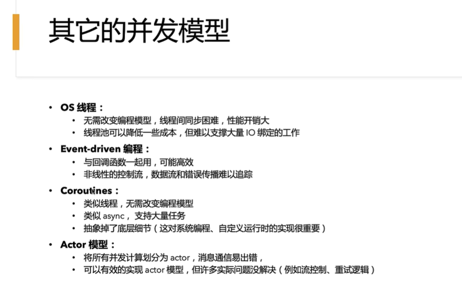

Rust 异步编程 

# RustAsync

Rust Async 异步编程，配套教材为官方教程：https://rust-lang.github.io/async-book/
https://learnku.com/docs/async-book/2018 翻译 https://github.com/rustlang-cn/async-book/blob/master/async/getting-started.md 另一个翻译

【Rust Async 异步编程（完结）】 https://www.bilibili.com/video/BV1Ki4y1C7gj/?share_source=copy_web&vd_source=874ce02cf2b466e2f5648504c81f83c9

