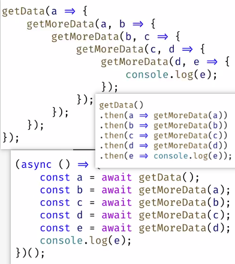

# 1. js协程语义

yield

promise --> async await

协程，promise 之间有点关系，promise 比协程好实现，通常不需要改 编译器和运行时

协程语法分为 async, await 流派和 yield流派

协程实现，分为转化状态机，捕获变量流派和完整堆栈复制流派

协程又可以根据支不支持递归，分类

普通语言，一般只实现协程，没有支持多线程task调度，这个task调度其实是另外一个问题

按照csharp的发展路线，其实先做task 调度系统，task 用future的方式，来做顺序控制

-------------------------

async/await异步模型是否优于stackful coroutine模型？ - 圆珠笔的回答 - 知乎
https://www.zhihu.com/question/65647171/answer/233495694

跳转离开，在任何语言里都有2种最基本的方法：1）从当前函数返回； 2）调用一个新的函数。 前者会把上下文中的局部变量和函数参数全部摧毁，除非他返回前把这些变量找个别的地方保存起来；后者则能保护住整个上下文的内存（除了函数返回之后会摧毁一些我们高级语言所看不见的寄存器），而且跳转回来也是常规方法：函数返回。

async/await和有栈协程的区别就在于，在这里分别选用了这2种方法：

前者（async/await）在函数返回前把那些变量临时保存在堆的某个地方，然后把存放地址传回去，当你想返回现场的时候，把这些变量恢复，并跳转回离开时候那个语句；持有指针语义的c/c++语言则略麻烦：因为可能这些局部变量中有谁持有另一个局部变量的地址，这样“值语义”的恢复就会把他们变成野指针，所以需要在进入函数时所有的局部变量和函数参数都在堆上分配，这样就不会有谁持有离开时栈上下文的指针了，换句话说，对c/c++来说，这是一种无栈协程(有些自己写的无栈协程库提供你在堆上面分配局部变量的接口，或者强迫你在进入这个函数前把要用到的所有局部变量在堆上面分配好内存)，其它语言只要没有值语义或变量天生不放栈上就没这个概念。如果使用闭包语法返回现场，可以只需要恢复闭包中捕获的变量；对于c++，在离开现场时不能提前析构掉那些没有被捕获的变量（否则析构顺序未必是构造顺序的反序，其实这个c++规则真是没必要）。所以从C++的观点来说，这是一种彻头彻尾的“假”函数返回(有垃圾回收器的语言倒是有可能走到async之后的语句后，回收前面已经不用的临时变量)。

后者（有栈协程）在离开前只需要把函数调用中可能被破坏的callee-saved 寄存器给保存在当前栈就完事了（别的协程和当前协程栈是完全隔离的，不会破坏自己堆栈），跳转回来的时候把在栈中保存的寄存器都恢复了并跳转回离开时候那个语句就行了。

综上：前者（尤其是c、c++）需要编译器的特殊支持，对使用了async/await语义的函数中的局部变量的分配，恢复进行些特殊的处理；后者则只需要写写汇编就搞定了（一般需要给 进入协程入口函数，协程间切换，协程函数入口函数返回后回收协程资源并切换去另一个协程 这3个地方写点汇编，也有的协程库把这3种情况都统一起来处理）。

谁优谁劣呢？

语法友好度：衡量这个玩意儿的标准，莫过于“逻辑聚合性”：逻辑相关的代码能否写在相近的代码处。例如 redis/nginx中处处可见这种上下文被分割的代码，因为任何一个“暂时不能完成“的场景都会把场景前后代码逻辑写在完全不同的两个函数里。。对于async/await 或无栈协程语义，c/c++在没有闭包之前的，还需要达夫设备跳转回离开现场的那行代码，有了闭包之后，上下文之间就只被return ( [xxx](){ 分开了，代码可以认为基本没有被分割( C# 新版js, VC和clang实验性的resumable function连这点分开都没有了)；不过依然远远比不上有栈协程，因为他语法完全是常规的函数调用/函数返回，使用hook之类的手法甚至可以把已有的阻塞代码自动yield加无阻塞化（参见libco, libgo）。可以认为在这一项：前者在得到现代化编译器辅助后，和后者相近但依然有差距且容易对一些常识产生挑战；后者语法非常适合传统编程逻辑。

时间/空间效率：async/await 语义执行的是传统的函数调用函数返回流程，没有对栈指针进行手工修改操作，cpu对return stack buffer的跳转预测优化继续有效；有栈协程需要在创建时根据协程代码执行的最坏情况提前分配好协程函数的栈，这往往都分配的过大而缺乏空间效率，而且在协程间切换的时候手工切换栈，从而破坏了return stack buffer跳转预测，协程切换后函数的每一次返回都意味着一次跳转预测失效，所以流程越复杂有栈协程的切换开销越大（非对称调度的有栈协程会降低一些这方面的开销，boost新版有栈协程彻底抛弃了对称协程）。对于async/await 语义实践的无栈协程，如果允许提前析构不被捕获的C++变量，或者你返回前手工销毁或者你用的是带垃圾回收器的语言，空间效率会更佳。 可以认为在这一项：前者远胜后者，而且后者会随着你业务复杂度加深以及cpu流水线的变长（还好奔4过后的架构不怎么涨了）而不断变差。笔者写的yuanzhubi/call_in_stack yuanzhubi/local_hook， 以及一个没有开源的jump assembler（把有栈协程切换后的代码输出的汇编语句中的ret指令全部换成pop+jmp指令再编译，避开return stack buffer 预测失败）都是来优化有栈协程在时间/空间的表现的 。

调度：其实2者都是允许用户自己去管理调度事宜的，不过前者必须返回由调度函数选择下一个无栈协程的切入，后者允许”深度优先调度“：即当某个协程发现有“暂时不能完成“的场景时自己可以根据当前场景选择一个逻辑相关的协程进行切入，提升内存访问局部性，不过这对使用者的要求和业务侵入度非常高。。整体而言的话，可以认为在这一项：前者和后者大致持平，前者是集中式管理而后者是分布式管理，后者可以挖掘的潜力更高但对使用者要求很高且未必能适应业务的变更。

结论：性能上，前者有一定时间优势但不是精雕细琢的多用途公共开源组件完全可以忽略，而空间上前者超越后者很多；易用度上，前者正在快速演进 慢慢的追上后者（c#这样的async/await鼻祖已经完全不存在这个问题）；和已有组件的可结合度上，后者始终保持优势（不管已有组件是源码还是二进制）。孰优孰劣，如何侧重，如何选择（如果你们有选择的机会的话），，也许 纯属你头儿的口味问题吧 哈哈哈。

看到很多同学提状态机，，其实这种理解没有什么问题，而是人和编译器的观点有所不同：人会抽象出很多状态，在痛苦这些状态如何在各种上下文跳转中传递和保存（状态机）; 编译器则在痛苦怪异的上下文跳转中，局部变量的保存和恢复(无栈协程)。 前者会自行决定某些局部变量是“真的局部”变量，后续无需恢复了；后者会把他们全盘考虑下来，把所有的量都要在各个状态间传递和保存（当然有的语言可以智能些，按需传递）。从本质来说，如果是由编译器来玩状态机实现的async/await和无栈协程的，概念上没有什么区别。 人才说状态，机器只说变量，内存这些。

---------------------------------------------

Kotlin 通过 Coroutine 达到深度递归不爆栈，别的语言能有类似的写法吗？ - Martin Chloride的回答 - 知乎
https://www.zhihu.com/question/390889830/answer/1183963131

Stackless coroutine 本质上是相同的，只不过 Kotlin 使用了比较传统的 coroutine 原语（suspend/resume），和 async/await 是等价的。（如果 C# 要实现传统 coroutine 的 suspend/resume 等价操作的话需要结合 async enumerable 使用）

至于为什么不爆栈，因为 stackless coroutine 本来就没有栈，原本栈的功能是存放在堆上的（注意原文的 val stack = ArrayList<Frame>()）。这也是 stackless coroutine 最大的性能瓶颈所在，相当于每一次开新的 coroutine（await）都会有一次堆分配并给 GC 造成压力。

Stackless coroutine 并不是为了避免栈溢出而出现的。如果单单是为了避免栈溢出而这样写递归会造成极大的性能浪费。所有递归都有等价的非递归写法，将递归函数翻译成非递归形式才是正确的解决栈溢出的手段。

-------------------------------

C#的async和await底层是怎么做到的? - lhelpme的回答 - 知乎
https://www.zhihu.com/question/395806055/answer/1237197661

深入理解协程（三）：async/await实现异步协程 - 「已注销」的文章 - 知乎
https://zhuanlan.zhihu.com/p/103315778

协程语法

async/await不是协程，这是FP的懒求值，意思是变量在需要时再求值，在FP语言中被称作lazy（被C#窃取到OO世界的，async关键字的唯一用途是提醒编译器函数体内有await）真正的狭义协程是yield，意思是把执行权教给另一个函数goroutine等绿色线程也属于广义协程

作者：印本源
链接：https://www.zhihu.com/question/50185085/answer/1814903832

