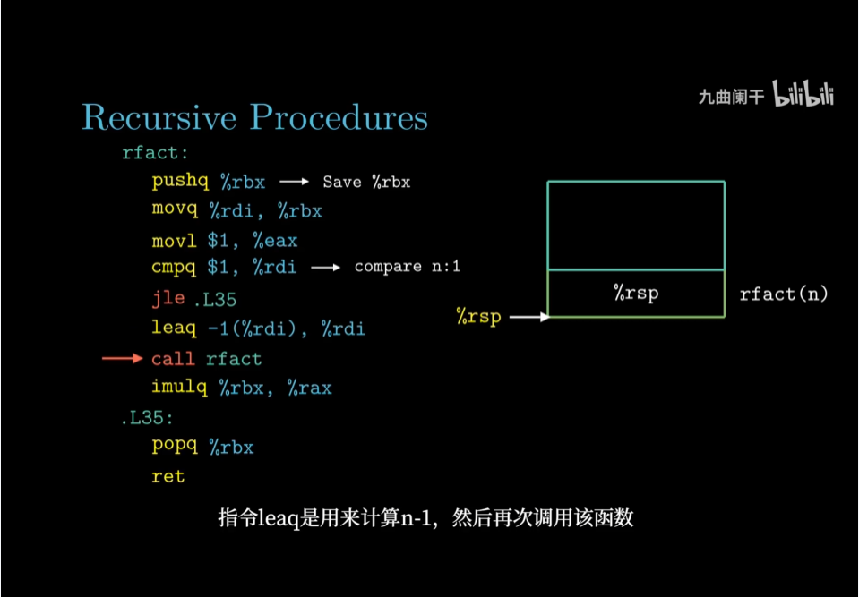
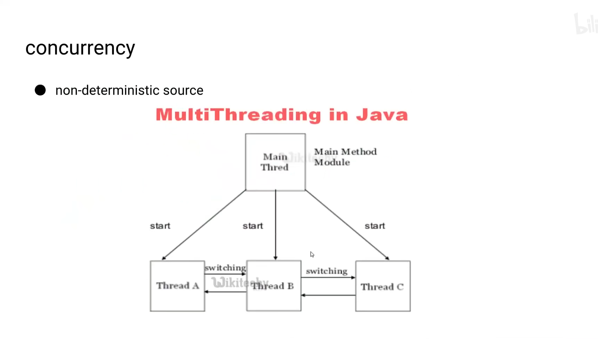
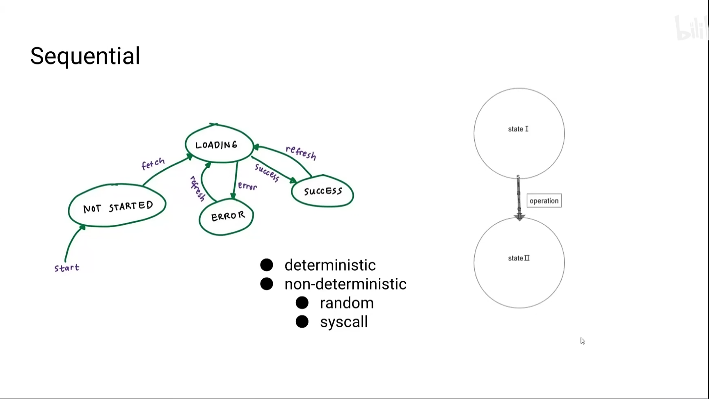

[TOC]

谈递归（一）：递归的五种定式 - 罗宸的文章 - 知乎
https://zhuanlan.zhihu.com/p/84452538


通用的递归转循环方法 - brambles的文章 - 知乎
https://zhuanlan.zhihu.com/p/136511316


https://www.zhihu.com/answer/1762111484
for(int i)汇编转换为栈机本身的执行过程

有哪些循环方法是只能用goto完成，不能用for循环完成的？ - Tridu的回答 - 知乎
https://www.zhihu.com/question/38149457/answer/1741755530


**递归的实现就是：每一次递归调用都会把函数的局部变量、参数值和返回地址等压入调用栈中**，然后递归返回的时候，从栈顶弹出上一次递归的各项参数，所以这就是递归为什么可以返回上一层位置的原因。

相信大家应该遇到过一种错误就是栈溢出，系统输出的异常是`Segmentation fault`（当然不是所有的`Segmentation fault` 都是栈溢出导致的） ，如果你使用了递归，就要想一想是不是无限递归了，那么系统调用栈就会溢出。

而且**在企业项目开发中，尽量不要使用递归**！在项目比较大的时候，由于参数多，全局变量等等，使用递归很容易判断不充分return的条件，非常容易无限递归（或者递归层级过深），**造成栈溢出错误（这种问题还不好排查！）**

链接：https://leetcode-cn.com/problems/remove-all-adjacent-duplicates-in-string/solution/1047-shan-chu-zi-fu-chuan-zhong-de-suo-y-ky9u/


Ashcroft, Edward; Zohar Manna (1971). "The translation of go to programs to 'while' programs". Proceedings of IFIP Congress. The paper, which is difficult to obtain in the original conference proceedings due to their limited distribution, was republished in Yourdon's 1979 book pp. 51-65     


https://en.wikipedia.org/wiki/Structured_program_theorem 结构化程序定理 对不对？


What was really shown was that a purelypropositional formulation of the B ̈ohm–Jacopini theorem is false: there is a de-terministic propositional flowchart that is not equivalent to any propositionalwhileprogram. This result is implicit in [1, 4], although it was not stated thisway.
《The B ̈ohm–Jacopini Theorem is False,Propositionally》


1.E. Ashcroft and Z. Manna. The translation of goto programs into while programs.In C.V. Freiman, J.E. Griffith, and J.L. Rosenfeld, editors,Proceedings of IFIPCongress 71, volume 1, pages 250–255. North-Holland, 1972 隐含上述

4.S. Rao Kosaraju. Analysis of structured programs. InProc. 5th ACM Symp. Theoryof Computing (STOC’73), pages 240–252, New York, NY, USA, 1973. ACM.

Using these tools, we then give a purely propositional account of three knownresults: that the B ̈ohm–Jacopini theorem is false at the propositional level, thatloopprograms with multi-level breaks are sufficient to represent all deterministicflowcharts, and that the Kosaraju hierarchy is strict. These results are provedin Sections 3, 4, and 5, respectively. We conclude with some open problems inSection 6


We have shown three results giving upper and lower bounds on the power ofvarious programming constructs to represent flowchart programs, modeled asautomata on guarded strings. On the one hand, the simple three-state automatonin Section 3 cannot be represented by anywhileprogram. On the other hand, wepresent a congruence in Section 4 that transforms any automaton into a tree-likestructure and show how a tree-like automaton can be turned into aloopprogramwith multi-level breaks. We also give an alternative proof of Kosaraju’s hierarchyresult forloopprograms with multi-level breaks


-------------------------------------


https://en.wikipedia.org/wiki/Recursion_(computer_science)#Structural_versus_generative_recursion


---------------------------------------------------------------------------

corecursion https://en.wikipedia.org/wiki/Corecursion#Examples


在计算机科学中，corecursion是对递归具有dual([范畴学意义上的对偶](https://en.wikipedia.org/wiki/Dual_(category_theory)))作用的一种操作。

递归是分析性的，从基础案例开始进一步将数据分解为较小的数据，然后重复进行直到达到基础案例为止，

而核心递归则从基础案例开始逐步构建并综合起来，迭代生成进一步从基础案例中删除的数据。基本情况。简而言之，corecursive算法使用它们自身产生的数据（在变得可用且需要时）一点一点地产生更多的数据。

一个类似但不同的概念是生成递归，它可能缺少核心递归和递归中固有的明确“方向”。


-------------------------------------------------------------------------------------------------------------------------

结构递归 与 生成递归 https://en.wikipedia.org/wiki/Structural_induction jiegoudigui
[消耗结构化数据的函数]通常将其参数分解为它们的直接结构组件，然后处理这些组件。如果直接组件之一与输入属于同一类数据，则该函数是递归的。因此，我们将这些功能称为（结构性）递归功能。

—  Felleisen，Findler，Flatt和Krishnaurthi，如何设计程序，2001年[5]
因此，结构递归函数的定义特征是每个递归调用的参数是原始输入字段的内容。结构递归几乎包括所有的树遍历，包括XML处理，二叉树创建和搜索等。通过考虑自然数（即自然数为零或自然数的后继）的代数结构，可以实现以下功能：阶乘也可以视为结构递归。


https://en.m.wikipedia.org/wiki/Structured_program_theorem
Böhm–Jacopini theorem
《B方法》裘宗燕译第九章:递归操作定义为 非递归抽象 的一种精化。

# 1. 循环转递归


所有递归都可以改写成循环吗？ - hoodlum1980的回答 - 知乎
https://www.zhihu.com/question/20418254/answer/112090154


有哪些循环方法是只能用goto完成，不能用for循环完成的？ - Tridu的回答 - 知乎
https://www.zhihu.com/question/38149457/answer/1741755530


https://www.cnblogs.com/zhujudah/p/4104599.html
循环就是尾递归


TOP-down转bottom-UP，比如汉诺塔的递归转递推算法，

阶乘（函数式则是flodl,flodr左右折叠**添加左右括号运算顺序层次==压栈出栈**）

```
int FactorialTailRecursion(int n, int acc)
{
    if (n == 0) return acc;
    return FactorialTailRecursion(n - 1, acc * n);
}
```
变：

```
int FactorialLoopOptimized(int n, int acc)
{
    while (true)
    {
        if (n == 0) return acc;

        acc *= n;
        n--;
    }
}
```


https://www.cnblogs.com/JeffreyZhao/archive/2009/04/01/tail-recursion-explanation.html

所有的递归都能等效成一个栈+循环
递归是循环超集

所有的递归都能等效成一个栈+循环


通用的递归转循环方法 - brambles的文章 - 知乎
https://zhuanlan.zhihu.com/p/136511316


递归能够等效于栈+循环，其实确切地说函数的调用就已经能等效成栈+循环了，而递归只是其中的一种而已。


通过简单的规则手动优化尾递归了，那么作为一个程序员，把这种简单的重复操作交给计算机那当然是理所当然的了。我这里可以给出一个简易的通过正则的和字符串拼接的实现。

这个项目只是一个简易 demo，在分析语法的时候只用了简单的正则表达式，所以智能覆盖小部分的情况。如果希望进阶，可以使用 acron 解析，转换AST，并且用 escodegen 生成代码来实现更好的版本，我这里可以提供另外一个项目进行参考 acron 使用和操作 AST。
https://github.com/bramblex/jsjs


https://github.com/bramblex/tail-call


# 2. 递归转循环while已经有很好的答案


https://www.bilibili.com/video/BV19X4y1P7Pn




http://hcoona.github.io/Functional-Programming/tail-recursion-cps-and-recursion-to-loop/
一般递归转循环


 linux笔记系列github仓库之`所有递归都可以变循环`https://github.com/1184893257/simplelinux/blob/master/recur.md 所有递归都可以用循环实现，更确切地说： **所有递归都可以用循环+栈实现** 

　**通过在我们自定义的栈中自建函数帧， 我们可以达到和函数调用一样的效果**。 但是因为这样做还是比较麻烦，所以就不转换汉诺塔问题了， 而是转换之前的那个递归求解阶乘的程序

可以在自建的函数帧中存储局部变量、存储参数， **但是我们不能存返回地址，因为我们得不到机器指令的地址！** 不过，C语言有一个类似于指令地址的东西：switch case 中的 case子句，我们可以用一个case代表一个地址， 技术难点就此突破了。

当然，本文的方法只用于学术讨论， 说明所有递归都可以变循环，编程的时候还是不要这么用。 因为代码复杂、容易出错、难以理解， 唯一的优点是能省空间省到极限。

　　这种递归变循环的方式并没有降低时间复杂度， 但却是通用的（所有递归都可以这么变循环）； 而有一部分递归可以基于巧妙的算法变成循环， 并且大大降低时间复杂度，如：动态规划、贪心算法 （详见《算法导论》）。

http://hcoona.github.io/Functional-Programming/tail-recursion-cps-and-recursion-to-loop/
一般递归转循环

https://leetcode-cn.com/problems/binary-search-tree-iterator/solution/fu-xue-ming-zhu-dan-diao-zhan-die-dai-la-dkrm/ 二叉树递归转循环


https://www.cnblogs.com/Leo_wl/p/12318918.html 下面的的例子就是实现递归优化的实现方法（这里复制于阮一峰的es6教程）这是一个很巧妙的方法，我说下它的实现步骤：

1. 利用闭包将f方法保留（这里的f方法就是我们需要递归调用的方法）
2. 创建value、active、accumulated三个变量，并利用了闭包原理避免被垃圾回收
3. accumulated是保存每次f方法调用后需要传入f的新的形参，active是标记f方法是否执行到了最后一次循环，value是记录需要返回的值
4. 下面的因为tco会return一个新的函数accumulator，所以sum=accumulator，然后再accumulator内只要accumulated长度不为0，while就会一直执行，每次执行sum方法就会accumulated.push(arguments)方法，这样accumulated长度就不会为0。所以只要f.apply(this, accumulated.shift())执行的时候一旦不调用sum(x + 1, y - 1)方法，accumulated就不会有push操作，这时while就会停止。然后就是active，我们看到if (!active) {...}这个操作，这里保证了只有第一次调用accumulator方法时会进入while循环，剩下的只是起到accumulated.push(arguments)的作用。直到while循环停止，return出来的就是经过n次调用f方法后返回的值了。

https://www.jianshu.com/p/6205563b4858 这里总结道：

一般递归函数都含有几个模块，计算模块，递归结束判断模块，计算下次递归参数模块，回归结算模块。因此，我们根据这些特性进行整理：


```notranslate
    public int calculate(int i) {
        // 计算模块
        Function<Integer, Integer> fun = num -> num * num;

        // 记录当前递归参数，和递归结果
        int arg = i;
        List<Integer> list = new ArrayList<>();
        while (true) {
            if(arg == 0) {
                // 不满度递归条件，结束循环
                list.add(0);
                break;
            } else {
                // 添加递归结果
                list.add(fun.apply(arg));
                arg--;
            }
        }
        // 进行回归结算
        return list.stream().reduce(0, Integer::sum);
    }
```

  转换的关键步骤是，将计算逻辑独立出来，这样只要计算逻辑结束，栈就会减掉，不再像之前一样，在栈的基础上，再增加一个栈了。

递归转循环得通用方法和5个**例子**https://blog.csdn.net/tobewhatyouwanttobe/article/details/51180977


## CPS转换 常规的递归函数转变为尾递归形式，

参考协程的实现相关：stackless的协程promise vs stackful的协程回调c

进而减少压栈stack overflow

同时尾递归转do while循环，进而等效理解为goto汇编


## 尾递归、CPS 和将递归转化为循环的一般方法


7. 递归模型
无外乎以下三种：

左递归：

```
f(n):
ret_v1=call f(g1(n));
ret_v2=call f(g2(n));
doSomething_2(ret_v1, ret_v2);
```
右递归：

```
f(n):
doSomething;
call f(g1(n));
call f(g2(n));
```
混合式递归：

```
f(n):
ret_v1=call f(g1(n));
doSomething(ret_v1);
call f(g2(n));
```


是否所有的循环都能用递归代替？ - 罗宸的回答 - 知乎
https://www.zhihu.com/question/29373492/answer/49446200


是否所有的循环都能用递归代替？ - 梨梨喵的回答 - 知乎
https://www.zhihu.com/question/29373492/answer/44137224


尾递归为啥能优化？ - brambles的文章 - 知乎
https://zhuanlan.zhihu.com/p/36587160


通用的递归转循环方法 - brambles的文章 - 知乎
https://zhuanlan.zhihu.com/p/136511316

奔跑吧！“消除递归算法”


本**系列的第7篇《神力加身！动态编程》**中讲述的、自底向上的“动态规划”其实就是一种消除递归算法。

实现“动态规划”的窍门在于：画出如《神力加身！动态编程》一文中所展示的递归展开树，然后从最深的叶子节点开始向上循环处理。

另一种消除递归算法就是“人肉模拟法”——人肉模拟计算机系统对递归算法的实现，也就是章节4描述的步骤。这个也是“消除递归的万能算法”。

步骤中最关键的就是返回地址的处理——它指示了“从哪里来、到哪里去”。 

算法素颜（第8篇）：史上最猛之递归屠龙奥义 - 周林Zhou Lin的文章 - 知乎
https://zhuanlan.zhihu.com/p/66285575

通用的递归转循环方法 - brambles的文章 - 知乎
https://zhuanlan.zhihu.com/p/136511316


所有递归都可以改写成循环吗？ - takeyoudancing的回答 - 知乎
https://www.zhihu.com/question/20418254/answer/28215190

### 递归算法向非递归算法转换


直接转换法通常用来消除尾递归和单向递归，将递归结构用循环结构来替代


尾递归是指在递归算法中，递归调用语句只有一个，而且是处在算法的最后。例如求阶乘的递归算法：
```

long fact(int n) { 
    if (n==0) 
        return 1; 
    else 
        return n*fact(n-1); 
} 

```
当递归调用返回时，是返回到上一层递归调用的下一条语句，而这个返回位置正好是算法的结束处，所以，不必利用栈来保存返回信息。对于尾递归形式的递归算法，可以利用循环结构来替代。例如求阶乘的递归算法可以写成如下循环结构的非递归算法：

```
long fact(int n) {
    int s=0;
    for (int i=1; i<=n;i++) 
    s=s*i; //用s保存中间结果return s;
} 

```

间接转换法 该方法使用栈保存中间结果，一般需根据递归函数在执行过程中栈的变化得到。

```
将初始状态s0进栈 
while (栈不为空) {   
    退栈，将栈顶元素赋给s;  
    if (s是要找的结果)
        返回;   
    else      {
    寻找到s的相关状态s1;       
    将s1进栈   }
} 

```


间接转换法在数据结构中有较多实例，如二叉树遍历算法的非递归实现、图的深度优先遍历算法的非递归实现等等。


[将循环（while / for）转换为递归或从递归转换为循环的一般方法？](https://softwareengineering.stackexchange.com/questions/279004/general-way-to-convert-a-loop-while-for-to-recursion-or-from-a-recursion-to-a)


[迭代可以代替递归吗？](https://cs.stackexchange.com/questions/67897/iteration-can-replace-recursion/67931#67931?newreg=83c771eff16245e58d19dd395ce60935)


[How to replace recursive functions using stack and while-loop to avoid the stack-overflow](https://www.codeproject.com/Articles/418776/How-to-replace-recursive-functions-using-stack-and)


介绍 

模拟功能的目的 

递归和模拟函数的优缺点  

使用堆栈和while循环替换递归函数的10条规则（步骤）   

第一法则 

第二条规则 

第三条规则

第四条规则

第五条规则

第六条规则


第七条规则

第八条规则

第九条规则

第十条规则 

递归类型的简单示例 

更实际的示例资源

为什么源同时包含模拟版本和递归版本？

结论
参考   

[TOC]


##  loop


bilibli有翻译 https://www.bilibili.com/video/av21376839/


### 一个jump指令制造循环的例子循环


youtube.com/watch?v=zltgXvg6r3k&list=PLH2l6uzC4UEW0s7-KewFLBC1D0l6XRfye&index=9

- 指令jump 10跳转行指令，而通常break跳出循环代码段，continue跳出本次循环进入下一次循环代码段：HALT停机指令

ATT 指令和Intel指令不一样，这里AT&T不影响理解就行。


RAM指令：

| address |    data    |
| ------- | ---------- |
| 0       | LOAD_A 14  |
| 1       | LOAD_B 15  |
| 2       | ADD B A    |
| 3       | STORE A 13 |
| 4       | JUMP 2     |
| 5       | HALT       |
| 6       | 0          |
| 7       | 0          |
| 8       | 0          |
| 9       | 0          |
| 10      | 0          |
| 11      | 0          |
| 12      | 0          |
| 13      | 0          |
| 14      | 1          |
| 15      | 1          |
| ...     | ...        |

执行上述前观察，地址14，地址15已经提前赋值int 1

地址14的int 1存到 寄存器A---LOAD_A

寄存器B加载int 1，地址15的值---LOAD_B 15  

add 1+1 =2保存在寄存器A中---ADD B A   


A中int 2保存到地址13中---STORE A 13 


**跳转**第二行地址---JUMP 2

这时候寄存器A（int 2）B(int 1)
add 1+2 =3保存在寄存器A中---ADD B A   


...i++...死循环如果只是这样的话，


>0    a = 1;
1    b =1;
2    c = b + a;
3    register_c = c+a;
4    c = register_c;//寄存器值保存在地址c中
5    jump 3;


**等价**

```a = 1;b =1;c = b + a;while(true) {c = c+a};```

A中int 2保存到地址13中---STORE A 13 

停机指令---HALT


### conditional 条件jump

- 指令jump_negative，当今当ALU为负数跳转，比如for(int i =10;i>0:i--) {...10,...,3,2,1,0,当0-1=-1跳出循环jump_neg};

- 指令jump if equal相等时jump

- jump if greater大于时jump


RAM指令(栈机的话，从上往下读指令，可以看作 指令栈stack)：


| address |                               data                               |
| ------- | ---------------------------------------------------------------- |
| 0       | LOAD_A 14                                                        |
| 1       | LOAD_B 5                                                         |
| 2       | **SUB B A** 循环体用a-B，11-5=6存入寄存器A                          |
| 3       | JUMP_NEG 5 当6，1正数不跳转，-4跳转第五地址的指令                     |
| 4       | JUMP 2                                                           |
| 5       | **ADD B A**      循环体逆运算一次，撤销恢复为上一状态。A中-4+ B中5 = 1 |
| 6       | STORGE A 13           c=1                                        |
| 7       | HALT                                                             |
| 8       | 0                                                                |
| 9       | 0                                                                |
| 10      | 0                                                                |
| 11      | 0                                                                |
| 12      | 0                                                                |
| 13      | 0                                                                |
| 14      | 11                                                               |
| 15      | 5                                                                |
| ...     | ...                                                              |

连续-5直到负数

**等价**

```
a =11;
b = 5;
do{a = a - b}while(a<0);
```


目的是
```
11%5 = 1算余数，循环两次
```

同理，可以用类似的方法，打包这种步骤 实现为语法糖for：
>for(int i =11;i<0:i=i-5) {...};


- 定长指令长度
- 变长指令长度


**inmediate value立即数**，HALT，JUMP 5中的**5**
指令 = 操作码+操作之地址；当指令 = 操作码+操作值 时，这个操作数就是立即数。


>while{...},

>do{...} while;


###  demo


函数式，递归.fix point不动点函数
```
summation :: (Num a, Ord a) => a -> a 
summation n 
    | n > 1 = n + summation (n-1) 
    | otherwise = 0
```

```
$>ghci sumamtion.hs
*Main> summation 100
5049
```

while 

```cpp
#include<stdio.h>
int main()
{
    int i=1,sum=0;
    while(i<=100)
    {
        sum+=i;
        i++;
    }
    printf("%d",sum);
    return 0;
}


```

do while

```cpp
#include<stdio.h>
int main()
{
    int i=1,sum=0;
    do
    {
        sum+=i;
        i++;
    }

    while(i<=100);

    printf("%d",sum);
    return 0;
}

//（do while循环体至少执行一次）
```


for
```cpp
#include<stdio.h>
int main()
{
    int i,sum=0;
    for(i=1; i<=100; i++)
    {
        sum+=i;
    }
    printf("%d",sum);

    return 0；
}
```


为什么在汇编语言中需大量使用跳转指令，而在C语言中却尽量避免使用goto语句呢？ - Milo Yip的回答 - 知乎
https://www.zhihu.com/question/66415361/answer/242845780


## while语法糖转换for,do while

for的逻辑基本上是

```
for(each) item in iterable

```
而while要实现相同的逻辑，就需要

```
iter = iterable.iter();

item=iter.next();

while item.is_some() {

……

item=iter.next();

}
```

少了这么多行，就等于少了这么多出错机会。


而while比较常用的场合

while(true)，对应for(;;)(通常被读作forever)


do……while(false)，没有对应，但世界上只有两个语言需要这种操作。

while(flag)，对应for(;flag;)

虽然说for都可以做，但总有一种很奇怪的感觉。总得来说while更灵活一些，而for是为了遍历迭代器特化的。


所以大多数 正常 语言，都是把while作为通用循环，而for作为迭代器遍历来设计的，所以就有了foreach, for…in, for…of(论某语言的for…in居然是遍历key)，而最初的for ;;语法，有些语言就直接删掉了。


for循环与while循环可以相互转换，为什么要有多种循环？ - 「已注销」的回答 - 知乎
https://www.zhihu.com/question/333022884/answer/744626513


实际上程序设计中的loop有三大流派：for，while和goto。

goto是最强大的，可以随意跳转，早期可以起到提高效率的作用，但是后来人们发现精心的设计更复杂的算法大部分时候也能达到相同的目的，而且逻辑上更清楚，人看起来更明白，所以逐渐被放弃了。

for loop是直接控制循环次数的循环方式，个人认为这是一种数理逻辑思维的体现。它出现非常早，Quora上有人提到可能是由Lady Ada Lovelace最早提出来的，早期高级语言中Fortran以Do loop的形式提供支持，Algo以For loop的形式提供支持，当然还有其它一些表达形式，后来因为采用for loop形式的C语言盛行，所以后续语言都用了这个形式。

while loop是控制循环条件，感觉是更符合人类的语言逻辑的方式。早期高级语言中也有很多提供，比如Fortran以while和do while的形式提供，不知道最早提出者是谁，但是在由特定条件决定退出循环时可能更符合人的语言习惯一些。


### Go中只for没有while

为Java程序员而准备的Go指南 - 极乐君的文章 - 知乎
https://zhuanlan.zhihu.com/p/24785820


For语句

Go既没有while语句也没有do-while语句。for语句可以用单个条件，如此等价于while语句。如果缺省整个条件将产生一个无限循环。

一个for语句可以包含一个range子句来遍历字符串、数组、切片、maps或者channels，而非写

```go
for i:=0;i<len(a);i++ {...}
```
想要循环a的所有元素，还可以这样写

```
for i,v := range a {...}
```
这为i赋予索引值，v赋予连续的数组，切片或字符串元素。对于字符串而言，i代表一个位的索引，v代表Unicode的code point，类型为rune（rune是int32的别名)。映射(map)的迭代器将产生key-value对，而通道(channel)只有一个迭代值。

Break和Continue

如Java，Go也允许break和continue指定一个标记，但标记必须是指向一个for，switch或select语句。


## 递归转goto

https://segmentfault.com/q/1010000000505204 

所谓递归无非就是函数（直接或间接）调用自己，所以我们先看一下简单的函数调用。
假设有一个函数长这样：

```
int foo() {
  int X = 4
  int Y = bar(14);
  return X*Y;
}
```

你可以把它变成这样：

```
int foo() {
  foo_stack_frame = gcalloc { X: int; Y: int }
  foo_stack_frame->X = 4;
  foo_stack_frame->Y = bar(14);
  return foo_stack_frame->X * foo_stack_frame->Y;
}
```

其中`gcalloc`就是指从GC heap上分配一个什么东西，这里分配的是一个map，用于保存foo的stack frame。
然后，foo可以变成这样：

```
int foo(continuation C) {
  foo_stack_frame = gcalloc { C: continuation; X: int; Y: int }
  foo_stack_frame->C = C;
  foo_stack_frame->X = 4;
  continuation Next = { foo2, foo_stack_frame };
  return bar(Next, 14);
}

int foo2(continuation C, int Y) {
  foo_stack_frame = C->stack_frame;
  foo_stack_frame->Y = Y;
  continuation Next = foo_stack_frame->C;
  return Next->F(Next, foo_stack_frame->X * foo_stack_frame->Y);
}
```

这里的`continuation`你可以认为就是一个“返回地址”，这个等下再说。
你很可能会问，这么一大堆变换到底是在干神马？
嗯，其实这一堆就只变换干了一件事，那就是——把所有的函数调用变成了tail call。
大家都知道，tail call是可以直接优化成goto的，所以我们必须记录下原本的返回地址，把它传递给被tail call的函数，这样它就可以在结束的时候直接返回到最初的调用者那里。
如果对每个函数都做这样的变换，让每个函数调用都是tail call，那我们就彻底干掉了stack，整个程序只用goto就搞定。

PS. 对上面内容有兴趣的童鞋可以去看看 http://en.wikipedia.org/wiki/Continuation-passing_style
PPS. 其实从“理解”这个角度而言，递归往往更容易更清晰，因为它天生就是一个把高复杂度问题分解为低复杂度的过程。

tail recursion无非就是对自己的tail call，没什么特别的。tail call都可以变成continuation，continuation在命令式语言里都可以实现成goto，当然你如果一定要较真的话这的确不是“循环”。 把tail call变成continuation的具体过程会有点复杂，但基本的过程无非就是把程序在所有的分支点（包括条件分支、无条件跳转和函数调用）处切开成一系列basic block，然后用CPS（或者SSA，这两者其实是差不多的）把这些basic block连接起来。 详细内容你可以看看http://en.wikipedia.org/wiki/Static_single_assignment_form，另外LLVM里也有很多相关内容


## goto 实现while,for循环

C-05goto模拟循环及函数的底层原理 https://article.itxueyuan.com/oJDd2o

也可以用C语言的setjmp、longjmp模拟异常，不过这个东西可不是简简单单的goto
内部实现比较复杂

## while+break实现goto
 do while(false) + break 可以模拟 goto语句，遇到break直接跳转。

https://www.cnblogs.com/flying_bat/archive/2008/01/18/1044693.html  

https://stackoverflow.com/questions/1073397/while1-break-instead-of-goto


## 2.1. 结构化程序定理


[结构化定理wiki](https://en.wikipedia.org/wiki/Structured_program_theorem)

结构化程序定理，也称为博姆- Jacopini的定理，[1] [2]是在结果语言理论编程。它指出，一类控制流程图（在此上下文中，以前称为流程图）可以通过仅以三种特定方式（控制结构）组合子程序来计算任何可计算函数。这些是

执行一个子程序，然后执行另一个子程序（序列）
根据布尔表达式的值执行两个子程序之一（选择）
只要布尔表达式为真，重复执行子程序（迭代）
但是，受这些约束的结构化图表可以使用位形式的其他变量（存储在原始证明中的额外整数变量中），以便跟踪原始程序由程序位置表示的信息。该构造基于伯姆的编程语言P''。

该定理构成了结构化程序设计的基础，结构化程序设计避免了goto命令，只使用子程序，序列，选择和迭代。


https://link.springer.com/chapter/10.1007%2F978-3-540-70594-9_11


Böhm–Jacopini定理（Böhm和Jacopini，1966）是程序图式学的经典成果。它指出任何确定性流程图程序都相当于一会儿程序。该定理通常是在一级解释或一级未解释（示意图）级别上拟定的，因为构造需要引入辅助变量。Ashcroft and Manna（1972）和Kosaraju（1973）表明，这是不可避免的。正如许多作者所观察到的那样，功能更强大的结构化编程结构（即具有多级中断的循环程序）足以表示所有确定性流程图，而无需引入辅助变量。Kosaraju（1973）建立了严格的层次结构，该层次结构由允许的最大嵌套深度决定。在本文中，我们仅对这些结果进行了命题说明。我们根据命题级别上的保护弦上的自动机（在测试中与Kleene代数的自动机理论相对应）重新构造了问题。尽管经典方法无法区分抽象的一阶和命题级别，但我们发现，纯粹的命题表述允许使用代数和拓扑概念（例如双仿真和共归）来简化数学处理。使用这些工具，我们可以给出更严格的数学公式以及更简单，更易揭示的证明。


----------------------------------


# 3. leecode 递归转循环实例
fibonacci循环小步语义记录中间变量值，也可以打表保存所有中间变量值，递归大步语义只关心输入输出返回需要的结果值。

https://blog.csdn.net/qyb19970829/article/details/113706262


为什么尾递归的方式要比传统递归的方式时间复杂度更低呢？

不同于传统的递归方式，尾递归在调用方法的时候，就将数据作为形参进行了缓存累加，作为下一次调用的输入，大大节省了开销。而传统的递归产生的栈的层次像二叉树一样，以指数级增长，但是现在栈的层次却像是数组，变成线性增长了，有点dp的味道。


https://leetcode-cn.com/problems/spiral-matrix/solution/luo-xuan-ju-zhen-by-leetcode-solution/


循环和递归地互相转换方法，就是把**控制流图中的“循环体部分if-then rules跳入跳出迭代loop”放进去递归基出口if判断条件，其他地方通用**。最常见的递归转循环是“前中后序遍历二叉树”，用手工维护的变量while(手工栈循环变量单调增减决定是否跳出循环)代替递归使用的系统栈。

用这题官方解答描述一下过程：

```cpp
//一般递归会超时，所以才会把简单的递归，尾递归改循环优化,但是这题不会超时能过，导致速度仅仅超越32%用户
class Solution {
public:
    vector<int> order;//递归可以通过类内全局变量order也可以通过传入参数matrix实现"大步语义"的执行流传递返回值；小步语义--loop
//对cout<<"left, right, top, bottom"<<left<<","<< top<<","<< right<<","<< bottom<<endl;
    vector<int> spiralOrder(vector<vector<int>>& matrix) {
        if (matrix.size() == 0 || matrix[0].size() == 0) {
            return {};
        }
        int rows = matrix.size(), columns = matrix[0].size();
        int left = 0, right = columns - 1, top = 0, bottom = rows - 1;
        recursive(left,right,top,bottom,matrix);//循环转递归
        return order;
    }
    void recursive(int left,int right,int top,int bottom,vector<vector<int>>& matrix){
        if (left <= right && top <= bottom) {//循环loop入口就是递归recursive出口
            //cout<<"left, right, top, bottom"<<left<<","<< right<<","<< top<<","<< bottom<<endl;
            //循环体部分执行流开始
            int column,row;//
            for ( column = left; column <= right; column++) {
                cout<<"1[top][column]"<<","<<top<<column<<matrix[top][column]<<endl; 
                order.push_back(matrix[top][column]);
            }//左到右=
            for ( row = top + 1; row <= bottom; row++) {
                cout<<"2[row][right]"<<matrix[row][right]<<","<<row<<right<<endl;
                order.push_back(matrix[row][right]);
            }//上+1到下=
            if (left < right && top < bottom) {//排除基数最后只剩下一行的情况(这是只需要执行 “右---执行，下---跳出”)
                for ( column = right - 1; column > left; column--) {
                    cout<<"3[bottom][column]"<<matrix[bottom][column]<<","<<bottom<<column<<endl;
                    order.push_back(matrix[bottom][column]);
                }//右-1到左-1
                for ( row = bottom; row > top; row--) {
                    cout<<"4[row][left]"<<matrix[row][left]<<","<<row<<left<<endl;
                    order.push_back(matrix[row][left]);
                }//下到上-1
            }//循环体部分执行流结束//top <= right && left <= bottom错了
        
            left++;right--;top++;bottom--;//new sub matrix
            //recursive(left++,right--,top++,bottom--,matrix);//注意直接这样写不行，会先递归调用再+1-1导致[0202]没办法变成[1111]死循环
            //cout<<left<<right<<top<<bottom<<endl;
            recursive(left,right,top,bottom,matrix);//递归调用循环体部分执行流
        }else{
            return ;//递归基出口，也可以把相等中心点作为递归出口的写法,而不是多走一步上述if哪个都不执行然后退出。
        }
    }
};

```


## 递归转循环实例

【从程序员角度理解状态机-哔哩哔哩】 https://b23.tv/ojql40T
汉诺塔
递归转迭代
自动机理解
从程序员角度理解状态机








