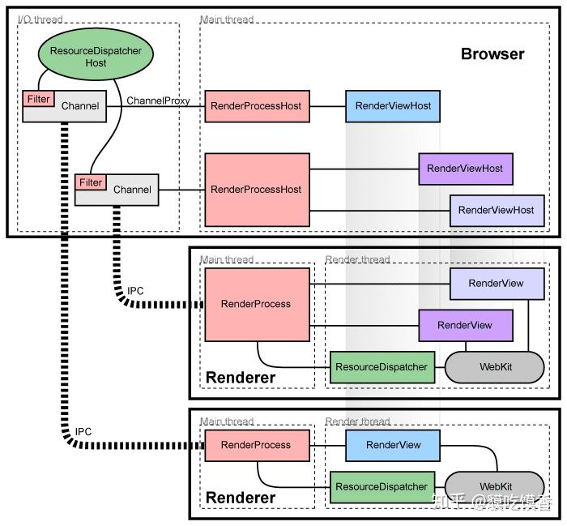

https://source.chromium.org/chromium/chromium/src 在线看代码贼好用


https://www.chromium.org/developers/design-documents/multi-process-architecture/



怎样阅读 Chromium 源码？ - 巢鹏的回答 - 知乎
https://www.zhihu.com/question/306408034/answer/565409020


# Chromium


怎样阅读 Chromium 源码？ - 龙泉寺扫地僧的回答 - 知乎
https://www.zhihu.com/question/306408034/answer/565791530


http://bloomberg.github.io/chromium.bb/

https://github.com/bloomberg/chromium.bb


WIN10编译Chromiumbb 记录；windows10 Chromium.bb环境搭建、clone、编译、VS调试
 https://blog.csdn.net/weixin_44503157/article/details/122275267 


按下面命令设置自己的VS路径
```
set vs2019_install=C:\Program Files (x86)\Microsoft Visual Studio\2019\Community
```


```
>gclient
WARNING: Your metrics.cfg file was invalid or nonexistent. A new one will be created.
Usage: gclient.py <command> [options]

Meta checkout dependency manager for Git.

Commands are:
  config   creates a .gclient file in the current directory
  diff     displays local diff for every dependencies
  fetch    fetches upstream commits for all modules
  flatten  flattens the solutions into a single DEPS file
  getdep   gets revision information and variable values from a DEPS file
  grep     greps through git repos managed by gclient
  help     prints list of commands or help for a specific command
  metrics  reports, and optionally modifies, the status of metric collection
  pack     generates a patch which can be applied at the root of the tree
  recurse  operates [command args ...] on all the dependencies
  revert   reverts all modifications in every dependencies
  revinfo  outputs revision info mapping for the client and its dependencies
  root     outputs the solution root (or current dir if there isn't one)
  runhooks runs hooks for files that have been modified in the local working copy
  setdep   modifies dependency revisions and variable values in a DEPS file
  status   shows modification status for every dependencies
  sync     checkout/update all modules
  validate validates the .gclient and DEPS syntax
  verify   verifies the DEPS file deps are only from allowed_hosts

Options:
  --version             show program's version number and exit
  -h, --help            show this help message and exit
  -j JOBS, --jobs=JOBS  Specify how many SCM commands can run in parallel;
                        defaults to 12 on this machine
  -v, --verbose         Produces additional output for diagnostics. Can be
                        used up to three times for more logging info.
  --gclientfile=CONFIG_FILENAME
                        Specify an alternate .gclient file
  --spec=SPEC           create a gclient file containing the provided string.
                        Due to Cygwin/Python brokenness, it can't contain any
                        newlines.
  --no-nag-max          Ignored for backwards compatibility.
```


