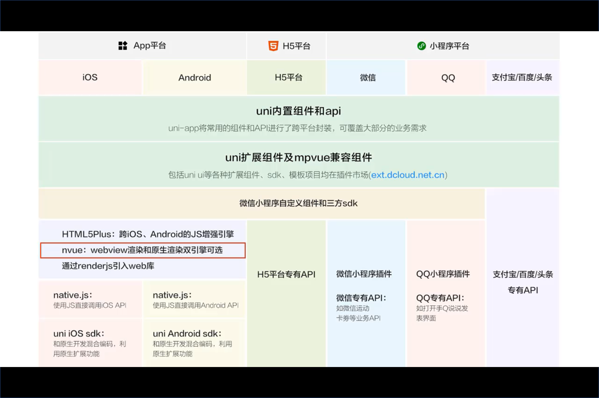

# 缺点满小不原生

uniapp开发和原生开发到底差多少，有没有实际的数据对比，太久的数据对比不行？ - 恋猫的回答 - 知乎 https://www.zhihu.com/question/315790845/answer/1082678217

使用uni-app开发小程序，比直接原生开发小程序好在哪里 - 崔红保的文章 - 知乎 https://zhuanlan.zhihu.com/p/87685252

结论是：使用`uni-app`框架开发，在功能上和原生小程序开发没有区别，不会有任何限制

T꯭r꯭i꯭d꯭u³³ ：
android开发和网页开发小程序开发的工作流超像的：
android的xml，java,style
≈微信小程序开发的wxml,wxss,js
≈大前端nodejs的html,css,javascript
各自又有多种多样的框架阶层二次开发工具。

