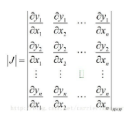
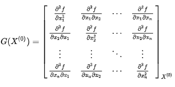
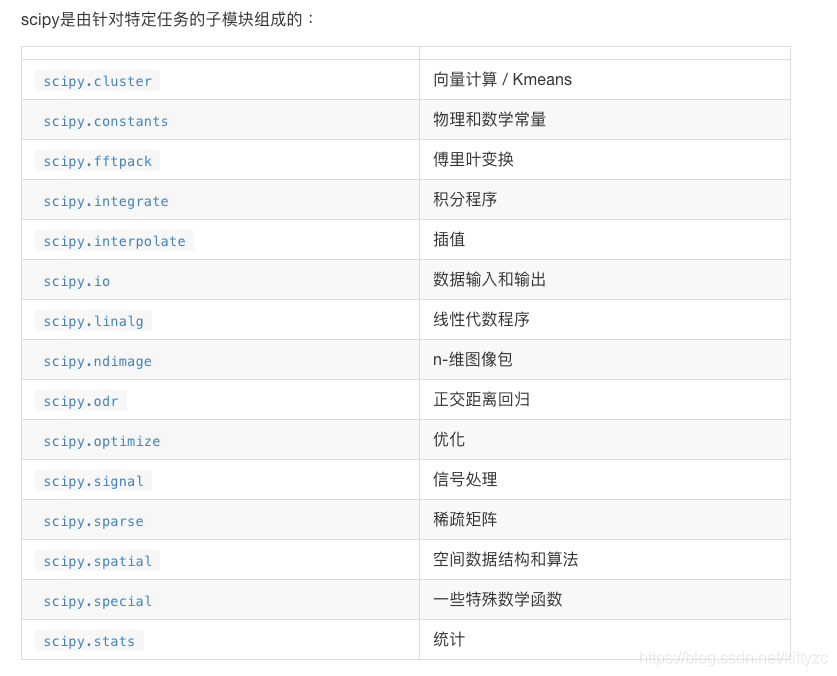

# scipy

一般来说，scipy中有的算法，就不要用numpy了。

scipy会使用fortran的库，可以参考这里。
minpack是一个1980年代用fortran编写的库，用于非线性方程组求解、或是方程组残差的least square minimization。
这里有两个基本概念：
Jaccobi矩阵：多个y（联立方程组）对x的一阶偏导矩阵

注意不要和Hession阵混淆，Hession阵是一个y对x的二阶偏导矩阵。

