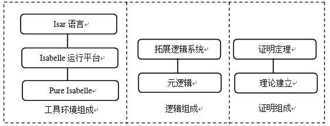
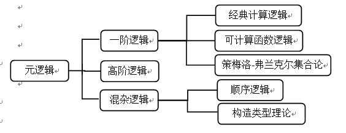

# 有没有人熟悉isabelle

《高阶逻辑 辅助证明系统》，是专门讲Isabelle/HLO的，我是研究函数式编程才看到这个的，再深入的不懂了

https://www.zhihu.com/question/22949842

最近要学习isabelle这个定理证明工具做一个操作语义的证明，Isabelle 是基于逻辑框架的概念而开发的定理证明辅助工具。Isabelle是英国剑桥大学的Law rence C. Pau lson和他的合作者于1986年共同开发完成。目前, 其许多工作由德国慕尼黑工业大学的Toh ias N ipkow 来完成。  

Isabelle最大的特点是系统支持多种对象逻辑, 包括直觉主义一阶逻辑( IFOL) , 建设性类型理论( CTT) , 高阶逻辑( HOL), 基于序列演算的一阶逻辑( LK)和模态逻辑等。  
我想知道的是用它做一个操作语义的证明，元逻辑应该是哪一种？

作者：奶油蘑菇  
链接：https://www.zhihu.com/question/22949842/answer/131874580  
来源：知乎  
著作权归作者所有。商业转载请联系作者获得授权，非商业转载请注明出处。  
  

我决定自问自答了。最后本科用这个工具二次开发做了一个语言的定理证明工具。  
=====================================================  

Isabelle定理证明器是一种支持高阶逻辑(Higher Order Logic, 简称HOL) 的交互式通用定理证明器。它由剑桥大学(University of Cambridge) 的Lawrence C. Paulson教授及其团队与慕尼黑理工大学(Technical University of Munich) 的Tobias Nipkow教授于1986年共同开发完成\[1\]。随着不断地改进，它也成为了一种通用的定理证明辅助工具，支持形式化数学公式，并提供证明工具完成对数学公式的逻辑演算。它的主要应用有数学公式和计算机中协议的形式化描述与性质证明，特别是形式化验证\[2\]。自发布以来，因其强大的证明能力，Isabelle已被广泛用于数学公式和计算机协议的形式化验证，如哥德尔完备性定理、素数定理、安全协议的正确性和编程语言语义的一些性质的验证等。

  

1、Isabelle的组成

Isabelle是由函数程序设计语言Standard ML(Meta Language)\[3\]编写完成，工具环境的组成包括ML语言实现的底层Pure Isabelle、Isabelle的运行平台和Isar语言。整个Isabelle的组成如图1所示。

作者：奶油蘑菇  
链接：https://www.zhihu.com/question/22949842/answer/131874580  
来源：知乎  
著作权归作者所有。商业转载请联系作者获得授权，非商业转载请注明出处。  
  

图1 Isabelle的组成  
Standard ML是基于ML的一种语言，早期的ML语言用于LCF式定理证明之后演化出许多版本，Standard ML就是使用比较广泛的一种。该语言是强类型语言，能支持多态类型并且具有可扩展的函数功能，主要以拉姆达演算为理论基础。利用Standard ML 语言开发的元逻辑使得它基于一个小的核心逻辑并不断扩展，以此保证逻辑的正确性，同时也使得Isabelle工具继承了该语言的多种优点。例如ML的多态性使得Isabelle的变量类型有了很好的继承性。在ML中’a表示任何类型的变量，在编码定义函数时利用’a变量来定义传入参数与返回参数时该函数就能匹配任意的变量。后续的工具实现就是以该语言为基础。  
Isar语言则是用于书写证明义务与证明过程。所有的验证工作都可以在Isabelle的运行平台jEdit下进行，现在该平台已经可以运行在linux、windows与IOS三种操作系统环境中。

  
2、Isabelle的逻辑

在Isabelle/HOL中，主要有两种逻辑系统：元逻辑(meta-logic)与拓展的逻辑系统（对象逻辑）\[4\]。图2为Isabelle的逻辑系统。

元逻辑：元逻辑是基于弱类型理论的一种直觉的高阶逻辑(intuitionistic higher-order logic)，可以使用其他的逻辑系统替换，如一阶逻辑(FOL)、高阶逻辑(HOL)、策梅洛-弗兰克尔集合论(ZFC)、模态逻辑(Model Logics) 等，以此增加了工具的延展性。它主要有∀(全称量词）、≡（等价符号）与⟹（推导）。

**拓展的逻辑系统****：**拓展的逻辑系统指的就是基于元逻辑的推理模式引进的其他逻辑系统。该工具实现了高阶逻辑的引进，由于采用的主要证明方法是基于高阶统一的高阶逻辑解决方案，用户可以自行扩展新的逻辑系统。同时该工具也在不断地丰富现在主流的一些逻辑系统作为其拓展的逻辑系统。

作者：奶油蘑菇  
链接：https://www.zhihu.com/question/22949842/answer/131874580  
来源：知乎  
著作权归作者所有。商业转载请联系作者获得授权，非商业转载请注明出处。  
  

图2 Isabelle的逻辑系统

3、Isabelle工具的特点

（1）证明理论可迭代使用

在利用Isabelle证明时，主要采用自带的语言Isar，该语言描述能力强，能较好地刻画需要证明的系统。主要体现在它具有丰富的类型、提供各种逻辑系统、规则和策略。在使用过程中，该工具已经内置了许多的逻辑系统，如果不能满足证明需求，则只要提供正确的逻辑系统编辑到该系统中，就能使用自定义的逻辑系统进行证明工作。此外，工具本身有已经完成的理论也可以引用到新添加的理论中作为基础，只要在创建理论的开头加入语句“import S1 ...Sn”就可以继承S1.thy中的理论，并且是递归继承父理论。因此，在利用Isabelle工具证明时，主要是完成两部分的工作，一部分是利用现有的一些理论基础创建新的理论，另一部分是使用新的理论来证明需要做的证明义务。

  

（2）证明义务不受内存限制

由于Isabelle在证明中并不保存证明过程，而是利用jEdit集成化工具，针对每一步，在一个output栏中查看证明的状态变化，显示仍然需要证明的义务，并且当证明义务超过缓存时则不予以显示，这使得用户不但能够很好的利用该交互式工具进行定理的证明，而且使得证明义务不会受到内存大小的限制。

  

（3）支持多种逻辑系统和自定义逻辑系统

一种逻辑系统包含了该逻辑的语法、定理、公理、类型和推理规则。诸如一阶逻辑、模态逻辑、构造型理论模态逻辑、高阶逻辑等都是逻辑系统。目前大部分定理证明辅助工具（如Coq等）只支持一种逻辑系统，而由于Isabelle引入了元逻辑，它所有的验证工作都是在元逻辑所提供的逻辑框架下展开的，所以它能支持多种逻辑系统。在使用过程中，该工具已经内置了许多的逻辑系统，如果不能满足证明需求，则只要能提供正确的逻辑系统编辑到该系统中，就能使用自定义的逻辑系统进行证明工作。

  

（4）庞大的规则库和策略集

一般的定理证明器有两种推理方式，前推证明（forward proof）和后推证明（backwards proof)。交互式定理证明器主要采用后推证明，即给定一些已知的规则和证明公式以及预期的目标，在用户的交互中一步步接近目标。每一步证明都是从后往前搜索规则查找是否有这样的路径能从目标到达前提定理。因此，规则和策略集是定理证明非常关键的部分，一个定理证明器中提供的规则和策略越多，则定理证明工作越容易。

虽然该工具是交互式的，但由于引入项重写引擎、静态证明器等模块，它的自动推理速度仍然非常可观。该工具提供了大量规则和策略集，虽然这增加了使用者的学习难度，因为必须选择使用哪一种策略或规则才能实现目标就必须掌握这些规则和策略，但是不可否认，这也使得该工具具有强大的证明能力。并且在该工具的可视化界面中也提供了规则和策略的搜索功能。利用命令apply（method name)可以使用这些规则和策略。此外，Isabelle也允许使用者添加新的规则和策略，如果编译通过则可以加入到之后的定理证明中。  

  

4、Isabelle的新理论创建

理论主要是由一种类似函数程序语言如ML、Haskell的类型系统中的类型（type），项（term），公式（formulae）组成。基础类型主要有布尔bool，自然数nat等，构造类型主要有列表list，集合set等。类型也可以是两种类型组成的对，如nat×list就是一个类型对。需要构造一个自然数类型的list可以表示为（nat）list。此外，函数类型由=>表示，t1 => t2 =>t3 等价于t1=> (t2 => t3)。定义一个新理论的语法规则如下表所示：

  

**Header{***The annotation of this theory***}  
theory** T

**imports** T1 ... Tn

**begin**

Declarations；Definitions；Theorems； Proofs；

**end**

  

其中，T表示理论的名字，import后的参数T1指该理论继承的父理论。Declarations主要是声明一些数据类型，Definitions是定义函数，Theorems需要写明一些定理，在Proofs部分进行目标的证明。

  
  
5、例子  
由于Isabelle集合了众多的推论规则和策略供定理证明时使用。利用原子模式证明P ∧ Q ⟹ Q ∧ P的流程如下：  
  

lemma "P ∧ Q ⟹ Q ∧ P"

apply(rule conjI)

apply(erule conjE)

apply(assumption)

apply(erule conjE)

apply(assumption)

done

  

1.apply(rule conjI)表示使用的是定理conjI。conjI表示吸取规则

P Q

————

P ^ Q

采用第一步规则以后目标变为两个子目标：

1\. P ∧ Q ⟹ Q

2\. P ∧ Q ⟹ P

  

2.apply(erule conjE)表示使用的是消去定理(elimination rule)conjE。它把第一步的前提条件拆分成了P；Q。其中P ⟹ Q ⟹ Q等同于\[\[P; Q\]\] ⟹ Q。

1\. P ⟹ Q ⟹ Q

2\. P ∧ Q ⟹ P

  

如果想要先处理第二个子目标则可以在定理前加prefer 2。证明为：prefer 2 apply（rule conjE）。则结果变为：

1\. P ⟹ Q ⟹ P

2\. P ∧ Q ⟹ Q

  

3.apply assumption指的就是假言推断。当没有subgoals时就表示证明结束。

此外，利用一些自动证明策略往往能一步完成一些简单的证明，常用的自动证明策略有：

auto | blast | arith | simp

  

其中，auto是使用最多的自动证明规则集合了许多基本的证明方法，blast常用于一阶定理证明，arith则多用于算术计算的证明，最后simp是基于重写规则的自动证明。在这个例子中auto策略则可以一步证明。

lemma "P ∧ Q ⟹ Q ∧ P"

apply auto

Done

  

=================

还有一些例子，等网好一点传。。写论文太无聊了。。把自己的问题给填了。

  

参考文献

\[1\] Paulson, Lawrence C., ed. Isabelle: A generic theorem prover\[M\]. Springer, Vol. 828. 1994.

\[2\] Paulson, Lawrence C. The foundation of a generic theorem prover. Journal of Automated Reasoning, Volume 5, Issue 3 (September 1989), Pages: 363-397,

\[3\] Lawrence C. Paulson. ML for the Working Programmer. Cambridge University

Press, 2nd edition, 1996.

\[4\] Paulson L C. Isabelle: The next 700 theorem provers\[J\]. arXiv preprint cs/9301106, 2000.

