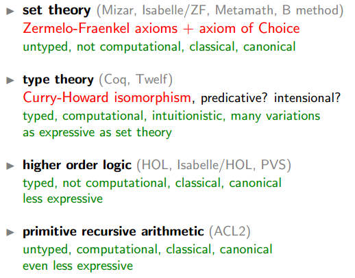

[TOC]

谁能介绍一下微软Theorem Prover Z3项目？ - rainoftime的回答 - 知乎
https://www.zhihu.com/question/36458347/answer/67771090

# 1. 1.lean,coq,idris,isabelle等theorem prover对比

**Coq to Lean Tactic**Cheatsheet

https://github.com/jldodds/coq-lean-cheatsheet

## 1.1. Coq，Isabelle，Idris，lean
Coq，Isabelle，Idris，最近轉lean，https://www.zhihu.com/answer/1250972885

Isabelle開始説吧。Isabelle擁有目前所有system裏面最强的automation，所以很多的Isabelle proof都是使用大量的automation，例如auto和sledgehammer。這樣可以保證開發速度，讓程式來解決小問題，然後讓用戶來想更大的問題。但是Isabelle使用的是Simply Typed Lambda Calculus，然後有部分人認爲有一些數學裏面的概念和定義一點要Dependent Type才可以解決。我也不清楚，不過這些過幾年可能更明顯吧。

Dependent Type還有兩個Haskell類的語言，Idris和Agda。先説Idris吧，Edwin設計Idris的時候也沒有特別考慮用Idris來做Proof這個方面，所以Idris對於我的用途不是特別適合。Idris的强項是編程，然後好像Idris2速度提上來了，以後可能可以再看看吧。Agda的話現在我感覺更像HoTT的試驗場，實際在用的人不多吧。但是對於數學來説，這兩個語言都是Term-based，而不是tactic-based，對於很多數學家來説不是特別友好。

所以最接近Lean的就是Coq。要直接對比的話兩個系統其實Foundation都差不多，不過在Lean裏面做Quotient會簡單一點。還有就是Lean裏面有幾個axiom導致了Lean的type system沒有了部分CS會在乎的Property。不過大部分Lean用戶（數學家）並不是特別在乎。然後整體來説，Lean比Coq容易用很多，因爲Lean的community寫了不少的程序，來讓安裝和使用Lean更容易。

其他的區別的話還有就是Lean是使用Type Class，Coq是使用類似Ocaml的module系統。說真的，我其實到現在都沒搞懂Ocaml的module。。。還有就是Lean是使用了更多的Type Class來做override notation和syntax sugar，然後Lean程序的易讀性個人感覺是比Coq好很多的。一個example就是如果想在Coq裏面使用 作爲一個實數的話

Lean另外一個（個人感覺）的優勢是metaprogramming可以直接用Lean來寫，而不是像Coq那樣需要Ltac那樣另外一個語言。這樣方便寫新的tactic，并且可以在tactic裏面調用現有的Lean代碼。

不過説這麽多也沒啥用，畢竟比程式本身更重要的是有誰在用這些程式。然後對於我感興趣的方面來説，使用Lean的數學家比使用Coq的多跟多。其實我就是跟著大佬們來選的Lean。。。現在Lean周圍的Community已經有不少數學家了，例如Kevin Buzzard。他是Imperial的教授，他在Imperial的Intro to Proofs course裏面也有用Lean來做教學。然後現在Lean的community裏面也有不少Imperial的本科生。如果熟悉IMO/IOI/Putnam的人可能會知道Reid Barton，他現在也在用Lean。

因爲Lean的community裏面數學家比CS的多，所以很多mathlib裏面的東西都是按照數學家習慣的方向來做。這也導致了Lean裏面有很多的definition和proof都是classical和non-computable的，不像Coq的community那樣，能constructive就用constructive的方法。沒辦法的時候才用classical。Lean的Mathlib裏面基本上analysis，linear algebra，set theory等都是classical的。

Leo de Moura 在寫完Lean 3.4.2之後轉向去寫Lean 4，然後現在Lean的社區就fork了然後自己更新，現在基本上每周一個新版本 （5月發佈了六個版本）。所以目前來看社區活躍度最高的可能還是Lean。

長遠來看，Lean 4估計會比Lean 3強一點。主要就是Lean 4的front end 用Lean來寫了，然後好像backend會compile to C。這樣速度會快不少，而且還能做FFI。目前Lean要compile整個mathlib要一個小時（CI裏面），而且這已經是改進很多了的速度，前幾周的時候要差不多兩個小時。這速度跟其他的system比真的是很慢。聽説Lean 4有可能比Haskell快，所以到時候在看看吧。

https://leanprover-community.github.io/

這裏有mathlib LoC增長速度的一個圖，可以看到2017年的時候只有22k，2018到了112k，2019到了210k，現在已經280k了。雖然説增長速度還是蠻快的，但可能還是不夠。畢竟增長速度還是Linear的，每年100k左右，然而數學新的concept/knowledge增長的速度還是比這個快很多。https://leanprover-community.github.io/mathlib_stats.html

如果你對Formalise IMO的問題有興趣的話，你可以看看這個PR

https://github.com/leanprover-community/mathlib/pull/2720

加入了Olympiad幾何題需要的一部分Euclidean Geometry。除了這裏面的東西之外，基本上機會都沒有。貌似Pythagoras目前還沒有。。。

這裏有一些BMO2（英國IMO選拔賽）的題目在Lean裏面Formalise了

https://github.com/jsm28/bmo2-2020-lean/tree/master/src

不過如果你對IMO Grand Challenge有興趣是因爲AI的話，個人感覺還是差蠻多東西的。目前Theorem Prover最好的AI也不是特別強，應該不夠解決IMO問題的。

而且你要看IMO Grand Challenge裏面的人的話，Leo和Daniel在寫Lean 4，Kevin目前在Formalise的更多是UG的東西，另外三個我不知道了。反正目前沒有人在做IMO Grand Challenge。

-------------------------------------------

Infer的核心目标memory safety，早期主要采用基于separation logic的shape analysis（分析pointer, list, tree等memory相关等）。

Infer当前的定位更倾向analysis(更精确地发现更多bug)而非verification（验证没有bug或满足某个复杂属性）。Infer的前身是Smallfoot（大约4k OCaml)和SpaceInvader(大约4w OCaml）项目，Smallfoot倾向verification, SpaceInvader可以看出处于转型期。可参考下面的文章

Smallfoot: Modular Automatic Assertion Checking
with Separation Logic, FMCO 05
A local shape analysis based on separation logic, CAV 08(Spaceinvader)
Compositional Shape Analysis by Means of Bi-Abduction, POPL 09(Spaceinvader-Abductor)
分离逻辑

https://www.zhihu.com/answer/296039660

-------------------------------------------------------

## 1.2. Isabelle vs Coq

由于问题中的“ Isabelle / HOL”是精确的，因此我将讨论Isabelle中使用的HOL逻辑，我认为这是与Coq进行比较的最佳方法。我不是类型系统和逻辑方面的专家，但是我认为我所说的是正确的，至少是正确的。这当然也是一个品味问题；-)，我的回答可能是主观的。

最深刻的区别在于类型系统和逻辑。

我想说，对于了解ML系列功能语言的人（甚至对于了解SML的人），它的力量会更加自然，并且它会采用务实的方法来解决问题，例如使用经典逻辑来解决问题。一个基础。它的类型系统接近Hindley Milner的类型系统，并且默认情况下终止（如果用户未对其进行修改）。

另一方面，Coq更严格，并使用直觉逻辑。它具有一个特殊的类型系统，该系统具有多个顺序，并允许类型依赖性，这种依赖性可能很难处理，并且在某些情况下可能不会终止。它还允许人们从证明中提取程序（可能效率较低），而这在Isabelle中是不可能直接实现的。
https://stackoverflow.com/questions/30152139/what-are-the-strengths-and-weaknesses-of-the-isabelle-proof-assistant-compared-t/30159566#30159566

69

我对Coq最为熟悉，并且对Isabelle / HOL没有太多经验，但是我可能会有所帮助。也许其他对Isabelle / HOL有更多经验的人可以帮助改善这一点。

两种系统之间有两点分歧：基础理论和互动方式。我将简要概述每种情况下的主要区别。

理论
Coq和Isabelle / HOL均基于功能强大且表达力强的高阶逻辑。但是，这些逻辑在一些功能上有所不同：

依赖类型
Coq的逻辑是一个从属类型理论，称为归纳结构演算（简称CIC）。“从属类型”在这里意味着Coq中的类型可以引用普通值。例如，可以编写一个mult类型为的矩阵乘法函数

mult : forall (n m p : nat), matrix n m -> matrix m p -> matrix n p
此函数的类型表示，它使用两个矩阵作为输入，一个维度为维n x m，另一个维度为维m x p，并返回一个维度矩阵n x p。另一方面，Isabelle / HOL的理论不具有依赖类型。因此，不能编写mult与上述函数相同类型的函数。取而代之的是，必须编写一个适用于任何类型矩阵的函数，并在接收到正确类型的参数时证明该函数的某些后验性质。换句话说，在处理Isabelle / HOL时，需要将Coq类型中体现的某些属性断言为单独的定理。

尽管从属类型在某些方面很有趣，但尚不清楚它们在总体上有多有用。我的印象是，有些人觉得它们的使用非常复杂，并且在类型级别上表达某些属性而不是将它们作为单独的定理所带来的好处不值得增加这种复杂性。就个人而言，在有明确的理由时，我喜欢在少数情况下使用依赖类型。

基本推理原理
缺省情况下，Coq的理论缺少许多数学实践中常见的推理原理，例如被排除的中间律（即非构造性推理的能力），可扩展性（例如，能够说产生相同结果的函数）本身是平等的），以及选择的公理。另一方面，在Isabelle / HOL中，此类原则是内置的。

从理论上讲，这不是什么大问题，因为Coq的逻辑旨在让人们安全地将这些推理原理添加为额外的公理。不过，我的印象是，在Isabelle / HOL上进行这种推理比较容易，因为逻辑是从头开始构建的，以支持它们。

（您可能想知道，为什么将这些基本原理排除在Coq的逻辑之外是什么原因。动机是哲学上的：在Coq的核心逻辑中，证明可以看作是可执行程序，从而使逻辑具有建设性的味道。拒绝排除在外的原因中间，例如，是一个析取的证明A \/ B对应于一个程序，返回一个指示其中一个A或B为真;因此，被排除的中间将对应于一个程序，决定每一个数学问题，其中不能存在这个问题进一步讨论这个问题。）

互动方式
Coq和Isabelle / HOL都是交互式定理证明。它们是用于编写定义和证明的语言。计算机会检查这些证明，以确保它们没有错误。在这两种系统中，都通过给出解释如何证明事物的命令来写下证明。但是，在每个系统上发生这种情况的方式各不相同。

通常，Isabelle / HOL对“按钮”证明自动化具有更成熟的支持。例如，它带有著名的sledgehammer策略，该策略调用多个外部自动定理证明者和求解器以尝试证明一个定理。Coq还提供了许多功能强大的证明自动化程序，例如omega或congruence，但是它们并不普遍适用，并且在Isabelle / HOL中可以用单个命令解决的许多定理需要在Coq中提供更明确的证明。

当然，这种便利是有代价的。有人告诉我，在Isabelle / HOL中很难控制自己的举证，因为该系统试图自己做很多事情。证明简单定理时，这不是问题，但当证明自动化功能不够强大时，就成为问题，您需要告诉定理证明者如何进行更详细的说明。

在支持用户定义的证明自动化程序时，情况有所不同。Coq附带一种称为Ltac的用于编写证明的战术语言，这是一种独立的编程语言。即使Ltac存在一些设计问题，它也允许用户以轻量级的方式对相当复杂的证明自动化程序进行编码。对于繁重的任务，Coq还允许用户使用Coq的实现语言OCaml编写插件。相反，在Isabelle / HOL中，没有像Ltac这样的高级自动化语言，并且用户编程自定义证明自动化过程的唯一方法是使用插件。

https://arxiv.org/abs/1808.09701
在上个世纪出现了对数学的基础进行形式化定义的需要。数学的规模和复杂性，以及发现的悖论，揭示了跨各种理论积累错误的危险。尽管根据哥德尔的不完备性定理，不可能建立一个单一的形式系统来描述世界上所有现象，同时又是完整和一致的，但它却产生了相当实用的逻辑领域，例如理论定理证明的证明。这是用于使用逻辑推理机械地验证数学陈述的一组技术。此外，它还可以用于解决复杂的工程问题，例如，证明软件系统或算法的安全性。本文在表达性，局限性和可用性方面**比较了两种广泛使用的自动定理证明工具Isabelle / HOL和Coq**。因此，它首先简要介绍形式系统和自动演绎理论的基础，它们的主要问题和挑战，然后在举例说明性证明的支持下，对所选定理证明者最显着特征的详细比较。

---------------------------------------------------------------------------------------------------------------

Coq的自动化用好了很爽，有很多现成的decision procedure（Presburger Arithmetic solver，Fourier method for solving inequality，SAT solver，SMT solver，Nelson and Oppen congruence closure algorithm，暴力深搜），你自己也可以任意定制，pattern matching，prolog式backtracking branching，自定义爆搜，自己在OCaml里面写，有不少的时候我自己脑袋里还没证出来，但是Coq已经搞出来了。同时，你做任何的逻辑推导（正向推导，反向推导），coq都会自动的展示出【你还需要证明什么，才能证明整个theorem】，很爽，不需要自己写/放脑袋里。Coq也符合LCF approach-换句话说，只要你在Coq proving mode里面一步步走，到最后把所有东西证明了，就一定对。你也不需要proof read你的证明了，bravo daze!https://www.zhihu.com/answer/137226520 

buzzard现在有开给imperial phd学生的lean入门。https://xenaproject.wordpress.com/2021/01/21/formalising-mathematics-an-introduction/，http://wwwf.imperial.ac.uk/~buzzard/maths/teaching/21Spr/formalisation.html

其他人可能会给出更深层次的原因，但我相信造成这种差异的一个关键原因是Isabelle严格适用于经典逻辑，并且不支持依赖类型。Coq用于构造逻辑，并具有依赖类型。当然，在Coq中可以将排除的中位数作为公理，但是很多人不愿意这样做。具有依赖类型意味着Coq可以处理Isabelle无法处理的许多类型的证明。因此，伊莎贝尔（Isabelle）具有更“自动化强大/范围能力更弱”的逻辑核心（古典逻辑，例如，排除在外的中间逻辑，在某种意义上说是与esp一起用于自动化的强大公理），并且可以推理更少的事情。
https://coq.discourse.group/t/what-does-it-mean-that-isabelle-has-better-automation-than-coq/957/6

使普通Coq用户能够使用isabelle锤子的最佳方法sauto可能是将其作为Coq平台的一部分。我已经开了一个问题 1个 有关此问题的信息，请访问GitHub，这可能是继续讨论如何将CoqHammer吸引到普通读者的好地方。

----------------------------------------------------------------------------------------------------

