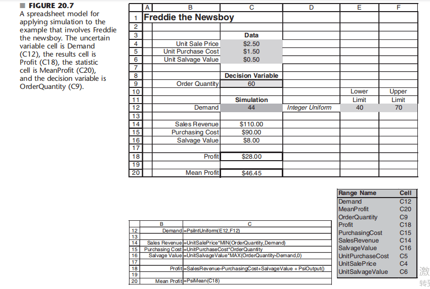
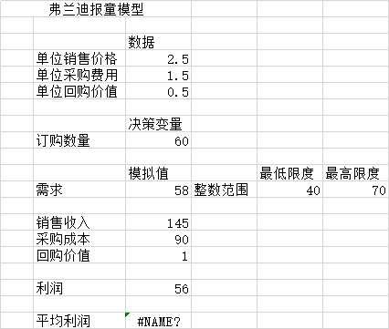

# 报童模型

图20.7显示了这个问题的电子表格模型。

给定数据单元C4:C6，决策变量是在单元C9中输入的订单数量。(在这个图中，数字60被随意输入，作为对合理值的第一个猜测。)图的底部显示了用于计算输出单元C14:C16的公式。然后使用这些输出单元计算输出单元利润(C18)。

电子表格中唯一不确定的输入量是C12单元的日需求量。这个数量可以包括在40到70之间的任何地方。由于40 - 70之间的整数频率大致相同，因此可以合理地假设日需求量的概率分布为40 - 70之间的整数均匀分布，如单元格D12:F12所示。ASPE要做的不是在模拟需求 (C12)中永久性地输入一个数字，而是将这个概率分布输入到这个单元中。通过使用ASPE从这个概率分布中生成随机观察，电子表格可以按照通常的方式计算输出单元以完成一次试验。通过运行用户指定的试验次数(通常为数百或数千次)，模拟从而生成输出单元中相同数量的随机观察值。ASPE为特定利益的输出单元(弗兰迪的每日利润)记录这些信息，然后，在最后以各种方便的形式显示这些信息，以显示对弗兰迪的每日利润的潜在概率分布的估计。(这一点稍后再说。)

图20.7将模拟应用于涉及报童弗雷迪的示例的电子表格模型。

不确定变量单元为需求(C12)，结果单元为利润(C18)，统计单元为平均利润(C20)，决策变量为订货量(C9)。

