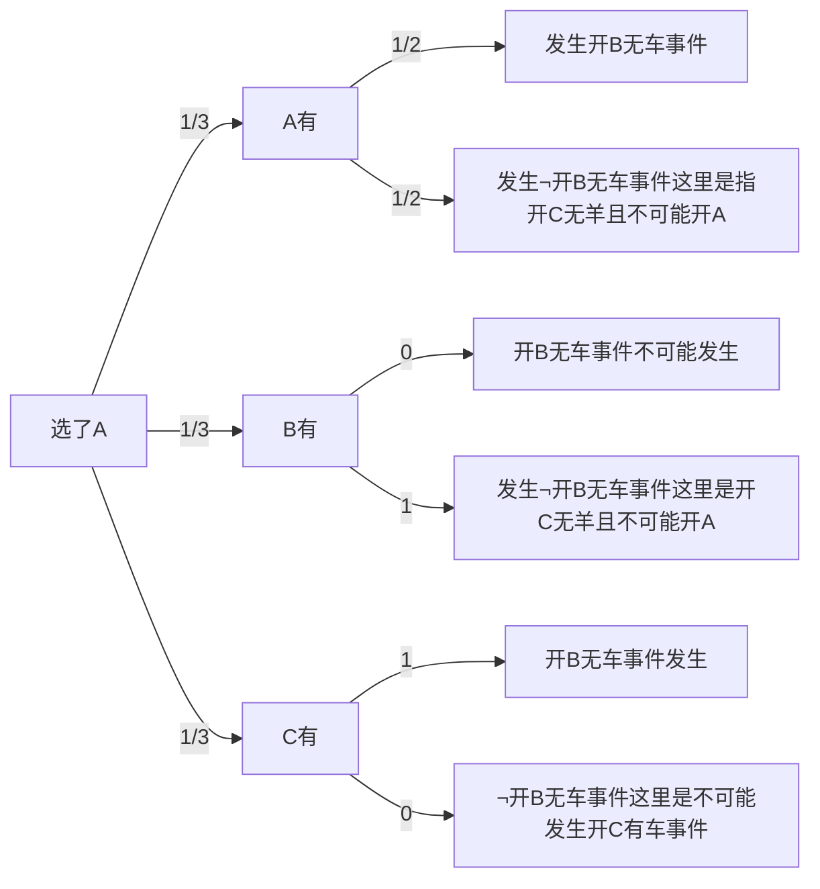
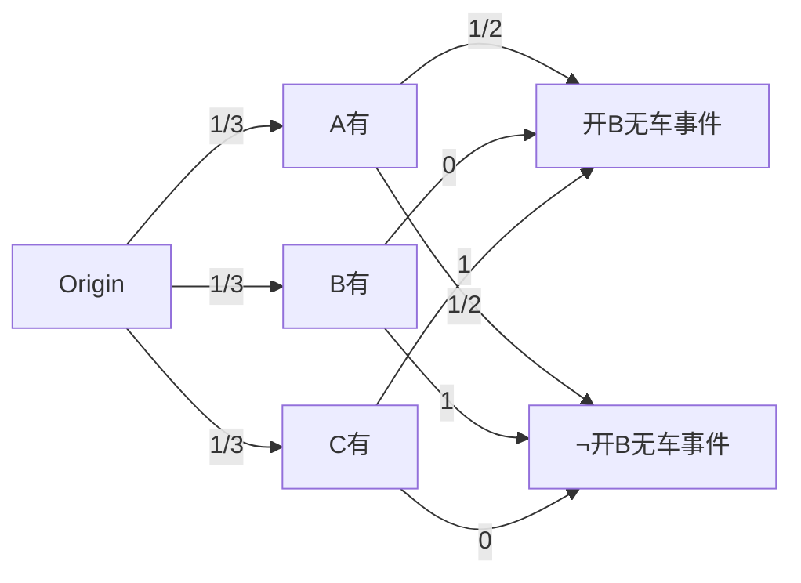
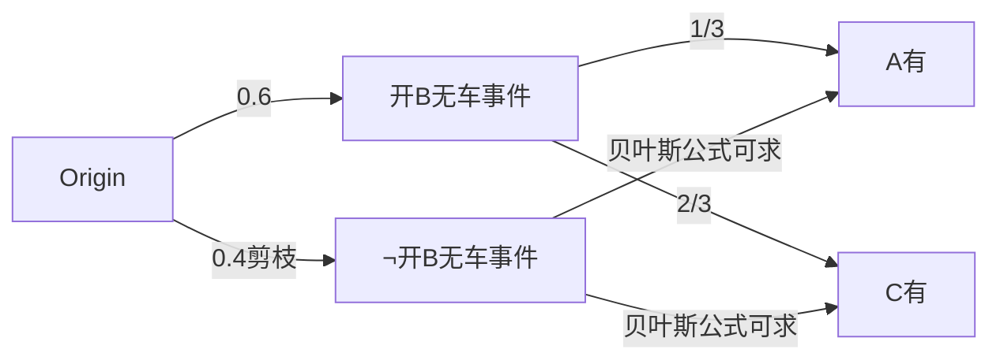

[TOC]

# 三门问题的贝叶斯理解方法

因为A,B,C可轮换，假设三门问题（Monty Hall problem蒙提霍尔问题、蒙特霍问题或蒙提霍尔悖论）是“选A，开B无车”，小明是否换C?

若C有车的情况下，为什么$\neg$开B无车事件是不可能发生开C有车事件的理由[^1]

[^1]: “不可能发生的开C有车事件不可能发生，是因为主持人不可能“开C有车”的话，就没机会让玩家选择“换/不换”，主持人一定知道那个门有车防止节目“翻车”。或者说，根据选A后“开B无车事件”已经发生的事实说明，“开C有车事件”不允许发生，这是获得的信息。

全概率

开B无车事件：
$\frac{1}{3}*\frac{1}{2}+\frac{1}{3}*0+\frac{1}{3}*1=\frac{1}{2}$

$\neg$开B无车事件：
$\frac{1}{3}*\frac{1}{2}+\frac{1}{3}*1+\frac{1}{3}*0=\frac{1}{2}$

然后整合看看：

根据贝叶斯公式$P(X|Y)=\frac{P(Y|X)P(X)}{P(Y)}$：

求解：

$P(A有|开B无车事件)=\frac{P(开B无车事件|A有)*P(A有)}{P(开B无车事件)} \ \ \ \ \   =\frac{\frac{1}{2}*\frac{1}{3}}{\frac{1}{2}}=\frac{1}{3}$

$P(C有|\neg开B无车事件)=\frac{P(\neg开B无车事件|C有)*P(C有)}{P(\neg开B无车事件)}  \ \ \ \ \       =\frac{1*\frac{1}{3}}{\frac{1}{2}}=\frac{2}{3}=1-\frac{1}{3}-0$

根据"**选A开B无车**"带来的信息决定了不可能发生的部分，这部分概率不必算了。

如果小花上厕所没看节目，不知道"小明选A后开B无车事件"发生，而仅仅知道A,C选一个就是$\frac{1}{2}$,如果小花问了身边的人知道这个事件，选C概率也是$\frac{2}{3}$

