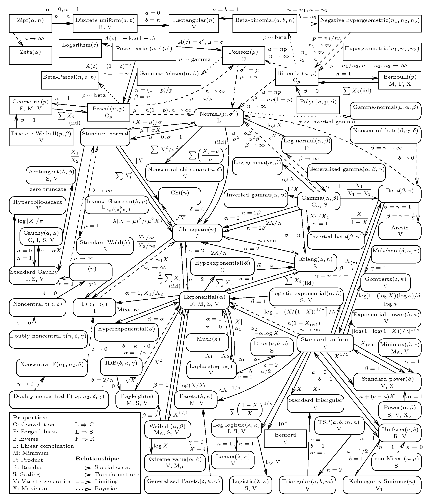

# 常见概率分布模型的关系

# 排队论中的常见分布：泊松分布、指数分布与爱尔朗分布

[推导关系https://blog.csdn.net/a493823882/article/details/78175824](https://blog.csdn.net/a493823882/article/details/78175824)

[常见概率分布关系http://www.math.wm.edu/~leemis/chart/UDR/UDR.html](http://www.math.wm.edu/~leemis/chart/UDR/UDR.html)

[论文https://wenku.baiduvvv.com/view/1eefb83710661ed9ad51f3c6.html](https://wenku.baiduvvv.com/view/1eefb83710661ed9ad51f3c6.html)

[论文https://wenku.baidu.com/view/1eefb83710661ed9ad51f3c6.html](https://wenku.baidu.com/view/1eefb83710661ed9ad51f3c6.html)

[常见概率分布的直觉与联系https://zhuanlan.zhihu.com/p/47609519](https://zhuanlan.zhihu.com/p/47609519)

[常见概率分布模型的给关系https://zhuanlan.zhihu.com/p/47609519](https://zhuanlan.zhihu.com/p/47609519)

