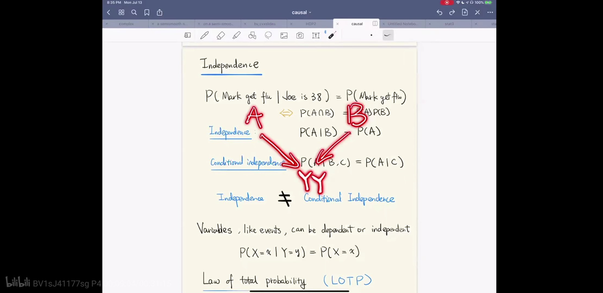

# 独立和条件独立

这里讲的很好

https://b23.tv/oaFNUl

有点想知道机器学习中，一般因果推断的方法会怎么用？什么场景下会用到？如果原因x->结果y，却x,y条件独立的这些情况下，那根据x,y采集的数据“统计规律”训练模型的思路，不就没用了吗？

比如这里 https://b23.tv/aZ0MNj 这个异或门，同或门的例子

https://www.cnblogs.com/Belter/p/6711160.html

在吴恩达老师讲的【机器学习】课程中，最开始介绍神经网络的应用时就介绍了含有一个隐藏层的神经网络可以解决异或问题，而这是单层神经网络（也叫感知机）做不到了，当时就觉得非常神奇，之后就一直打算自己实现一下，一直到一周前才开始动手实现。

据说在人工神经网络（artificial neural network, ANN）发展初期，由于无法实现对多层神经网络（包括异或逻辑）的训练而造成了一场ANN危机，到最后BP算法的出现，才让训练带有隐藏层的多层神经网络成为可能。因此异或的实现在ANN的发展史是也是具有里程碑意义的。异或之所以重要，是因为它相对于其他逻辑关系，例如与（AND）, 或（OR）等，异或是线性不可分的。

对应 视频 因果分析 中x,y线性不可分的图
x o
o x

所以早期异或门不好办

通用近似定理

https://www.zhihu.com/question/42080633/answer/121233345

