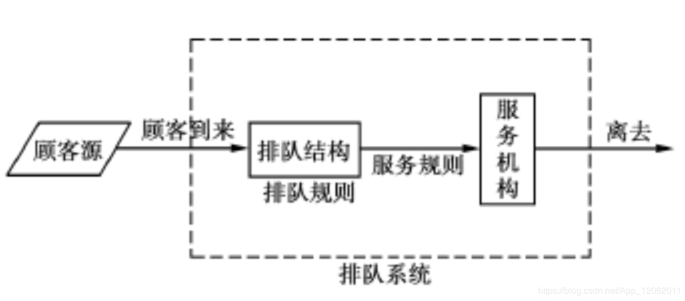
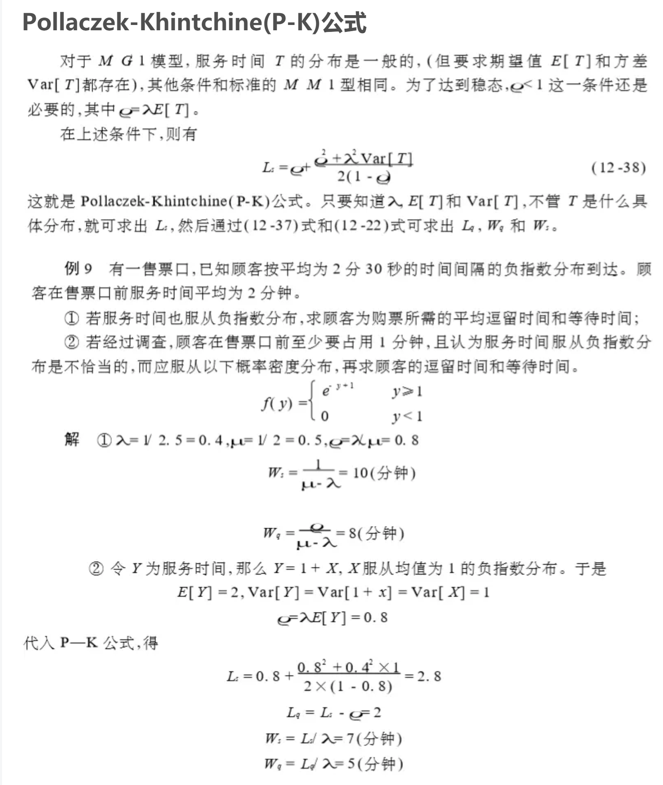

# 随机过程
指数分布图像

[P-K公式https://eason.blog.csdn.net/article/details/86607952](https://eason.blog.csdn.net/article/details/86607952)

[排队论全家桶https://blog.csdn.net/qq_29831163/article/details/89735320](https://blog.csdn.net/qq_29831163/article/details/89735320)

[https://blog.csdn.net/weixin_33913332/article/details/91956660](https://blog.csdn.net/weixin_33913332/article/details/91956660)

# Pollaczek-Khintchine(P-K)公式

[https://blog.csdn.net/weixin_33913332/article/details/91956660](https://blog.csdn.net/weixin_33913332/article/details/91956660)

[https://blog.csdn.net/adminpd/article/details/77171432](https://blog.csdn.net/adminpd/article/details/77171432)

指数分布无记忆性

[https://www.zhihu.com/question/48532595](https://www.zhihu.com/question/48532595)

[https://www.zhihu.com/question/36965252](https://www.zhihu.com/question/36965252)

[https://www.zhihu.com/question/24796044](https://www.zhihu.com/question/24796044)

# 给定随机序列得到满足的分布模型

：
你自己给出。那就简单了，所谓随机数是叫伪随机数，产生时受制于某种规律，如高斯分布，泊松分布，［0，1］均布，…，等等。

2．别人给出。
2．1）你可以借助工具做分布检验，如minitab,  spss,  excel

2．2）手算，或自己编能程处理。先排序，再统计分布函数，做曲线拟合，确定对应的分布参数

：
[f,x]=ksdensity(v);%画概率密度曲线
    plot(x,f);
    xlabel('x)');
    ylabel('p');
    
其中v是很多样本如v=[1,2,54,5,7,8,65,8,78,5,7,5,6,87,4]

：
R语言能解决，如果不想编程的话，可以用crystal ball软件完美解决。
：
你这个问题是 从一群点 来估计这群点属于什么分布
1、视觉辨识是最简单的方法，把这些点画到坐标空间中，然后将其构成的图像与已知概率分布图像进行直观对比即可
2、将目前人类已知的概率分布函数参数化后，用极大似然估计在数据的联合概率分布函数上求取参数，并获得极大似然值，似然值最大的分布可定为该数据的分布
3、如果视觉法否定了数据属于某分布，极大似然法的极大似然概率仍然很小，则判定你的数据不属于已知任何分布，此时可用pazon窗法统计你的数据在每一坐标区域出现的点概率作为概率分布，
：
这属于概率密度函数PDF估计问题，方法有很多，如直方图、核密度估计、最大熵法等，找找相关的文献或专著吧。
：
知乎:python科研绘图
：
知乎:这属于概率密度函数PDF估计问题
[http://muchong.com/t-8415373-1](http://muchong.com/t-8415373-1)

2

# 2.8. 概率密度估计 (Density Estimation)
[http://sklearn.lzjqsdd.com/modules/density.html](http://sklearn.lzjqsdd.com/modules/density.html)

概率密度估计可应用到无监督学习(unsupervised learning)，特征工程 (feature engineering)，数据建模 (data modeling)。 其中使用最广泛最有效的概率密度估计方法包括基于混合模型 (mixture models)的方法，比如，高斯混合 (Gaussian Mixtures, [`sklearn.mixture.GMM`](http://sklearn.lzjqsdd.com/modules/generated/sklearn.mixture.GMM.html#sklearn.mixture.GMM "sklearn.mixture.GMM"))；和基于邻域的方法，比如说核密度估计 (kernel density estimation, [`sklearn.neighbors.KernelDensity`](http://sklearn.lzjqsdd.com/modules/generated/sklearn.neighbors.KernelDensity.html#sklearn.neighbors.KernelDensity "sklearn.neighbors.KernelDensity")). 高斯混合因为在无监督聚类分析中非常有效，因此在 [clustering](http://sklearn.lzjqsdd.com/modules/clustering.html#clustering) 中更全面地进行介绍。

概率密度是一个非常简单的概念，而且大多数的人已经对一个概率密度估计方法非常熟悉：频率分布直方图。

