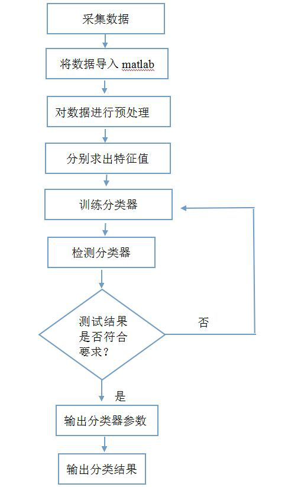

# 基于SVM分类器的动作识别系统
https://www.write-bug.com/article/26.html

有什么能记录（安卓）手机加速度传感器数据的APP吗？ - 巫毅的回答 - 知乎 https://www.zhihu.com/question/29923733/answer/165284791

其中采集数据后应该有一个滤波过程，用来去噪，就是另外一个答主说的卡尔曼滤波之类的方法，因为我使用的传感器JY-901里已经集成了这部分算法，所以我就去掉了这一步。

将数据导入matlab 是因为我使用的上位机编程软件是matlab，如果不喜欢你可以用其他的。

其实导入这步应该包括一个串口传输部分，你需要将传感器上的程序导入上位机进行操作，这就需要通过串口进行传输，这部分需要调试，不过淘宝上有很多物美价廉的USB——TTL串口转换器，比如这种：

接下来就是预处理部分。

这部分的作用是截取信号，因为我们采集出来的数据是一连串离散的点，为了提取特征值更方便，需要将数据进行截取、分组，可以用加窗或者自己设置循环语句的方式。

再之后是特征值，特征值是指从原始信号中提取出的可以表征动作特征的值，可以通过你需要区分的动作来确定特征值，当然有时域和频域之分。

接下来就是训练分类器的部分了。分类器是指这样一种程序，它可以根据你输入的、预先分类完毕的数据进行学习（有老师分类），然后对接下来输入的数据类型进行判断，这部分分类器有SVM、BP、贝叶斯等，每一种都可以写一本书，你需要自己学习。

加速度传感器技术在智能手表跌倒检测中的案例与应用 \- gk-auto的文章 - 知乎 https://zhuanlan.zhihu.com/p/73039414

这一跌倒检测的基本原理是通过测量用在运动过程中的三个正交方向的加速度变化来感知其身体姿态的变化，并通过算法分析判断该个体是否发生跌倒情况。当用户发生跌倒时，可穿戴设备可与GPS模块以进行联动，借无线发送模块对这一情况进行定位及报警，以便获得相应的救助。而跌倒检测器的核心部分，就是判断跌倒情况是否发生的检测原理及算法。

传统的捷联式惯导（加速度二次积分得到位移）很成熟，但是由于手机传感器本身的原因，效果不好。对于步行的人来说一般使用PDR方法（步行者航位推算），用加速度数据检测步伐的发生，估计步伐的长度（可以使用捷联式惯导的方法来计算步伐长度，或者随便估计一个），然后用手机里的磁力计或者陀螺仪等方式估计步行的方向，就能一步一步地绘制出轨迹了，再深入一点可以加一些看上去高端的滤波方法。

demo的话可以上Github去找找，完整的demo不一定有，但分别的（步伐检测，方向估计，绘制轨迹）应该能找到，很多运动类应用软件都包含了这些基本功能。

  

基于安卓手机传感器实现人行轨迹绘制，请问有没有成熟的例子或demo？ - rubbninja的回答 - 知乎 https://www.zhihu.com/question/38884580/answer/78674959

基于安卓手机传感器实现人行轨迹绘制，请问有没有成熟的例子或demo？ - 徐枭涵的回答 - 知乎 https://www.zhihu.com/question/38884580/answer/78630318

只用 IMU是不够的，只有accel/gyro的系统叫捷联惯导（strapdown inertial navigation system），请参考文献3。你能买的起的accel/gyro sensor积分一分钟不到就发散到天边去了，嵌入式平台需要进行补充，室外的话用 GPS 组成INS(文献3有详细叙述)，室内用 VIO。这些文献1都讲过，按照我对国内211大学硕士项目的认知，其实你女朋友只需要把文献1的定位部分翻译一下，再找ros 里面的代码抄两行应该就够毕业了。

我截取了我本科的双学位毕业论文的一部分，语言不通是因为切掉了一些关键部分，下面的这些参考文献，应该够这位研究生姐姐用了。另外就是请善用 ROS。我就只能帮到这里咯，追妹子还要靠自己，我连女朋友都没有呢。如果硕士姐姐够漂亮的话我还可以考虑多帮帮忙但是那样就没有题主什么事情了 hhhhhh

btw，突然想到 android 的姿态现在是跑了一个 ekf 的，可以自行翻源代码。  

在当今的小型无人机领域，越来越多的应用偏向于机器人学，多传感器融合，室内定位，障碍物躲避\[参考文献1\]\[1\]成为了热门领域，对此，传统的纯物理仿真方案已经无法满足研发的需求。  
随着复杂传感器的应用日渐广泛，CMOS摄像头，深度传感器，laser ranger，超声波等传感器在无人机的应用日渐广泛。在目前兴起的无人机 SLAM 领域，我们常常使用这些传感器一起工作。这对我们的仿真工作带来了挑战。  
例如光流定位\[参考文献2\]\[2\]是一种应用较广泛的无人机室内悬停的算法，在大疆创新公司生产的Inspire/Phantom系列无人机已经在此技术的商业应用得到了一定的成果，例如大疆公司的 Phantom 3 Professional 无人机可以达到室内五厘米的悬停定位精度。而用于定位的光流算法通常运行速度达到400hz，并且和控制系统会有一定耦合

探测定位算法  
传统的捷联惯导常用\[参考文献3\]\[3\]系统常常用于诸如洲际导弹等得军事用途，采用直接测量/积分的方式，对于小型无人机来说，传感器精度受到严重限制，通常定位需要多传感器融合。  
在非常成熟的室外定位领域，我们一般使用基于 GPS/北斗/格洛纳斯等全球定位系统和微机电的惯性导航仪融合的方案，使用多种卡尔曼滤波\[参考文献4\]\[4\]进行融合，最后得到位置的结果，这一算法已经非常成熟稳健对于传感器仿真的要求较低，只需根据 GPS 的模型和 IMU 的模型对物理仿真过程的加速度/坐标进行简单映射即可。  
而室内定位是新型领域，使用21世纪后随着智能手机得到极大发展的多种传感器融合，比较典型的算法有传统的 EKF-SLAM\[参考文献5\]\[5\]，通常使用对feature/dense的识别，结合惯性导航进行卡尔曼滤波或者 loop cluose，算法常常需要1D/2D/3D的深度传感器，分别对应常见的超声波传感器，UTM 30LX 等线扫描激光测距仪，MicroSoft Kinect/Intel RealSense等，这些算法因为使用深度作为尺度信息，常常要求对场景模拟并作为深度传感器信息给出。这类算法的工业应用有Microsoft HoloLens等。

另一些较新的视觉-惯性辅助导航算法\[参考文献6\]\[6\]使用摄像头信息抽取特征点，与作为scale 信息的 IMU 互相补充，采用所谓的MSCKF\[参考文献7\]\[7\]作为滤波算法，可以得到非常好的效果，甚至直接在 iPhone 的计算能力上就可以得到精确的位置。而这类算法不仅仅对惯性导航的仿真有要求，对图像的要求更是严格，如何对摄像机模型进行合理的模拟，并且对真实的光照环境进行仿真，是现有仿真平台少有解决的问题。另一点是，此类算法对于 IMU 和摄像头的延迟极其敏感。

  
\[1\]: AUTONOMOUS NAVIGATION IN COMPLEX INDOOR AND OUTDOOR ENVIRONMENTS WITH MICRO AERIAL VEHICLES  
Shaojie Shen  
\[2\]:An Open Source and Open Hardware Embedded Metric Optical Flow  
CMOS Camera for Indoor and Outdoor Applications Dominik Honegger, Lorenz Meier, Petri Tanskanen and Marc Pollefeys  
ETH Zurich, Switzerland  
\[3\]:An introduction to inertial navigation   
Oliver J. Woodman  
\[4\]:Probabilistic Robotics  
Book by Dieter Fox, Sebastian Thrun, and Wolfram Burgard  
\[5\]:Simulataneous localization and mapping  
with the extended Kalman filter  
‘A very quick guide... with Matlab code!’  
Joan Sol`a  
\[6\]:Monocular Visual Inertial Odometry on a Mobile Device  
Michael Andrew Shelley  
\[7\]:A Multi-State Constraint Kalman Filter  
for Vision-aided Inertial Navigation  
Anastasios I. Mourikis and Stergios I. Roumeliotis

不科学：
有没有可工作在无重力状态下的加速度传感器？ \- 刘杰的回答 \- 知乎 https://www.zhihu.com/question/25033297/answer/1118411800

