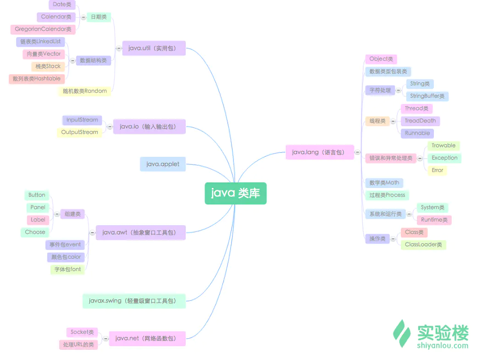
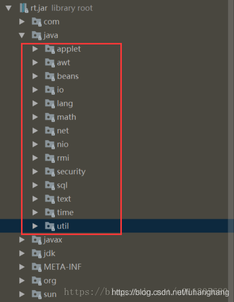

[JDK 基础入门](https://www.lanqiao.cn/courses/109)

java.lang 包并不需要像其他包一样需要import关键字进行引入。系统会自动加载，所以我们可以直接取用其中的所有类。

 java 为每个基本类型都提供了包装类：

原始数据类型	包装类
byte（字节）	Byte
char（字符）	Character
int（整型）	Integer
long （长整型）	Long
float（浮点型）	Float
double （双精度）	Double
boolean （布尔）	Boolean
short（短整型）	Short
在这八个类名中，除了Integer和Character类以后，其它六个类的类名和基本数据类型一致，只是类名的第一个字母大写。

# jar包合集

常用jar包

[常用jar包下载](https://download.csdn.net/download/qq_15007327/10047838?utm_medium=distribute.pc_relevant.none-task-download-BlogCommendFromMachineLearnPai2-4.control&dist_request_id=13a68b44-c260-4a70-930a-a9c1885412d5&depth_1-utm_source=distribute.pc_relevant.none-task-download-BlogCommendFromMachineLearnPai2-4.control)

如spring、oracle驱动、mysql驱动、mybatis、 hibernate、struts、c3p0、cglib、dbcp、dom4j、jstl等，可以在开发中，减少寻找jar包所需要的时间，用到哪个缺哪个，就拖他

commons-beanutils.jar
commons-collections-3.1.jar
commons-fileupload-1.0.jar
commons-fileupload-1.2.2.jar
commons-io-1.4.jar
ext-all.js
ext-base.js
javaee.jar
JFreeChart_Jar
jspupload.jar

Mysql的连接jar包，jstl完整标签以及发送邮件用的email jar包等等

JavaWeb项目的jar包常用：

antlr-2.7.7.jar 
aopalliance-1.0.jar 
asm-3.1.jar 
aspectjrt-1.6.0.jar 
aspectjtools-1.6.0.jar 
aspectjweaver-1.6.0.jar 
bcprov-jdk16-1.46.jar 
c3p0-0.9.1.2.jar 
cas-client-core-3.3.3.jar

Java开发常用jar包下载网站

1、MvnRepository，一个国外网站，有点慢

https://mvnrepository.com/

 

2、酷码派，国内网站，但是资源并不是很全

https://www.kumapai.com/open

[java常用jar包详解](https://blog.csdn.net/fuhanghang/article/details/84102404?utm_medium=distribute.pc_relevant.none-task-blog-baidujs_baidulandingword-3&spm=1001.2101.3001.4242)

1、dt.jar
SUN对于dt.jar的定义：Also includes dt.jar, the DesignTime archive of BeanInfo files that tell interactive development environments (IDE's) how to display the Java components and how to let the developer customize them for the application。中文翻译过来就是：dt.jar是BeanInfo文件的DesignTime归档，BeanInfo文件用来告诉集成开发环境（IDE）如何显示Java组件还有如何让开发人员根据应用程序自定义它们。这段文字中提到了几个关键字：DesignTime,BeanInfo,IDE，Java components。其实dt.jar就是DesignTime Archive的缩写。那么何为DesignTime。

    何为DesignTime?翻译过来就是设计时。其实了解JavaBean的人都知道design time和runtime（运行时）这两个术语的含义。设计时（DesignTIme）是指在开发环境中通过添加控件，设置控件或窗体属性等方法，建立应用程序的时间。与此相对应的运行时（RunTIme）是指可以象用户那样与应用程序交互作用的时间。那么现在再理解一下上面的翻译，其实dt.jar包含了swing控件中的BeanInfo，而IDE的GUI Designer需要这些信息。那让我们看一下dt.jar中到底有什么？下面是一张dt.jar下面的内容截图：

    从上面的截图可以看出，dt.jar中全部是Swing组件的BeanInfo。那么到底什么是BeanInfo呢？

    何为BeanInfo?JavaBean和BeanInfo有很大的关系。Sun所制定的JavaBean规范，很大程度上是为IDE准备的——它让IDE能够以可视化的方式设置JavaBean的属性。如果在IDE中开发一个可视化应用程序，我们需要通过属性设置的方式对组成应用的各种组件进行定制，IDE通过属性编辑器让开发人员使用可视化的方式设置组件的属性。一般的IDE都支持JavaBean规范所定义的属性编辑器，当组件开发商发布一个组件时，它往往将组件对应的属性编辑器捆绑发行，这样开发者就可以在IDE环境下方便地利用属性编辑器对组件进行定制工作。JavaBean规范通过java.beans.PropertyEditor定义了设置JavaBean属性的方法，通过BeanInfo描述了JavaBean哪些属性是可定制的，此外还描述了可定制属性与PropertyEditor的对应关系。BeanInfo与JavaBean之间的对应关系，通过两者之间规范的命名确立：对应JavaBean的BeanInfo采用如下的命名规范：<Bean>BeanInfo。当JavaBean连同其属性编辑器相同的组件注册到IDE中后，当在开发界面中对JavaBean进行定制时，IDE就会根据JavaBean规范找到对应的BeanInfo，再根据BeanInfo中的描述信息找到JavaBean属性描述（是否开放、使用哪个属性编辑器），进而为JavaBean生成特定开发编辑界面。

    dt.jar里面主要是swing组件的BeanInfo。IDE根据这些BeanInfo显示这些组件以及开发人员如何定制他们。2、rt.jar
rt.jar是runtime的归档。Java基础类库，也就是Java doc里面看到的所有的类的class文件。

rt.jar 默认就在Root Classloader的加载路径里面的，而在Claspath配置该变量是不需要的；同时jre/lib目录下的其他jar:jce.jar、jsse.jar、charsets.jar、resources.jar都在Root Classloader中。

3、tools.jar
    tools.jar 是系统用来编译一个类的时候用到的，即执行javac的时候用到

    javac XXX.java

    实际上就是运行

    java -Calsspath=%JAVA_HOME%\lib\tools.jar xx.xxx.Main XXX.java

    javac就是对上面命令的封装 所以tools.jar 也不用加到classpath里面。

4、其他jar包

jar包     用途 

axis.jar SOAP引擎包（Simple Object Access Protocol，简单对象访问协议） 

commons-discovery-0.2.jar 用来发现、查找和实现可插入式接口，提供一些一般类实例化、单件的生命周期管理的常用方法. 

jaxrpc.jar Axis运行所需要的组件包（Apache Extensible Interaction System 即阿帕奇可扩展交互系统，是一个soap引擎） 

saaj.jar 创建到端点的点到点连接的方法、创建并处理SOAP消息和附件的方法，以及接收和处理SOAP错误的方法.   

wsdl4j-1.5.1.jar Axis运行所需要的组件包 

activation.jar JAF框架的jar包 

annotations-api.jar 使用注解所需

jar ant.jar 用于自动化调用程序完成项目的编译，打包，测试等 

aopalliance-1.0.jar 支持Spring AOP 

asm-2.2.3.jar ASM字节码库 

asm-commons-2.2.3.jar ASM字节码库 

asm-util-2.2.3.jar Java字节码操纵和分析框架 

aspectjrt.jar 处理事务和AOP所需的包 

aspectjweaver.jar 处理事务和AOP所需的包 

axiom-api-1.2.7.jar Axis 对象模型 

axiom-impl-1.2.7.jar Axis 对象模型 

bcprov-jdk15-140.jar 基于java1.5 的加密算法实现 

bfmclientmodel.jar 使用WebSphere所需jar包 

bpcclientcore.jar 使用WebSphere所需jar包 

bpe137650.jar 提供远程访问BPE容器的实现。  

bsh-2.0b4.jar 解决负载逻辑运算 

c3p0-0.9.0.jar 开放源代码的JDBC连接池 （JDBC3 Connection and Statement Pooling）

cglib-nodep-2.1_3.jar Spring中自动代理所需jar包 

cobertura.jar 测量测试覆盖率 

commons-beanutils-1.7.0.jar 动态的获取/设值Java Bean的属性 

commons-chain-1.1.jar 实现责任链设计模式的Java 类库 

commons-codec-1.3.jar 用来处理常用的编码方法的工具类包，例如DES、SHA1、MD5、Base64等等 

commons-collections-3.1.jar 对标准java Collection的扩展 

commons-collections.jar 对标准java Collection的扩展 

commons-digester-1.8.jar 用于处理struts-config.xml配置文件 

commons-fileupload-1.1.1.jar struts上传文件 

commons-httpclient-3.1.jar 用来简化HTTP客户端与服务器端进行各种通信编程实现 

commons-io-1.1.jar 针对java.io.InputStream和Reader进行了扩展 

commons-lang-2.4.jar 对java.lang.*的扩展 

commons-logging-1.1.1.jar 日志包 

commons-pool-1.3.jar 实现对象池化框架 

commons-validator-1.3.1.jar 用来把验证规则程序提取出来，以供重复使用 

db2jcc.jar java连接DB2所需jar 

db2jcc_license_cu.jar java连接DB2所需jar 

dom4j-1.6.1.jar 解析XML 

ehcache-1.2.4.jar hibernate的二级缓存如果用ehcache的时候需要此jar包 

emf.jar 基于Eclipse的模型框架 

ezmorph-1.0.6.jar 使用JSON所需的jar包 

FastInfoset-1.2.2.jar 使用WebService所需的jar包 

freemarker-2.3.8.jar Strus2支持的一种表现层框架 

geronimo-activation_1.1_spec-1.0.2.jar Apache Geronimo所带jar包， 

geronimo-annotation_1.0_spec-1.1.1.jar Apache Geronimo所带jar包 

geronimo-javamail_1.4_spec-1.3.jar Apache Geronimo所带jar包 

geronimo-jaxws_2.1_spec-1.0.jar Apache Geronimo所带jar包 

geronimo-jms_1.1_spec-1.1.1.jar Apache Geronimo所带jar包 

geronimo-servlet_2.5_spec-1.2.jar Apache Geronimo所带jar包 

geronimo-stax-api_1.0_spec-1.0.1.jar Apache Geronimo所带jar包 

hibernate3.jar Hibernate3的核心jar包 

htmclientmodel.jar 使用WebSphere所需jar包 

jakarta-oro.jar 一套文本处理工具，提供per15.0兼容的表达式，AWK-like表达式，Glob表达式。 

javassist.jar Javassist 字节码解释器 

jaxb-api-2.1.jar 使用WebService所需的jar包 

jaxb-impl-2.1.7.jar 使用CXF所需jar包 

jaxb-xjc-2.1.7.jar 使用CXF所需jar包 

jaxen-1.1.1.jar 解析XML 

jcifs-1.2.22.jar 实现单点登陆 

jdom2-1.0.jar 解析XML 

jdom-1.0.jar 解析XML 

jettison-1.0.1.jar 使用CXF所需jar包 

jetty-6.1.9.jar Jetty Http服务器jar 

jetty-util-6.1.9.jar Jetty Http服务器jar 

jra-1.0-alpha-4.jar 使用CXF所需jar包 

js-1.6R7.jar 使用CXF所需jar包 

json-lib-2.2.3-jdk13.jar 使用JSON所需的jar包 

jsonplugin-0.25.jar strus2的JSON插件 

jsr311-api-0.8.jar 使用CXF所需jar包 

jstl.jar JSTL标签库 

jta.jar 标准的 JAVA 事务处理接口 

junit.jar 用于单元测试 

jxl.jar 通过java操作excel表格的工具类库 

ldap.jar JNDI目录服务和LDAO服务器所需的jar 

ldapbp.jar JNDI目录服务和LDAO服务器所需的jar 

log4j-1.2.15.jar 提供日志功能 

mail.jar java发送邮件jar包 

neethi-2.0.4.jar 使用CXF所需jar包 

odmg-3.0.jar ODMG是一个ORM的规范，Hibernate实现了ODMG规范，这是一个核心的库 

ognl-2.6.11.jar struts2中OGNL语言 

ojdbc14.jar Oracle数据库驱动包 

opensaml-1.1.jar 使用CXF所需jar包 

oro-2.0.8.jar Validator框架所需的jar包 

oscache-2.1.jar Java 对象的缓存工具 

poi-3.1-FINAL-20080629.jar 操作exce所需jar包 

poi-contrib-3.1-FINAL-20080629.jar 操作exce所需jar包 

poi-ooxml-3.6-20091214.jar 提供对office的word、excel、visio及ppt的操作 

poi-ooxml-schemas-3.6-20091214.jar 提供对office的word、excel、visio及ppt的操作 

poi-scratchpad-3.1-FINAL-20080629.jar 提供对office的word、excel、visio及ppt的操作 

processCommon.jar IBM WebSphere 运行所需jar 

ProcessCommonLibrary.jar IBM WebSphere 运行所需jar 

processIdentity.jar IBM WebSphere 运行所需jar 

ProcessInformation.jar 进程监视软件包 

proxool-0.9.1.jar 数据库连接池 

proxool-cglib.jar 数据库连接池 

quartz-1.6.0.jar 开源作业调度框架 

saaj-api-1.3.jar 使用axis所需的jar 

saaj-impl-1.3.2.jar 使用axis所需的jar 

serializer-2.7.1.jar XML序列化 

slf4j-jdk14-1.5.6.jar 整合各种日志框架的工具 

spring208.jar spring核心框架 

spring-ldap-1.2-RC1.jar spring下LDAP 

spring-mock.jar spring的测试框架 

standard.jar 使用JSTL标签库所需的jar 

stax-api-1.0.1.jar 解析XML 

struts2-core-2.0.14.jar struts2核心jar 

struts2-spring-plugin-2.0.6.jar struts2整合Spring所需jar 

taglibs-datetime.jar Apache开源组织提供标签库，用于格式化日期。 

taglibs-mailer.jar 用于发送邮件 

taglibs-string.jar Apache开源组织提供标签库，用于对String的操作。 

task137650.jar Portal技术在SOA系统集成应用中实现所需的jar 

utility.jar Apache开源组织提供标签库 

velocity-1.5.jar 一个免费的开源模板框架 

wsdl4j-1.6.2.jar 用来解析服务的WSDl文件 

wss4j-1.5.4.jar 创建CXF所需jar 

wstx-asl-3.2.6.jar 创建CXF所需jar 

xbean-spring-2.8.jar 使用xfire所需jar 

xerces-2.6.2.jar XML解析器 

xfire-all-1.2.6.jar 用于实现WebService 

XmlSchema-1.1.jar 使用xfire所需jar 

xwork-2.0.7.jar WebWork核心jar

JAR包与描述对照表	注：jar包尾后的版本号不代表当前最高版本

activation-1.1.jar	Sun的JavaBeans Activation Framework（JAF）,JavaMail要运行必须依赖于它的支持

asm-3.0.jar

asm-commons-2.2.3.jar

asm-util-2.2.3.jar	asm是一个轻量级字节码处理和分析框架

alveole-struts2.jar

alveole-tools.jar	 

aspectjtools-1.5.3.jar	Aspect提供的注释类库和相应的解析类库

atomikos-util.jar	数据库提供分布式事务支持

c3p0-0.8.5.2.jar	C3PO是一个数据库连接池

cglib-nodep-2.2.jar	CGLIB是一个强大的高质量高性能的代码生成库,在运行时可以用它来扩展Java类

commons-attributes-api.jar	Apache Commons包中的一个,包含了一些属性的api

commons-beanutils-1.6.jar	Apache Commons包中的一个，包含了一些Bean工具类类

commons-chain-1.1.jar	 

commons-codec-1.3.jar	 

commons-collections-3.2.jar	Apache Commons包中的一个,包含了一些Apache开发的集合类，功能比java.util.*强大

commons-configuration.jar	Apache Commons包中的一个,用于协助读取配置和首选项文件

commons-digester-1.8.jar	Apache Commons包中的一个,通过它可以很方便的解析xml文件生成java对象

commons-fileupload.jar	Apache Commons包中的一个,是一个通过Http接收上传的文件并处理结果文件的库

commons-lang-2.1.jar	Apache Commons包中的一个,包含了一些数据类型工具类，是java.lang.*的扩展

commons-httpclient-3.0.jar	Apache Commons包中的一个,提供一个框架啊处理http客户端的扩展

commons-io.jar    	Apache Commons包中的一个,java.io.*的扩展,输入输出,支持文件上传

commons-logging-1.1.1.jar	Apache Commons包中的一个,包含日志功能

commons-logging-api-1.1.jar	Apache Commons包中的一个,Commons Logging应用接口,一种超薄适配器允许其他可配置桥连接

commons-validator-1.3.0.jar	Apache Commons包中的一个,struts使用它进行表单验证

dom4j-1.6.1.jar    	dom4j XML 解析器

ezmorph-1.0.4.jar	json和java转化的辅助工具

freemarker-2.3.8.jar	freemarker表现层模板工具

hessian-3.1.3.jar	一个轻量级的remoting onhttp工具，使用简单的方法提供了RMI的功能

htmlparser.jar	强大的html解析器

httpsqs4j.jar	一款基于 HTTP GET/POST 协议的轻量级开源简单消息队列服务

ibatis-2.3.3.720.jar	iBATIS提供的持久层框架包括SQL Maps和Data Access Objects（DAO）

jamon-2.7.jar	一个小巧的，免费的，高性能的，线程安全的性能监测工具

java_memcached-release.jar	memcached连接的java客户端

jfreechart-1.0.1.jar	使用java生成图表的工具

jcommon-1.0.8.jar	使用java生成图表的工具

json-lib-2.2-jdk15.jar	json和java转化的辅助工具

jta.jar	Java事务API,为J2EE平台提供了分布式事务服务

junit-3.8.1.jar	是一个开放源代码的Java测试框架，用于编写和运行可重复的测试。他是用于单元测试框架体系xUnit的一个实例

jxl.jar	通过java操作excel表格的工具类库

log4j-1.2.9.jar	通过使用Log4j，我们可以控制日志信息输送的目的地是控制台、文件、GUI组件、甚至是套接口服务器

lucene-core-2.3.2.jar	是一个全文检索引擎的架构，提供了完整的查询引擎和索引引擎

mongo-2.2.jar	java连接mongodb客户端接口

morphia.jar	是一个轻量级的类型安全的Java类库，用来将在MongoDB和Java对象之间进行映射

mysql-connector-java.jar	mysql连接驱动

ognl-2.6.11.jar	OGNL表达式,支持EL

oscache-2.3.2.jar	Java对象的缓存工具,比ehcache的优势在于页面缓存

poi-3.0.1.jar	apache工具,用于操作pdf和excel的工具类

quartz-1.6.0.jar	自动任务处理功能类包

proxool-0.9.1.jar	Proxool JDBC 连接池 工具

servlet.jar	 

spring-2.0.2.jar	 

spring-2.0.2.jar	 

velocity-1.6.3-dep.jar

velocity-tools-1.4.jar    	velocity基于java的模板引擎,允许用简单的模板语言来引用java定义的对象

xwork-core-2.1.6.jar	web work的核心库

