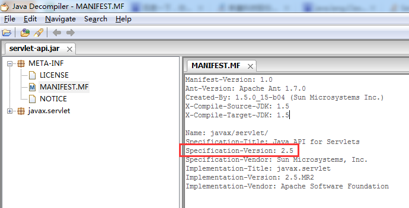

# java.lang.NullPointerException
1\. 错误描述

打开jsp网页时报错

`java.lang.NullPointerException`

`org.apache.jsp.WEB_002dINF.pages.imagecheck.test_jsp._jspInit(test_jsp.java:22)`

或 java.lang.ClassNotFoundException: org.apache.jsp.index_jsp

2\. 原因

　　由于tomcat 和 项目 中都有 servlet-api.jar 和 jsp-api.jar，换了tomcat之后，tomcat中的jar版本及编译的jdk版本不同，导致冲突

讲原理
cnblogs.com/guodao/p/9702440.html

解决办法：

1.检查你的项目中是否存在jsp-api.jar,jstl-api.jar,servlet-api.jar。

2.web.xml文件配置错误。

3.版本冲突。

这是为啥呢，可能是由于servlet-api版本jar包重复导致的，他项目本身使用了servlet-api（pom.xml中引用），

通过eclipse部署tomcat，tomcat中也包含了servlet-api.jar，而且这两个jar包版本不一致。换成版本一致的重新部署之即可，

session中有Profiles吗？如果没用肯定会出著名的java.lang.NullPointerException  
(index_jsp.java:90)在tomcat下的work目录里有这个jsp的Servlet文件和class文件！  
所有JSP报错都是报的Servlet里面的行数，所以，你要去看看这个Servlet的第90行是什么！

