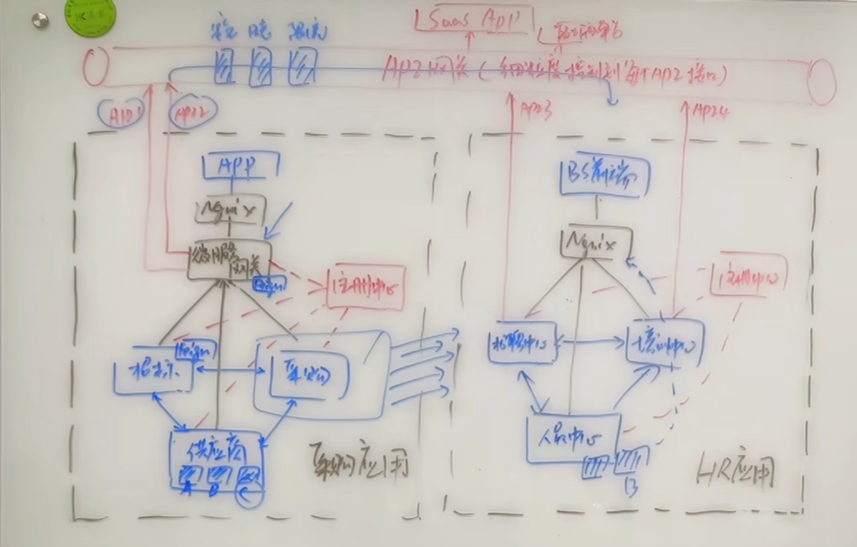
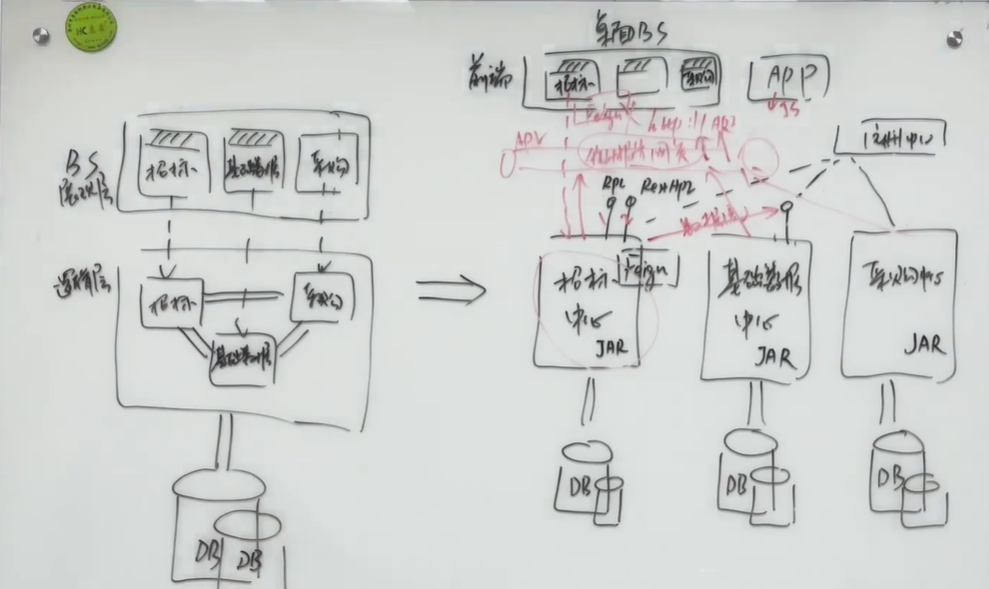

 Java Spring全家桶调包侠大神？ Tauri+Rust+wasm+NextJS+KOA大前端吞并后端？扯犊子，生态位已经垄断了。
 
 # 微服务
 https://doocs.gitee.io/advanced-java/#/docs/micro-services/micro-services-technology-stack 微服务技术栈
 
 轻量化，去中心化微服务治理

实现放在边车端做，流量拦截，插件实现

1.服务注册发现:不必额外做定制和拓展，可基于k8s本身etcd上做
2.服务网关:可基于k8s ingress网关做拓展
3.考虑如何融合复用k8s本身已有的能力，大量能力实现由envoy边车代理
4.全局配置可放入etcd库中


【一张图讲解微服务-注册中心，微服务网关和API网关区别】 https://www.bilibili.com/video/BV1MP411p7fA/ 
【微服务编排-从业务场景到开源工具选择】 https://www.bilibili.com/video/BV1zP4y1g7qf/  Netflix的conductor拖拽实现编排。物联网中使用node red，或者 n8n.io，或者自己实现








什么是ROMA Connect
https://support.huaweicloud.com/productdesc-roma/what-is-ROMA.html
ROMA Connect是一个全栈式的应用与数据集成平台，源自华为数字化转型集成实践，聚焦应用和数据连接，适配多种企业常见的使用场景。ROMA Connect提供轻量化消息、数据、API、设备等集成能力，简化企业上云流程，支持云上云下、跨区域集成，帮助企业实现数字化转型。


ROMA Connect主要包含四个组件：数据集成（FDI）、服务集成（APIC）、消息集成（MQS）、设备集成（LINK）。


-----------------

**k8s**

K8S  ingress

https://istio.io/latest/zh/docs/ 


etcd 用于存储桶DNS服务记录


**minio.exe** 
官网：https://min.io/
中文官网：http://www.minio.org.cn/
GitHub：https://github.com/minio/

MinIO 与 FastDFS对比

目前可用于文件存储的网络服务选择有很多，比如阿里云OSS、七牛云、腾讯云等等，但是收费。可用fastDFS/MinIO作为文件服务器。

http://www.minio.org.cn/docs/minio/kubernetes/openshift/index.html   官方文档


https://www.bookstack.cn/read/MinioCookbookZH/1.md 中文文档
Minio 是一个基于Apache License v2.0开源协议的对象存储服务。它兼容亚马逊S3云存储服务接口，非常适合于存储大容量非结构化的数据，例如图片、视频、日志文件、备份数据和容器/虚拟机镜像等，而一个对象文件可以是任意大小，从几kb到最大5T不等。
Minio是一个非常轻量的服务,可以很简单的和其他应用的结合，类似 NodeJS, Redis  或者 MySQL，springBoot https://juejin.cn/post/7156818319008333838。
Minio 是个基于 Golang 编写的开源对象存储套件，虽然轻量，却拥有着不错的性能。


single单机

```
docker run -d -p 9000:9000 --name minio --restart=always -e "MINIO_ACCESS_KEY={accessKey}" -e "MINIO_SECRET_KEY={secretKey}" -v /mnt/data:/data minio/minio server /data

```

cluster集群
```
docker run -d --net=host --name minio --restart=always -e "MINIO_ACCESS_KEY=minio" -e "MINIO_SECRET_KEY=minio@123" -v /opt/minio/data1:/data1 -v /opt/minio/data2:/data2 minio/minio server --compat  http://10.10.63.16:9000/data1 http://10.10.63.16:9000/data2 http://10.10.63.17:9000/data1 http://10.10.63.17:9000/data2

```
**数据库**
mongodb-windows-x86_64-6.0.4-signed.msi
mysql-installer-community-5.7.10.0.msi      
HeidiSQL_12.3.0.6589_Setup.exe    


一旦涉及大数据量的需求，比如一些商品抢购的情景，或者是主页访问量瞬间较大的时候，单一使用数据库来保存数据的系统会因为面向磁盘，磁盘读/写速度比较慢的问题而存在严重的性能弊端,极其容易造成数据库系统瘫痪，最终导致服务宕机的严重生产问题。

为了克服上述的问题，Java Web项目通常会引入NoSQL技术。NoSQL单纯是指它不基于关系模型，至于实现，则各有办法。一个跑在内存的关系数据库，也是关系数据库管理系统（RDMS）而不是NoSQL

Redis和MongoDB是当前使用最广泛的NoSQL

Redis提供的数据类型主要分为5种自有类型和一种自定义类型，这5种自有类型包括：String类型、哈希类型、列表类型、集合类型和顺序集合类型。

**Redis内存**
single
```
docker run -d --restart=always -p 6379:6379 --name redis redis:5.0 --requirepass "Redis@2020"
```
超强、超详细Redis入门教程  
https://zhuanlan.zhihu.com/p/411888708

当第一次读取数据的时候，读取 Redis 的数据就会失败，此时就会触发程序读取数据库，把数据读取出来，并且写入 Redis 中；

当第二次以及以后需要读取数据时，就会直接读取 Redis，读到数据后就结束了流程，这样速度就大大提高了。

[Redis-x64-5.0.14]
Redis-x64-5.0.14.1.msi

Redis 的应用场景包括：缓存系统（“热点”数据：高频读、低频写）、计数器、消息队列系统、排行榜、社交网络和实时系统。


Redis的深度用户都知道，缓存只是他最简单和基础的功能罢了，**哨兵，集群，分布式锁，延时队列，位图，HyperLogLog，布隆过滤器，限流，GeoHash（附近的人）等**，眼花缭乱的类型和使用姿势多得不行。


Memcache：这是一个和Redis非常相似的数据库，但是它的数据类型没有Redis丰富。Memcache由LiveJournal的Brad Fitzpatrick开发，作为一套分布式的高速缓存系统，被许多网站使用以提升网站的访问速度，对于一些大型的、需要频繁访问数据库的网站访问速度的提升效果十分显著。

Apache Cassandra：（社区内一般简称为C*）这是一套开源分布式NoSQL数据库系统。它最初由Facebook开发，用于储存收件箱等简单格式数据，集Google BigTable的数据模型与Amazon Dynamo的完全分布式架构于一身。Facebook于2008将 Cassandra 开源，由于其良好的可扩展性和性能，被 Apple、Comcast、Instagram、Spotify、eBay、Rackspace、Netflix等知名网站所采用，成为了一种流行的分布式结构化数据存储方案。

MongoDB：是一个基于分布式文件存储、面向文档的NoSQL数据库，由C++编写，旨在为WEB应用提供可扩展的高性能数据存储解决方案。MongoDB是一个介于关系数据库和非关系数据库之间的产品，是非关系数据库当中功能最丰富，最像关系型数据库的，它支持的数据结构非常松散，是一种类似json的BSON格式。

   
在 Java 中使用 Redis
添加 Jedis 依赖
使用 Redis 连接池
在 Spring 中使用 Redis
在 SpringBoot 中使用 Redis


**ES索引**
终于有人把Elasticsearch原理讲透了！ - msup的文章 - 知乎
https://zhuanlan.zhihu.com/p/62892586

[elasticsearch-7.17.3]          https://www.cnblogs.com/coderxz/p/13268417.html 
```
docker run -d --restart=always -p 9200:9200 -e "discovery.type=single-node" -v /etc/localtime:/etc/localtime:ro -v /opt/elasticsearch/data:/usr/share/elasticsearch/data --name es docker.elastic.co/elasticsearch/elasticsearch:7.8.1
```
https://www.elastic.co/elasticsearch/
Elasticsearch 是一个分布式、可扩展、实时的搜索与数据分析引擎，通过它我们可以构建出一个强大的全文搜索系统，解决诸如文章检索慢，商品检索慢、MySQL的like查询慢这样的问题。
Elasticsearch是基于hadoop创始人道哥的另一杰作Lucene实现的，速度非常快，核心是使用了[倒排索引](https://www.cnblogs.com/chenqionghe/p/12464671.html)这样的结构。


很多公司都用 Elasticsearch 搭建 **ELK 系统**，也就是日志分析系统。其中 E 就是 Elasticsearch，L 是 Logstash，是一个日志收集系统，K 是 Kibana，是一个数据可视化平台。


                 
[kibana-7.17.3-windows-x86_64] Kibana 是为 Elasticsearch设计的开源分析和可视化平台。你可以使用 Kibana 来搜索，查看存储在 Elasticsearch 索引中的数据并与之交互。

Kibana的安装、自定义索引，搜索，控制台调用es的api和可视化等操作

控制台可以非常方便的来调用es的api，强烈推荐使用


**日志**
logdash.conf                                         
[logstash-7.17.3]


                                 

**服务注册发现**
一般会选择Zookeeper、Eureka做注册中心，其实Nacos也是可以做注册中心的。

nacos  

https://nacos.io/zh-cn/docs/cluster-mode-quick-start.html
【一个小时搞懂nacos服务注册与发现底层原理【和朋友一起看源码系列】】 https://www.bilibili.com/video/BV1iY4y1i7XT/ 55张图吃透Nacos 
https://zhuanlan.zhihu.com/p/440902106
ali开源 动态服务发现、配置和服务管理平台 Nacos

```
1、需要设置容器的固定ip，要不然每次重启ip变化后，需要去删除protocol文件夹
 
docker run --env MODE=standalone --env SPRING_DATASOURCE_PLATFORM=mysql --env MYSQL_SERVICE_HOST=10.10.63.18 --env MYSQL_SERVICE_PORT=3306 --env MYSQL_SERVICE_DB_NAME=nacos --env MYSQL_SERVICE_USER=root --env MYSQL_SERVICE_PASSWORD=TMS@2020h --name nacos -d -p 8848:8848 nacos/nacos-server:1.4.0
```
服务（Service）是 Nacos 世界的一等公民。Nacos 支持几乎所有主流类型的“服务”的发现、配置和管理：
Kubernetes Service
gRPC \& Dubbo RPC Service
Spring Cloud RESTful Service

web生态中使用 Nacos，请参考文档：

Nacos与Spring Cloud一起使用

Nacos与Kubernetes一起使用

Nacos与Dubbo一起使用

Nacos与gRPC一起使用

Nacos与Istio一起使用 


【微服务注册与发现-Eureka  深入浅出】 https://www.bilibili.com/video/BV18v411C7To/ 


zookeeper 

etcd

消费端的调用还是首推**Feign+hystrix**熔断的


Feign是一款Java语言编写的HttpClient绑定器，在Spring Cloud微服务中用于实现微服务之间的声明式调用。Feign 可以定义请求到其他服务的接口，用于微服务间的调用，不用自己再写http请求，在客户端实现，调用此接口就像远程调用其他服务一样，当请求出错时可以调用接口的实现类来返回

Feign是一个声明式的web service客户端，它使得编写web service客户端更为容易。创建接口，为接口添加注解，即可使用Feign。


Spring Cloud为**Feign**添加了Spring MVC的注解支持，并整合了**Ribbon**和**Eureka**来为使用Feign时提供负载均衡。


**MQ**                                   
MQ 是message queue ,消息队列，也叫消息中间件，遵守JMS（java message service）规范的一种软件。(同时还有另一个叫AMQP的应用层协议，语言无关性不受产品 语言等限制，rabbitMQ支持这个 )


消息中间件的组成
- Broker

消息服务器，作为server提供消息核心服务

- Producer

消息生产者，业务的发起方，负责生产消息传输给broker，

- Consumer

消息消费者，业务的处理方，负责从broker获取消息并进行业务逻辑处理

- Topic

主题，发布订阅模式下的消息统一汇集地，不同生产者向topic发送消息，由MQ服务器分发到不同的订阅者，实现消息的       广播

- Queue

队列，PTP模式下，特定生产者向特定queue发送消息，消费者订阅特定的queue完成指定消息的接收
- Message

消息体，根据不同通信协议定义的固定格式进行编码的数据包，来封装业务数据，实现消息的传输


----------


消息队列 MQ/ JMS/ Kafka 有什么区别？


消息队列是分布式系统中重要的组件，使用消息队列主要是为了通过异步处理提高系统性能和削峰、降低系统耦合性。


rabbitmq-server-3.10.5.exe   https://www.rabbitmq.com/                         
otp_win64_25.0.1.exe
RabbitMQ是一款使用Erlang语言开发的，实现AMQP(高级消息队列协议)的开源消息中间件。


JMS即Java消息服务（Java Message Service）应用程序接口，是一个Java平台中关于面向消息中间件（MOM）的API，类似于JDBC。用于在两个应用程序之间，或分布式系统中发送消息，进行异步通信。它提供创建、发送、接收、读取消息的服务。由Sun公司和它的合作伙伴设计的应用程序接口和相应语法，使得Java程序能够和其他消息组件进行通信。
JMS是一个消息服务的标准或者说是规范，允许应用程序组件基于JavaEE平台创建、发送、接收和读取消息。它使分布式通信耦合度更低，消息服务更加可靠以及异步性。


在Java中，目前基于JMS实现的消息队列常见技术有ActiveMQ、RabbitMQ、RocketMQ。值得注意的是，RocketMQ并没有完全遵守JMS规范，并且Kafka不是JMS的实现。


kaffka 日志消息中间件 支持大数据场景
Kafka=Apache下的一个子项目，使用scala实现的一个高性能分布式Publish/Subscribe消息队列系统。Kafka是最初由Linkedin公司开发，是一个分布式、分区的、多副本的、多生产者、多订阅者，基于zookeeper协调的分布式日志系统（也可以当做MQ系统），常见可以用于web/nginx日志、访问日志，消息服务等等，Linkedin于2010年贡献给了Apache基金会并成为顶级开源项目。


```
docker run -d -p 2181:2181 --restart=always -v /etc/localtime:/etc/localtime --name zookeeper zookeeper:3.6.2
 
docker run -d -p 9092:9092 --restart=always -v /etc/localtime:/etc/localtime --env KAFKA_ZOOKEEPER_CONNECT=10.10.63.15:2181 --env KAFKA_LISTENERS=PLAINTEXT://0.0.0.0:9092 --env KAFKA_ADVERTISED_LISTENERS=PLAINTEXT://10.10.63.15:9092 --env KAFKA_ADVERTISED_PORT=9092 --name kafka wurstmeister/kafka:2.12-2.5.0
```


##  消息中间件常用协议


mqtt：一种通信协议，类似人类交谈中的汉语、英语、俄语中的一种语言规范

MQ：一种通信通道，也叫消息队列，类似人类交谈中的用电话、email、微信的一种通信方式


有两种主要的消息传递模式：

- 点对点传递模式、
- 发布-订阅模式。


大部分的消息系统选用发布-订阅模式。Kafka就是一种发布-订阅模式


EMQ 使用的协议是mqtt。
MQTT（Message Queuing Telemetry Transport，消息队列遥测传输）是IBM开发的一个即时通讯协议，有可能成为物联网的重要组成部分。该协议支持所有平台，几乎可以把所有联网物品和外部连接起来，被用来当做传感器和致动器（比如通过Twitter让房屋联网）的通信协议。 
优点：格式简洁、占用带宽小、移动端通信、PUSH、嵌入式系统


市面上的MQ产品很多，如阿里自研并开源RocketMQ，还有类似RabbitMQ、ActiveMQ，他们不管支持MQTT协议，还支持如AMQP、stomp协议等等


AMQP协议（Advanced Message Queuing Protocol，高级消息队列协议）是一个进程间传递异步消息的网络协议。

STOMP（Streaming Text Orientated Message Protocol）是流文本定向消息协议，是一种为MOM(Message Oriented Middleware，面向消息的中间件)设计的简单文本协议。STOMP提供一个可互操作的连接格式，允许客户端与任意STOMP消息代理（Broker）进行交互。 
优点：命令模式（非topic\queue模式）


XMPP（可扩展消息处理现场协议，Extensible Messaging and Presence Protocol）是基于可扩展标记语言（XML）的协议，多用于即时消息（IM）以及在线现场探测。适用于服务器之间的准即时操作。核心是基于XML流传输，这个协议可能最终允许因特网用户向因特网上的其他任何人发送即时消息，即使其操作系统和浏览器不同。 
优点：通用公开、兼容性强、可扩展、安全性高，但XML编码格式占用带宽大


其他基于TCP/IP自定义的协议

有些特殊框架（如：redis、kafka、zeroMq等）根据自身需要未严格遵循MQ规范，而是基于TCP\IP自行封装了一套协议，通过网络socket接口进行传输，实现了MQ的功能。

https://juejin.cn/post/6926423950889058311 kafka协议


**kafka原理图**


**监控**

https://www.prometheus.wang/ 
监控平台选Prometheus还是Zabbix ？
https://zhuanlan.zhihu.com/p/269037457


-------------------


## 一些阿里开源网络编程相关工具栈


https://github.com/orgs/alibaba/repositories

**DB**
 分布式数据层 TDDL
轻量级分布式数据访问层 CobarClient

关系型数据的分布式处理系统 Cobar
JDBC连接池、监控组件 Druid
分布式SQL引擎 Lealone
阿里巴巴分布式数据库同步系统 otter
淘宝分布式数据库 OceanBase
面向云的分布式消息领域标准 OpenMessaging
分布式文件系统 FastDFS

**后端**

淘宝定制 JVM：TaobaoJVM

JStorm 是参考 Apache Storm 实现的实时流式计算框架，在网络IO、线程模型、资源调度、可用性及稳定性上做了持续改进，已被越来越多企业使用。JStorm 可以看作是 storm 的 java 增强版本，除了内核用纯java实现外，还包括了thrift、python、facet ui。从架构上看，其本质是一个基于 zk 的分布式调度系统。


Apache Dubbo (incubating) |是阿里巴巴的一款高性能、轻量级的开源Java RPC框架

高性能 Java RPC 框架 SOFARPC

基于 Netty 的网络通信框架 SOFABolt


动态非侵入 AOP 解决方案 JVM-Sandbox


**中间件**
分布式应用服务开发的一站式解决方案 Spring Cloud Alibaba

JDBC 连接池、监控组件 Druid
基于多维度 Metrics 的系统度量和监控中间件 SOFALookout

消息中间件 Apache RocketMQ


分布式消息中间件 Metamorphosis


**前端**


通用 React 兼容渲染引擎 Rax

HTML5 互动游戏引擎 Hilo

前端构建和工程化工具 Dawn


设计语言 & 前端框架 Ant Design

Java 的 JSON 处理器 fastjson

数据驱动的高交互可视化图形语法 AntV - G2

------------------------

- 高级**前端**：高级Cocos Creator开发 25k-45k
深圳 / 经验10年以上 / 本科及以上 /前端工程师
1. 计算机或相关专业本科及以上学历；
2. Cocos Creator 的三年以上相关项目开发经验；
3. 扎实的 JavaScript ES6/TypeScript 语言基础；
4. 熟练掌握界面开发，动画、网络（TCP/IP、HTTP）、多线程、数据库等客户端开发技术；
5. 丰富的性能优化经验，熟悉客户端内存优化、包大小优化、drawcall优化等；
加分项:1. 对 Cocos Creator 的 engine 和 cocos2d-x-lite 源码有一定的了解；2. 较强的代码阅读能力，和代码架构能力，能设计出高效、合理、易读、易于扩展的程序结构

- 高级**后端**开发工程师 35k-60k （一般数据平台，AI平台之类的高级后端+10K以上）
深圳 / 经验5年- / 本科及以上 /JAVA工程师
精通Java，5年以上java开发经验，编码能力强，基本功扎实
熟悉常用设计模式，对DDD、OO、IOC、AOP等有深刻认识；
掌握微服务架构设计思想，熟悉Spring Boot/SpringMVC微服务与docker/k8s容器技术应用，有Istio等ServiceMesh应用经验更佳
精通主流数据库Mysql/Sql Server，具备优秀的数据建模能力和数据库问题定位/性能调优经验；熟悉MongoDB、Elastic Search等技术；
掌握vue前端框架技术优先；有大型企业IT系统/2B领域SaaS应用开发经验优先；有linux跨平台开发经验优先。


# 后端技术栈目录

https://www.zhihu.com/question/409197374/answer/2616799063


一个**中级后端**的基本要求：

web前端基础（HTML,CSS,JS,React,Vue及前端构建工具链； 能看懂了解并能简单使用即可，一般不要求熟练）

1. 后端通识（前端别说什么都是学计算机的，问问自己啥时候面试笔试要求了？）：

linux ：bash/zsh脚本 操作系统，进程管理，线程及协程 ，内存管理，进程间通信，IO管理， POSIX基础，
Http协议，TCP/IP协议，RPC协议
应用级接口调用，系统级接口调用
Docker
后端核心：

Java/Go/C&C++/Rust/C#/python/php/Node.js 精通其中一门后端语言（前端们有意见 去掉语言学习内容）
2. 关系数据库（核心中的核心）： Mysql,MariaDB,PostgreSQL,Oracle ...非关系型数据库：mongoDB , Redis

ORM框架
原子性、一致性、隔离性和持久性
事务
N+1 查询
数据库规范
数据库索引
数据复制
CAP Theorem
3. web开发 （基本类同Nodejs 后端开发）

web服务器：nginx
熟练使用至少一个 Spring MVC/Sprint Boot/Django/Laravel/Express 等 基础开发框架
orm 框架： MyBatis/SQLalchemy
消息中间件：RabbitMQ、Kafka等
CICD： Docker Jenkins git gitlab Terraform GitHub Actions等等...
服务端缓存：Memcached/Redis
基础监控：Prometheus/Grafana
应用监控： Jaeger/NewRelic
日志管理：Elastic Stack
容器管理：k8s
4. API相关：

RESTful 风格接口开发
GraphQL 接口开发
JSON APIs 接口开发
gRPC 接口开发
Thrift 接口开发
认证授权： OAuth2.0 Basic authentication Token authentication JWT
5. 日常相关：

缓存：分布式缓存，CDN缓存，浏览器缓存，SSR渲染技术，静态缓存，CPU内存硬盘等服务器缓存，中间件缓存，客户端缓存...
基础安全：https, OWASP Security Risks CORS SSL/TLS 劫持保护 跨站请求伪造 CSRF 保护 登录加密 安全中间件
搜索：ES，solr
服务器相关： 反向代理，缓存服务器，转发服务器，负载均衡，防火墙。
测试：单元测试，集成测试，功能测试，基础压测
系统设计及开发： SOLID,KISS,YAGNI,DRY
架构模式：单体应用，微服务，SOA, CQRS，无服务...
状态管理：Apollo中间件等等
其他常用数据库：MongoDB, Cassandra,InfluxDB,Firebase,RethinkDB


**高级后端**通识：

https协议，http2,http3
I/O多路复用技术
进程安全， 死锁处理常识
rpc协议设计和框架搭建常识
网络抓包及分析能力
分布式trace、监控告警建设常识
常见业务场景建模常识
自动化测试常识
技术选型能力：

主流语言（包括但不限于： Java,Go,Rust,C#,Python ）的优缺点

主流框架（Spring，Flask, Express，Dubbo， Laravel ...）的优缺点

数据库选型：（ Mysql,MariaDB,PostgreSQL，MongoDB,Redis..）基于框架进行选型

各种中间件的选型：服务中间件、集成中间件、数据中间件、消息中间件（JBoss,RabbitMQ等等...）

常见算法能力：dijkstra算法、最小生成树、深度优先搜索、贪心算法、动态规划等

算法执行效率和资源消耗分析、时间和空间复杂度分析

云原生能力（Kubernetes 基础）：

服务注册、服务发现, 服务拆分
全链路跟踪
服务网格Istio和Serverless
云网络故障分析
容灾保护、降级熔断、
流量控制、故障隔离、故障恢复
分布式能力：

容器设计：服务降级，限流，异步通信，补偿事务...
注册中心，负载均衡，配置中心，
分布式消息组件
API网关，分布式事务...
一致性算法 分布式锁
弹性扩缩容
缓存设计
分布式文件系统：Ceph,HDFS等
WEB开发能力：

熟练使用主流微服务rpc协议：gRPC, thrift
精通常用的开源框架进行二开如Spring, Dubbo
精通MySQL(或PostgreSQL)处理机制与应用场景限制，分库分表分片等等...
精通Redis、MongoDB、HBase等NoSQL，精通缓存数据持久化、主从同步
精通各类中间件的使用及二开，如RabbitMQ、Kafka等
基础大数据处理能力：

数据采集：beats,flume还有各种各样日志采集工具
批处理：Spark，HIVE
实时处理：一般用Flink
实时搜索： ES啥的
日常异常优化能力：

长链接短链接异常处理
慢查询优化
内存泄露分析与优化
time_wait、close_wait处理
磁盘 I/O 性能优化
进程间通信优化，
异步性能优化
缓存雪崩、缓存击穿等异常处理
rpc的服务寻址、数据流的序列化与反序列化和网路传输


---------------


