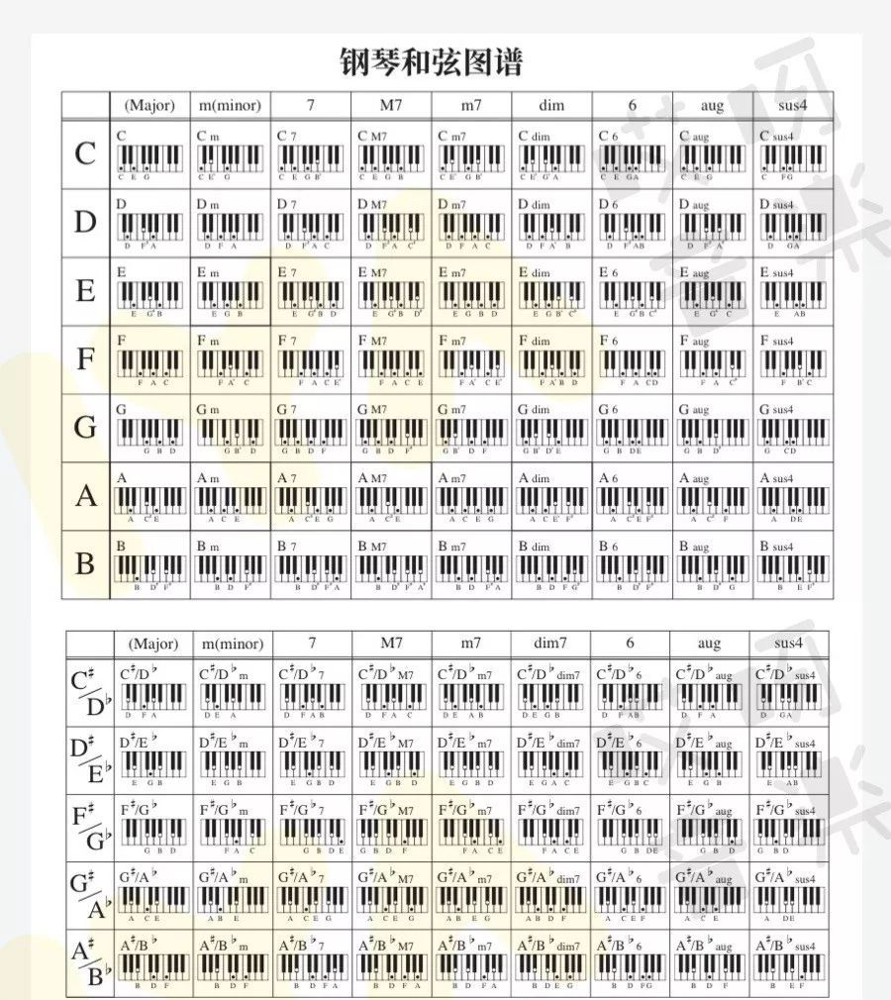

# 1. 流行曲和弦

一次帮你搞定所有钢琴中流行歌曲常用和弦！
10
https://www.hqgq.com/pu/album_show/1554

我们总结了流行歌曲中最为常用的几类和弦，学会这些，完全可以应对日常伴奏或乐队排练啦！

大三和弦（major）
小三和弦（m）
大七和弦（M7）
小七和弦（m7）
属七和弦（7）
大六和弦（6）
挂四和弦（sus4）
增三和弦（aug）
减三和弦（dim）

这么多和弦！ 你都会弹吗？别急，送一张图给你！

有这么一张图是不是演奏和弦什么的就很简单了？

在开头谱子中，我要弹C调的话，第一个和弦是6m，6是什么？C往上数六个，A！我演奏Am和弦就好了！再也不用四处翻书找和弦了，想不起和弦怎么弹，对着这个图找一下就ok啦！

