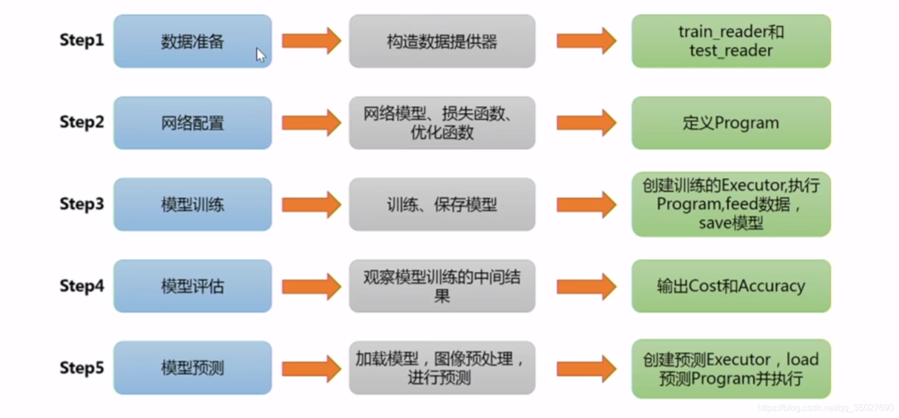

# Paddle飞浆

如何评价百度开源的深度学习框架 Paddle? - 贾扬清的回答 - 知乎
https://www.zhihu.com/question/50185775/answer/119784535

文档
paddlepaddle.org.cn/documentation/docs/zh/1.7/install/install_Windows.html

github主题仓库集
github.com/PaddlePaddle

模型
github.com/PaddlePaddle/models

-   [智能视觉(PaddleCV)](https://github.com/PaddlePaddle/models#PaddleCV)
    -   [图像分类](https://github.com/PaddlePaddle/models#%E5%9B%BE%E5%83%8F%E5%88%86%E7%B1%BB)
    -   [目标检测](https://github.com/PaddlePaddle/models#%E7%9B%AE%E6%A0%87%E6%A3%80%E6%B5%8B)
    -   [图像分割](https://github.com/PaddlePaddle/models#%E5%9B%BE%E5%83%8F%E5%88%86%E5%89%B2)
    -   [关键点检测](https://github.com/PaddlePaddle/models#%E5%85%B3%E9%94%AE%E7%82%B9%E6%A3%80%E6%B5%8B)
    -   [图像生成](https://github.com/PaddlePaddle/models#%E5%9B%BE%E5%83%8F%E7%94%9F%E6%88%90)
    -   [场景文字识别](https://github.com/PaddlePaddle/models#%E5%9C%BA%E6%99%AF%E6%96%87%E5%AD%97%E8%AF%86%E5%88%AB)
    -   [度量学习](https://github.com/PaddlePaddle/models#%E5%BA%A6%E9%87%8F%E5%AD%A6%E4%B9%A0)
    -   [视频](https://github.com/PaddlePaddle/models#%E8%A7%86%E9%A2%91)
-   [智能文本处理(PaddleNLP)](https://github.com/PaddlePaddle/models#PaddleNLP)
    -   [NLP 基础技术](https://github.com/PaddlePaddle/models#NLP-%E5%9F%BA%E7%A1%80%E6%8A%80%E6%9C%AF)
    -   [NLP 核心技术](https://github.com/PaddlePaddle/models#NLP-%E6%A0%B8%E5%BF%83%E6%8A%80%E6%9C%AF)
    -   [NLP 系统应用](https://github.com/PaddlePaddle/models#NLP-%E7%B3%BB%E7%BB%9F%E5%BA%94%E7%94%A8)
-   [智能推荐(PaddleRec)](https://github.com/PaddlePaddle/models#PaddleRec)
-   [智能语音(PaddleSpeech)](https://github.com/PaddlePaddle/models#PaddleSpeech)
-   [快速下载模型库](https://github.com/PaddlePaddle/models#%E5%BF%AB%E9%80%9F%E4%B8%8B%E8%BD%BD%E6%A8%A1%E5%9E%8B%E5%BA%93)

快速上手：

paddlepaddle.org.cn/documentation/docs/zh/beginners_guide/index_cn.html

blog.csdn.net/qq_35027690/article/details/103902252

基本流程如上图所示，分为五个步骤，我这里再说明一下：

1.  数据准备：一般包含认知数据，从文件中加载数据，打乱数据归一化等数据预处理，构造数据提供器reader四个小步骤；
2.  网络配置：一般包含网络搭建，定义数据层，定义损失函数，定义优化函数几个步骤；**（个人理解，这里定义数据层的用法，跟c语言中变量在使用之前先命名定义它和告诉其类型为int，类似。）**
3.  网络训练&评估：一般包含定义运算场所来创建Executor，定义数据映射器，定义绘制loss相关的函数，训练并保存模型；（**个人理解，这里定义数据映射器，是将第二步中定义的变量通过DataFeeder映射成为Executor能接受的数据结构，可以作为输入，注意到这里还只是定义。真正的数据传输是在训练的时候发生的，是将train_reader()读入的data，通过该数据映射器转成Executor接受的数据，喂入网络）**
4.  网络预测：一般包含数据预处理（特别是图像），创建预测用的Executor，开始预测。

