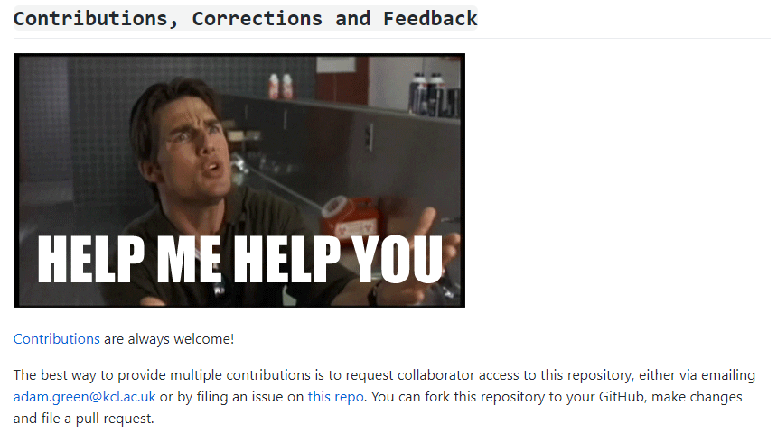

https://github.com/jan-dolejsi/pddl-reference  

https://planning.wiki/extras

https://en.wikipedia.org/wiki/Planning_Domain_Definition_Language#De_facto_official_versions_of_PDDL

 start-process-stop model.

VS code PDDL插件有很多相关研究链接

Below you can find a collection of resources for writing, learning and using PDDL and planning. For more information on what these tools and resources are and how they can help, please visit the [additional resources](https://github.com/nergmada/planning-wiki/blob/master/extras) page.

- [Planning.Domains](http://planning.domains/)
- Planner Tools
  - [VAL - The Plan Validator](https://nms.kcl.ac.uk/planning/software/val.html)
  - [ROSPlan - Planning in ROS](https://github.com/KCL-Planning/ROSPlan/)
  - [PlanSys2 - Planning in ROS2](https://github.com/IntelligentRoboticsLabs/ros2_planning_system)
  - [Eviscerator - The Planner tester](https://www.github.com/nergmada/eviscerator)
  - [Universal Planning Validator (Under Development)](https://github.com/aig-upf/universal-planning-validator)

https://planning.wiki/extras 介绍 规划工具

 [VAL-计划验证器](https://nms.kcl.ac.uk/planning/software/val.html)

[VAL](https://nms.kcl.ac.uk/planning/software/val.html)（也称为验证器）是一种工具，用于根据原始域和问题文件验证计划者生成的解决方案。VAL使您可以在执行操作时遵守计划所需的所有前提条件，同时检查计划是否真正实现了目标。

 [Eviscerator-规划器测试器](https://www.github.com/nergmada/eviscerator)

[Eviscerator](https://www.github.com/nergmada/eviscerator)是为此PDDL参考指南开发的工具，它使我们能够自动测试和识别计划人员支持的PDDL要求。它是一个开放源代码工具，随附用于Linux的持续部署的预构建二进制文件。这意味着您可以下载它并测试计划程序，而不必担心编译。

 [ROSPlan-ROS中的计划](https://github.com/KCL-Planning/ROSPlan/)

[ROSPlan](https://github.com/KCL-Planning/ROSPlan/)是机器人操作系统（ROS）的模块，允许将AI Planning集成到使用ROS的机器人中。ROSPlan允许对机器人环境进行建模，以计划和执行任务。

[Plansys2-在ROS2中进行规划](https://github.com/IntelligentRoboticsLabs/ros2_planning_system)

[Plansys2](https://github.com/IntelligentRoboticsLabs/ros2_planning_system)是机器人作业系统，新版本的一个项目**ROS2**，整合规划和机器人。它的目标是成为一个框架，在其中可以轻松集成不同的计划人员以使机器人执行任务。使用[行为树](https://github.com/BehaviorTree/BehaviorTree.CPP)来实现[动作](https://github.com/BehaviorTree/BehaviorTree.CPP)，并且在仓库中有很多[例子](https://github.com/IntelligentRoboticsLabs/ros2_planning_system_examples/)。

 [通用规划验证器（开发中）](https://github.com/aig-upf/universal-planning-validator)

[通用计划验证器（开发中）](https://github.com/aig-upf/universal-planning-validator)是一种用于验证计划领域和问题的工具。当前，它只能支持经典的计划问题和领域，但是该工具旨在进行扩展以包括时间域和多主体域。如果您需要一个支持比传统计划更多的PDDL高级功能的验证器，请尝试使用VAL（计划验证器）代替。

- PDDL Tools
  - Visual Studio Code
    - [PDDL Plugin for VSCode](https://marketplace.visualstudio.com/items?itemName=jan-dolejsi.pddl)
  - Sublime Text Editor
    - [MyPDDL Plugin for Sublime](https://packagecontrol.io/packages/myPDDL)
  - Atom Text Editor
    - [MyPDDL Plugin for Atom](https://atom.io/packages/mypddl)
  - [Planning.Domains PDDL Editor](http://editor.planning.domains/)
- Learning Resources
  - [Learn PDDL by Fares K. Alaboud](https://fareskalaboud.github.io/LearnPDDL/)
  - [Introduction to AI Planning. Part I. (video)](https://www.youtube.com/watch?v=EeQcCs9SnhU)
  - [Introduction to AI Planning. Part II. (video)](https://www.youtube.com/watch?v=FS95UjrICy0)

http://education.planning.domains/ 写道这些学习资源

 Course Materials

Compiled and source course materials (please [contact me](mailto:christian.muise@gmail.com) for access to source materials).

 Lecture Slides

| [UniBasel AI Group](https://ai.dmi.unibas.ch/)               | Misc AI and Planning Courses | [Lecture Slides](https://ai.dmi.unibas.ch/forstudents.html) |                                                              |
| ------------------------------------------------------------ | ---------------------------- | ----------------------------------------------------------- | ------------------------------------------------------------ |
| [Foundations of Artificial Intelligence (FAI) Group](http://fai.cs.uni-saarland.de/index.html) | Misc AI and Planning Courses | [Lecture Slides](http://fai.cs.uni-saarland.de/teaching/)   | [Planning Source](http://education.planning.domains/lecturer_area/fai-planning.zip) [AI Source](http://education.planning.domains/lecturer_area/fai-ai.zip) |

 Example Assignments

| [Artificial Intelligence (CS) at PUCRS](https://github.com/pucrs-ai-cs) | Felipe Meneguzzi, Mauricio Magnaguagno, Leonardo Rosa Amado | Planning using Heuristic Search assignment focused on implementing the core functions of an automated planner. | [Source Code](https://github.com/pucrs-automated-planning/heuristic-planning) |
| ------------------------------------------------------------ | ----------------------------------------------------------- | ------------------------------------------------------------ | ------------------------------------------------------------ |
| [Pacman Capture the Flag in AI Courses](https://ieeexplore.ieee.org/document/8468047) | Nir Lipovetzky, Sebastian Sardina                           | Competition using the Berkley AI Pacman framework. Students use search algoithms, PDDL, classical replanning, minimax, etc. for their agents. | [Competition](https://sites.google.com/view/pacman-capture-hall-fame) [Code](https://bitbucket.org/ssardina-teaching/pacman-contest/src/master/) |
| [ICAPS 2020 Summer School Plan Synthesis](https://icaps20subpages.icaps-conference.org/students/summer-school/icaps-online-summer-school-lab-plan-synthesis/) | Michael Cashmore                                            | This training lab is an introduction to modelling planning problems using the Planning Domain Definition Language (PDDL). | [Lab Details](http://education.planning.domains/lecturer_area/icaps20-ss-lab1.zip) |

- Publicly Available PDDL Domains
  - [IPC PDDL Domains](https://github.com/potassco/pddl-instances)
- Book: [An Introduction to the Planning Domain Definition Language](http://www.morganclaypoolpublishers.com/catalog_Orig/product_info.php?products_id=1384)

# 1. plan-wiki

https://github.com/nergmada/planning-wiki

这也太调皮了吧

