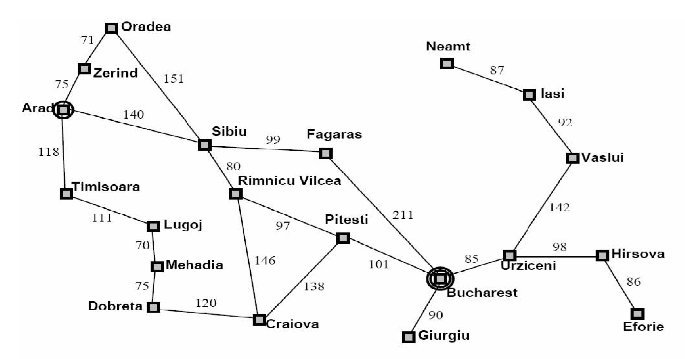

[TOC]

[人工智能实验本地文件](file:///C:/Users/admin/Documents/Tridu33/postgraduate/%E4%BA%BA%E5%B7%A5%E6%99%BA%E8%83%BD%E5%AE%9E%E9%AA%8CAgent%E4%BA%BA%E5%B7%A5%E6%99%BA%E8%83%BD%EF%BC%9A%E4%B8%80%E7%A7%8D%E7%8E%B0%E4%BB%A3%E7%9A%84%E6%96%B9%E6%B3%95/)

[Jupyter本地文档](file:///C:/Users/admin/Documents/Tridu33/Py/jupyternotebook/aima3_notebooks/)

[alpha-beta pruning](http://web.cs.ucla.edu/~rosen/161/notes/alphabeta.html)

[详解min-max剪纸](https://blog.csdn.net/wenjianmuran/article/details/90633418?utm_medium=distribute.pc_relevant.none-task-blog-BlogCommendFromMachineLearnPai2-9.channel_param&depth_1-utm_source=distribute.pc_relevant.none-task-blog-BlogCommendFromMachineLearnPai2-9.channel_param)

: 4 assignments (15%) + 4 projects (15%) + class presentation (10%) + final exam (60%)

weekly exercises (30%) + 4 projects (70%)

Submission mailbox: ai 201901@foxmail.com

# 作业

1. 路 Trace the operation of uniform-cost search with cycle-checking: draw the search tree.

States: the various cities you could be located in.

Actions: drive between neighboring cities.

Initial state: in Arad

Goal: in Bucharest

Solution: the route, the sequence of cities to travel through to get to Bucharest.

2. gh

3. a-b pruning

## A1

## A2

## A3

## A4

