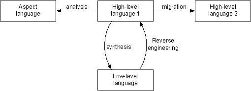

# ProgramSynthesis代码综合

# Program synthesis

https://en.wikipedia.org/wiki/Program_synthesis

程序综合
ProgramSynthesis是一类转换，可降低程序的抽象级别。在ProgramRefinement中，实现是从高级规范派生的，以便该实现满足该规范。编译是一种综合形式，其中将高级语言的程序转换为机器代码。这种翻译通常在几个阶段中完成，在这些阶段中，首先将高级语言转换为中间表示形式。然后，指令选择将中间表示转换为机器指令。合成的其他示例parser and pretty-printer generation from context-free grammars.。

