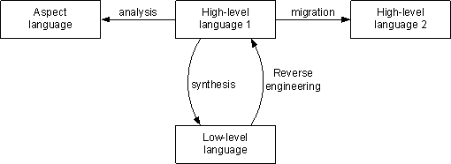

[TOC]


program-transformation.org


Program transformation techniques are used in a many areas of software engineering ranging from **program synthesis**, via program optimization and program refactoring, to reverse engineering and documentation generation. Many theories, tools and applications have been developed over the last 30 years. Often the results of these efforts are used only in the community that developed them.

Program-transformation.org is dedicated to collecting, organizing and disseminating information about all aspects of program transformation in order to share results across communities. Such an effort cannot possibly be achieved by a static web site. Therefore, this site is based on TWiki, a system for collaborative web development. This means that you cannot only read information about program transformation, but also contribute to this site by editing pages and by adding new pages. OneMinuteWiki explains how wiki works. -- EelcoVisser & ArieVanDeursen


# 程序转换


program-transformation.org/Transform/ProgramTransformation.html


程序是具有语义的结构化对象。该结构使我们可以转换程序。语义为我们提供了比较程序和推理转换有效性的方法。语义包括程序的扩展和内涵行为。编程语言是程序的集合。这是一个相当广泛的定义，旨在涵盖适当的编程语言（带有操作解释），以及数据格式和特定​​于域的语言。

可以将编程语言聚类为具有结构和/或语义相似性的类。程序转换的通用框架的目标之一是定义可以在尽可能广泛的语言范围内重用的转换。例如，变量和变量绑定的概念由所有编程语言共享。可以以一种非常通用的方式一次为所有语言定义处理诸如绑定变量重命名，替换和统一之类的变量的转换。

程序转换是将一个程序更改为另一个程序的动作。术语程序转换也用于算法实现程序转换的正式描述。编写要转换的程序和生成的程序的语言分别称为源语言和目标语言。

程序转换以许多不同的名称而闻名
>Meta Programming
Software generation
Generative programming
Program synthesis
Program refinement
Program calculation
元编程
软件生成
生成式编程
程序综合
程序完善
程序计算


程序转换用于软件工程的许多领域，包括编译器构建，软件可视化，文档生成和自动软件更新。在所有这些应用程序中，我们可以区分两种主要方案，即源语言和目标语言不同（翻译）与相同的方案（改写）。根据它们对程序抽象级别的影响以及它们在何种程度上保留了程序的语义，可以将这些主要方案细化为许多典型的子方案。这种改进产生了以下TransformationTaxonomy。
```
翻译
    程序迁移
    程序综合
        程序精修
        程序编译
        代码生成
    逆向工程
        反编译
        架构提取
        文档生成
        软件可视化
    程序分析
改写
    程序规范化
    程序优化
        程序专业化
        毁林
        超级编译
    程序重构
        程序混淆
    ProgramReflection ？
    软件改造/再造


Translation
    ProgramMigration
    ProgramSynthesis
        ProgramRefinement
        ProgramCompilation
        CodeGeneration
    ReverseEngineering
        DeCompilation
        ArchitectureExtraction
        DocumentationGeneration
        SoftwareVisualization
    ProgramAnalysis
Rephrasing
    ProgramNormalization
    ProgramOptimization
        ProgramSpecialization
        DeForestation
        SuperCompilation
    ProgramRefactoring
        ProgramObfuscation
    ProgramReflection?
    SoftwareRenovation / ReEngineering
```





# transcompiler

**最大的问题不是程序代码的实际翻译，而是平台API的移植。**

《Programming Language Inter-conversion》这论文提了想法和java22c，他说法是这个方式使用所有语言。


https://softwareengineering.stackexchange.com/questions/12475/why-arent-there-automated-translators-from-one-programming-language-to-another/12491

- Google的GWT将Java“编译”为JavaScript。Facebook的嘻哈将PHP编译为C


虽然它本身不是代码翻译，但语言工作台 https://www.martinfowler.com/articles/languageWorkbench.html#ElementsOfALanguageWorkbench 的概念显示了如何实现类似于所有语言之间100％正确的翻译器的功能。

在我们当前的方法中，源代码以文本格式存储。在编译期间，这些人类可读的文本文件被解析为抽象语法树表示形式，该语法树表示形式又用于生成字节码或机器代码。但是，此抽象表示是临时的，对于编译器而言是内部的。

在语言工作台方法中，类似的抽象语法树表示形式是永久性存储的工件。机器代码和文本“源”代码都是基于此抽象表示生成的。这种方法的后果之一是程序的抽象表示实际上与语言无关，并且可以用来生成任何已实现语言的文本代码。这意味着一个人可以使用他们认为最合适的任何一种语言自由地在系统的不同方面进行工作，或者团队的每个成员都可以使用他们最熟悉的语言来从事共享项目。

据我所知，该技术仍无法在主流开发中使用，但是有数个小组在独立研究该技术。很难说他们中的任何一个是否能兑现诺言，但是看到这种情况会很有趣。


- java2c http://www.semanticdesigns.com/Products/Services/NorthropGrummanB2.html?site=Quora

- C++ to Java Converter : tangiblesoftwaresolutions.com/product_details/cplusplus_to_java_converter_details.html


- FWIW，有一个从Java到D的翻译器。它称为TioPort，用于将SWT移植到D的相当认真的尝试。它遇到的主要问题是，有必要移植Java标准库的大部分内容。该TioPort http://www.dsource.org/projects/tioport 项目做Java来全库和应用程序的d转换。


- C to Pascal and Pascal to C translators were quite common at one point.

Translating one language to another is just a special case for the class of programs called compilers, interpreters and translators.

This class of program will take a stream of input symbols ("source code") that can usually be described by a formal grammar and will output a stream of symbols.

That output stream of symbols can be:

Native assembly code, usually for the operating system and hardware the machine is running on. If so, the program is referred to as a compiler;
Native assembly code for a different OS and/or hardware. This can be called a compiler too but is often referred to as a cross-compiler;
To an intermediate form that can be executed by a virtual machine of some kind. This isn't a true compiler but is often called a compiler anyway. The Java, C#, F#, VB.NET, etc "compilers" all fall into this category;
To another language entirely. This is called a translator and there are examples of, say, Java to C# translators. They typically have varying degrees of success because idioms often aren't readily translatable;
Interpreters follow the same principle but typically execute the processed form in-place rather than saving it somewhere. Perl, PHP and shell scripts all fall into this category. PHP for example will store opcodes in an opcode cache as an intermediate form (if opcoding caching is enabled) but this intermediate form isn't stored so it's still safe to call PHP an interpreter.


https://www.quora.com/How-do-you-write-a-program-to-transform-from-one-programming-language-to-another
简单的答案是从源语言到目标语言“构建编译器”。
您可以以临时方式执行此操作；去获得一本编译器书，为源语言构建一个解析器，构建许多特殊情况分析器，构建许多特殊代码生成器，以在适当的特殊情况下生成目标源。
这是很多工作，尤其是从头开始的时候。
事实证明，您可以概括此过程并构建大量基础结构来支持更有效地执行此操作。这种类型的基础架构称为程序转换系统（PTS）。
Semantic Designs（我的公司）以我们的DMS软件再造工具包 http://www.semanticdesigns.com/Products/DMS/DMSToolkit.html 的形式提供商业PTS。
要使用DMS实施翻译器，您必须明确定义源语言和目标语言，并且您必须明确定义翻译规则。这些任务都不是一件容易的事，但是由2至3名工程师组成的团队可以针对一年中没有根本不同的语言来完成此任务。 这是有可能的，因为DMS拥有大量支持这些任务的基础架构，我们在过去20年中一直在磨练这些基础架构。
这比从头开始做起来要快得多，而且答案要好得多，因为您可以轻松地为经常出现的螺丝翻译问题提供很多特殊情况处理。

DMS可用于各种程序分析和转换任务；语言翻译是一种特例
- quercus could translate php to java

- IntelliJ可以将Java转换为Kotlin，并且做得很好。


If you are doing research and into AI then I suggest you to go through this article

>Unsupervised Translation of Programming Languages

>Deep learning to translate between programming languages

The above-mentioned Transcoder of Facebook translate functions between C++, Java, and Python 3


- **TransCoder**Fackbook:Transcompilation between Java, C++ and Python 3.
https://github.com/facebookresearch/TransCoder 
最近的论文“Unsupervised Translation of Programming Languages编程语言的无监督翻译”来自Facebook AI Research，描述了神经网络如何学习如何将现有程序从一种语言翻译为另一种语言-反编译。如论文所述：

“A transcompiler, also known as source-to-source translator, is a system that converts source code from a high-level programming language (such as C++ or Python) to another. 转编译器，也称为源到源翻译器，是一种将源代码从高级编程语言（例如C ++或Python）转换为另一种的系统。转编译器主要用于互操作性和移植编写的代码库以一种过时或过时的语言（例如COBOL，Python 2）更新为现代语言，它们通常依赖于应用于源代码抽象语法树的手工重写规则，但不幸的是，由此产生的翻译通常缺乏可读性，无法尊重目标语言按照惯例，需要人工修改才能正常工作。整个翻译过程很耗时，并且需要源语言和目标语言方面的专业知识，从而使代码翻译项目变得昂贵。”

当然，这就是Cobol仍在许多金融系统中使用的原因。如果您曾经尝试用两种相似的语言来翻译甚至一个小程序，Python 2到3都会说，您知道这是非常困难的。您从未想过的事情会突然出现，并使事情无法按计划进行。

Facebook小组从C ++，Java和Python的GitHub中获取了大量代码。想法是使用自然语言处理中的技术从语言中提取模式。该程序学习了函数的独立于语言的表示形式，然后能够使用它来生成另一种语言的函数。关键因素是这种表示是以无人监督的方式学习的-也就是说，没有人告诉神经网络程序做了什么，没有学习目标，也没有应用强化奖励。语言中的模式显然足够。这令人惊讶，但是类似的方法也适用于自然语言-这更令人惊讶。

并未通过向系统展示使用不同语言编写的相同功能的示例来训练该系统，这就是您可能会想像的那样。通过阅读功能，理解其功能然后以新语言重新表达该功能，这更是人类的工作方式。

它行得通吗？

看来确实如此。

“我们观察到TransCoder成功地理解了每种语言的语法，学习了数据结构及其方法，并正确地跨编程语言对齐了库。”

它并不总是正确，但是令人印象深刻，足以表明正在发生某些事情。

可以用于在特定语言中创建实现的程序的独立于语言的表示形式的想法可能导致某种AI可以根据需求或描述生成程序。

也许现在还没有我们，但是，是的，我不得不说，在这项研究之后，人工智能可能接管生成程序的那一天似乎已经接近了


# ANTLR

https://awhisper.github.io/2016/11/18/%E4%BB%8Eantlr%E5%88%B0%E8%AF%AD%E6%B3%95%E8%A7%A3%E6%9E%90/


网上我们看到很多看起来很神奇的，能做到各种语言之间转换的东西

比如JSPatchConvertor http://bang590.github.io/JSPatchConvertor/ ，他可以做到把OC代码输入后直接转化成JSPatch代码，

比如objc2swift http://objc2swift.yahoo-labs.jp/  ，他可以做到把OC代码输入后直接转化为Swift代码

这些看起来很酷炫的东西是怎么做的？Bang哥写的这篇JSPatchConvertor实现原理，我们可以好好看看。


