[TOC]

# 1. 编程语言国际会议

编程语言国际会议 - 赵俊民的文章 - 知乎
https://zhuanlan.zhihu.com/p/111682343

目前我个人主要跟踪的会议：

1. PLDI：Programming Language Design and Implementation

2. CC： International Conference on Compiler Construction

3. CGO：Code Generation and Optimization)，

4. POPL： 程序语言设计原理

5. OOPLSA：面向对象程序设计

6. ISMM：内存管理

7. ICFP：函数式编程，最近比较流行curry on(工业界程序设计语言应用），包含编程语言、语言虚拟机等。

International Conference on Functional Programming

https://www.multi-mania.be/international-conference-on-functional-programming/

8. Curry-on还是跟ECOOP

9. Splash

10. LLVM summit

11. JVM language Summit ：JVM SUMMIT是专门讨论JAVA虚拟机进展的年会

其他会议:

>ACM SIGPLAN International Conference on Functional Programming(ICFP)
Flops: International Symposium on Functional and Logic Programming
IFL: International Symposia on Implementation and Application of Functional Languages
MPC: International Conference on Mathematics of Program Construction
PPDP: International Conference on Principles and Practice of Declarative Programming
TFP: Symposium on Trends in Functional Programming
TLCA: International Conference on typed lambda calculi and Applications
TLDI: International Workshop on Types in Language Design and Implementation
SAS: International Static Analysis Symposium

杂志：
>Journal of Functional Programming
Journal of Functional and Logic Programming
Higher-Order and Symbolic Computation
ACM Transactions on Programming Languages ​​and Systems

http://www.sigplan.org/Conferences/
SIGPLAN在编程语言研究领域组织了重要的会议和研讨会，为研究人员，开发人员，从业人员和学生提供了展示其最新研究进展的机会。

下列会议由SIGPLAN定期赞助。

编程语言原理（POPL）
编程语言原理是有关编程语言，编程系统和编程抽象的设计，定义，分析，转换和实现的基础创新的首要论坛。

编程语言设计和实现（PLDI）
编程语言设计和实现是研究编程语言设计和实现的首要论坛。

OOPSLA（OOPSLA @ SPLASH）
OOPSLA是面向行业和学术专家的主要会议，目的是报告对象技术，程序员生产力，安全可靠的软件以及超大规模系统方面的创新。

国际函数式编程会议（ICFP）
国际函数式编程会议是有关函数式编程的设计，实现和使用的首要论坛。

编程语言和操作系统的体系结构支持（ASPLOS）编程语言和操作系统的体系
结构支持国际会议为科学家和工程师提供了一个高质量的论坛，以介绍他们在这些快速变化的领域中的最新研究成果。它捕获了过去15年中的一些主要计算机系统创新（例如RISC和VLIW处理器，小型和大型多处理器，集群和工作站网络，优化编译器，RAID和网络存储系统设计） 。ASPLOS与SIGARCH和 SIGOPS共同赞助 。 

编译器构造（CC）
国际编译器构造大会（CC）对最广义的处理程序感兴趣：分析，转换或执行描述系统工作方式的输入，包括传统的编译器构造（作为特例）。

代码生成和优化（CGO）
国际代码生成和优化专题讨论会（CGO）提供了一个绝佳的场所，使研究人员和从业人员聚集在硬件和软件的界面上，就各种优化和代码生成技术以及相关问题进行了探讨。会议涵盖了从纯静态方法到全动态方法的各个方面，包括从基于纯软件的方法到体系结构功能和支持的技术。

动态语言研讨会（DLS @ SPLASH）
动态语言研讨会（DLS）是讨论动态语言，其实现和应用的论坛。

生成式编程：概念和体验（GPCE）
生成式编程：概念和体验是一个会议，旨在促进支持自动程序生成的基础技术的应用和创新。

国际内存管理专题讨论会（ISMM） 国际内存管理专题讨论会着重于垃圾收集，动态存储分配，存储管理实现技术，以及与语言和操作系统的交互，以及对程序的内存分配和引用行为的实证研究。

嵌入式系统的语言，编译器和工具（LCTES）
LCTES提供了编程语言和嵌入式系统工程界之间的链接。这些领域的研究人员和开发人员正在解决许多类似的问题，但是背景和方法不同。LCTES旨在使任一领域的研究人员和开发人员了解另一领域的相关工作和有趣的问题，并提供一个可供他们互动的论坛。

Haskell专题讨论会（HS）
Haskell专题讨论会是与国际函数式编程会议（ICFP）隶属组织的年度专题讨论会。Haskell研讨会的目的是讨论Haskell的经验以及该语言的未来发展。座谈会的范围包括Haskell的设计，语义，理论，应用，实现和教学的所有方面。

编程语言历史（HOPL）
编程语言历史会议的目的是为编程语言设计和开发提供准确的历史记录。HOPL-IV将与PLDI'20于2020年举行。HOPL-I于1978年在加利福尼亚州洛杉矶举行。HOPL-II于1993年在马萨诸塞州剑桥市举行。HOPL-III于2007年在加利福尼亚州圣地亚哥举行。

向前！（前进 @ SPLASH）
前进！是关于编程新思想和软件思考的座谈会。欢迎提出并提出新的软件创建方法的论文，以及对广泛解释的编程技术和思想的反思。

软件语言工程（SLE）软件语言工程
国际会议（SLE）致力于软件语言的工程原理：其设计，实现和发展。

并行编程的原理和实践（PPOPP）并行编程的
原理和实践为有关并行编程的原理和基础，并行编程的工具和技术以及使用并行编程解决应用程序问题的经验的论文提供了一个论坛。

虚拟执行环境（VEE）
国际虚拟执行环境会议的目标是成为一个一流的研究论坛，汇集虚拟化广泛领域的领先从业者和研究人员，其中包括诸如高级语言虚拟机之类的主题。 （JVM，CLR等），进程和系统虚拟机，转换器，机器仿真器和模拟器。以前，关于这些主题的研究结果分散在语言（VM，PLDI，OOPSLA，IVME），操作系统（SOSP，OSDI，USENIX）和体系结构（ASPLOS，CGO，PACT）社区的多个不同地点。

编程语言辅导研讨会（PLMW）
的目的是鼓励研究生（博士和理科硕士）和高年级本科生从事编程语言研究事业。该研讨会的特色是采用编程语言进行前沿研究的技术会议以及有关如何为研究职业做准备的指导会议。它聚集了来自学术界和工业界的编程语言研究的领导者，就他们的研究领域进行了演讲。研讨会使学生参与了一个过程，他们在想像他们如何为我们的研究社区做出贡献。

# 2. CCF中国计算机学会推荐国际学术期刊 会议 - 梦寐mayshine的文章 - 知乎
https://zhuanlan.zhihu.com/p/139763798

## 2.1. (计算机科学理论) ——期刊

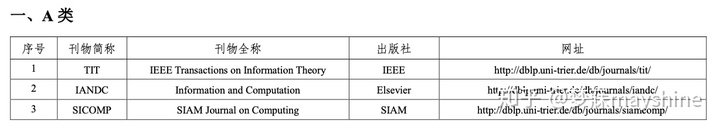

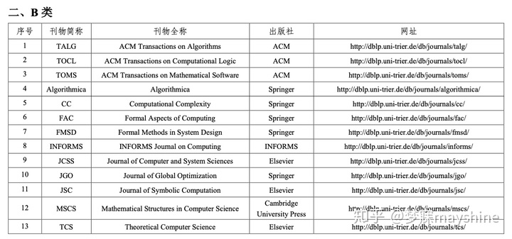

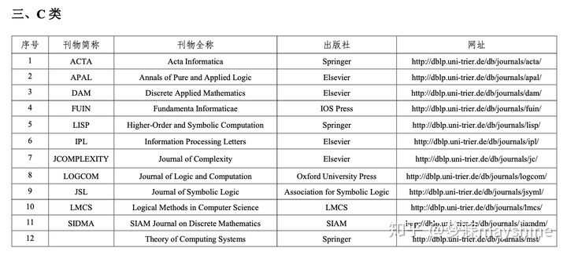

## 2.2. (计算机科学理论) ——会议

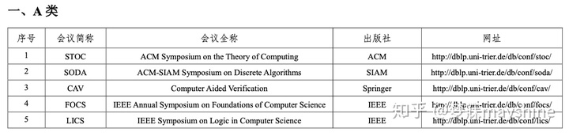

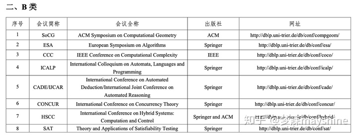

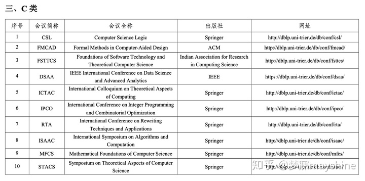

## 2.3. (人工智能) ——期刊

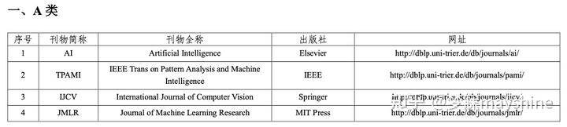

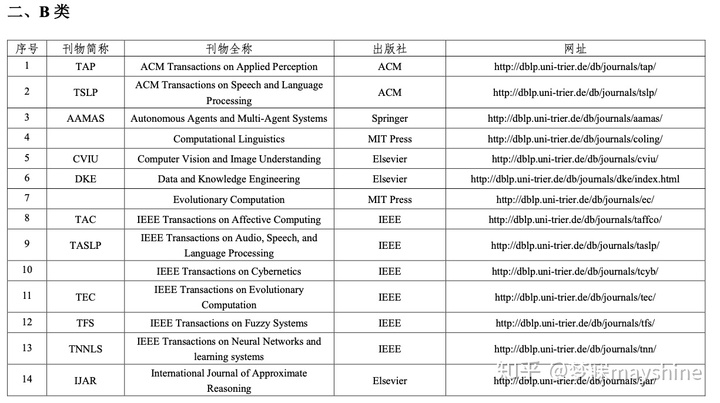

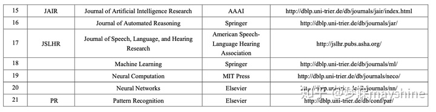

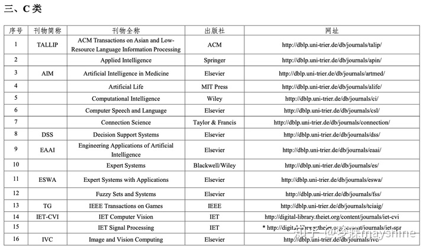

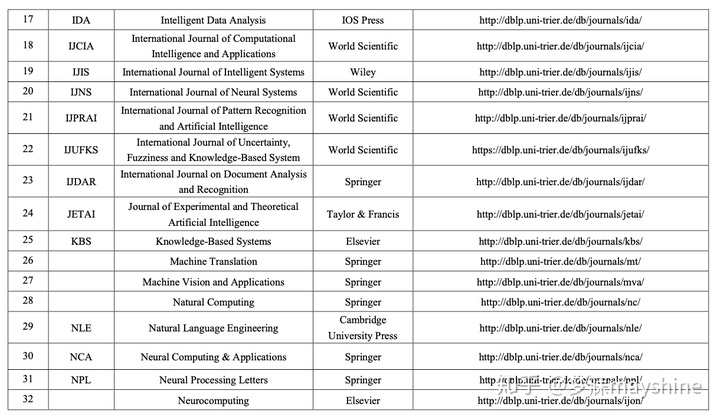

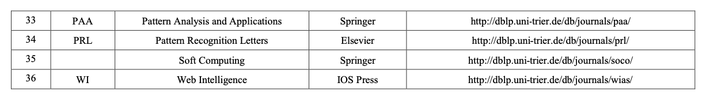

## 2.4. (人工智能) ——会议

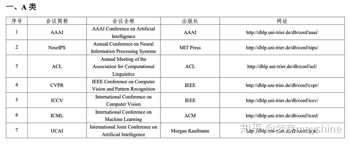

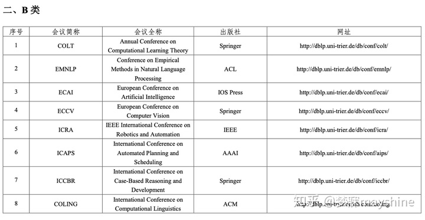
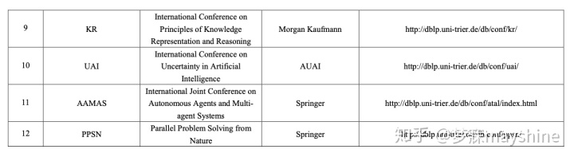

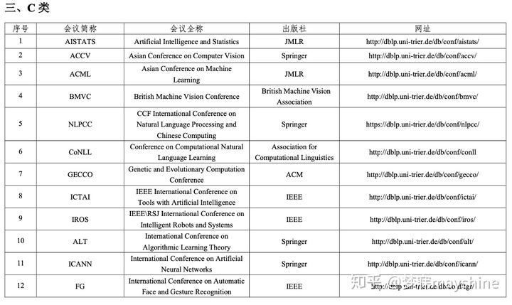

## 2.5. (软件工程/系统软件/程序设计语言) ——期刊
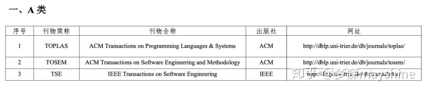
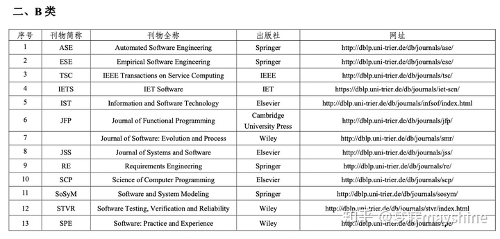

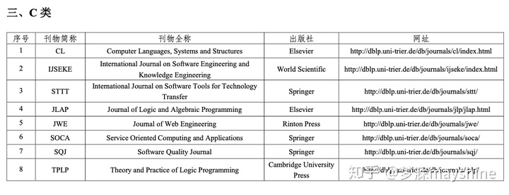

## 2.6. (软件工程/系统软件/程序设计语言) ——会议

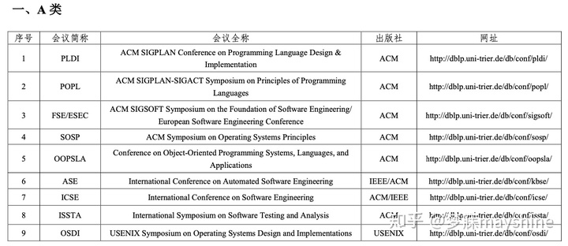

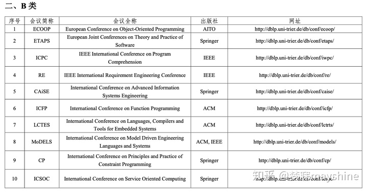

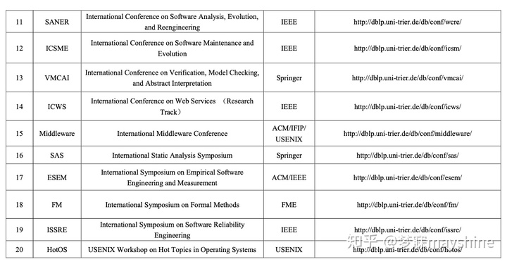

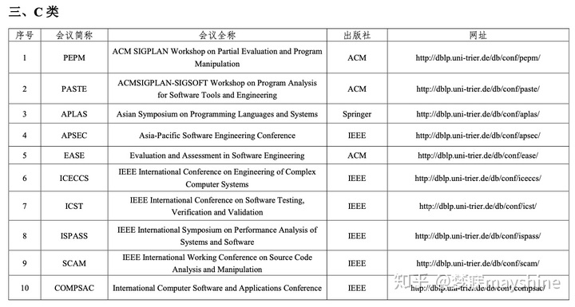

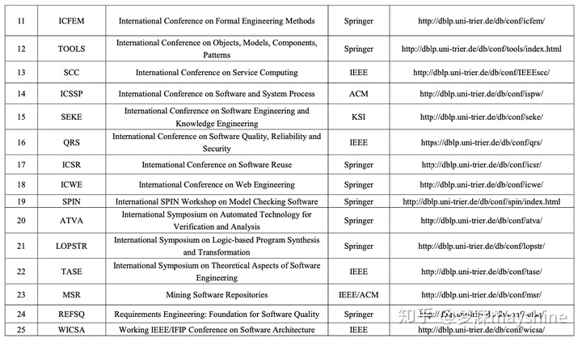

# 3. TCS会议和研讨会列表

https://qastack.cn/cstheory/7900/list-of-tcs-conferences-and-workshops

## 3.1. 一般计算理论科学：

STOC，ACM计算理论研讨会
FOCS，IEEE计算机科学基础研讨会
ICALP EATCS自动机，语言和编程国际学术讨论会
（A：算法，复杂性，B：逻辑，语义，C：网络）
FOSSACS，软件科学和计算结构的基础
STACS，计算机科学理论专题研讨会
MFCS，计算机科学的数学基础
FSTTCS，软件技术和理论计算机科学的基础
茧，计算与组合会议
ITCS，理论计算机科学的创新
企业社会责任，俄罗斯计算机科学
ISAAC，国际算法与计算研讨会
TAMC，计算模型理论与应用
可可，组合优化与应用会议
FM，正式方法
FCT，计算理论基础
拉丁美洲，拉丁美洲理论信息学研讨会
SOFSEM，计算机科学理论与实践最新趋势会议
TASE，软件工程的理论方面
## 3.2. CC：复杂性

CCC，IEEE计算复杂性大会
SIROCCO，国际结构信息和通信复杂性学术讨论会
## 3.3. CG：计算几何

SOCG，计算几何专题讨论会
CCCG，加拿大计算几何学会议
EuroCG，欧洲计算几何研讨会

CR：密码学和安全性

CRYPTO，国际密码学会议
EUROCRYPT，密码技术理论与应用会议
ASIACRYPT，密码学理论与应用会议
拉丁美洲，拉丁美洲密码学和信息安全国际会议
AFRICACRYPT，密码学在非洲的国际会议
PQCRYPTO，后量子密码学国际会议
TCC，密码学会议
PKC，公开密钥密码学实践与理论国际会议
FSE，快速软件加密会议
CHES，加密硬件和嵌入式系统会议
IEEE标准普尔，IEEE安全和隐私研讨会
CCS， ACM计算机和通信安全会议
POST，安全与信任原则
CSF，计算机安全基础研讨会

DB：数据库理论

SIGMOD / PODS，ACM数据库系统原理专题讨论会（均接受理论，但SIGMOD的范围更广）
ICDT，国际数据库理论会议
VLDB，超大型数据库
AMW，Alberto Mendelzon国际数据管理基础研讨会
- DC：分布式，并行和集群计算

PODC，ACM分布式计算原理研讨会
DISC，国际分布式计算研讨会
SPAA，ACM算法和体系结构并行研讨会
IPDPS，IEEE国际并行和分布式处理研讨会
ICDCN，国际分布式计算和网络会议
OPODIS，分布式系统原理国际会议
SSS，分布式系统的稳定性，安全性和安全性国际研讨会
Algosensors，国际研讨会算法的传感器系统，无线Ad Hoc网络，并自主移动实体

- DM：离散数学和组合论

WG，计算机科学图形理论概念国际研讨会
LAGOS，拉丁美洲算法，图形和优化研讨会
DS：数据结构和算法

 SODA，ACM-SIAM离散算法专题讨论会
ESA，欧洲算法研讨会（A道是理论上的）
WADS，算法和数据结构研讨会
SAT，满意度测试的理论与应用
特警，斯堪的纳维亚研讨会和算法理论研讨会
ALENEX，算法工程与实验
SOSA，算法简化研讨会
IPCO，整数编程和组合优化
近似 /随机，优化问题的近似算法研讨会/随机化和计算研讨会
WAOA，近似和在线算法研讨会
IPEC，参数化和精确计算国际研讨会
IWOCA，国际组合算法研讨会
WAW，网络图算法和模型研讨会
CPM，组合模式匹配
CP，约束编程原理与实践
## 3.4. FL：自动机理论和形式语言

 DLT，语言理论发展国际会议
LATA，语言和自动机理论及其应用
AFL，自动机和形式语言
NCMA，自动机的非经典模型及其应用
CIAA，国际自动机实施与应用会议
DFCS，形式系统的描述复杂性
## 3.5. GT：算法游戏理论

EC，电子商务
SAGT，算法博弈论国际研讨会
WINE，互联网和网络经济学研讨会
## 3.6. LG：学习理论

- COLT，学习理论会议
ALT，算法学习理论
LO：计算机科学中的逻辑

## 3.7. LICS，IEEE计算机科学逻辑专题讨论会
CONCUR，国际并发理论会议
CSL，计算机科学逻辑
CiE，欧洲的可计算性
LCC，逻辑与计算复杂性国际研讨会
WoLLIC，逻辑，语言，信息和计算研讨会
逻辑，游戏和自动机的重点
- PL：编程语言

## 3.8. POPL，编程语言原理
ICFP，国际函数式编程会议
ETAPS，欧洲软件理论和实践联席会议（包括FOSSACS，ESOP和POST，请参见单独的条目）
ESOP，欧洲编程研讨会
MSFP，数学结构化函数式编程
MFPS，编程语义学的数学基础
## 3.9. SC：符号计算

 ISSAC：符号和代数计算国际研讨会
FPSAC：形式幂级数和代数组合
CASC：科学计算中的计算机代数
SNC：符号数值计算
## 3.10. 定理证明

  CADE，国际自动扣除会议
ITP，交互式定理证明
CPP，认证证明和程序
- 量子
 QIP，量子信息处理研讨会
QCMC，量子通信，信息与计算国际会议
TQC，量子计算，通信和密码学理论
AQIS，亚洲量子信息科学大会
QCRYPT，量子密码学会议
QEC，量子误差校正国际会议
CEQIP，中欧量子信息处理研讨会
- RO：机器人技术
  WAFR，机器人技术算法基础研讨会。
## 3.11. 计算生物学

推荐：计算分子生物学研究
ISMB：分子生物学智能系统
WABI：生物信息学算法研讨会
- 其他

## 3.12. CAV，计算机辅助验证
GD，国际制图研讨会
FUN，算法乐趣国际会议
DNA，DNA计算和分子程序设计（DNA计算，理论A道，实验B道）
DCM，计算模型的发展
RTA，重写技术和应用
TLCA，lambda型结石及其应用
UCNC，非常规计算与自然计算

