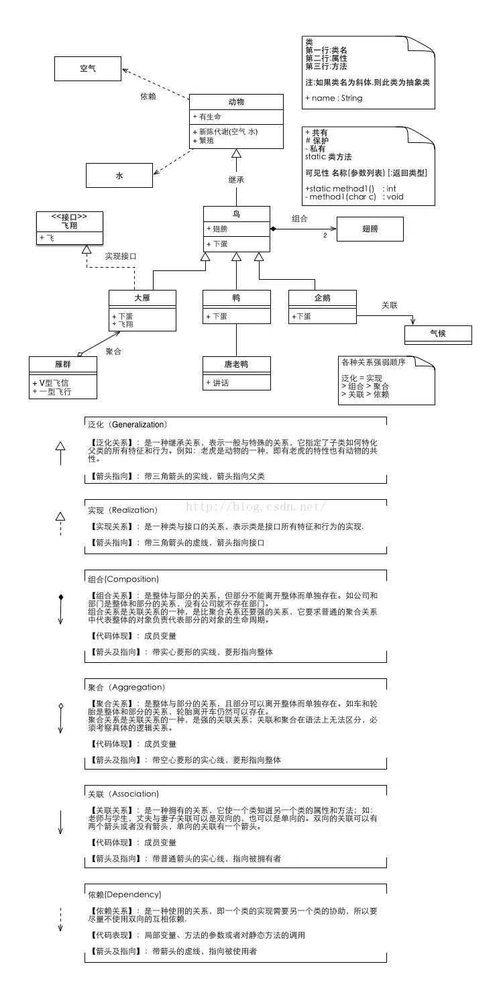

# UML
有用吗
https://www.zhihu.com/question/23569835

是什么
https://www.cnblogs.com/jiangds/p/6596595.html
UML图分为用例视图、设计视图、进程视图、实现视图和拓扑视图，又可以静动分为静态视图和动态视图。静态图分为：用例图，类图，对象图，包图，构件图，部署图。动态图分为：状态图，活动图，协作图，序列图。
https://www.w3cschool.cn/uml_tutorial/uml_tutorial-c1gf28pd.html

https://www.processon.com/

https://blog.csdn.net/qq_25827845/article/details/52932234
23种设计模式大汇总

https://blog.csdn.net/weixin_33877885/article/details/85856560

