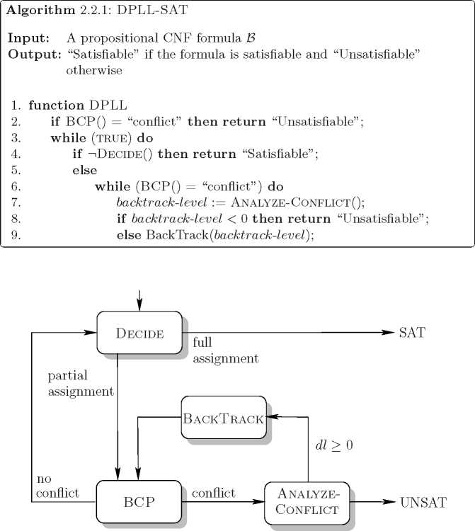

Solving SAT and SAT Modulo Theories: From an abstract Davis--Putnam--Logemann--Loveland procedure to DPLL(T), Journal of the ACM, Vol. 53, No. 6, November 2006

《Decision-Procedures》电子书Kroening-Strichman 2008决策过程Book

https://www.researchgate.net/publication/2495291_Satisfiability_Modulo_Theories

我们提出了一个通用框架DPLL（T），用于将决策程序集成到DPLL方法中。尽管其主要动机是为具有确定的基础后果的一阶理论提供基础公式的可满足性的快速求解器，但该框架在命题案例中也很有用。SAT问题通常可以根据理论T转换为可满足性问题，对于理论T，已知的SAT方法比DPLL更快。我们展示了如何使用DPLL（T）来利用这一事实并获得更好的性能。

Satisfiability Modulo Theories and DPLL(T)
https://lara.epfl.ch/w/_media/sav15:lecture09.pdf

# 1. DPLL

Solving SAT and SAT Modulo Theories: From an abstract Davis--Putnam--Logemann--Loveland procedure to DPLL(T)
https://dl.acm.org/doi/10.1145/1217856.1217859

我们首先介绍Abstract DPLL，这是Davis-Putnam-Logemann-Loveland（DPLL）过程的基于规则的表述，以实现命题可满足性。这一抽象框架允许人们简洁地表达实用的DPLL算法，并以一种简单的方式正式地对它们进行推理。它的特性（例如健全性，完整性或终止性）会立即移植到具有回跳或子句学习等功能的现代DPLL实现中，然后将框架扩展到可满足性模数背景理论（SMT），并使用它来对模型的几种变体进行建模所谓的SMT懒惰方法。特别是，我们使用它来介绍基于通用DPLL（X）引擎的SMT新，高效和模块化方法的一些变体，其参数对于给定的理论T，可以使用专门的求解器Solver T来实例化X，从而生成DPLL（T）系统。我们描述了DPLL（X）的高级设计及其与Solver T的合作，讨论了理论传播的作用，并针对工业应用中出现的一些理论描述了不同的DPLL（T）策略。这篇文章表明，DPLL（T）系统可以显着优于其他最新工具，即使在几个数量级上也是如此，并且具有更好的缩放特性。

https://blog.csdn.net/swy_swy_swy/article/details/106675816
程序验证（七）：可满足性模理论(Satisfiability Modulo Theories)

## 1.1. CDCL

首先，各人的背景、需求不同，这种问题很难有大而全的回答。。下面只针对“深刻理解求解原理，跟进一些最新成果“，给一点小建议。。。

说明一下，这里不考虑3-SAT，＃SAT，MaxSAT，"SMT-opt"(SMT + 最优化）, "SMT-ind"（SMT with inducetive pred)，"SMT-CLP"(SMT + constraint logic programming)等变种/扩展。。

SAT：当前最主流、成功的架构是CDCL（Conflicit-Driven Lemma-Learning)，之所以说“架构“，是因为它本质上还是基于DPLL(Davis-Putnan-Logemann-Loveland)算法，只是加了一些lemma learning, restarting, phase selection等策略，和很多简化算法（如hidden tautology elimination, bloked clause elimination)。个人建议是好好花时间阅读、理解Minisat的代码。当前相当大一部分SAT引擎都是基于Minisat的。

SMT：

SMT求解器可能包涵各种theory如real, integer, bit-vector,等等。为了求解不同theory，可能涉及特定算法如线性规划、高斯消元等；但是这些thery的求解基本都有会SAT solver参与。
SAT solver是怎么参与的呢？大体分为“lazy approach“和“eager approach"两类（此处略去 xx 字）..如果想通过动手实现加深理解，对于“lazy aproach“，简单点的可以考虑EUF(theory of equality with uninterpreted function)或DL(difference arithmetic)...

如何学习 SMT/SAT（可满足性理论）的数学基础？ - rainoftime的回答 - 知乎
https://www.zhihu.com/question/65438076/answer/233925406

