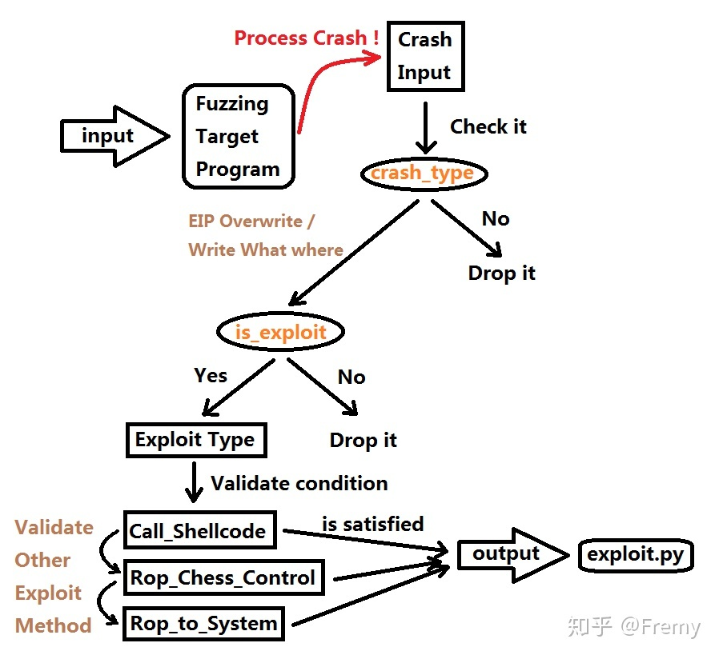

# 1. REX 框架与Auto Exploit Generation 符号执行原理

REX 框架与Auto Exploit Generation 符号执行原理 - Fremy的文章 - 知乎
https://zhuanlan.zhihu.com/p/67072177

Auto Exploit Generation (AEG)意为自动化利用代码生成,通常我们把得到的崩溃样本经过一系列的分析,根据崩溃点和执行环境上下文来推算该异常能否被利用和生成对应的利用代码(不是metasploit 里面的那种根据一个脚本和选择某种Shellcode 合并生成EXP 的方式).

从Fuzzing 到Exploit 自动化的完整过程

在AEG 的范畴中,最重要的一点是要找到能够把漏洞原理和利用方式转化为数学上可以验证的方法.我们回顾CallJmpSPShellcode.apple() 的实现,检测栈溢出的漏洞最后归根结底是对EIP 和指定内存进行约束求解的过程.如果有满足这些条件的解,那么我们能肯定这个漏洞的利用方法.我们总结一下栈溢出Jmp ESP 的利用方法,整体的约束条件

