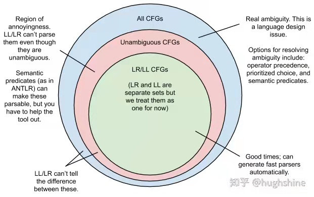
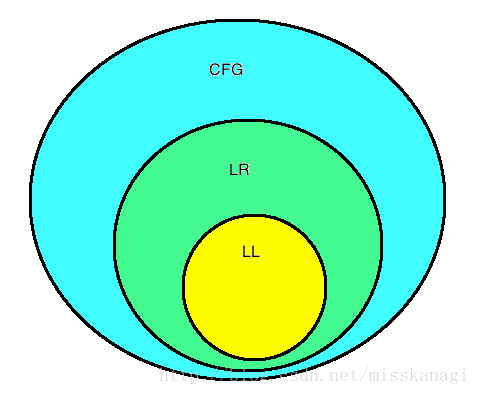

核心代码中间表示是cfg控制流图--多叉树AST数据结构

中序遍历就是常见的c-like编程语言的代码，如果分层控制结构 用()划分可以看作Binary AST就是lisp中的S-expression。括号匹配

前序遍历就是逆波兰表达式的代码haskell就是这样的存在，其中层次结构

https://blog.reverberate.org/2013/07/ll-and-lr-parsing-demystified.html
**(前缀)波兰语和(后缀)反向波兰语符号分别直接对应于LL和LR解析**。

http://www.gnu.org/software/bison/manual/html_node/Examples.html
bison教程例子

# 1. LL(k), SLR(k), LALR(k), LR(k)

https://zhuanlan.zhihu.com/p/94424139

编译原理文法这里有很多混淆的地方，在这里梳理一下，尤其是各种“文法”

（LL(k), SLR(k), LALR(k), LR(k), unambiguous grammar, ambiguous grammar, context-free grammar）。

首先说明，Context-free grammar与无二义性文法不是一个层级的概念。

CFG的意思是：我们用产生式设计的一组文法，对于每一个推导，其中的NT可以任意地被产生式右部替换而合法（这并不限制对于一个文本，只能推理出一棵树）。也就是每个NT之下的产生式是等价的，比如对于Verb->吃/飞，在具体解析时，不论前面的主语/后面的宾语是什么，都合法。二义性是在CFG之下的概念。

    LL(0) < LL(1) < LR(1)
    LL(0) < LR(0)
    LR(0) 与 LL(1) 是 有交集，不相互包含的关系。
    此外，LL(k)/LR(k) < unambiguious grammar

GLR可以分析任意的CFG、输出所有的AST供用户选择，（我认为它就是LR(∞)...），但它并不要先建“表”，对于一个文法是否是二义性的，它不能在仅看到文法时就了解（它根本不处理文法，它只是在做完全的遍历）。所以GLR并不能判断文法的二义性。

"**根本没有输出函数的有限状态机叫做半自动机或转移系统**"，那么按照有限状态自动机的定义没有输出函数难道就是半自动机吗。

https://blog.csdn.net/ZP_icenow/article/details/82910657
正规式来定义一些简单的语言，能表示给定结构的固定次数的重复或者没有指定次数的重复
正规式不能用于描述配对或嵌套的结构，例如配对括号串的集合

https://blog.csdn.net/qq_42977003/article/details/112341427

**LL(1)**分析法是自上而下的分析法。**LR(0),LR(1),SLR(1),LALR(1)**是自下而上的分析法。

自上而下:从开始符号出发，根据产生式规则推导给定的句子。用的是推导。

自下而上:从给定的句子规约到文法的开始符号。用的是归约。

 

下面就主要来讲解他们的不同点， 

LL(1)单独讲，

其他四种文法分析过程基本有三大步：

写出自动机（即 LR(0)或 LR(1)项集族，后面都称作自动机） -> 构造文法分析表-> 进行文法分析过程。

其中后两步都是类似或者说几乎完全一样的，第一步中的自动机有两种: LR(0)自动机和 LR(1)自动机。

LR(0) 和 SLR文法分析用的是 LR(0)自动机，LR(1)和 LALR文法分析用的是 LR(1)自动机。

而LR(1)自动机构造方法和LR(0)自动机的构造方法相同，只是多增加了向前搜索符号。

https://blog.csdn.net/zuzhiang/article/details/79047743

https://blog.csdn.net/misskanagi/article/details/29852901 

----------------------------------------------------------------------------------------------

yacc采用的是LALR(1)，而antlr采用LL(k)的解析方法
https://www.cnblogs.com/haoxinyue/p/4225006.html
使用Antlr实现简单的DSL

