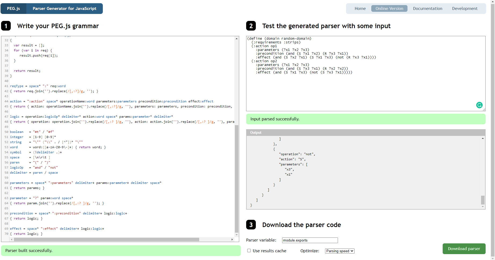

# 1. PEG.js解析器生成器


编译原理之 PEG.js

https://mp.weixin.qq.com/s?__biz=MzIwOTM2ODM1OQ==&mid=2247483895&idx=1&sn=381bfa625647ded322a722674d744e5b&chksm=9775a5bfa0022ca940f6447319d205ef356123cd51340f0ade76bf1f3a2e78d14938b893fda1&mpshare=1&scene=1&srcid=0222ohhay9QlDhQj0Ary3xib&sharer_sharetime=1613923293332&sharer_shareid=7145cbc3d8fd655459c0177e9b45259c#rd


[1]
编译原理之手写一门解释型语言: https://mp.weixin.qq.com/s/-9JaieElYz2HBr8vH8fSRA

[2]
PEG.js: https://nathanpointer.com/

[3]
PEG.js Online: https://pegjs.org/online


## 1.1. 实例学习怎么从pddl到json结构化数据


https://gist.github.com/primaryobjects/22363e71112d716ea183 一个pddl2json的完美案例:


Attempt at a basic STRIPS PDDL grammar parser for pegjs.org.




https://pegjs.org/online
 在线工具peg.js直接转换

标准案例

```

// Simple Arithmetics Grammar
// ==========================
//
// Accepts expressions like "2 * (3 + 4)" and computes their value.

Expression
  = head:Term tail:(_ ("+" / "-") _ Term)* {
      return tail.reduce(function(result, element) {
        if (element[1] === "+") { return result + element[3]; }
        if (element[1] === "-") { return result - element[3]; }
      }, head);
    }

Term
  = head:Factor tail:(_ ("*" / "/") _ Factor)* {
      return tail.reduce(function(result, element) {
        if (element[1] === "*") { return result * element[3]; }
        if (element[1] === "/") { return result / element[3]; }
      }, head);
    }

Factor
  = "(" _ expr:Expression _ ")" { return expr; }
  / Integer

Integer "integer"
  = _ [0-9]+ { return parseInt(text(), 10); }

_ "whitespace"
  = [ \t\n\r]*
```

pddl parser有一个挺方便的

```python
 pip install pddlpy#pddl parser
 # 读取pddl文件进入内存，变成python可以访问的结构化数据格式
 # 需要函数pddl2json则是输出转换json结构，这种结构化文件网络编程javascript几乎唯一选择
```


https://gist.github.com/primaryobjects/1d2f7ee668b62ca99095 使用案例教程


```
/*
grammar.txt: saved from https://gist.github.com/primaryobjects/22363e71112d716ea183
domain.txt:
(define (domain random-domain)
  (:requirements :strips :typing)
  (:action op1
    :parameters (?x1 ?x2 ?x3)
    :precondition (and (S ?x1 ?x2) (R ?x3 ?x1))
    :effect (and (S ?x2 ?x1) (S ?x1 ?x3) (not (R ?x3 ?x1))))
  (:action op2
    :parameters (?x1 ?x2 ?x3)
    :precondition (and (S ?x3 ?x1) (R ?x2 ?x2))
    :effect (and (S ?x1 ?x3) (not (S ?x3 ?x1)))))
*/
 
var fs = require('fs');
var PEG = require("pegjs");
var util = require('util');
 
fs.readFile('grammar.txt', 'utf8', function(err, grammar) {
    if (err) throw err;
 
    var parser = PEG.buildParser(grammar);
 
    fs.readFile('domain.txt', 'utf8', function(err, domain) {
        if (err) throw err;
 
        var result = parser.parse(domain);
	console.log(JSON.stringify(result));
    });
});
```


