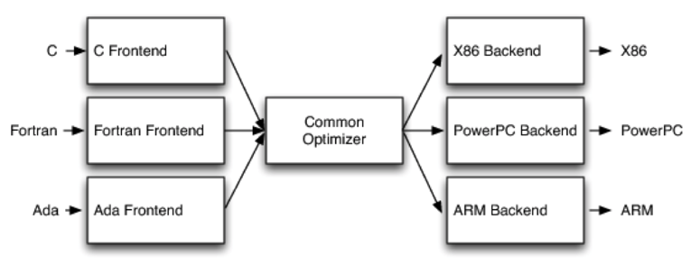
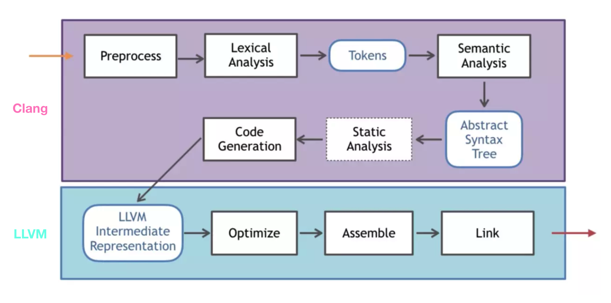

[TOC]
# 1. LLVM

PPT slideshare:
https://www2.slideshare.net/zongfanyang/coscup-2016-llvm

https://github.com/sonicyang/ws-frontend

https://github.com/sonicyang/llvm-z80

如何学习 clang和LLVM(有关于源代码阅读)，需要哪些知识？ - 蓝色的回答 - 知乎
https://www.zhihu.com/question/22160085/answer/55104283

学了编译原理能否用 C++ 写一个编译器或解释器？ - DCDC的回答 - 知乎
https://www.zhihu.com/question/406810057/answer/1420731526 编译器本身LLVM框架已经做的很好了，如果想继续深入了解编译器内核，直接去读LLVM的源码，在llvm的官方主页上有很多基于llvm的项目可以跟进。

如果想学习tensorflow xla和tvm，需要对llvm掌握到什么程度？ - 蓝色的回答 - 知乎 https://www.zhihu.com/question/300549540/answer/521527938

如何学习 clang和LLVM(有关于源代码阅读)，需要哪些知识？ - 蓝色的回答 - 知乎 https://www.zhihu.com/question/22160085/answer/55104283

有没有介绍LLVM的书籍可以推荐?最好是中文的 - 蓝色的回答 - 知乎 https://www.zhihu.com/question/28513400/answer/41143148

llvm.org

[本地bat文件打开LLVM文件目录](file:///C:/Users/admin/Downloads/arch/myenv/MyLLVMOpenBat.bat)

官网主页：[http://llvm.org](http://llvm.org/)

中文官网主页：[https://www.llvm.org.cn](https://www.llvm.org.cn/)  LLVM的首页被翻译成了中文，首页中的很多链接里面的内容还是英文的。

官网提供的安装方法：[http://clang.llvm.org/get_started.html](http://clang.llvm.org/get_started.html)

各种安装方法 https://blog.csdn.net/chikey/article/details/85004556

 https://blog.csdn.net/u011231598/article/details/80505526
 windows下LLVM的安装和配置

作者：依田恥  
链接：https://www.zhihu.com/question/309889585/answer/579381870  
来源：知乎  
著作权归作者所有。商业转载请联系作者获得授权，非商业转载请注明出处。  
  

LLVM首先是一个编译器框架，所以首先起码需要了解编译原理的基础知识。

其次对于一个编程框架，在了解细节之前应该需要提纲挈领地学习一下LLVM的整个结构。万幸的是，LLVM的官方文档非常之出色：[LLVM Design & Overview](https://link.zhihu.com/?target=http%3A//llvm.org/docs/%23llvm-design-overview)，[Programming Documentation](https://link.zhihu.com/?target=http%3A//llvm.org/docs/%23programming-documentation)，[Subsystem Documentation](https://link.zhihu.com/?target=http%3A//llvm.org/docs/%23programming-documentation)，我认为没有比这些更出色的LLVM的入门材料了。后两个链接的内容可以选择一些自己需要的内容来读。

然后是再细节一些的问题，具体到编程层面的问题，解决这个的最好办法当然是应用起来，比如说利用LLVM框架的后端，自己设计一个语言的编译器：关于这个也有LLVM的官方教程：[Kaleidoscope: Implementing a Language with LLVM](https://link.zhihu.com/?target=http%3A//www.llvm.org/docs/tutorial/%23kaleidoscope-implementing-a-language-with-llvm)。不过自己比较建议配合Bison的前端进行使用，网上的博客有一些Bison和LLVM结合使用的教程，虽然基本上可能因为这样那样的问题不能直接用起来，但可以借鉴他们的思路，起码他们曾经做出来过。

除了自己设计编译器之外也有其他应用，可以直接参考LLVM源码中附带的example和docs文件夹。

对于一些高级的内容，可以参见：[LLVM Project Blog](https://link.zhihu.com/?target=http%3A//blog.llvm.org/)

1.  `http://llvm.org`
2.  `http://clang.llvm.org`
3.  `http://en.wikipedia.org/wiki/List_of_JVM_languages`
4.  A backronym that now stands for "GNU Compiler Collection".
5.  This is in contrast to a two-address instruction set, like X86, which destructively updates an input register, or one-address machines which take one explicit operand and operate on an accumulator or the top of the stack on a stack machine.
6.  For all the details, please see *Writing an LLVM Pass manual* at `http://llvm.org/docs/WritingAnLLVMPass.html`.
7.  `http://llvm.org/docs/Bugpoint.html`
8.  I often say that none of the subsystems in LLVM are really good until they have been rewritten at least once.

www.aosabook.org/en/llvm.html

**Sources:**

-   [llvm-project monorepo source code](https://github.com/llvm/llvm-project/releases/download/llvmorg-10.0.0/llvm-project-10.0.0.tar.xz) [(.sig)](https://github.com/llvm/llvm-project/releases/download/llvmorg-10.0.0/llvm-project-10.0.0.tar.xz.sig)
-   [LLVM source code](https://github.com/llvm/llvm-project/releases/download/llvmorg-10.0.0/llvm-10.0.0.src.tar.xz) [(.sig)](https://github.com/llvm/llvm-project/releases/download/llvmorg-10.0.0/llvm-10.0.0.src.tar.xz.sig)
-   [Clang source code](https://github.com/llvm/llvm-project/releases/download/llvmorg-10.0.0/clang-10.0.0.src.tar.xz) [(.sig)](https://github.com/llvm/llvm-project/releases/download/llvmorg-10.0.0/clang-10.0.0.src.tar.xz.sig)
-   [compiler-rt source code](https://github.com/llvm/llvm-project/releases/download/llvmorg-10.0.0/compiler-rt-10.0.0.src.tar.xz) [(.sig)](https://github.com/llvm/llvm-project/releases/download/llvmorg-10.0.0/compiler-rt-10.0.0.src.tar.xz.sig)
-   [libc++ source code](https://github.com/llvm/llvm-project/releases/download/llvmorg-10.0.0/libcxx-10.0.0.src.tar.xz) [(.sig)](https://github.com/llvm/llvm-project/releases/download/llvmorg-10.0.0/libcxx-10.0.0.src.tar.xz.sig)
-   [libc++abi source code](https://github.com/llvm/llvm-project/releases/download/llvmorg-10.0.0/libcxxabi-10.0.0.src.tar.xz) [(.sig)](https://github.com/llvm/llvm-project/releases/download/llvmorg-10.0.0/libcxxabi-10.0.0.src.tar.xz.sig)
-   [libunwind source code](https://github.com/llvm/llvm-project/releases/download/llvmorg-10.0.0/libunwind-10.0.0.src.tar.xz) [(.sig)](https://github.com/llvm/llvm-project/releases/download/llvmorg-10.0.0/libunwind-10.0.0.src.tar.xz.sig)
-   [LLD Source code](https://github.com/llvm/llvm-project/releases/download/llvmorg-10.0.0/lld-10.0.0.src.tar.xz) [(.sig)](https://github.com/llvm/llvm-project/releases/download/llvmorg-10.0.0/lld-10.0.0.src.tar.xz.sig)
-   [LLDB Source code](https://github.com/llvm/llvm-project/releases/download/llvmorg-10.0.0/lldb-10.0.0.src.tar.xz) [(.sig)](https://github.com/llvm/llvm-project/releases/download/llvmorg-10.0.0/lldb-10.0.0.src.tar.xz.sig)
-   [OpenMP Source code](https://github.com/llvm/llvm-project/releases/download/llvmorg-10.0.0/openmp-10.0.0.src.tar.xz) [(.sig)](https://github.com/llvm/llvm-project/releases/download/llvmorg-10.0.0/openmp-10.0.0.src.tar.xz.sig)
-   [Polly Source code](https://github.com/llvm/llvm-project/releases/download/llvmorg-10.0.0/polly-10.0.0.src.tar.xz) [(.sig)](https://github.com/llvm/llvm-project/releases/download/llvmorg-10.0.0/polly-10.0.0.src.tar.xz.sig)
-   [clang-tools-extra](https://github.com/llvm/llvm-project/releases/download/llvmorg-10.0.0/clang-tools-extra-10.0.0.src.tar.xz) [(.sig)](https://github.com/llvm/llvm-project/releases/download/llvmorg-10.0.0/clang-tools-extra-10.0.0.src.tar.xz.sig)
-   [LLVM Test Suite](https://github.com/llvm/llvm-project/releases/download/llvmorg-10.0.0/test-suite-10.0.0.src.tar.xz) [(.sig)](https://github.com/llvm/llvm-project/releases/download/llvmorg-10.0.0/test-suite-10.0.0.src.tar.xz.sig)

**Documentation:**

-   [LLVM](https://releases.llvm.org/10.0.0/docs/index.html) ([release notes](https://releases.llvm.org/10.0.0/docs/ReleaseNotes.html))
-   [Clang](https://releases.llvm.org/10.0.0/tools/clang/docs/index.html) ([release notes](https://releases.llvm.org/10.0.0/tools/clang/docs/ReleaseNotes.html))
-   [clang-tools-extra](https://releases.llvm.org/10.0.0/tools/clang/tools/extra/docs/index.html) ([release notes](https://releases.llvm.org/10.0.0/tools/clang/tools/extra/docs/ReleaseNotes.html))
-   [LLD](https://releases.llvm.org/10.0.0/tools/lld/docs/index.html) ([release notes](https://releases.llvm.org/10.0.0/tools/lld/docs/ReleaseNotes.html))
-   [libc++](https://releases.llvm.org/10.0.0/projects/libcxx/docs/index.html) ([release notes](https://releases.llvm.org/10.0.0/projects/libcxx/docs/ReleaseNotes.html))
-   [Polly](https://releases.llvm.org/10.0.0/tools/polly/docs/index.html) ([release notes](https://releases.llvm.org/10.0.0/tools/polly/docs/ReleaseNotes.html))
-   [LLVM Doxygen](https://github.com/llvm/llvm-project/releases/download/llvmorg-10.0.0/llvm_doxygen-10.0.0-rc6.tar.xz) (.tar.xz)
-   [Clang Doxygen](https://github.com/llvm/llvm-project/releases/download/llvmorg-10.0.0/clang_doxygen-10.0.0-rc6.tar.xz) (.tar.xz)
-   [clang-tools-extra Doxygen](https://github.com/llvm/llvm-project/releases/download/llvmorg-10.0.0/clang-tools-extra_doxygen-10.0.0-rc6.tar.xz) (.tar.xz)

# 2. LLVM笔记

LLVM最初是[Low Level Virtual Machine](http://en.wikipedia.org/wiki/Llvm)的缩写，定位是一个虚拟机，但是是比较底层的虚拟机。它的出现正是为了解决编译器代码重用的问题，LLVM一上来就站在比较高的角度，制定了LLVM IR这一中间代码表示语言。LLVM IR充分考虑了各种应用场景，例如在IDE中调用LLVM进行实时的代码语法检查，对静态语言、动态语言的编译、优化等。

从上面这个图中我们发现LLVM与GCC在三段式架构上并没有本质区别。LLVM与其它编译器最大的差别是，它不仅仅是Compiler Collection，也是Libraries Collection。举个例子，假如说我要写一个XYZ语言的优化器，我自己实现了PassXYZ算法，用以处理XYZ语言与其它语言差别最大的地方。而LLVM优化器提供的PassA和PassB算法则提供了XYZ语言与其它语言共性的优化算法。那么我可以选择XYZ优化器在链接的时候把LLVM提供的算法链接进来。LLVM不仅仅是编译器，也是一个SDK。

现在我们可以回答本文最前面我遇到的那个问题了。Apple LLVM compiler 4.2是一个真正的LLVM编译器，前端使用的是Clang，基于最新的LLVM 3.2编译的。LLVM GCC 4.2编译器的核心仍然是LLVM，但是前端使用的是GCC 4.2编译器。从LLVM的[下载页面](http://llvm.org/releases/download.html)可以看出，LLVM从1.0到2.5使用的都是GCC作为前端，直到2.6开始才提供了Clang前端。

LLVM由三部分组成：

第一部分是LLVM套件，它包含有LLVM所需的所有工具、库函数、和头文件，汇编器、反汇编器、bitcode(一种中间代码)分析器和优化器，以用来测试LLVM和Clang前端的基本回归测试。

第二部分是Clang前端，它将C/C++，Object C和Object C++代码编译成LLVM的中间代码（bitcode），一旦编译成LLVM bitcode，就可以使用LLVM的套件中的LLVM工具来进行操作了。

第三部分是测试集合，这是一个可选部分。它是一套能用来进一步测试LLVM功能和性能的程序。

[https://xuhehuan.com/2738.html](https://xuhehuan.com/2738.html)

，Android NDK 已在具体应用中放弃了 GCC，全面转向 Clang，正如很早前 Android NDK 在 Changelog 中提到的那样：

Everyone should be switching to Clang. 
GCC in the NDK is now deprecated.

Android NDK 从 r11 开始建议大家切换到 Clang，并且把 GCC 标记为 deprecated，将 GCC 版本锁定在 GCC 4.9 不再更新； 
Android NDK 从 r13 起，默认使用 Clang 进行编译，但是暂时也没有把 GCC 删掉，Google 会一直等到 libc++ 足够稳定后再删掉 GCC； 
Android NDK 在 r17 中宣称不再支持 GCC 并在后续的 r18 中删掉 GCC，具体可见 NDK 的版本历史。

自己编译 https://blog.csdn.net/weixin\_33971205/article/details/93750780

# 3. LLVM IR

https://zhuanlan.zhihu.com/p/66793637

# 4. 各种格式文件转换图

llvm主要具有以下几种格式的文件，其转换和关系图图中所示。

1) a.c，源代码。

2) a.bc，llvm的字节码的二进制形式。

3) a.ll，llvm字节码的文本形式。

4) a.s，机器汇编码表示的汇编文件。

5) a.out，可执行的二进制文件。

  

使用clang可以直接把源代码（a.c）编译为本机可执行文件（a.out）。

使用clang -emit-llvm -c可以把源代码（a.c）转换为llvm字节码的二进制格式文件（a.bc），并可以使用lli解释执行。

使用clang -emit-llvm -S可以把源代码（a.c）转换为llvm字节码的文本格式文件（a.ll）。

使用llc可以把字节码的二进制格式文件（a.bc）转换为本地的汇编文件（a.s）。

a.ll和a.bc之间可以通过llvm-as和llvm-dis命令相互转换。

helloted.com/ios/2020/06/03/llvm-clang/

如上图所示，

**前端**
1. 预处理(Pre-process)：他的主要工作就是将宏替换，删除注释展开头文件，生成.i文件。
2. 词法解析(Lexical Analysis)：将代码切成一个个 token，比如大小括号，等于号还有字符串等。是计算机科学中将字符序列转换为标记序列的过程。这一步把源文件中的代码转化为特殊的标记流，源码被分割成一个一个的字符和单词，在行尾Loc中都标记出了源码所在的对应源文件和具体行数，方便在报错时定位问题。
3. 语义分析(Semantic Analysis)：验证语法是否正确，然后将所有节点组成抽象语法树 AST 。由 Clang 中 Parser 和 Sema 配合完成。
4. 静态分析(Static Analysis)：静态分析会对代码进行错误检查，如出现方法被调用但是未定义、定义但是未使用的变量等，以此提高代码质量。
5. 中间代码生成(Code Generation)：生成中间代码 IR，CodeGen 会负责将语法树自顶向下遍历逐步翻译成 LLVM IR，IR 是编译过程的前端的输出，后端的输入。
**优化**
6. 优化(Optimize)：LLVM 会去做些优化工作，在 Xcode 的编译设置里也可以设置优化级别-O1、-O3、-Os…还可以写些自己的 Pass，官方有比较完整的 Pass 教程： Writing an LLVM Pass 。如果开启了Bitcode苹果会做进一步的优化，有新的后端架构还是可以用这份优化过的Bitcode去生成。可以在这一层自定义Pass对IR代码做代码混淆
**后端**
7. 生成目标文件(Assemble)-后端：在这一阶段，也是汇编阶段，汇编器将上一步生成的可读的汇编代码转化为机器代码。最终产物就是 以 .o 结尾的目标文件。使用Xcode构建的程序会在DerivedData目录中找到这个文件。。
8. 链接(Link)：上个阶段生成的目标文件和引用的静态库链接起来，最终生成可执行文件(Mach-O 类型),链接器解决了目标文件和库之间的链接。
