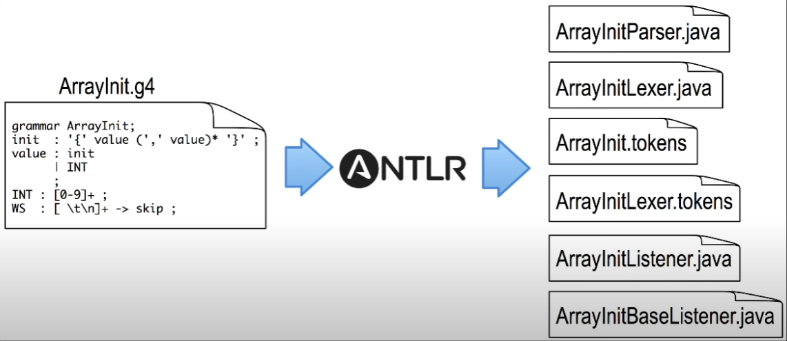
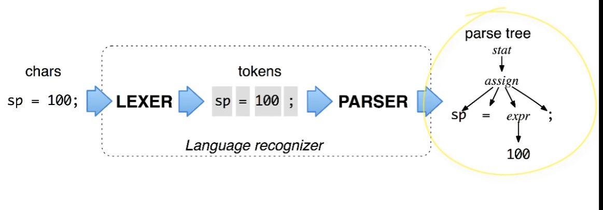
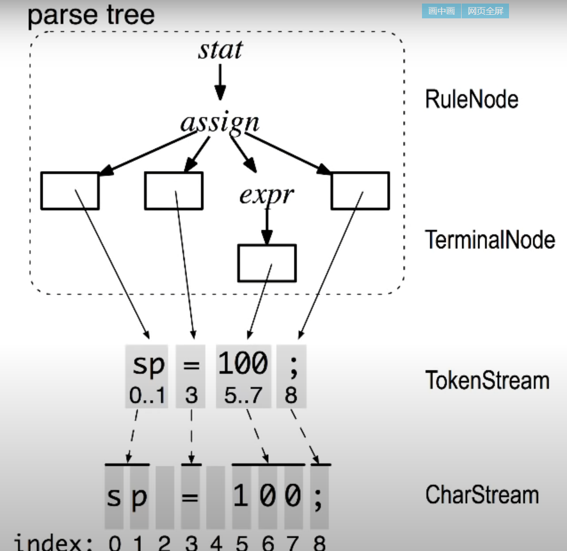

yacc采用的是LALR(1)，而antlr采用LL(k)的解析方法
https://www.cnblogs.com/haoxinyue/p/4225006.html
使用Antlr实现简单的DSL


# 1. ANTLR


ANTLR涉及编译原理中的哪些部分？ - RednaxelaFX的回答 - 知乎
https://www.zhihu.com/question/21580602/answer/93736714

https://www.antlr.org/


https://beyondtheloop.dev/Antlr-cpp-cmake/


github.com/antlr/antlr4/blob/master/doc/python-target.md

github.com/antlr/antlr4/blob/master/doc/java-target.md


antlr.org


https://github.com/antlr/antlr4/blob/master/doc/index.md
官方文档


APIhttps://www.antlr.org/api/


Helloworld CL:https://www.chungkwong.cc/antlr.html

Helloworld IDE:IDEA https://blog.51cto.com/androidguy/2515188  打破国外垄断，开发中国人自己的编程语言（1）：编写解析表达式的计算器


ANTLR 4进阶 https://liangshuang.name/2017/08/20/antlr/


Gradle 的ANTLR插件 https://docs.gradle.org/current/userguide/antlr_plugin.html


https://tomassetti.me/parsing-any-language-in-java-in-5-minutes-using-antlr-for-example-python/ 我喜欢出于多种目的处理代码，例如静态分析或自动重构。对我来说，有趣的部分是推理从抽象语法树（AST）构建的模型。为此，您需要一种从源文件中获取AST的方法。可以使用ANTLR轻松完成此操作，并在此处提供完整语法的集合： https://github.com/antlr/grammars-v4 

一个案例是： https://github.com/ftomassetti/python-ast Python parser built using ANTLR

ANTLR（另一种语言识别工具）是功能强大的解析器生成器，用于读取，处理，执行或翻译结构化文本或二进制文件。它被广泛用于构建语言，工具和框架。ANTLR通过语法生成一个解析器，该解析器可以构建和遍历解析树。

https://awhisper.github.io/2016/11/18/%E4%BB%8Eantlr%E5%88%B0%E8%AF%AD%E6%B3%95%E8%A7%A3%E6%9E%90/
从antlr扯淡到一点点编译原理


《Automatic Inference of Java-to-Swift Translation Rules forPorting Mobile Applications》paper


java如何动态生成抽象语法树AST？ - RednaxelaFX的回答 - 知乎
https://www.zhihu.com/question/56463236/answer/149645326


中科大

chrome-extension://oemmndcbldboiebfnladdacbdfmadadm/http://staff.ustc.edu.cn/~yuzhang/compiler/2019f/lectures/allstar.pdf




书 The Definitive ANTLR 4 Reference https://www.youtube.com/watch?reload=9&v=OAoA3E-cyug







https://gist.github.com/ZenLiuCN/dafaf635412274a8bf367f1f72824a59  
ANTLR (ANother Tool for Language Recognition)是一项开源的java编写的语法/词法分析器套件.

通过ANTLR可以生成语法处理器来对进行文本或二进制文件进行解析处理.

ANTLR由定义语法,编译工具和运行时库组成.

使用ANTLR需要先依据其定义语法编写语法解析文件(.g4),

然后通过java编译器输出对应平台的解析器源代码

解析器源代码结合运行库即可进行语法树解析.

解析之后

解析之后,通过读取语法树即可将你的语法转换为对应平台的真实执行.

限制

只支持LR语法。

Twitter使用ANTLR来解析其搜索服务的查询语句，每天处理超过20亿次查询。Java领域最流行的ORM框架Hibernate使用它将HQL翻译成SQL。Hadoop、Hive以及Pig都使用ANTLR来做语法分析。


ANTLR的IDE——ANTLRWorks2的安装及基本使用  https://blog.csdn.net/u014454538/article/details/86351781 http://plugins.netbeans.org/plugin/53652
https://www.antlr3.org/works/

author Terence Parr, book available from www.pragprog.com


## 1.1. ANTLR4支持的输出平台

+ Java
+ C#
+ Python2 Python3
+ javascript
+ Go
+ C++
+ Swift
+ Php

**ANTLR 生成的对应平台解析器都需要对应平台的运行时进行支持!**

## 1.2. 语法解析文件

+ .g4 作为扩展名 (grammar 4 的缩写) 

+ **语法文件**定义语法中的模式

+ **解析文件**定义语法解析的规则

+ 上两者可以合并为 **语法解析文件** 就是写一起完事儿

+ 基本格式

  ``` 
  //单行注释
  /*
   多行注释
  */
  /**
  * java 文档型注释
  */
  lexer grammar NameLexer;//定于语法文件和语法名称
  import OtherG4;//导入文件
  Token //定义一个语法标记
  	: Param //语法标记的模式
  	;//结束
  //--------这是同文件夹的另外一个g4
  parser grammar NameParser;//某个语法的解析规则
  options { tokenVocab = NameLexer; }//上面定义的语法
  Statement
  	: Pattern //语句的模式
  	;//结束
  //-------这是一个独立的g4	
  grammar NameLanguage;
  
  ```

+ 注释: 同Java就一毛一样

+ 语句: 最终由分号结束

+ Token: 标记,代表你的语法中的一个元素,Token名字必须是大写字母开头

+ Rule: 规则,规则名字必须是小写字母开头

+ Label: 标签,是规则一条匹配项后面以`#` 开始的标注，对不同的标签会生成对应的visitor方法

+ Identifier: Token和Statement的统称,可以包含Unicode的字面值(中文编程不是梦)

+ Literals:字面值,由单引号`'`包围起来的一个或多个字符

+ Actions: 目标平台的代码片段

+ EmbeddedCode: 嵌入的目标平台代码行,包括`@header` `@member`

+ Keywords: 关键词,这个是ANTLR定义语法的关键词

  | 关键词   | 说明                           |
  | -------- | ------------------------------ |
  | import   | 导入另外一个语法规则文件       |
  | fragment | 定义一个语法片段               |
  | lexer    | 定义语法,一般同grammar联用     |
  | parser   | 定义解析规则,一般同grammar联用 |
  | returns  | 定义返回值                     |
  | locals   | 定义局部变量                   |
  | throws   | 定义异常                       |
  | catch    | 定义异常捕获                   |
  | finally  | 不想注释了,同java一样一样嘚    |
  | mode     | 定义模式                       |
  | options  | 定义选项值(后面细说)           |
  | tokens   | 就是Token加s                   |

  **rule** : 不是关键字,但是**不要用**,**其他目标平台的关键字**也不能用..so.中文考虑下🤔

+ 具体格式(🙂又是格式)

  ```
  /** 可选的像java一样的备注 */
  /**
  * lexer grammar  开头的文件只能有语法规则
  * parser grammar 开头的文件只能有解析规则
  * grammar 文件是上两者其一或同时兼具(懒就用这个)
  */
  grammar Name; //语法名字必须同文件名一样,比如这个文件就应该是Name.g4
  options {...}//这些操作是顺序无关的
  import ... ; //导入另外一个文件,必须是同类文件(语法或者解析规则或者又是语法又是解析规则)
   	
  tokens {...} //定义一堆没有语法规则的Token
  channels {...} // 只有语法文件可以有
  @actionName {...}
   	 
  rule1 // parser and lexer rules, possibly intermingled
  ...
  ruleN
  ```

+ import: 导入,引入另外一个**同类** 文件.相当于就写在一起了,

  + 被导入文件中已经有的规则会被当前文件所**覆盖**
  + 对于复合导入的文件,除了当前文件中的规则优先之外,**最深的**规则优先
    + A[r:'1';] B:[<-A;c'1';] C:[r:'2';] D[<-A,B;e:'3';] ==>D[r:'1';c:'1';e:'3';]

## 1.3. 特殊用例

+ 流转: `->`

  + `-> skip` 忽略 常用于注释等 `WS:[\t\r\n]+ -> skip;`

  + `-> channel(NAME)` 发送到通道 

    ```
    WS  : [ \r\t\n]+    -> channel(HIDDEN) //等同 -> skip
        ;
    ```

## 1.4. 参考资源

[官方的开源语法库](https://github.com/antlr/grammars-v4)

[官方文档(英文)](https://github.com/antlr/antlr4/blob/master/doc/index.md)


编译器前端工具有很多，比如 Lex（以及 GNU 的版本 Flex）、Yacc（以及 GNU 的版本 Bison）、JavaCC 等等。你可能会问了：“那为什么我们这节课只讲 Antlr，不选别的工具呢？”主要有两个原因。

第一个原因是 Antlr 能支持更广泛的目标语言，包括 Java、C#、JavaScript、Python、Go、C++、Swift。无论你用上面哪种语言，都可以用它生成词法和语法分析的功能。而我们就使用它生成了 Java 语言和 C++ 语言两个版本的代码。

第二个原因是 Antlr 的语法更加简单。它能把类似左递归的一些常见难点在工具中解决，对提升工作效率有很大的帮助。这一点，你会在后面的课程中直观地感受到。


