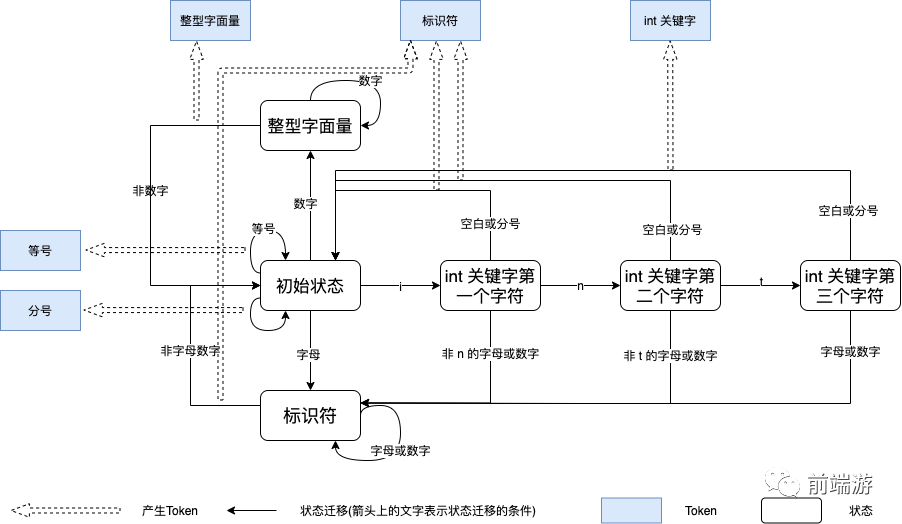

# 1. 写paser
如何愉快地写个小parser - 陈天的文章 - 知乎
https://zhuanlan.zhihu.com/p/20178871

PARSING STRATEGIES解析策略

· Hand written lexer + recursive descent parser手写语法分析树和递归

· Use Parser generator tools like Antlr使用生成工具

· Parser Combinators!语法组合器

Sources Code ->Lexer (Token) ->  Paser -> AST ->IR Emitter -> LLVM IR

编译原理之手写一门解释型语言

https://mp.weixin.qq.com/s/-9JaieElYz2HBr8vH8fSRA

https://github.com/ParadeTo/learn-compile

